# 幻化追踪

一个用于追踪角色副本锁定、当前副本掉落、套装缺失与可收集进度的魔兽世界插件。

## 功能概览

> 这一段说明插件对玩家暴露的主要功能入口和能力范围。

- 小地图 tooltip：按资料片聚合副本锁定，支持多角色对比。
- 主面板：提供通用配置、职业过滤、物品过滤。
- 独立调试面板：仅通过 `/img debug ...` 打开，用于复制 focused debug dump。
- 掉落面板：提供 `掉落 / 套装` 两个 tab。
- 套装页：按职业展示当前副本相关套装、缺失部位和来源。
- 独立统计看板：展示按资料片 / 团本 / 难度 / 职业聚合的离线快照统计，只读取已缓存的摘要数据；底部提供 `扫描团队副本` / `扫描地下城` 两个手动重建按钮。

## Architecture

> 这一段用高层依赖图说明插件从入口、编排、领域模块到 UI 表面和外部系统的关系。

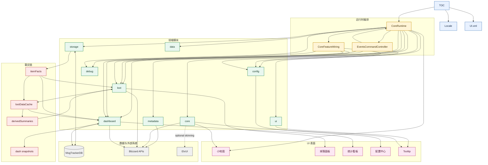

图里的方向表示“谁依赖谁 / 谁向下调用谁”，并且这里以当前代码接线为准：

- `runtime` 是编排层，负责启动、接线和事件分发。
- `core / loot / dashboard` 是主要业务层。
- `storage / metadata / data` 都属于数据层：`storage` 负责 `MogTrackerDB` 访问与归一化，`metadata` 负责规则解释和元数据解析，`data` 负责静态数据定义。
- `config / debug / ui` 是支撑和表现层。
- `itemFacts -> lootDataCache -> derivedSummaries -> dashboard snapshots` 是当前事实到派生缓存的主链路。

这里的“真模块”指已经从 `CoreRuntime.lua` 那类运行时编排文件里抽离出来、拥有明确 `Configure(...)` 依赖边界并可独立承载职责的模块；不是只做一层转发的薄 wrapper，也不是纯数据或纯资源文件。

### 编排层

> 这一组模块负责启动、接线和事件分发，是其余层的统一编排入口。

#### `src/runtime/`

> 这一段说明运行时编排目录的职责，以及其中已经独立成型的真模块。

- 运行时入口、模块接线、事件与 slash 命令分发。
- 细节见 [src/runtime/README.md](./src/runtime/README.md)。
- 真模块：
  - [src/runtime/EventsCommandController.lua](./src/runtime/EventsCommandController.lua)

### 业务层

> 这一组模块负责核心业务计算、掉落面板逻辑和统计看板聚合。

#### `src/core/`

> 这一段说明跨功能公共能力所在的核心目录，以及其中的真模块。

- 通用计算、状态、UI 外壳，以及 dashboard bridge 这类跨功能公共能力。
- 细节见 [src/core/README.md](./src/core/README.md)。
- 真模块：
  - [src/core/ClassLogic.lua](./src/core/ClassLogic.lua)
  - [src/core/EncounterState.lua](./src/core/EncounterState.lua)
  - [src/core/CollectionState.lua](./src/core/CollectionState.lua)
  - [src/core/UIChromeController.lua](./src/core/UIChromeController.lua)
  - [src/core/DerivedSummaryStore.lua](./src/core/DerivedSummaryStore.lua)
  - [src/core/SetDashboardBridge.lua](./src/core/SetDashboardBridge.lua)

#### `src/loot/`

> 这一段说明掉落面板相关目录，以及其中的真模块。

- 掉落面板选择、缓存、渲染、行组件和套装页逻辑。
- 细节见 [src/loot/README.md](./src/loot/README.md)。
- 真模块：
  - [src/loot/LootSelection.lua](./src/loot/LootSelection.lua)
  - [src/loot/LootFilterController.lua](./src/loot/LootFilterController.lua)
  - [src/loot/LootDataController.lua](./src/loot/LootDataController.lua)
  - [src/loot/LootPanelController.lua](./src/loot/LootPanelController.lua)
  - [src/loot/LootPanelRows.lua](./src/loot/LootPanelRows.lua)
  - [src/loot/LootPanelRenderer.lua](./src/loot/LootPanelRenderer.lua)

#### `src/dashboard/`

> 这一段说明统计看板相关目录，以及其中的真模块。

- 独立统计看板窗口、批量扫描、团队本/套装/PVP 看板聚合。
- 细节见 [src/dashboard/README.md](./src/dashboard/README.md)。
- 真模块：
  - [src/dashboard/bulk/DashboardBulkScan.lua](./src/dashboard/bulk/DashboardBulkScan.lua)
  - [src/dashboard/DashboardPanelController.lua](./src/dashboard/DashboardPanelController.lua)

### 数据层

> 这一组模块负责持久化访问、规则解释和静态数据定义。

#### `src/storage/`

> 这一段说明存储层目录，以及作为南下入口的 storage gateway。

- 存储归一化、数据库初始化，以及对 `MogTrackerDB` 的南下访问入口。
- 细节见 [src/storage/README.md](./src/storage/README.md)。
- 真模块：
  - [src/storage/StorageGateway.lua](./src/storage/StorageGateway.lua)

#### `src/metadata/`

> 这一段说明静态元数据和规则目录，以及其中的真模块。

- 静态元数据、难度语义规则、EJ 实例定位和 metadata 级缓存。
- 细节见 [src/metadata/README.md](./src/metadata/README.md)。
- 真模块：
  - [src/metadata/InstanceMetadata.lua](./src/metadata/InstanceMetadata.lua)

#### `src/data/`

> 这一段说明纯静态数据目录的职责。

- 纯静态数据定义，目前主要承载套装分类配置。
- 细节见 [src/data/README.md](./src/data/README.md)。

### 支撑与表现层

> 这一组模块负责配置中心、调试工具和轻量 UI 资源装配。

#### `src/config/`

> 这一段说明配置中心相关目录，以及其中的真模块。

- 主配置面板和调试数据链路。
- 细节见 [src/config/README.md](./src/config/README.md)。
- 真模块：
  - [src/config/ConfigDebugData.lua](./src/config/ConfigDebugData.lua)
  - [src/config/ConfigPanelController.lua](./src/config/ConfigPanelController.lua)

#### `src/debug/`

> 这一段说明调试工具目录的职责。

- 调试采集器、调试工具和调试输出辅助。
- 细节见 [src/debug/README.md](./src/debug/README.md)。

#### `src/ui/`

> 这一段说明 UI 资源和轻量 UI 装配目录的职责。

- XML/UI 资源和 tooltip 这类轻量 UI 装配文件。
- 细节见 [src/ui/README.md](./src/ui/README.md)。

## 事件流

> 这一段说明运行时事件和 slash 命令如何进入事件入口并分发到各模块。

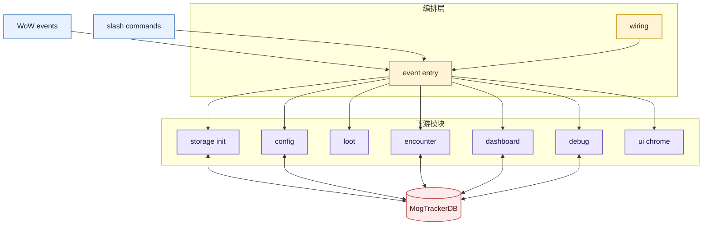

### 魔兽世界事件

> 这一段按事件逐个说明当前真正注册的 WoW 事件及其运行路径。

#### `ADDON_LOADED`

> 这一段说明插件加载完成后如何初始化默认存储结构。

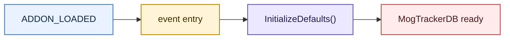

- 只在 `arg1 == addonName` 时处理。
- 主要动作是调用 `InitializeDefaults()`，完成 `MogTrackerDB` 默认值和归一化初始化。

#### `PLAYER_LOGIN`

> 这一段说明角色进入世界后如何完成运行时启动和 UI 初始化。

```mermaid
flowchart LR
    A["PLAYER_LOGIN"] --> B["event entry"]
    B --> C["PruneExpiredBossKillCaches()"]
    C --> D["RequestRaidInfo()"]
    D --> E["CaptureSavedInstances()"]
    E --> F["InitializePanel()"]
    F --> G["InitializeLootPanel()"]
    G --> H["CreateMinimapButton()"]

    classDef eventNode fill:#e8f1ff,stroke:#4f81bd,stroke-width:1.5px,color:#10233f;
    classDef orchestrationNode fill:#fff4d6,stroke:#c58b00,stroke-width:1.5px,color:#3f2b00;
    classDef actionNode fill:#ece8ff,stroke:#6f5bb7,stroke-width:1.5px,color:#24184a;

    class A eventNode;
    class B orchestrationNode;
    class C,D,E,F,G,H actionNode;
```

- 这一条是主要启动路径。
- 除了 UI 初始化外，还会挂上 `ResetInstances` 的 hook。

#### `UPDATE_INSTANCE_INFO`

> 这一段说明副本信息刷新后如何同步存储、失效缓存并更新界面。

```mermaid
flowchart LR
    A["UPDATE_INSTANCE_INFO"] --> B["event entry"]
    B --> C["CaptureSavedInstances()"]
    C --> D["PruneExpiredBossKillCaches()"]
    D --> E["InvalidateLootDataCache()"]
    E --> F["InvalidateRaidDashboardCache()"]
    F --> G["RefreshPanelText()"]

    classDef eventNode fill:#e8f1ff,stroke:#4f81bd,stroke-width:1.5px,color:#10233f;
    classDef orchestrationNode fill:#fff4d6,stroke:#c58b00,stroke-width:1.5px,color:#3f2b00;
    classDef actionNode fill:#ece8ff,stroke:#6f5bb7,stroke-width:1.5px,color:#24184a;

    class A eventNode;
    class B orchestrationNode;
    class C,D,E,F,G actionNode;
```

- 这是“副本锁定刷新”后的主要同步路径。
- 重点是刷新已存实例信息并失效相关缓存。

#### `GET_ITEM_INFO_RECEIVED`

> 这一段说明异步物品信息补全后如何刷新依赖缺失物品数据的面板。

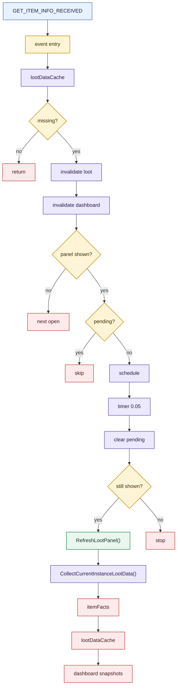

- 这个事件是统一入口，不是每个物品单独注册一个回调。
- 每次收到事件时，代码不会按 `itemID` 精确匹配，而是先看当前 `lootDataCache.data.missingItemData` 是否还存在。
- 只有存在缺失物品数据时，才会失效 `lootDataCache` 和看板运行时缓存；事件本身不直接写 `itemFacts`。
- 真正的 `itemFacts` 回填发生在后续 `RefreshLootPanel() -> CollectCurrentInstanceLootData()` 重采集时；这时会把新可用的 `name / link / appearanceID / sourceID` 写回事实层。
- 如果掉落面板没开，流程会停在“失效缓存”，等下次打开或主动采集时再重建并补写 `itemFacts`。
- 如果掉落面板开着，代码会用 `addon.lootItemInfoRefreshPending` 加 `C_Timer.After(0.05)` 做一次轻量合并，避免短时间内重复排很多次刷新。
- 所以当 100 个物品陆续补全时，事件可能会触发很多次，但通常表现为“少量失效 + 少量重采集”，而不是 100 次完整重绘。

#### `ENCOUNTER_END`

> 这一段说明首领战结束后如何记录击杀并刷新相关缓存。

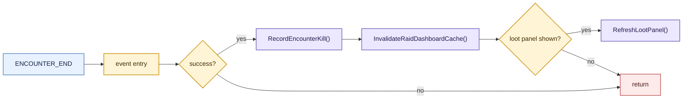

- 只有 `arg5 == 1` 时才会处理，也就是击杀成功。
- 这条路径只更新击杀结果、折叠状态和统计看板缓存，不再在击杀事件里失效整张掉落表缓存。
- 如果掉落面板当时开着，会直接按当前 session baseline 重绘；如果没开，就等下次打开时再应用新的击杀结果。

#### `TRANSMOG_COLLECTION_UPDATED`

> 这一段说明收藏状态变化后，统计看板和掉落面板为什么会走两条不同的刷新链路。

**统计看板链路**

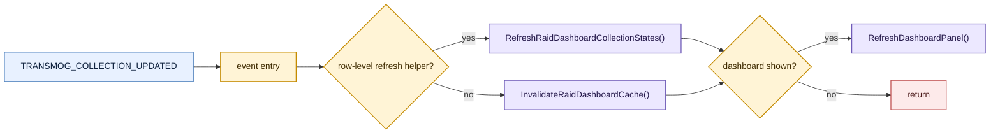

- 优先路径不再把统计看板整张 cache 打掉，而是就地修正已缓存 row 里的 `collectibles`、`setPieces` 和派生计数。
- 只有缺少行级刷新 helper 时，才退回到旧的整表失效逻辑。
- 统计看板如果当前没开，数据仍然会先更新；只是不会立刻触发面板重绘。

**掉落面板链路**

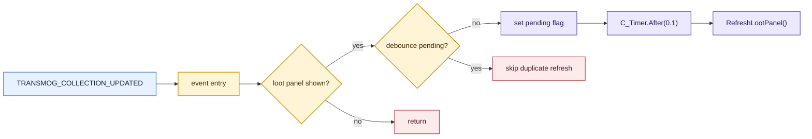

- 掉落面板这条链路只刷新“收藏态驱动的显示层”，不重扫 EJ 掉落表。
- 这里保留 `0.1s` debounce，是为了等 Blizzard 的收藏 API 稳定后再重绘，避免一次收集触发多次连刷。

### 斜杠命令

> 这一段列出 slash 命令入口及其主要分支。

- `/imt`
- 普通命令默认打开配置中心。
- `debug`
  - 采集通用 debug dump 并切到 debug 页。
- `debug setboard`
  - 采集 set dashboard preview debug。
- `debug sets`
  - 采集 set category debug。
- `debug dungeon=...` / `debug raid=...`
  - 采集 dungeon/raid dashboard debug。
- `debug pvpsets`
  - 采集 PVP set debug。

### 模块定位

> 这一段说明为什么事件入口模块归在编排层而不是业务层。

- `EventsCommandController` 只做“外部输入 -> 内部动作分发”，不承载业务计算。
- 因为它主要连接 WoW 事件系统和 slash 命令系统，所以归到 `src/runtime/` 而不是 `src/core/`。

## UI 结构

> 这一段按玩家可见入口说明插件的主要 UI 结构。

- 小地图按钮
  - 统一入口。
  - 左键进入配置中心，右键进入掉落面板，`Ctrl + 左键` 进入统计看板。
- 掉落面板
  - 面向当前副本或选定副本的即时查看界面。
  - 包含 `掉落` 和 `套装` 两个 tab，用于看掉落列表、套装汇总和缺失件来源。
- 统计看板
  - 面向离线摘要的聚合查看界面。
  - 展示缓存化的资料片 / 团本 / 难度 / 职业统计矩阵，不在打开时触发全量采集。
- 配置中心
  - 面向插件设置和诊断的控制界面。
  - 包含 `通用`、`职业过滤`、`物品过滤`、`调试` 等分区。

## 数据流

> 这一段按启动、采集、计算、渲染的顺序概括主要运行路径。

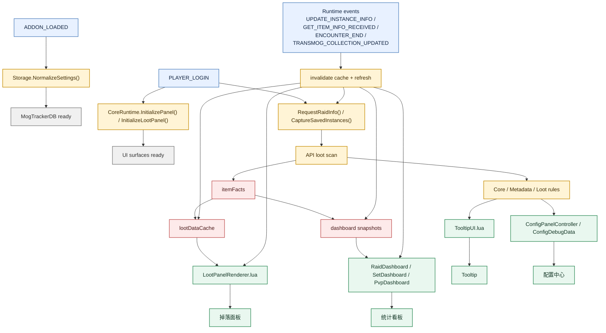

1. `ADDON_LOADED`
   - `Storage.lua` 归一化 `MogTrackerDB`。
2. `PLAYER_LOGIN`
   - `CoreRuntime.lua` 创建 UI。
   - 注册小地图按钮、主面板、掉落面板和 tooltip。
3. 副本数据采集
   - `API.lua` 负责当前副本识别、EJ 难度切换和掉落扫描。
   - 物品级解析结果先写入 `itemFacts`，再由上层缓存和看板复用。
4. 业务计算
   - `Compute.lua` 负责角色筛选、锁定矩阵和 tooltip 结构。
   - `ClassLogic.lua`、`metadata/InstanceMetadata.lua`、`EncounterState.lua`、`CollectionState.lua`、`LootSelection.lua` 提供被 UI 和数据层复用的核心能力。
   - `LootSets.lua` 负责套装聚合与缺失件来源。
   - `DashboardBulkScan.lua` 负责主动全量扫描路径。
   - `RaidDashboard.lua` 依赖 `itemFacts` 和已缓存摘要构建看板行列数据。
5. 渲染
   - `CoreRuntime.lua` 把结果渲染到 tooltip、主面板和掉落面板。

## 面板加载时序

> 这一段单独说明这五个主要 UI 表面从用户入口、运行时接线、初始化到首屏渲染的时序：小地图 Tooltip、掉落面板、统计看板、配置面板、调试面板。

### 配置面板

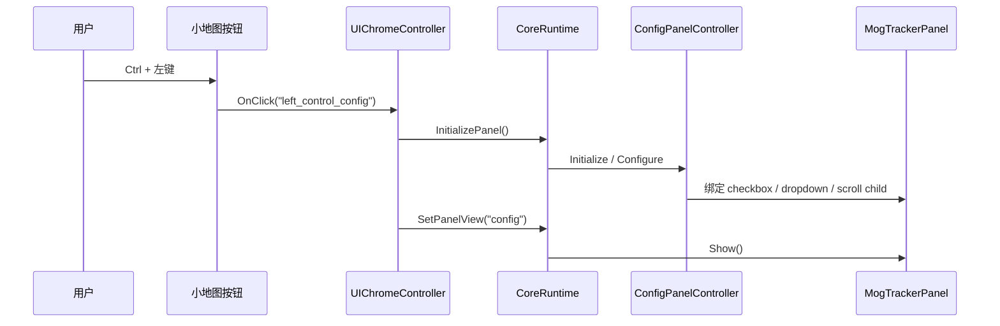

配置面板是最轻的入口之一。它不依赖 Encounter Journal 全量扫描，主要在首次打开时完成配置控件、scroll child 和样式绑定，然后直接显示 `config` 视图。

### 独立调试面板

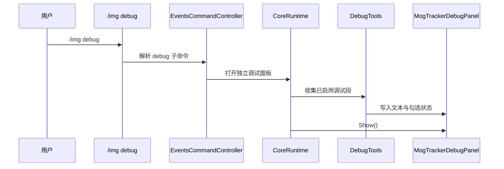

调试面板不挂在主面板 tab 里，而是独立 frame。命令入口先决定要收集哪些段，再由 `DebugTools` 生成可复制的 focused dump。

### 掉落面板

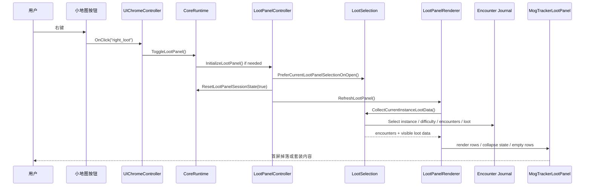

掉落面板的重活都在 `RefreshLootPanel()` 后面：当前副本优先、会话基线重置、EJ encounter 级掉落枚举、再进入 renderer。首开路径现在只保留一次主刷新，不再叠加额外的零延迟二次刷新。

会话层还有一条额外约束：面板打开时会记录 `itemCollectionBaseline`。这让“本来就已收集”的幻化在整个本次打开会话里持续隐藏，只把面板打开后新获得的外观标成 `newly_collected` 保留下来；如果 Blizzard 收集 API 在事件抖动里短暂回报 `unknown`，也不会把原本已隐藏的已收集物品重新刷出来。

### 统计看板

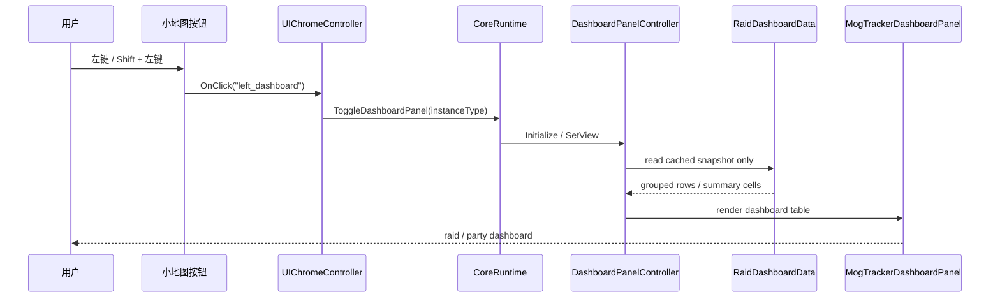

统计看板读取的是已缓存摘要，不应该在打开时触发 EJ 全量采集。主动 bulk scan 属于另一路显式操作，不属于面板首开时序。

### 小地图 Tooltip

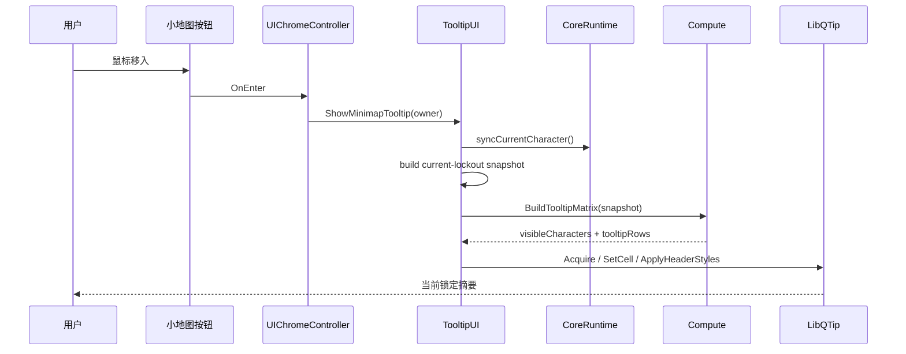

Tooltip 现在展示“当期锁定 + 过期七天内的灰显锁定”：不混入 `previousCycleLockouts`，但会把 `lockouts` 里已经过期、仍在七天宽限窗口内的记录保留下来并灰显。它会先构建 tooltip 自己的快照，再复用共享 matrix builder。

## 缓存

> 这一段集中说明插件里的缓存、快照和版本化规则。

### Storage 分层

> 这一段定义 `MogTrackerDB`、快照、视图状态和运行时缓存各自应该落在哪一层。

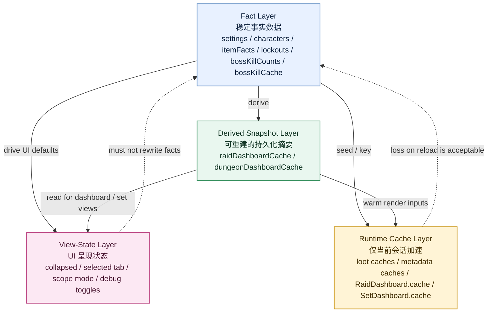

当前存储结构按四层理解：

1. Fact Layer
   - 存放稳定、可直接解释的事实数据。
   - 典型字段：`MogTrackerDB.settings`、`MogTrackerDB.characters[*].lockouts`、`MogTrackerDB.characters[*].bossKillCounts`、`MogTrackerDB.bossKillCache`
   - 规则：不要把 tooltip 文案、dashboard 分组猜测或展示标签塞进这一层；如果规则变化后这份数据仍然有效，它通常就属于事实层。
2. Derived Snapshot Layer
   - 存放从扫描结果和事实数据派生出的持久化摘要。
   - 典型字段：`MogTrackerDB.raidDashboardCache`、`MogTrackerDB.dungeonDashboardCache`
   - 规则：这一层是可丢弃、可重建的；所有规则驱动的快照都必须带显式 `rulesVersion`，规则变化时要整体重建。
3. View-State Layer
   - 存放 UI 如何展示，而不是游戏事实本身。
   - 典型内容：折叠状态、选中的 tab、scope mode、debug section 开关
   - 规则：重置 view state 不应破坏事实层和摘要层；只影响布局、显隐、按钮行为的状态应归这里。
4. Runtime Cache Layer
   - 存放仅用于当前会话加速的内存缓存。
   - 典型内容：loot panel in-memory caches、metadata lookup caches、`RaidDashboard.cache`、`SetDashboard.cache`
   - 规则：默认不持久化；`/reload` 后丢失是可接受的，这一层只负责降低 open/refresh 成本，不应成为新的事实来源。

边界规则：

- Set classification
  - 优先级应是 `PVP keyword` -> `raid cached setPieces` -> `dungeon cached setPieces` -> `other`
  - 不要在已有真实来源证据时只靠显示名分类。
- Dashboards
  - 看板应该读 snapshot，不应该在打开时重新全量扫描世界。
  - 采集路径负责写 snapshot，看板路径只负责读 snapshot。
- Invalidation
  - fact 层变化：做 migration/normalize
  - snapshot 层变化：bump rules version 并重建
  - 纯 UI/view 变化：不要碰 stored facts/snapshots
  - 纯 session 优化：留在 runtime cache

反模式：

- 同一个语义事实同时存在于 facts、snapshots 和第三份自定义缓存里
- 持久化 runtime-only panel caches
- 把 UI 标签和事实 ID 混在一起存
- 已有 source ID 时仍从不稳定显示文本推长期分类
- 让 dashboard 变成隐式 bulk-scan 入口

### Tooltip 当前锁定与过期灰显

> 这一段说明小地图 tooltip 如何读取当期锁定，并在最多七天的窗口里保留已过期锁定用于灰显展示。

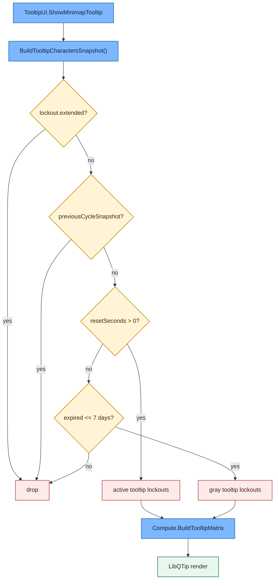

Tooltip 不直接把 `MogTrackerDB.characters[*]` 原样交给 matrix builder，而是先构建一份 tooltip 专用快照。只有满足“非 extended、非 previous-cycle，并且要么当前有效、要么刚过期不超过七天”的锁定才会进入摘要，所以这个表面表达的是“当前锁定 + 短期过期提示”，不是历史事实总表。

### 缓存与快照策略

> 这一段说明运行时缓存和统计快照的基本原则。

- 掉落面板数据有规则版本化缓存，规则变更时应 bump 对应版本号。
- 统计看板是离线摘要页：
  - 只有某个团队本已经在别的路径里算过，才会写入 `raidDashboardCache`。
  - 看板只读快照，不主动触发 EJ 全量扫描。
- 调试日志会尽量同时输出：
  - 原始 Blizzard 返回
  - 归一化后的内部状态
  - 关键计算链的中间结果

### 缓存版本号总览

> 这一段集中列出当前各类缓存规则版本号和它们的管理位置。

当前运行时有 `6` 个缓存规则版本号，另外有 `1` 个 `DB_VERSION` 用于 `SavedVariables` schema，不属于缓存版本。

| 名称 | 当前值 | 管理位置 | 作用缓存 |
| --- | --- | --- | --- |
| `JOURNAL_INSTANCE_LOOKUP_RULES_VERSION` | `2` | `src/runtime/CoreRuntime.lua` | `InstanceMetadata.metadataCaches.journalLookup` |
| `LOOT_PANEL_SELECTION_RULES_VERSION` | `3` | `src/runtime/CoreRuntime.lua` | `InstanceMetadata.metadataCaches.selectionTree` |
| `LOOT_DATA_RULES_VERSION` | `2` | `src/runtime/CoreRuntime.lua` | `lootDataCache` |
| `DASHBOARD_RULES_VERSION` | `19` | `src/dashboard/raid/RaidDashboardData.lua` | `RaidDashboard.cache` 和存储条目 `entry.rulesVersion` |
| `SET_DASHBOARD_RULES_VERSION` | `1` | `src/dashboard/set/SetDashboard.lua` | `SetDashboard.cache` |
| `PVP_DASHBOARD_RULES_VERSION` | `1` | `src/dashboard/pvp/PvpDashboard.lua` | `PvpDashboard.cache` |
| `DB_VERSION` | `2` | `src/runtime/CoreRuntime.lua` | `MogTrackerDB` schema 版本；同时约束 `itemFacts` 等事实层结构，不是缓存版本 |

- `JOURNAL_INSTANCE_LOOKUP_RULES_VERSION` 和 `LOOT_PANEL_SELECTION_RULES_VERSION` 由 `CoreRuntime` 定义，经 `CoreFeatureWiring.Configure(...)` 注入 `InstanceMetadata`。
- `LOOT_DATA_RULES_VERSION` 由 `CoreRuntime` 定义，经 `CoreFeatureWiring.Configure(...)` 注入 `LootSelection` / `LootDataController`。
- `DASHBOARD_RULES_VERSION` 由 `RaidDashboardData.lua` 自管，同时约束运行时汇总缓存和持久化摘要条目的兼容性。
- `SET_DASHBOARD_RULES_VERSION` 和 `PVP_DASHBOARD_RULES_VERSION` 都是各自 dashboard 模块内自管的本地缓存版本。
- `itemFacts` 属于事实层存储，不走独立 rules version；它跟随 `DB_VERSION` 做 schema 归一化，供 `lootDataCache` 和各类 dashboard 摘要重建时复用。

## 发布说明

> 这一段记录插件发布名和对外命名约定。

- 正式发布名为 `MogTracker`。

## 开发文档

> 这一段提供开发者检查流程和工具说明的入口。

- 面板文档索引见 [docs/Panels.md](./docs/Panels.md)。
- 各面板独立文档：
  - [docs/ConfigPanel.md](./docs/ConfigPanel.md)
  - [docs/LootPanel.md](./docs/LootPanel.md)
  - [docs/DashboardPanel.md](./docs/DashboardPanel.md)
  - [docs/DebugPanel.md](./docs/DebugPanel.md)
- 开发相关内容已移到 [DEVELOP.md](./DEVELOP.md)。
- 包括 `LuaCheck`、`StyLua`、`LuaLS`、`JSCPD`、`VS Code Tasks` 和统一检查入口。

运行：

```powershell
powershell -ExecutionPolicy Bypass -File .\tools\check.ps1
```

如果本机还没装 `stylua`，可以先跳过格式检查：

```powershell
powershell -ExecutionPolicy Bypass -File .\tools\check.ps1 -SkipFormat
```

如果要把 `luacheck` warning 也升级为失败：

```powershell
powershell -ExecutionPolicy Bypass -File .\tools\check.ps1 -FailOnWarnings
```

如果本轮只想跳过重复代码检查：

```powershell
powershell -ExecutionPolicy Bypass -File .\tools\check.ps1 -SkipDuplication
```

