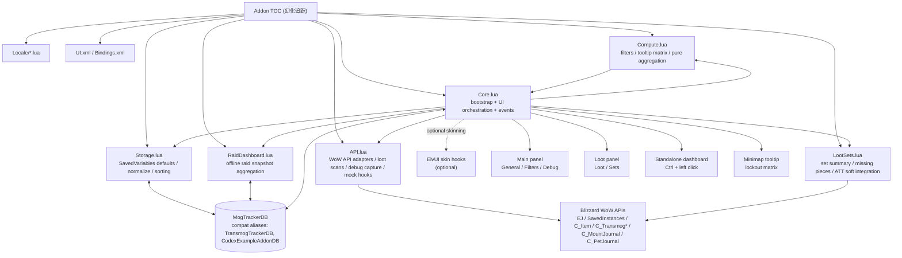

# 幻化追踪

一个用于追踪角色副本锁定、当前副本掉落、套装缺失与可收集进度的魔兽世界插件。

## 功能概览

- 小地图 tooltip：按资料片聚合副本锁定，支持多角色对比。
- 主面板：提供通用配置、职业过滤、物品过滤和调试日志。
- 小面板：提供 `掉落 / 套装` 两个 tab。
- 套装页：按职业展示当前副本相关套装、缺失部位和来源。
- 独立统计看板：展示按资料片 / 团本 / 难度 / 职业聚合的离线快照统计，只读取已缓存的摘要数据。

## Architecture

## 模块职责

- `Core.lua`
  - 插件启动与事件注册。
  - 主面板 / 小面板 / tooltip 的显隐、布局和刷新编排。
  - 把 `LootSets.lua`、`RaidDashboard.lua` 需要的依赖显式注入，而不是让模块隐式反向依赖总文件。
- `API.lua`
  - 隔离 Blizzard API 调用。
  - 负责当前副本解析、Encounter Journal 掉落扫描、调试抓取和 mock 入口。
- `Compute.lua`
  - 负责纯计算逻辑。
  - 包含职业过滤、锁定过滤、tooltip 矩阵聚合等不直接创建 UI 的逻辑。
- `Storage.lua`
  - 负责 `SavedVariables` 默认值、版本迁移、归一化和角色排序。
- `LootSets.lua`
  - 负责小面板套装页相关逻辑。
  - 包括套装聚合、缺失部位、当前副本掉落来源映射、AllTheThings 软增强等。
- `RaidDashboard.lua`
  - 负责离线统计快照和独立统计看板的数据组织。
  - 只读取和汇总已缓存的团队本摘要，不在打开看板时触发全量采集。

## UI 结构

- 小地图按钮
  - 左键：打开主面板。
  - 右键：打开当前副本小面板。
  - `Ctrl + 左键`：打开独立统计看板。
- 主面板
  - `通用`：通用配置和插件说明。
  - `职业过滤`：选择职业范围。
  - `物品过滤`：选择掉落类型范围。
  - `调试`：收集日志、查看原始 API 返回和本地归一化结果。
- 小面板
  - `掉落`：当前副本 / 选定团队本的掉落列表。
  - `套装`：当前副本相关套装、缺失件及其来源。
- 独立统计看板
  - 展示缓存化的资料片 / 团本 / 难度 / 职业统计矩阵。
  - 只读取已缓存摘要，不在打开时触发全量采集。

## 数据流

1. `ADDON_LOADED`
   - `Storage.lua` 归一化 `MogTrackerDB`。
2. `PLAYER_LOGIN`
   - `Core.lua` 创建 UI。
   - 注册小地图按钮、主面板、小面板和 tooltip。
3. 副本数据采集
   - `API.lua` 负责当前副本识别、EJ 难度切换、掉落扫描和调试抓取。
4. 业务计算
   - `Compute.lua` 负责角色筛选、锁定矩阵和 tooltip 结构。
   - `LootSets.lua` 负责套装聚合与缺失件来源。
   - `RaidDashboard.lua` 只消费已缓存摘要并构建看板行列数据。
5. 渲染
   - `Core.lua` 把结果渲染到 tooltip、主面板和小面板。

## 缓存与快照策略

- 小面板掉落数据有规则版本化缓存，规则变更时应 bump 对应版本号。
- 统计看板是离线摘要页：
  - 只有某个团队本已经在别的路径里算过，才会写入 `raidDashboardCache`。
  - 看板只读快照，不主动触发 EJ 全量扫描。
- 调试日志会尽量同时输出：
  - 原始 Blizzard 返回
  - 归一化后的内部状态
  - 关键计算链的中间结果

## Key Files

- [MogTracker.toc](C:\World of Warcraft\_retail_\Interface\AddOns\MogTracker\MogTracker.toc)
- [Core.lua](C:\World of Warcraft\_retail_\Interface\AddOns\MogTracker\Core.lua)
- [API.lua](C:\World of Warcraft\_retail_\Interface\AddOns\MogTracker\API.lua)
- [Compute.lua](C:\World of Warcraft\_retail_\Interface\AddOns\MogTracker\Compute.lua)
- [LootSets.lua](C:\World of Warcraft\_retail_\Interface\AddOns\MogTracker\LootSets.lua)
- [RaidDashboard.lua](C:\World of Warcraft\_retail_\Interface\AddOns\MogTracker\RaidDashboard.lua)
- [Storage.lua](C:\World of Warcraft\_retail_\Interface\AddOns\MogTracker\Storage.lua)
- [UI.xml](C:\World of Warcraft\_retail_\Interface\AddOns\MogTracker\UI.xml)

## 发布说明

- 正式发布名为 `MogTracker`。
- 为了兼容旧版本用户数据，内部仍保留 `TransmogTrackerDB` 与 `CodexExampleAddonDB` 作为 `MogTrackerDB` 的兼容别名。

