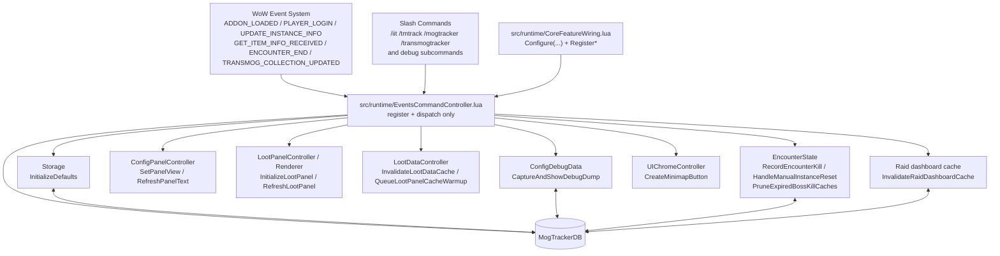

# 幻化追踪

一个用于追踪角色副本锁定、当前副本掉落、套装缺失与可收集进度的魔兽世界插件。

## 功能概览

- 小地图 tooltip：按资料片聚合副本锁定，支持多角色对比。
- 主面板：提供通用配置、职业过滤、物品过滤和调试日志。
- 掉落面板：提供 `掉落 / 套装` 两个 tab。
- 套装页：按职业展示当前副本相关套装、缺失部位和来源。
- 独立统计看板：展示按资料片 / 团本 / 难度 / 职业聚合的离线快照统计，只读取已缓存的摘要数据。

## Architecture

```mermaid
flowchart TD
    TOC["Addon TOC (幻化追踪)"]
    Locale["Locale/*.lua"]
    XML["src/ui/UI.xml / Bindings.xml"]
    Core["src/runtime/CoreRuntime.lua\nruntime state + remaining pure helpers + public addon entrypoints"]
    CoreWiring["src/runtime/CoreFeatureWiring.lua\ncontroller/module dependency wiring + registration order"]
    Storage["src/core/Storage.lua\nSavedVariables defaults / normalize / sorting"]
    Compute["src/core/Compute.lua\nfilters / tooltip matrix / pure aggregation"]
    API["src/core/API.lua\nWoW API adapters / loot scans / debug capture / mock hooks"]
    ClassLogic["src/core/ClassLogic.lua\nclass metadata / difficulty labels / class colors"]
    InstanceMetadata["src/metadata/InstanceMetadata.lua\nEJ instance resolution / expansion normalization / selection cache metadata"]
    EncounterState["src/core/EncounterState.lua\nboss kill cache / encounter collapsed state / reset handling"]
    CollectionState["src/core/CollectionState.lua\ncollection-state resolution / loot visibility filters / session markers"]
    LootSelection["src/loot/LootSelection.lua\nloot-panel selection keys / menus / lockout progress tooltip"]
    BulkScan["src/dashboard/bulk/DashboardBulkScan.lua\ndashboard bulk-scan queue / state machine / progress updates"]
    DashboardPanel["src/dashboard/DashboardPanelController.lua\ndashboard frame lifecycle / layout / visibility"]
    ConfigDebug["src/config/ConfigDebugData.lua\ndebug capture / saved-instance sync / debug section ui"]
    ConfigPanel["src/config/ConfigPanelController.lua\nconfig panel lifecycle / navigation / filter ui"]
    EventsCommands["src/runtime/EventsCommandController.lua\nevent registration / slash commands / debug command routing"]
    UIChrome["src/core/UIChromeController.lua\nminimap button / frame chrome / ElvUI skinning"]
    LootFilter["src/loot/LootFilterController.lua\nloot filter menus / collectible family lookups"]
    SetBridge["src/core/SetDashboardBridge.lua\nset helpers / LootSets wiring / dashboard bridge"]
    LootData["src/loot/LootDataController.lua\nloot data cache / warmup / expansion lookup / encounter collapse state"]
    LootPanel["src/loot/LootPanelController.lua\nloot frame lifecycle / header layout / tabs / dropdown shell"]
    LootRows["src/loot/LootPanelRows.lua\nloot row widgets / collection visuals / encounter header state"]
    LootRender["src/loot/LootPanelRenderer.lua\nloot panel row orchestration / loot+set tab rendering"]
    LootSets["src/loot/sets/LootSets.lua\nset summary / missing pieces / ATT soft integration"]
    Dashboard["src/dashboard/raid/RaidDashboard.lua\noffline raid snapshot aggregation"]
    DB[("MogTrackerDB\ncompat aliases: TransmogTrackerDB, CodexExampleAddonDB")]
    Blizzard["Blizzard WoW APIs\nEJ / SavedInstances / C_Item / C_Transmog* / C_MountJournal / C_PetJournal"]
    ElvUI["ElvUI skin hooks\n(optional)"]
    MainUI["Main panel\nGeneral / Filters / Debug"]
    LootUI["Loot panel\nLoot / Sets"]
    DashboardUI["Standalone dashboard\nCtrl + left click"]
    Tooltip["Minimap tooltip\nlockout matrix"]

    TOC --> Locale
    TOC --> Storage
    TOC --> Compute
    TOC --> API
    TOC --> ClassLogic
    TOC --> InstanceMetadata
    TOC --> EncounterState
    TOC --> CollectionState
    TOC --> LootSelection
    TOC --> BulkScan
    TOC --> DashboardPanel
    TOC --> ConfigDebug
    TOC --> ConfigPanel
    TOC --> EventsCommands
    TOC --> UIChrome
    TOC --> LootFilter
    TOC --> SetBridge
    TOC --> LootData
    TOC --> LootPanel
    TOC --> LootRows
    TOC --> LootRender
    TOC --> CoreWiring
    TOC --> LootSets
    TOC --> Dashboard
    TOC --> XML
    TOC --> Core

    Core --> Storage
    Core --> Compute
    Core --> API
    Core --> ClassLogic
    Core --> InstanceMetadata
    Core --> EncounterState
    Core --> CollectionState
    Core --> LootSelection
    Core --> BulkScan
    Core --> DashboardPanel
    Core --> ConfigDebug
    Core --> ConfigPanel
    Core --> EventsCommands
    Core --> UIChrome
    Core --> LootFilter
    Core --> SetBridge
    Core --> LootData
    Core --> LootPanel
    Core --> LootRows
    Core --> LootRender
    Core --> CoreWiring
    Core --> LootSets
    Core --> Dashboard
    Core --> MainUI
    Core --> LootUI
    Core --> DashboardUI
    Core --> Tooltip
    Storage <--> DB
    Dashboard <--> DB
    API --> Blizzard
    LootSets --> Blizzard
    Core <--> DB
    Compute --> Core
    Core -. optional skinning .-> ElvUI
```



## EventsCommandController 交互图



- 事件链：
  - `ADDON_LOADED` 初始化默认值。
  - `PLAYER_LOGIN` 触发 UI 初始化、锁定采集、小地图按钮创建和 cache warmup。
  - `UPDATE_INSTANCE_INFO` / `GET_ITEM_INFO_RECEIVED` / `ENCOUNTER_END` / `TRANSMOG_COLLECTION_UPDATED` 负责缓存失效和界面刷新。
- 命令链：
  - 普通 slash 命令默认打开主配置面板。
  - `debug` 系列命令走 `ConfigDebugData` / `DebugTools` 采集，再切到 debug 页并聚焦输出框。
- 模块定位：
  - `EventsCommandController` 只做“外部输入 -> 内部动作分发”，不承载业务计算。
  - 因为它主要连接 WoW 事件系统和 slash 命令系统，所以归到 `src/runtime/` 而不是 `src/core/`。

## 模块职责

- `src/runtime/CoreRuntime.lua`
  - 当前运行时入口。
  - 负责运行时状态、少量纯 helper、以及暴露给 addon 其余部分的顶层入口。
- `src/runtime/CoreFeatureWiring.lua`
  - 负责核心模块接线。
  - 包括 controller / data module 的 `Configure(...)` 顺序、跨模块依赖注入、slash/event 注册，以及少量公开别名回写。
- `src/core/API.lua`
  - 隔离 Blizzard API 调用。
  - 负责当前副本解析、Encounter Journal 掉落扫描、调试抓取和 mock 入口。
- `src/core/Compute.lua`
  - 负责纯计算逻辑。
  - 包含职业过滤、锁定过滤、tooltip 矩阵聚合等不直接创建 UI 的逻辑。
- `src/core/Storage.lua`
  - 负责 `SavedVariables` 默认值、版本迁移、归一化和角色排序。
- `src/metadata/CoreMetadata.lua`
  - 负责全局静态元数据。
  - 包括职业列表、职业分组、掉落类型分组和类掩码常量。
- `src/metadata/DifficultyRules.lua`
  - 负责副本难度语义规则。
  - 包括显示顺序、tooltip 顺序、颜色质量映射和难度归类辅助。
- `src/core/ClassLogic.lua`
  - 负责职业元数据、职业显示名、职业颜色和副本难度显示辅助。
- `src/metadata/InstanceMetadata.lua`
  - 负责资料片名归一化、EJ 实例定位、实例选择缓存和副本元数据解析。
- `src/core/EncounterState.lua`
  - 负责击杀周期、当前副本 boss 击杀缓存、手动重置副本后的状态清理、遭遇折叠缓存。
- `src/core/CollectionState.lua`
  - 负责物品收集状态解析。
  - 包括幻化 / 坐骑 / 宠物的 collected state、session baseline、掉落过滤和 boss fully-collected 判断。
- `src/loot/LootSelection.lua`
  - 负责掉落面板实例选择逻辑。
  - 包括 selection key、cache key、实例菜单构建、dashboard 跳转打开、角色锁定进度 tooltip。
- `src/dashboard/bulk/DashboardBulkScan.lua`
  - 负责独立看板的全量扫描状态机。
  - 包括扫描队列构建、进度推进、重试、完成收尾，以及配置页批量更新按钮状态。
- `src/dashboard/DashboardPanelController.lua`
  - 负责独立统计看板窗口本身。
  - 包括 frame 初始化、布局、显隐切换、刷新和 info tooltip。
- `src/config/ConfigDebugData.lua`
  - 负责主配置面板里的调试数据链路。
  - 包括 debug dump 采集、SavedInstances 捕获、debug 分段 UI 和主面板文本刷新。
- `src/config/ConfigPanelController.lua`
  - 负责主配置面板窗口本体。
  - 包括 panel 初始化、分栏导航、职业/物品过滤 UI、样式入口和批量更新按钮区。
- `src/runtime/EventsCommandController.lua`
  - 负责运行时事件和 slash 命令入口。
  - 包括 `ADDON_LOADED / PLAYER_LOGIN / UPDATE_INSTANCE_INFO` 等事件注册，以及 debug / 面板打开命令分发。
- `src/core/UIChromeController.lua`
  - 负责插件通用 UI 外壳。
  - 包括 minimap 按钮、默认 frame chrome、header button 视觉规则、滚动条布局和 ElvUI 皮肤接管。
- `src/loot/LootFilterController.lua`
  - 负责掉落过滤辅助层。
  - 包括职业/专精/类型 dropdown 菜单，以及坐骑/宠物家族的收集状态查询辅助。
- `src/core/SetDashboardBridge.lua`
  - 负责套装与看板桥接层。
  - 包括 transmog source/set 解析、套装进度、`LootSets` 依赖接线，以及 `Raid/Set/Pvp Dashboard` 的配置注入。
- `src/loot/LootDataController.lua`
  - 负责掉落面板相关的数据控制层。
  - 包括当前副本 loot data cache、warmup、团本/地下城资料片归类，以及 encounter 折叠状态切换。
- `src/loot/LootPanelController.lua`
  - 负责掉落面板窗口本身。
  - 包括 frame 初始化、header/tool 按钮、tab 切换、布局、自定义下拉菜单壳和显隐切换。
- `src/loot/LootPanelRows.lua`
  - 负责掉落面板里的行级 widget 和视觉状态。
  - 包括 loot row 创建、collection/newly-collected 高亮、职业图标、encounter header 视觉和自动折叠基线。
- `src/loot/LootPanelRenderer.lua`
  - 负责掉落面板内容渲染。
  - 包括 `掉落 / 套装` 两个 tab 的内容构建、error/empty state、set summary 组装和 render debug 记录。
- `src/data/sets/SetCategoryConfig.lua`
  - 负责套装分类的静态配置。
- `src/data/sets/SetCategories.lua`
  - 负责套装分类数据定义。
- `src/loot/sets/LootSets.lua`
  - 负责掉落面板套装页相关逻辑。
  - 包括套装聚合、缺失部位、当前副本掉落来源映射、AllTheThings 软增强等。
- `src/dashboard/raid/RaidDashboard.lua`
  - 负责离线统计快照和独立统计看板的数据组织。
  - 只读取和汇总已缓存的团队本摘要，不在打开看板时触发全量采集。
- `src/dashboard/set/SetDashboard.lua`
  - 负责套装统计看板的数据聚合与渲染。
  - 按资料片与来源类型组织套装进度矩阵，并渲染 set dashboard 专属表格。
- `src/dashboard/pvp/PvpDashboard.lua`
  - 负责 PVP 套装统计看板的数据聚合与渲染。
  - 按赛季与 track 分类组织进度矩阵，并渲染 pvp dashboard 专属表格。

## UI 结构

- 小地图按钮
  - 左键：打开主面板。
  - 右键：打开当前副本掉落面板。
  - `Ctrl + 左键`：打开独立统计看板。
- 主面板
  - `通用`：通用配置和插件说明。
  - `职业过滤`：选择职业范围。
  - `物品过滤`：选择掉落类型范围。
  - `调试`：收集日志、查看原始 API 返回和本地归一化结果。
- 掉落面板
  - `掉落`：当前副本 / 选定团队本的掉落列表。
  - `套装`：当前副本相关套装、缺失件及其来源。
- 独立统计看板
  - 展示缓存化的资料片 / 团本 / 难度 / 职业统计矩阵。
  - 只读取已缓存摘要，不在打开时触发全量采集。

## 数据流

1. `ADDON_LOADED`
   - `Storage.lua` 归一化 `MogTrackerDB`。
2. `PLAYER_LOGIN`
   - `CoreRuntime.lua` 创建 UI。
  - 注册小地图按钮、主面板、掉落面板和 tooltip。
3. 副本数据采集
   - `API.lua` 负责当前副本识别、EJ 难度切换、掉落扫描和调试抓取。
4. 业务计算
   - `Compute.lua` 负责角色筛选、锁定矩阵和 tooltip 结构。
   - `ClassLogic.lua`、`metadata/InstanceMetadata.lua`、`EncounterState.lua`、`CollectionState.lua`、`LootSelection.lua` 提供被 UI 和数据层复用的核心能力。
   - `LootSets.lua` 负责套装聚合与缺失件来源。
   - `DashboardBulkScan.lua` 负责主动全量扫描路径。
   - `RaidDashboard.lua` 只消费已缓存摘要并构建看板行列数据。
5. 渲染
 - `CoreRuntime.lua` 把结果渲染到 tooltip、主面板和掉落面板。

## 真模块清单

下列文件已经不是 “wrapper source chunk”，而是通过显式 `Configure(...)` 注入依赖、可独立承载职责的真模块：

- `src/core/ClassLogic.lua`
- `src/metadata/InstanceMetadata.lua`
- `src/core/EncounterState.lua`
- `src/core/CollectionState.lua`
- `src/loot/LootSelection.lua`
- `src/dashboard/bulk/DashboardBulkScan.lua`
- `src/dashboard/DashboardPanelController.lua`
- `src/config/ConfigDebugData.lua`
- `src/config/ConfigPanelController.lua`
- `src/runtime/EventsCommandController.lua`
- `src/core/UIChromeController.lua`
- `src/loot/LootFilterController.lua`
- `src/core/SetDashboardBridge.lua`
- `src/loot/LootDataController.lua`
- `src/loot/LootPanelController.lua`
- `src/loot/LootPanelRows.lua`
- `src/loot/LootPanelRenderer.lua`

约定：
- 每次从 `CoreRuntime.lua` 抽出新的真模块，都要同步更新本节和上面的“模块职责”。
- 如果模块职责发生变化，也要一起改 README，而不是只改代码。

## 缓存与快照策略

- 掉落面板数据有规则版本化缓存，规则变更时应 bump 对应版本号。
- 统计看板是离线摘要页：
  - 只有某个团队本已经在别的路径里算过，才会写入 `raidDashboardCache`。
  - 看板只读快照，不主动触发 EJ 全量扫描。
- 调试日志会尽量同时输出：
  - 原始 Blizzard 返回
  - 归一化后的内部状态
  - 关键计算链的中间结果

## Key Files

- [MogTracker.toc](C:\World of Warcraft\_retail_\Interface\AddOns\MogTracker\MogTracker.toc)
- [src/runtime/CoreRuntime.lua](C:\World of Warcraft\_retail_\Interface\AddOns\MogTracker\src\runtime\CoreRuntime.lua)
- [src/core/API.lua](C:\World of Warcraft\_retail_\Interface\AddOns\MogTracker\src\core\API.lua)
- [src/core/Compute.lua](C:\World of Warcraft\_retail_\Interface\AddOns\MogTracker\src\core\Compute.lua)
- [src/metadata/CoreMetadata.lua](C:\World of Warcraft\_retail_\Interface\AddOns\MogTracker\src\metadata\CoreMetadata.lua)
- [src/metadata/DifficultyRules.lua](C:\World of Warcraft\_retail_\Interface\AddOns\MogTracker\src\metadata\DifficultyRules.lua)
- [src/core/ClassLogic.lua](C:\World of Warcraft\_retail_\Interface\AddOns\MogTracker\src\core\ClassLogic.lua)
- [src/metadata/InstanceMetadata.lua](C:\World of Warcraft\_retail_\Interface\AddOns\MogTracker\src\metadata\InstanceMetadata.lua)
- [src/core/EncounterState.lua](C:\World of Warcraft\_retail_\Interface\AddOns\MogTracker\src\core\EncounterState.lua)
- [src/core/CollectionState.lua](C:\World of Warcraft\_retail_\Interface\AddOns\MogTracker\src\core\CollectionState.lua)
- [src/loot/LootSelection.lua](C:\World of Warcraft\_retail_\Interface\AddOns\MogTracker\src\loot\LootSelection.lua)
- [src/dashboard/bulk/DashboardBulkScan.lua](C:\World of Warcraft\_retail_\Interface\AddOns\MogTracker\src\dashboard\bulk\DashboardBulkScan.lua)
- [src/dashboard/DashboardPanelController.lua](C:\World of Warcraft\_retail_\Interface\AddOns\MogTracker\src\dashboard\DashboardPanelController.lua)
- [src/config/ConfigDebugData.lua](C:\World of Warcraft\_retail_\Interface\AddOns\MogTracker\src\config\ConfigDebugData.lua)
- [src/config/ConfigPanelController.lua](C:\World of Warcraft\_retail_\Interface\AddOns\MogTracker\src\config\ConfigPanelController.lua)
- [src/runtime/EventsCommandController.lua](C:\World of Warcraft\_retail_\Interface\AddOns\MogTracker\src\runtime\EventsCommandController.lua)
- [src/core/UIChromeController.lua](C:\World of Warcraft\_retail_\Interface\AddOns\MogTracker\src\core\UIChromeController.lua)
- [src/loot/LootFilterController.lua](C:\World of Warcraft\_retail_\Interface\AddOns\MogTracker\src\loot\LootFilterController.lua)
- [src/runtime/CoreFeatureWiring.lua](C:\World of Warcraft\_retail_\Interface\AddOns\MogTracker\src\runtime\CoreFeatureWiring.lua)
- [src/core/SetDashboardBridge.lua](C:\World of Warcraft\_retail_\Interface\AddOns\MogTracker\src\core\SetDashboardBridge.lua)
- [src/loot/LootDataController.lua](C:\World of Warcraft\_retail_\Interface\AddOns\MogTracker\src\loot\LootDataController.lua)
- [src/loot/LootPanelController.lua](C:\World of Warcraft\_retail_\Interface\AddOns\MogTracker\src\loot\LootPanelController.lua)
- [src/loot/LootPanelRows.lua](C:\World of Warcraft\_retail_\Interface\AddOns\MogTracker\src\loot\LootPanelRows.lua)
- [src/loot/LootPanelRenderer.lua](C:\World of Warcraft\_retail_\Interface\AddOns\MogTracker\src\loot\LootPanelRenderer.lua)
- [src/data/sets/SetCategoryConfig.lua](C:\World of Warcraft\_retail_\Interface\AddOns\MogTracker\src\data\sets\SetCategoryConfig.lua)
- [src/data/sets/SetCategories.lua](C:\World of Warcraft\_retail_\Interface\AddOns\MogTracker\src\data\sets\SetCategories.lua)
- [src/loot/sets/LootSets.lua](C:\World of Warcraft\_retail_\Interface\AddOns\MogTracker\src\loot\sets\LootSets.lua)
- [src/dashboard/raid/RaidDashboard.lua](C:\World of Warcraft\_retail_\Interface\AddOns\MogTracker\src\dashboard\raid\RaidDashboard.lua)
- [src/dashboard/set/SetDashboard.lua](C:\World of Warcraft\_retail_\Interface\AddOns\MogTracker\src\dashboard\set\SetDashboard.lua)
- [src/dashboard/pvp/PvpDashboard.lua](C:\World of Warcraft\_retail_\Interface\AddOns\MogTracker\src\dashboard\pvp\PvpDashboard.lua)
- [src/core/Storage.lua](C:\World of Warcraft\_retail_\Interface\AddOns\MogTracker\src\core\Storage.lua)
- [src/ui/UI.xml](C:\World of Warcraft\_retail_\Interface\AddOns\MogTracker\src\ui\UI.xml)

## 发布说明

- 正式发布名为 `MogTracker`。
- 为了兼容旧版本用户数据，内部仍保留 `TransmogTrackerDB` 与 `CodexExampleAddonDB` 作为 `MogTrackerDB` 的兼容别名。

## LuaCheck

- 项目已接入根目录配置文件：[.luacheckrc](C:\World of Warcraft\_retail_\Interface\AddOns\MogTracker\.luacheckrc)
- 运行脚本：[tools/run_luacheck.ps1](C:\World of Warcraft\_retail_\Interface\AddOns\MogTracker\tools\run_luacheck.ps1)
- 默认检查范围：
  - `src/`
  - `tests/`
  - `tools/`
- WoW AddOn 常用全局已在 `.luacheckrc` 里做了白名单，避免把 Blizzard API 误报成未定义全局。

本机如果还没有 `luacheck`，先安装：

```powershell
luarocks install luacheck
```

然后运行：

```powershell
powershell -ExecutionPolicy Bypass -File .\tools\run_luacheck.ps1
```

如果要把 warning 也视为失败：

```powershell
powershell -ExecutionPolicy Bypass -File .\tools\run_luacheck.ps1 -FailOnWarnings
```

说明：
- `luacheck` 依赖 `luafilesystem`
- 在 Windows 上如果 LuaRocks 只能拿到源码包，还需要本地 C 编译器才能完成安装

## StyLua

- 项目已接入格式配置：[.stylua.toml](C:\World of Warcraft\_retail_\Interface\AddOns\MogTracker\.stylua.toml)
- 运行脚本：[tools/run_stylua.ps1](C:\World of Warcraft\_retail_\Interface\AddOns\MogTracker\tools\run_stylua.ps1)
- 当前仓库已接入格式入口，但本机还没有 `stylua` 二进制；脚本会在缺失时直接报错提醒安装

检查格式：

```powershell
powershell -ExecutionPolicy Bypass -File .\tools\run_stylua.ps1 -Check
```

写回格式：

```powershell
powershell -ExecutionPolicy Bypass -File .\tools\run_stylua.ps1
```

## LuaLS

- 项目已接入工作区配置：[.luarc.json](C:\World of Warcraft\_retail_\Interface\AddOns\MogTracker\.luarc.json)
- LuaLS 本地 stub 库：[types/wow-globals.lua](C:\World of Warcraft\_retail_\Interface\AddOns\MogTracker\types\wow-globals.lua)
- 命令行检查脚本：[tools/run_luals_check.ps1](C:\World of Warcraft\_retail_\Interface\AddOns\MogTracker\tools\run_luals_check.ps1)
- 目标运行时固定为 `Lua 5.1`
- 常用 Blizzard / SavedVariables 全局和动态 WoW table 字段已预先声明，减少编辑器误报
- 本机已安装 `LuaLS.lua-language-server 3.17.1`
- `winget` 安装后如果当前终端还认不到 `lua-language-server`，重开一个 shell 即可

默认运行：

```powershell
powershell -ExecutionPolicy Bypass -File .\tools\run_luals_check.ps1
```

如果要把 LuaLS warning 也视为失败：

```powershell
powershell -ExecutionPolicy Bypass -File .\tools\run_luals_check.ps1 -FailOnWarnings
```

说明：
- 默认模式下，LuaLS 只把真实 `Error` 级诊断当作失败
- WoW AddOn 项目里低信号的动态环境诊断已在 `.luarc.json` 里降噪
- `types/` 目录被加入了 LuaLS workspace library，编辑器跳转和补全会直接读取这些 stub

## JSCPD

- 项目已接入重复代码检查配置：[.jscpd.json](C:\World of Warcraft\_retail_\Interface\AddOns\MogTracker\.jscpd.json)
- 命令行检查脚本：[tools/run_jscpd.ps1](C:\World of Warcraft\_retail_\Interface\AddOns\MogTracker\tools\run_jscpd.ps1)
- Node 依赖由 [package.json](C:\World of Warcraft\_retail_\Interface\AddOns\MogTracker\package.json) 和 [package-lock.json](C:\World of Warcraft\_retail_\Interface\AddOns\MogTracker\package-lock.json) 管理
- 默认检查范围：
  - `src/`
  - `Locale/`
  - `tests/`
  - `tools/`

运行：

```powershell
powershell -ExecutionPolicy Bypass -File .\tools\run_jscpd.ps1
```

如果要把重复块也视为失败：

```powershell
powershell -ExecutionPolicy Bypass -File .\tools\run_jscpd.ps1 -FailOnClones
```

说明：
- 本机 `jscpd` 已通过本地 `node_modules` 接入
- `dist/`、`node_modules/`、`.npm-cache/` 已排除，不参与重复代码统计
- 默认模式用于看基线；只有传 `-FailOnClones` 才会把重复块升级为失败

## VS Code Tasks

- 已接入任务入口：[.vscode/tasks.json](C:\World of Warcraft\_retail_\Interface\AddOns\MogTracker\.vscode\tasks.json)
- 可直接运行：
  - `MogTracker: check`
  - `MogTracker: check (skip format)`
  - `MogTracker: check (skip format + duplication)`
  - `MogTracker: luacheck`
  - `MogTracker: LuaLS`
  - `MogTracker: jscpd`
  - `MogTracker: tests`

## Unified Check

- 统一检查入口：[tools/check.ps1](C:\World of Warcraft\_retail_\Interface\AddOns\MogTracker\tools\check.ps1)
- Lua 测试与 mock 校验入口：[tools/run_lua_tests.ps1](C:\World of Warcraft\_retail_\Interface\AddOns\MogTracker\tools\run_lua_tests.ps1)

默认顺序：
- `luac -p`
- `luacheck`
- `LuaLS`
- `jscpd`
- `stylua --check`
- Lua tests / validators

运行：

```powershell
powershell -ExecutionPolicy Bypass -File .\tools\check.ps1
```

如果本机还没装 `stylua`，可以先跳过格式检查：

```powershell
powershell -ExecutionPolicy Bypass -File .\tools\check.ps1 -SkipFormat
```

如果要把 `luacheck` warning 也升级为失败：

```powershell
powershell -ExecutionPolicy Bypass -File .\tools\check.ps1 -FailOnWarnings
```

如果本轮只想跳过重复代码检查：

```powershell
powershell -ExecutionPolicy Bypass -File .\tools\check.ps1 -SkipDuplication
```

