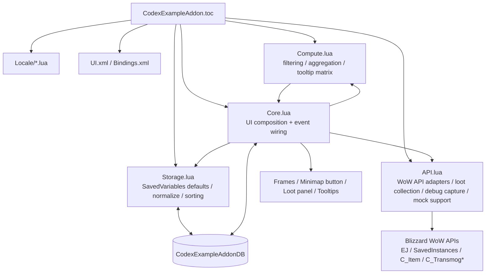

# 幻化追踪

一个用于追踪角色副本锁定、当前副本掉落和套装信息的魔兽世界插件。

## Architecture

## Layer Responsibilities

- `Core.lua`: 插件入口、事件注册、窗口与小地图按钮、标题下拉、tooltip 与面板刷新流程。
- `API.lua`: 隔离 Blizzard API 访问，负责冒险指南掉落采集、当前/指定副本解析、调试抓取；支持 mock。
- `Compute.lua`: 纯计算逻辑，负责职业/类型过滤、角色可见性判断、副本矩阵聚合。
- `Storage.lua`: `SavedVariables` 默认值、数据归一化、排序和存储边界。

## Runtime Flow

1. `ADDON_LOADED` 时由 `Storage.lua` 初始化 `CodexExampleAddonDB`。
2. `PLAYER_LOGIN` 后 `Core.lua` 创建 UI，并通过 `API.lua` 采集锁定与掉落数据。
3. `Compute.lua` 对角色、副本、掉落做筛选和聚合。
4. `Core.lua` 将结果渲染到主面板、右键小面板和 tooltip。

## Key Files

- [CodexExampleAddon.toc](C:\World of Warcraft\_retail_\Interface\AddOns\CodexExampleAddon\CodexExampleAddon.toc)
- [Core.lua](C:\World of Warcraft\_retail_\Interface\AddOns\CodexExampleAddon\Core.lua)
- [API.lua](C:\World of Warcraft\_retail_\Interface\AddOns\CodexExampleAddon\API.lua)
- [Compute.lua](C:\World of Warcraft\_retail_\Interface\AddOns\CodexExampleAddon\Compute.lua)
- [Storage.lua](C:\World of Warcraft\_retail_\Interface\AddOns\CodexExampleAddon\Storage.lua)
- [UI.xml](C:\World of Warcraft\_retail_\Interface\AddOns\CodexExampleAddon\UI.xml)
