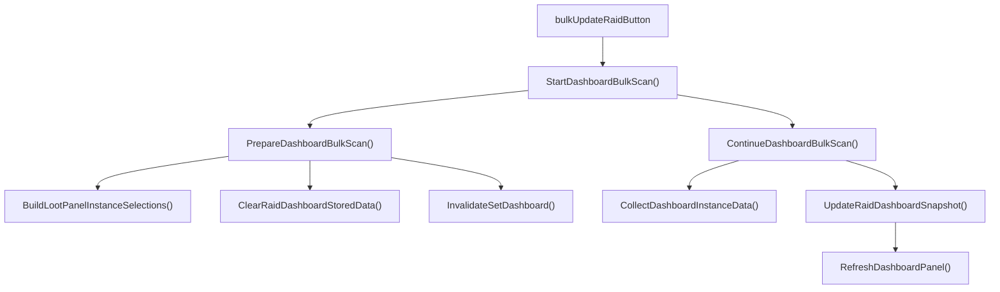

# 主配置面板

本文说明 MogTracker 的主配置面板如何组织视图、把设置写入哪里，以及哪些按钮会直接影响掉落面板和统计看板。

## 1. 面板定位

主配置面板由 `src/config/ConfigPanelController.lua` 管理。它不是掉落面板或统计看板的壳，而是三个职责的组合入口：

- 通用配置。
- 职业过滤。
- 物品类型过滤。

这三个视图共用同一个 frame，通过左侧导航切换，而不是三个独立窗口。

## 2. 导航结构

`InitializePanelNavigation()` 和 `SetPanelView()` 把主面板分成三个视图：

- `config`
  显示通用设置、样式选择和全量更新按钮。
- `classes`
  显示职业过滤。
- `loot`
  显示物品类型过滤。

导航按钮对应代码里的：

- `MogTrackerPanelNavConfigButton`
- `MogTrackerPanelNavClassButton`
- `MogTrackerPanelNavLootButton`

调试面板已经从这里拆出。`MogTrackerPanelNavDebugHeader` 和 `MogTrackerPanelNavDebugButton` 在初始化时直接隐藏，所以主配置面板不再承载 debug 输出。

## 3. `General` 视图

`config` 视图显示三类内容：

- 通用 checkbox 和样式下拉。
- 掉落展示相关设置。
- 全量更新区。

这里最重要的特殊区域是“全量更新”：

- `更新团本`
- `更新地下城`

这两个按钮不是简单刷新 UI，而是调用 `StartDashboardBulkScan(false, "raid")` 或 `StartDashboardBulkScan(false, "party")`，重建统计看板的资料片扫描计划，并清理对应的已缓存摘要。真正执行某个资料片的扫描，仍然是在统计看板资料片行里点击那一列独立的刷新 icon。

因此它们影响的是统计看板的数据底座，不是当前掉落面板的单次即时扫描。

## 4. `Classes` 视图

`classes` 视图由 `UpdateClassFilterUI()` 渲染。它按护甲组组织职业按钮，而不是平铺全部职业。

每个职业按钮做三件事：

- 更新 `settings.selectedClasses[classFile]`。
- `InvalidateLootDataCache()`。
- `RefreshLootPanel()`。

这表示职业过滤既影响后续掉落面板扫描，也会影响当前已打开掉落面板的刷新结果。

统计看板也会读取这组选中职业，但读法不是“只显示已勾选职业”。它会把已勾选职业排前面，再把未勾选职业补在后面，保证列集合稳定。

## 5. `Loot Types` 视图

`loot` 视图由 `UpdateLootTypeFilterUI()` 渲染。它按 UI 分组展示 `selectedLootTypes`，并在点击时：

- 更新 `settings.selectedLootTypes[typeKey]`。
- 直接 `RefreshLootPanel()`。

这里通常不需要清 `lootDataCache`，因为它改变的是显示过滤，不是副本扫描输入。

这类过滤影响：

- 掉落面板的当前可见物品。
- 首领是否“全收集”的判断。

它不直接重写统计看板的离线摘要。

## 6. 与其他面板的联动

主配置面板本身不渲染掉落列表或统计格子，但它会影响其他两个面板：

- 职业过滤改动后会清掉落缓存并刷新掉落面板。
- 物品类型过滤改动后会直接刷新掉落面板。
- 全量更新按钮会启动 `DashboardBulkScan`，重建统计看板计划和对应摘要。

可以把它理解成“设置入口 + 主动重扫入口”，而不是“数据展示面板”。

## 7. 一条完整链路

用户在主配置面板点击“更新团本”时，链路是：

这条链路说明主配置面板上的“更新”按钮，本质上是在启动统计看板的离线摘要重建任务。
