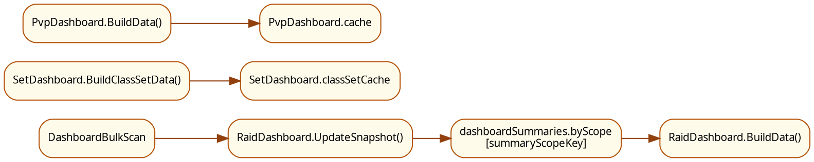
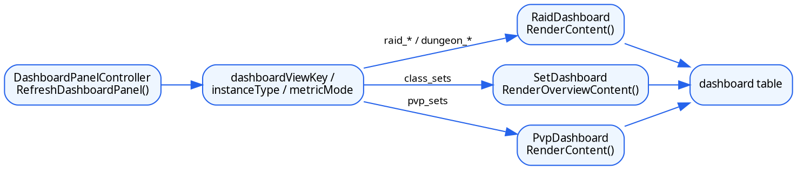

# 统计看板

本文统一说明幻化追踪统计看板的页面模式、数据来源，以及副本摘要页、职业套装页、PVP 套装页的区别。

## 1. 面板定位

统一入口是 `src/dashboard/DashboardPanelController.lua`，但当前看板包含三类页面：

- 副本摘要页
  `raid_sets`、`dungeon_sets`、`raid_collectibles`、`dungeon_collectibles`
- 职业套装页
  `class_sets`
- PVP 套装页
  `pvp_sets`

实际分发关系：

- `raid_*` / `dungeon_*`
  交给 `addon.RaidDashboard.RenderContent(...)`
- `class_sets`
  交给 `addon.SetDashboard.RenderOverviewContent(...)`
- `pvp_sets`
  交给 `addon.PvpDashboard.RenderContent(...)`

## 2. 页面差异

### 2.1 副本摘要页

副本摘要页只读已缓存摘要，不在打开时做 Encounter Journal 大扫描。

- `raid_sets`
  团本套装部件进度，显示 `setCollected / setTotal`
- `dungeon_sets`
  地下城套装部件进度，保留可见难度子行
- `raid_collectibles`
  团本 collectible 进度，显示 `collectibleCollected / collectibleTotal`
- `dungeon_collectibles`
  地下城 collectible 进度，保留可见难度子行

### 2.2 职业套装页

职业套装页不读副本摘要 bucket，而是直接聚合团本 T 系列职业套装。

- 主入口：`SetDashboard.BuildClassSetData()`
- 只统计能映射到 `tierTag` 的团本 T 系列套装
- 缓存：`SetDashboard.classSetCache`

### 2.3 PVP 套装页

PVP 页也不读副本摘要 bucket。

- 主入口：`PvpDashboard.BuildData()`
- 打开时直接从 `C_TransmogSets.GetAllSets()` 构建
- 按资料片、赛季、track 展示
- 缓存：`PvpDashboard.cache`

## 3. 副本摘要数据底座

副本摘要页读取的是 `RaidDashboardData` 维护的持久化摘要层：

- `dashboardSummaries.byScope[summaryScopeKey]`
- `store.buckets[bucketKey]`
- `RaidDashboard.cache`

关键入口：

- `DashboardBulkScan.StartDashboardBulkScan()`
- `RaidDashboard.UpdateSnapshot(selection, data, context)`
- `RaidDashboard.BuildData()`

## 4. 数据链路图

统计看板的数据链路先区分“副本摘要页”和“独立套装页”：

- 副本摘要页读 `dashboardSummaries`
- `class_sets` 读 `SetDashboard.classSetCache`
- `pvp_sets` 读 `PvpDashboard.cache`

## 5. 渲染链路图

看板控制器的渲染链路是“当前 view state -> 对应 renderer -> 当前页面表格”。

## 6. 团本套装格子的含义

`raid_sets` 某个格子的值表示：

`该团本当前展示难度下，属于该职业的套装部件里，已收集多少 / 总共统计到多少`

它不是：

- 整套完成数
- 当前实时 EJ 扫描结果
- 当前职业专属唯一套装数

## 7. 副本摘要补充链路

## 8. 统计规则

`StoreBuildScanStats(...)` 里每个掉落会经过这些判断：

1. `GetLootItemSetIDs(item)` 找套装归属
2. `ShouldCountSetForSnapshot(selection, setInfo)` 过滤副本归属
3. `ClassMatchesSetInfo(classFile, setInfo)` 投影职业列
4. `GetLootItemCollectionState(item)` 判定已收集状态
5. `BuildSetPieceKey(item)` 做套装件去重
6. collectible 分支则走 `BuildCollectibleKey(item)`

关键差异：

- `raid_*`
  只展示一个最高优先级难度矩阵行
- `dungeon_*`
  保留可见难度子行
- `sets`
  用 `setCollected / setTotal`
- `collectibles`
  用 `collectibleCollected / collectibleTotal`

## 9. 职业套装页和 PVP 页

### 8.1 `class_sets`

`SetDashboard.BuildClassSetData()` 会：

1. 建立 `setID -> tier metadata`
2. 遍历 `C_TransmogSets.GetAllSets()`
3. 只保留带 `tierTag` 的团本 T 系列套装
4. 按资料片、tier 聚合
5. 用 `ClassMatchesSetInfo()` 投影职业列

### 8.2 `pvp_sets`

`PvpDashboard.BuildData()` 会：

1. 遍历 `C_TransmogSets.GetAllSets()`
2. 用 `GetTrackKey(rawSetInfo)` 识别 PVP track
3. 按资料片建组
4. 按赛季建 row
5. 赛季下再按 `trackKey` 建 track rows
6. 用 `ClassMatchesSetInfo()` 投影职业列

## 10. 常见排查

如果症状是：

- 团本/地下城数字不对
  先看 `RaidDashboard.UpdateSnapshot()`、`StoreBuildScanStats()`、`BuildSetPieceKey()`、`BuildCollectibleKey()`
- 团本与地下城难度行不对
  先看 `RaidDashboard.BuildData()`
- 职业套装页内容不对
  先看 `SetDashboard.BuildClassSetData()`
- PVP 页赛季或 track 不对
  先看 `PvpDashboard.BuildData()`

很多“数字不对”不是渲染 bug，而是摘要来源、难度选择、scope 或去重语义理解错了。
