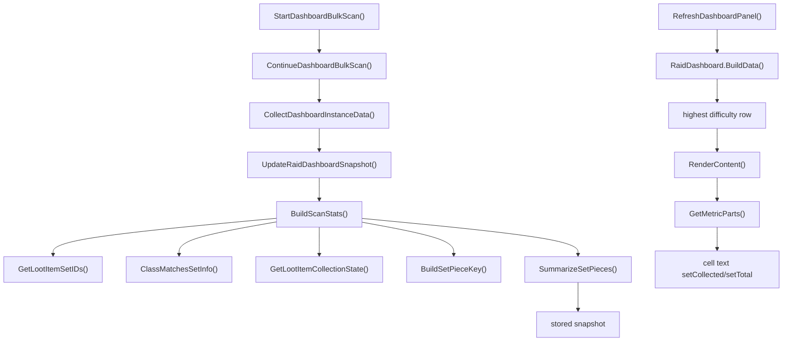

# 统计看板

本文说明统一统计看板的四个视图、数据来源，以及“团本套装”格子是怎样从已扫描掉落一路汇总出来的。

## 1. 面板定位

统一统计看板由 `src/dashboard/DashboardPanelController.lua` 管理。当前有四个视图：

- `raid_sets`
- `dungeon_sets`
- `raid_collectibles`
- `dungeon_collectibles`

面板刷新时统一走 `DashboardPanelController.RefreshDashboardPanel()`，然后把当前视图交给 `addon.RaidDashboard.RenderContent(...)` 渲染。

这意味着：

- 看板本身不主动做 Encounter Journal 大扫描。
- 看板主表格默认只读取已缓存摘要。
- 主动扫描由 `DashboardBulkScan` 或其他预热路径负责。

## 2. 入口和交互

看板底部固定有两行入口：

- `扫描团队副本`
- `扫描地下城`

这些按钮会先重建资料片扫描计划。真正执行某个资料片的扫描，是展开后的资料片 header 上那一列单独的刷新 icon，不是带文字的普通按钮。

因此可以把看板分成两层：

- 视图层：读摘要并渲染。
- 扫描层：构建计划、逐个副本难度扫描、写入摘要。

## 3. 四个视图分别看什么

### 3.1 `raid_sets`

按资料片和团本聚合套装部件进度。

- 团本模式下，同一个团本只展示一个难度矩阵行。
- 单元格显示的是 `setCollected / setTotal`。
- 这里的值是“部件数进度”，不是“整套完成数”。

### 3.2 `dungeon_sets`

按资料片和地下城聚合套装部件进度。

- 地下城模式会保留可见难度行。
- 单元格同样显示 `setCollected / setTotal`。

### 3.3 `raid_collectibles`

按资料片和团本聚合散件、坐骑、宠物等可收藏目标的进度。

- 单元格显示 `collectibleCollected / collectibleTotal`。

### 3.4 `dungeon_collectibles`

按资料片和地下城聚合可收藏目标进度。

## 4. 数据底座

统一看板主表格读取的是 `RaidDashboardData` 构建并持久化的摘要层。

关键入口有两个：

- `DashboardBulkScan.StartDashboardBulkScan()`
  负责批量扫描计划和逐项推进。
- `RaidDashboard.UpdateSnapshot()`
  负责把单个“副本 + 难度”的扫描结果写成可复用摘要。

看板打开时真正读取摘要的入口是：

- `RaidDashboard.BuildData()`

## 5. 团本套装格子怎么计算

先给出结论。

“团本套装”视图中某个格子的值表示：

`该团本当前展示难度下，属于该职业的套装部件里，已收集多少 / 总共统计到多少`

它不是：

- 整套完成数。
- 当前实时副本掉落扫描结果。
- 当前职业专属唯一套装数。

它是基于已缓存摘要的“套装部件进度”。

## 6. 团本套装数据链

下面这条链只描述 `raid_sets`。

## 7. 链路分解

### 7.1 扫描阶段

`ContinueDashboardBulkScan()` 会对扫描计划里的每个 selection：

1. 调 `CollectDashboardInstanceData(selection)` 获取该副本难度的完整掉落数据。
2. 把结果交给 `UpdateRaidDashboardSnapshot(selection, dashboardData)`。

### 7.2 快照写入阶段

`RaidDashboard.UpdateSnapshot()` 会调用 `BuildScanStats(selection, data, computedClassFiles)`。

这里会对每个掉落做几件事：

1. 用 `GetLootItemSetIDs(item)` 找出该掉落属于哪些套装。
2. 用 `ShouldCountSetForSnapshot(selection, setInfo)` 过滤，避免把不该记到这个副本快照里的套装混进来。
3. 用 `ClassMatchesSetInfo(classFile, setInfo)` 把套装归到对应职业列。
4. 用 `GetLootItemCollectionState(item)` 判断该部件当前是否已收集。
5. 用 `BuildSetPieceKey(item)` 去重。

这里的去重语义很关键：

- 优先按 `sourceID`
- 其次按 `itemID`
- 最后才退化到名字

所以同一个套装部件即使在多轮职业扫描里出现过，也只会在对应 bucket 里记一次。

### 7.3 汇总阶段

每个 bucket 最终会调用 `SummarizeSetPieces(setPieces)`，把：

- `setPieces` 里 `collected = true` 的数量记为 `setCollected`
- `setPieces` 总数量记为 `setTotal`

因此这里统计的是“部件数”，不是“套装数”。

### 7.4 渲染阶段

看板打开或刷新时，`RaidDashboard.BuildData()` 会从持久化摘要层读出实例和难度数据。

在 `raid_sets` 模式下：

- 同一个团本只取一个最高优先级难度矩阵行。
- 该矩阵行里的 `total` 和 `byClass[classFile]` 都已经带有 `setCollected / setTotal`。

随后 `RaidDashboard.RenderContent()` 进入套装模式：

- `metricMode = "sets"`
- `GetMetricParts(metric)` 返回 `metric.setCollected` 和 `metric.setTotal`
- 单元格文本最终显示为 `setCollected/setTotal`

## 8. 为什么有时看板数字和掉落面板不一致

最常见的原因有三类：

- 看板读的是已缓存摘要，掉落面板可能刚做了新的即时扫描。
- 团本看板只展示一个优先级最高的难度，不展示所有难度并列。
- 看板按“部件去重后计数”，不是按 raw loot row 计数。

如果用户说“同一个团本我明明还能掉两件，为何看板只加一”，先检查是不是两个来源行最终归到了同一个 `BuildSetPieceKey()`。

## 9. 资料片 header 和实例行

`RaidDashboard.BuildData()` 先按资料片建组，再把实例插进去：

- 资料片 header 行读取该资料片下所有实例 bucket 的汇总。
- 团本实例行只保留一个难度矩阵行。
- 地下城实例行保留可见难度子行。

所以资料片总计并不是简单的“当前屏幕可见数字相加”，而是由同一套 bucket 汇总逻辑预先算好后再渲染。

## 10. 维护建议

如果以后要改“团本套装”格子的含义，优先确认你要改的是哪一层：

- 想改扫描对象：看 `BuildScanStats()`。
- 想改是否算某个套装：看 `ShouldCountSetForSnapshot()`。
- 想改职业归属：看 `ClassMatchesSetInfo()`。
- 想改已收集判定：看 `GetLootItemCollectionState()`。
- 想改去重单位：看 `BuildSetPieceKey()`。
- 想改屏幕上显示哪种数：看 `GetMetricParts()`。

这几层不要混改。很多“数字不对”并不是渲染 bug，而是去重单位、难度选择或摘要来源理解错了。
