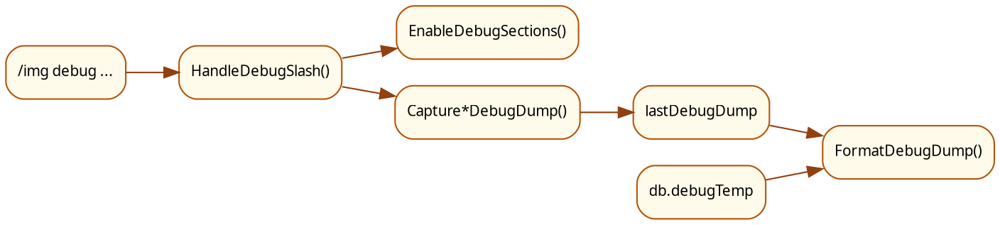

# 调试面板

本文说明 MogTracker 的独立调试面板如何打开、如何决定收集哪些调试段，以及 dump 最终怎样呈现为可复制文本。

## 1. 面板定位

调试面板不是主配置面板里的一个 tab，而是独立 frame。

当前入口是：

- `/img debug`
- `/img debug setboard`
- `/img debug sets=...`
- `/img debug raid=...`
- `/img debug dungeon=...`
- `/img debug pvpsets`

`EventsCommandController` 先解析 slash 命令，再决定：

- 开哪些调试段。
- 抓哪种 focused dump。
- 是否直接显示独立调试面板。

## 2. 面板结构

面板初始化由 `ConfigDebugData.InitializeDebugPanel()` 完成。它主要包含：

- 标题和副标题。
- 左侧日志分段开关。
- 右侧可滚动多行文本框。
- `Collect Logs` 按钮。

副标题明确写了“只能通过 `/img debug ...` 打开”，这也是当前设计意图：避免把调试面板混进普通玩家的主配置流里。

## 3. 日志分段

调试面板不是永远输出所有内容，而是由 `settings.debugLogSections` 决定哪些段启用。

这些分段由 `ConfigDebugData.GetDebugLogSectionLayout()` 提供，当前包括：

- 启动生命周期
- 运行时错误
- 当前掉落
- 小地图点击
- 掉落面板选择
- 掉落面板渲染耗时
- bulk scan 队列
- 套装摘要
- dashboard snapshot
- PVP 套装
- 套装分类
- dungeon/raid dashboard

slash 命令的作用之一，就是替用户提前打开一组和当前问题最相关的分段。

## 4. 数据链路图

调试面板的数据链路是“命令 -> collector -> last dump -> 格式化输入”。

如果是专项命令，比如 `/img debug raid=...`，中间的 collector 会换成对应 capture 函数，但最终仍会落到 `lastDebugDump`。

## 5. 渲染链路图

调试面板的渲染链路是“准备 panel -> 格式化文本 -> 填进滚动文本框”。

```dot
digraph DebugRenderFlow {
  rankdir=LR;
  graph [fontsize=10];
  node [shape=box style="rounded,filled" fillcolor="#EEF6FF" color="#2563EB" fontname="Microsoft YaHei" fontsize=10];
  edge [color="#2563EB" fontsize=9 fontname="Microsoft YaHei"];

  Show [label="ShowDebugOutputPanel()"];
  Init [label="InitializeDebugPanel()"];
  Refresh [label="RefreshPanelText()"];
  Format [label="FormatDebugDump()"];
  Text [label="scroll child text"];
  Focus [label="focus + select text"];

  Show -> Init -> Refresh -> Format -> Text -> Focus;
}
```

## 6. 为什么调试面板是“focused dump”

调试面板的目标不是长期开着看日志，而是快速生成一次可复制的聚焦输出。

因此它有几个显式设计：

- slash 命令优先决定收集范围。
- 文本框在打开后会自动 focus 并高亮内容。
- `Collect Logs` 会重新抓当前已启用分段，而不是进入持续监听模式。

这让用户可以更快地执行“抓一份、复制、贴给维护者”的流程。

## 7. 与主配置面板的关系

主配置面板不再承载 debug tab，但两者仍共享一部分配置状态：

- `settings.debugLogSections`
- `lastDebugDump`
- `db.debugTemp`

也就是说：

- 分段开关是持久化设置。
- 调试输出文本是当前 dump 的格式化结果。
- 某些事件路径会把临时调试对象先写进 `db.debugTemp`，再由格式化层读取。

## 8. 什么时候看这份文档

下面这些问题优先看调试面板文档：

- 为什么 `/img debug` 打开的是独立窗口而不是主面板。
- 为什么我只看到某几个调试段。
- 为什么某条命令抓的是 setboard / raid / dungeon 专项 dump。
- 为什么复制出来的是格式化后的文本而不是原始 Lua table。
