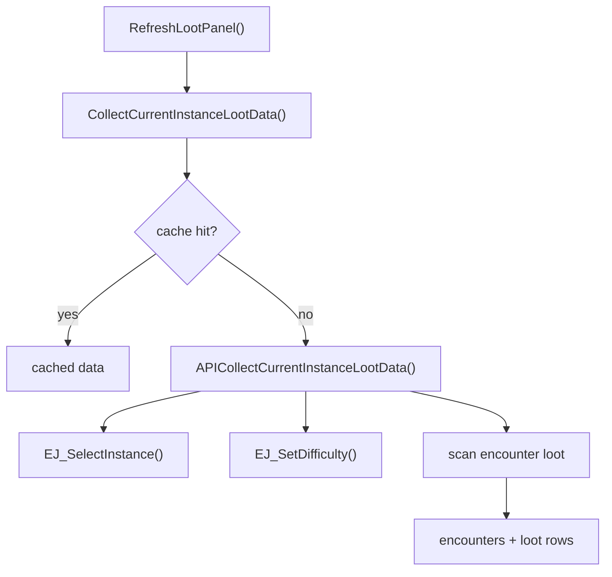

# 掉落面板

本文说明 MogTracker 当前的掉落面板如何从用户打开一路走到实例选择、Encounter Journal 扫描、过滤、缓存和最终渲染。

## 1. 入口和模块分工

当前掉落面板使用的是模块化结构，不再是旧的 `CoreLootPanel.lua / CoreLootRender.lua` 分工。主链路如下：

- `src/loot/LootPanelController.lua`
  负责面板生命周期、标题区按钮、tab 切换和整体布局。
- `src/loot/LootSelection.lua`
  负责“当前区域 + 所有可选副本/难度”的选择构建、菜单组织和选中切换。
- `src/loot/LootDataController.lua`
  负责掉落数据采集、缓存和当前实例摘要。
- `src/core/CollectionState.lua`
  负责收集状态、已收集隐藏和首领可见掉落计算。
- `src/loot/LootPanelRenderer.lua`
  负责 `loot / sets` 两个 tab 的最终渲染。
- `src/loot/LootPanelRows.lua`
  负责 item row、encounter row 的复用和视觉状态重置。
- `src/loot/sets/LootSets.lua`
  负责当前副本套装摘要、缺失部位和来源描述。
- `src/core/SetDashboardBridge.lua`
  负责套装相关的跨模块桥接，例如 `GetSetProgress()`、`GetLootItemSetIDs()`、`ClassMatchesSetInfo()`。

## 2. 打开面板时发生什么

掉落面板入口是 `ToggleLootPanel()`。首次打开会先 `InitializeLootPanel()` 创建 frame，之后每次真正显示前会做三件事：

1. `PreferCurrentLootPanelSelectionOnOpen()`
2. `ResetLootPanelSessionState(true)`
3. `RefreshLootPanel()`

这三步分别解决：

- 默认优先回到当前所在副本。
- 为本次打开建立稳定会话基线。
- 根据当前选中副本和 tab 重画内容。

## 3. 面板核心状态

### 3.1 `lootPanelState`

这是偏 UI 的选择态，至少包含：

- `selectedInstanceKey`
- `currentTab`
- `classScopeMode`
- `collapsed`
- `manualCollapsed`

### 3.2 `lootPanelSessionState`

这是本次打开期间的会话稳定态，主要用于避免 UI 在面板已打开时因事件刷新而跳动：

- `active`
- `itemCollectionBaseline`
- `itemCelebrated`
- `encounterBaseline`

### 3.3 `lootDataCache`

这是当前实例掉落数据缓存。它跟实例选择、职业范围和规则版本绑定，不直接缓存整张 UI。

## 4. 实例选择如何构建

`LootSelection.BuildLootPanelInstanceSelections()` 会先尝试解析当前区域，然后构建完整的副本/难度树。

结果里每个 selection 典型包含：

- `instanceName`
- `journalInstanceID`
- `instanceType`
- `difficultyID`
- `difficultyName`
- `expansionName`
- `instanceOrder`
- `key`

实例菜单由 `BuildLootPanelInstanceMenu()` 组织。用户改选择后会：

- 更新 `selectedInstanceKey`
- 清折叠态
- 重置滚动
- `InvalidateLootDataCache()`
- `RefreshLootPanel()`

## 5. 数据采集

`RefreshLootPanel()` 会调用 `LootDataController.CollectCurrentInstanceLootData()`。

这一步先查 `lootDataCache`，命中则直接复用；未命中时走 API 采集路径：

采集输入包括：

- 当前目标实例。
- 当前生效职业 ID 列表。
- 掉落类型归类函数。
- item fact 读写能力。

## 6. 为什么要按职业多轮扫

Encounter Journal 支持职业过滤。掉落采集会对当前生效职业列表多轮执行 `EJ_SetLootFilter(...)`，再把多轮结果合并去重。

这样做的好处是：

- Blizzard 先帮我们筛掉明显无关掉落。
- 后续渲染层只处理插件自身的过滤逻辑。

## 7. 收集状态和显示过滤

`CollectionState.GetLootItemCollectionState(item)` 是统一入口。

它会按收藏品家族分流：

- 幻化外观走 `C_TransmogCollection`
- 坐骑走 `C_MountJournal`
- 宠物走 `C_PetJournal`

同时它还会处理：

- 同外观已收集算收集。
- source 级与 appearance 级回退。
- 本次会话中的 `newly_collected` 表现。

随后 `CollectionState.GetEncounterLootDisplayState(encounter)` 会把：

- 当前类型过滤
- 已收集隐藏规则
- 可见物品列表
- 首领是否全收集

统一算出来，渲染层直接消费。

## 8. `loot` tab

`loot` tab 会对每个首领渲染：

- header 行
- 折叠/展开状态
- 击杀与进度提示
- 展开后的 item rows

item row 由 `LootPanelRows` 懒创建并复用。每次渲染前先 `ResetLootItemRowState()`，避免跨 tab 或跨刷新残留：

- 图标
- 文本颜色
- 收集图标
- 新收集高亮
- 套装高亮
- 职业图标

## 9. `sets` tab

`sets` tab 不直接显示首领掉落，而是走 `LootSets.BuildCurrentInstanceSetSummary(data, context)`。

这一步会：

1. 先把当前副本掉落映射为 `setID -> source rows`。
2. 读取每个 set 的当前进度。
3. 计算缺失部位。
4. 按职业分组排序。

因此 `sets` tab 本质上是“当前实例相关套装摘要页”，不是单纯换一种排版。

## 10. 与统计看板的关系

掉落面板和统计看板共用一部分桥接能力：

- `GetLootItemSetIDs()`
- `ClassMatchesSetInfo()`
- `GetSetProgress()`
- `GetLootItemCollectionState()`

另外，看板重扫时使用的实例选择树，也和掉落面板选择树共源。

因此如果你同时看到：

- 掉落面板套装页不对
- 统计看板套装格子也不对

先怀疑桥接层和 collection state，而不是两个 UI 同时各自出 bug。

## 11. 维护建议

如果症状是：

- “菜单对，但掉落不对”，先看 `LootSelection.lua` 和 `LootDataController.lua`。
- “数据对，但显示串状态”，先看 `LootPanelRows.lua` 和 `LootPanelRenderer.lua`。
- “套装页不对”，先看 `LootSets.lua` 和 `SetDashboardBridge.lua`。
- “收集图标不对”，先看 `CollectionState.lua`。
