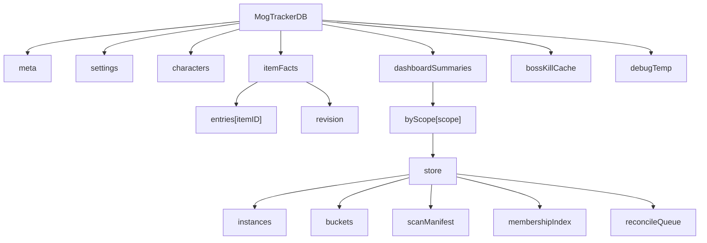
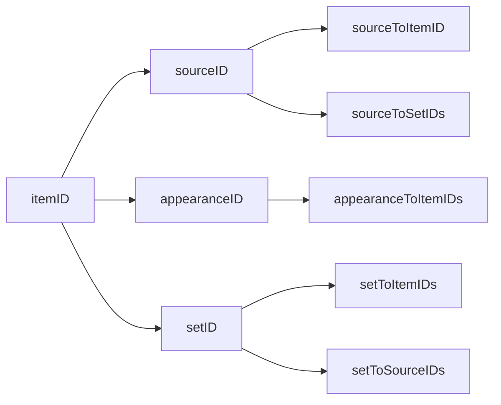
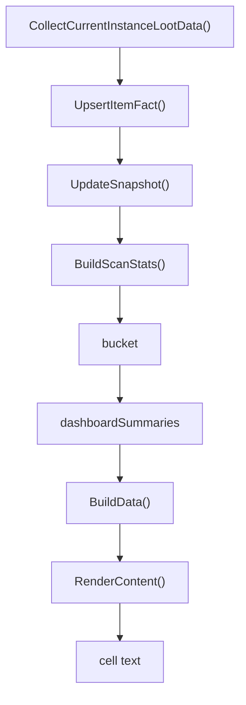

# 存储分层

本文说明 `MogTrackerDB` 当前如何按层组织，以及一条 item 事实如何流入统计摘要再落到看板单元格。

## 1. 总览

当前 storage 不是按面板分，而是按职责分：

- `settings`
  用户配置和过滤设置。
- `characters`
  角色身份、锁定信息、首领击杀状态。
- `itemFacts`
  归一化后的 item 事实层。
- `dashboardSummaries`
  统计看板的持久化摘要层。
- `bossKillCache`
  首领击杀相关索引。
- `debugTemp`
  `/img debug` 和 profile 临时输出。

入口文件：

- [Storage.lua](C:\World of Warcraft\_retail_\Interface\AddOns\MogTracker\src\storage\Storage.lua)
- [StorageGateway.lua](C:\World of Warcraft\_retail_\Interface\AddOns\MogTracker\src\storage\StorageGateway.lua)

## 2. 分层图

对应含义：

- `meta`
  schema/version 元信息。
- `settings`
  统一由 `StorageGateway.GetSettings()` 返回，读取时会先规范化。
- `characters`
  多角色视图和 lockout tooltip 的数据底座。
- `itemFacts`
  给掉落面板、套装逻辑、统计摘要复用的 item 事实。
- `dashboardSummaries`
  团本/地下城统计看板读取的离线摘要。

## 3. settings 层

`settings` 存的是用户配置，不是业务事实。常见字段有：

- `selectedClasses`
- `selectedLootTypes`
- `hideCollectedMounts`
- `hideCollectedPets`
- `panelStyle`
- `debugLogSections`
- `maxCharacters`

规范化入口在 [Storage.lua](C:\World of Warcraft\_retail_\Interface\AddOns\MogTracker\src\storage\Storage.lua) 的 `Storage.NormalizeSettings()`。

读取入口在 [StorageGateway.lua](C:\World of Warcraft\_retail_\Interface\AddOns\MogTracker\src\storage\StorageGateway.lua) 的 `StorageGateway.GetSettings()`。

## 4. itemFacts 层

`itemFacts` 是当前最重要的原子事实层，持久化位置是：

- `MogTrackerDB.itemFacts.entries[itemID]`

单个 item fact 的字段定义在 [Storage.lua](C:\World of Warcraft\_retail_\Interface\AddOns\MogTracker\src\storage\Storage.lua) 的 `NormalizeItemFactEntry()`：

- `itemID`
- `name`
- `link`
- `icon`
- `equipLoc`
- `itemType`
- `itemSubType`
- `itemClassID`
- `itemSubClassID`
- `appearanceID`
- `sourceID`
- `basicResolved`
- `appearanceResolved`
- `lastCheckedAt`
- `lastResolvedAt`
- `setIDs`

外围 cache 自身还有：

- `version`
- `layer`
- `kind`
- `schemaVersion`
- `revision`
- `entries`

## 5. itemFacts 索引

`itemFacts` 旁边维护了一组反查索引，代码在 [StorageGateway.lua](C:\World of Warcraft\_retail_\Interface\AddOns\MogTracker\src\storage\StorageGateway.lua)。

这些索引支持的入口包括：

- `GetItemFact(itemID)`
- `GetItemFactBySourceID(sourceID)`
- `GetItemFactsByAppearanceID(appearanceID)`
- `GetSetIDsBySourceID(sourceID)`
- `GetItemFactsBySetID(setID)`
- `GetSourceIDsBySetID(setID)`

## 6. dashboardSummaries 层

统计看板真正读的是 `dashboardSummaries`，不是 `itemFacts` 原表。

结构入口：

- [Storage.lua](C:\World of Warcraft\_retail_\Interface\AddOns\MogTracker\src\storage\Storage.lua) `NormalizeDashboardSummaryContainer()`
- [Storage.lua](C:\World of Warcraft\_retail_\Interface\AddOns\MogTracker\src\storage\Storage.lua) `NormalizeDashboardSummaryStore()`
- [Storage.lua](C:\World of Warcraft\_retail_\Interface\AddOns\MogTracker\src\storage\Storage.lua) `NormalizeDashboardBucket()`

层次是：

- `dashboardSummaries.byScope[summaryScopeKey]`
- `store.instances[instanceKey]`
- `store.buckets[bucketKey]`
- `store.scanManifest`
- `store.membershipIndex`
- `store.reconcileQueue`

其中：

- `instances`
  记录副本元信息和各难度 bucket 关联。
- `buckets`
  记录真正显示在看板里的聚合结果。
- `scanManifest`
  记录扫描覆盖情况。
- `membershipIndex`
  记录 bucket 依赖关系。
- `reconcileQueue`
  预留增量修复队列。

## 7. bucket 里的 item/member

`bucket` 本身除了实例维度字段，还带两类 member。

### 7.1 set piece member

定义在 [Storage.lua](C:\World of Warcraft\_retail_\Interface\AddOns\MogTracker\src\storage\Storage.lua) 的 `NormalizeSetPieceMember()`：

- `memberKey`
- `family`
- `collectionState`
- `collected`
- `itemID`
- `sourceID`
- `appearanceID`
- `setIDs`
- `slotKey`
- `slot`
- `name`

### 7.2 collectible member

定义在 [Storage.lua](C:\World of Warcraft\_retail_\Interface\AddOns\MogTracker\src\storage\Storage.lua) 的 `NormalizeCollectibleMember()`：

- `memberKey`
- `family`
- `collectibleType`
- `collectionState`
- `collected`
- `itemID`
- `sourceID`
- `appearanceID`
- `name`

## 8. item 到看板单元格的流转

下面这张图描述了“一个掉落 item 如何最终变成看板里的一个 `setCollected/setTotal` 或 `collectibleCollected/collectibleTotal`”。

分解成文字就是：

1. 掉落扫描先拿到 raw loot row。
2. item 元数据经 `UpsertItemFact()` 写回 `itemFacts`。
3. snapshot 写入阶段读取这些事实，构建 scan stats。
4. scan stats 被归并成 `bucket`。
5. `bucket` 持久化到 `dashboardSummaries`。
6. 看板打开时 `BuildData()` 从摘要层拼出行列。
7. `RenderContent()` 再把 bucket 数字写成单元格文本。

## 9. 为什么要分层

这样拆的好处是：

- `settings`
  和业务事实分开，避免配置污染事实缓存。
- `itemFacts`
  作为共享事实层，多个功能不必重复调 Blizzard API。
- `dashboardSummaries`
  作为离线摘要层，看板打开时不需要重扫 Encounter Journal。
- `indexes`
  负责反查关系，而不是把反查逻辑散在多个 UI 模块里。

如果你下一步要继续查“某个数字为什么不对”，建议按这个顺序看：

1. `itemFacts` 有没有正确写入。
2. `bucket` 有没有把这个 item/member 统计进去。
3. `BuildData()` 有没有取到正确摘要。
4. `RenderContent()` 是不是只把正确数字显示错了。
