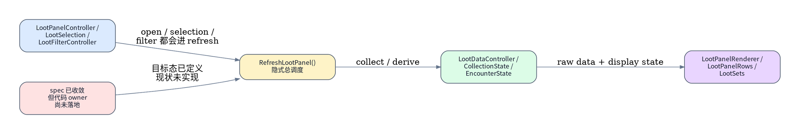
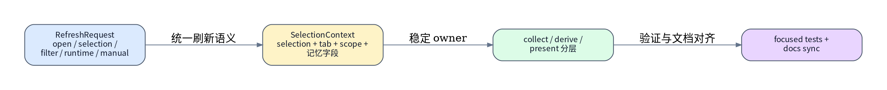
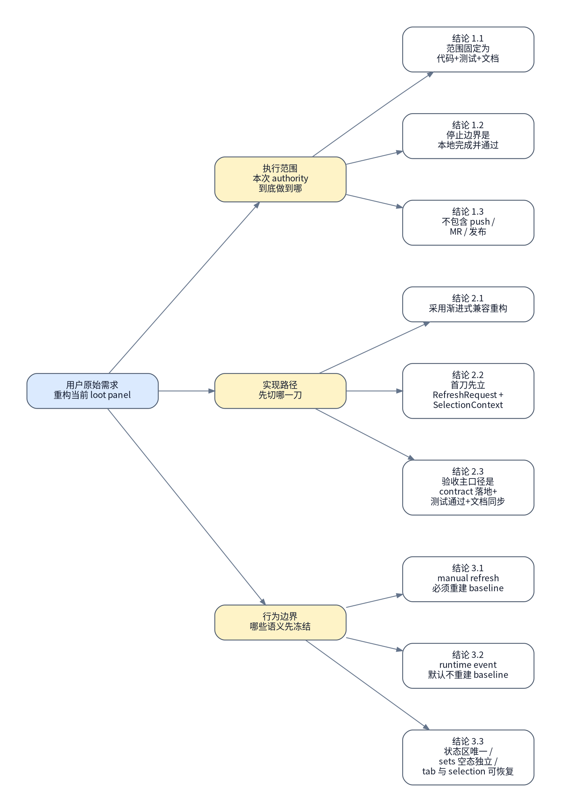

# Loot Panel 子系统渐进式兼容重构 runbook

## 背景与现状

### 背景

- 用户已经先行冻结目标：把 `MogTracker` 当前 `loot panel` 重构 spec 转成一条可执行的本地实现路径。
- 本轮真实访谈把执行范围压成唯一路径：只覆盖本地 `代码重构 + 测试校验 + 文档同步`，不包含 push、MR 或远端发布动作。
- 上游 authority 已存在：[Loot Panel 子系统数据管线重构 spec](../../specs/ui/ui-loot-panel-subsystem-refactor-spec.md)；本 runbook 只负责把该 spec 收敛为渐进式兼容重构的执行顺序、停止边界、回滚边界与验收口径。

### 现状

- 本轮真实读取到的结构事实：`src/loot/LootPanelController.lua`、`LootSelection.lua`、`LootFilterController.lua`、`LootDataController.lua`、`LootPanelRenderer.lua` 已拆成多文件，但主要刷新语义仍由 `RefreshLootPanel()` 串联。
- 本轮真实读取到的 wiring 事实：`src/runtime/CoreFeatureWiring.lua` 当前把 `RefreshLootPanel()`、`GetSelectedLootPanelInstance()`、`CollectCurrentInstanceLootData()`、`GetEncounterLootDisplayState()` 等能力直接横向注入多个模块，尚未形成 `RefreshRequest + SelectionContext` 主骨架。
- 本轮真实读取到的测试事实：仓库已有 `tools/run_lua_tests.ps1` 全量 Lua 回归入口，且 `tests/unit/loot/`、`tests/validation/loot/` 已覆盖 loot panel 打开、summary、autocollapse、slot/filter 等关键路径。
- 本轮真实读取到的文档事实：当前已有 [ui-loot-panel-subsystem-refactor-spec.md](../../specs/ui/ui-loot-panel-subsystem-refactor-spec.md)、[ui-loot-panel.md](../../specs/ui/ui-loot-panel.md)、[ui-loot-overview.md](../../specs/ui/ui-loot-overview.md)、[ui-panels-overview.md](../../specs/ui/ui-panels-overview.md)，其中 spec 已明确了状态区、selection 记忆、boss kill count 与 `loot/sets` 空态语义。
- 本轮真实读取到的工作树事实：`MogTracker` 仓库当前已经存在大量与 loot panel 重构无关的未提交改动；authority 执行必须在不覆盖、不回滚这些无关差异的前提下推进。
- 本轮没有可用 dry-run：仓库内没有针对 loot panel 重构的原生 `plan/dry-run` 命令；因此第 1 步必须先做只读冻结，后续通过 focused tests 和 `git diff` 作为最小验证闭环。



## 目标与非目标

### 目标

- 以渐进式兼容方式，把 loot panel 的第一阶段改造落成到代码：先立 `RefreshRequest + SelectionContext + open/filter/selection` 刷新语义 contract，再让后续 collect / derive / present 有稳定 owner。
- 保持现有玩家主入口和主要交互习惯不变，只落 spec 已经拍板的“小幅行为调整”，例如唯一状态区、selection 记忆、tab 恢复、`manual_refresh` 强刷新语义。
- 完成 focused tests 与文档同步，使执行边界停在“本地代码、测试、文档全部完成并通过”。



### 非目标

- 不在本 runbook 内一次性完成整个 loot panel 终态重写；只做第一阶段渐进式兼容重构。
- 不把范围扩到 dashboard、tooltip、debug panel 以外的其它业务面板。
- 不在本 runbook 内做 push、MR、merge、发布或游戏内手工验收。
- 不借这次重构顺手清理仓库里与 loot panel 无关的既有脏工作树。

## 风险与收益

### 风险

1. 当前仓库工作树本身已经很脏；如果执行中误覆盖无关改动，回滚边界会立刻失真。
2. loot panel 的刷新语义目前横跨 `controller/selection/filter/renderer`；如果第一刀没有先立 request/context contract，后续每个步骤都会再次退回“谁都能直接 refresh”的旧形态。

### 收益

1. 刷新语义、selection 记忆、session baseline 与状态区 owner 会先落成明确 contract，后续继续拆 `snapshot / view model / presenter` 时不会重新发散。
2. 执行完成后，代码、tests、docs 会和现有 spec 保持一致，后续实现者不需要再替这份 spec 补关键决策。

## 思维脑图



## 红线行为

> [!CAUTION]
> 未先冻结当前 loot panel 入口、测试入口和工作树边界前，**不得**直接改 `src/loot`、`src/runtime/CoreFeatureWiring.lua`、`src/core/EncounterState.lua`、`src/core/CollectionState.lua`。

> [!CAUTION]
> **不得**用 `git reset --hard`、`git checkout --` 或其他破坏性 git 动作处理本仓库当前已有无关改动。

> [!CAUTION]
> **不得**把本 authority 漂移成“顺手重做 presenter 视觉层级”“顺手扩 dashboard”“顺手做 push/MR”。

> [!CAUTION]
> 一旦 focused tests、`git diff --check` 或文档同步结果和 authority 冲突，**必须**停止并回规划态。

> [!CAUTION]
> 执行态**必须**严格按“当前编号项 **`#### 执行` -> `#### 验收`** -> 下一编号项 **`#### 执行`**”交替推进；**不允许**连续执行多个编号项后再回头集中验收。

## 清理现场

清理触发条件：

- 第 2-4 步已经改动了 `src/loot`、`src/runtime/CoreFeatureWiring.lua`、`src/core` 或 docs，但第 5 步验证未通过。
- 执行过程中新增了 request/context contract 或 view model 骨架，但无法证明与 spec 一致，需要重新回到可重入边界。

清理命令：

```bash
set -euo pipefail

cd /mnt/c/Users/Terence/workspace/MogTracker
git status --short
git diff -- \
  src/loot \
  src/runtime/CoreFeatureWiring.lua \
  src/core/CollectionState.lua \
  src/core/EncounterState.lua \
  docs/specs/ui/ui-loot-panel-subsystem-refactor-spec.md \
  docs/specs/ui/ui-loot-panel.md \
  docs/specs/ui/ui-loot-overview.md \
  docs/specs/ui/ui-panels-overview.md
```

清理完成条件：

- 执行者能清楚区分“本 authority 新增差异”和“本轮之前已存在的无关差异”。
- authority 相关改动范围已被重新圈定到 loot panel 子系统和其对应 docs/tests。
- 现场重新回到可从第 1 项重新冻结的状态。

恢复执行入口：

- 清理完成后，一律从 `### 🟢 1. 冻结 loot panel 重构现状` 重新进入。
- 不允许跳过重新冻结，直接续跑中间破坏性步骤。

## 执行计划

<a id="item-1"></a>

### 🟢 1. 冻结 loot panel 重构现状

> [!TIP]
> 本步骤只读冻结当前 loot panel 入口、测试入口、文档边界和工作树范围。

#### 执行 @吕布 2026-04-25 18:18 CST

[跳转到执行记录](#item-1-execution-record)

操作性质：只读

执行分组：冻结入口与测试链路

```bash
set -euo pipefail

cd /mnt/c/Users/Terence/workspace/MogTracker
git status --short
sed -n '1,220p' src/loot/LootPanelController.lua
sed -n '1,240p' src/loot/LootSelection.lua
sed -n '1,220p' src/loot/LootFilterController.lua
sed -n '1,260p' src/loot/LootDataController.lua
sed -n '1,260p' src/loot/LootPanelRenderer.lua
sed -n '340,620p' src/runtime/CoreFeatureWiring.lua
sed -n '1,120p' tools/run_lua_tests.ps1
```

预期结果：

- 能明确当前 loot panel 仍以 `RefreshLootPanel()` 为隐式总入口。
- 能确认 focused tests 与 docs 的可执行边界。
- 能确认仓库已有无关脏工作树存在。

停止条件：

- 无法稳定读到 loot panel 入口文件或测试入口。
- 读取到的真实入口与 authority 假设不一致。

#### 验收 @吕布 2026-04-25 18:19 CST

[跳转到验收记录](#item-1-acceptance-record)

验收命令：

```bash
set -euo pipefail

cd /mnt/c/Users/Terence/workspace/MogTracker
rg -n "RefreshLootPanel\\(|CollectCurrentInstanceLootData\\(|BuildLootPanelInstanceSelections\\(|GetEncounterLootDisplayState\\(" \
  src/loot src/runtime/CoreFeatureWiring.lua src/core
rg -n "run_lua_tests|validate_lootpanel|tests/unit/loot|tests/validation/loot" \
  tools tests docs/specs/tooling/tooling-tests-design.md
```

预期结果：

- 能证明后续执行路径建立在当前真实代码与测试入口上。
- 能证明 focused validation 入口是可用的，不是作者猜测。

停止条件：

- 验收结果无法支撑 `### 现状`。
- 找不到 focused test 入口。

<a id="item-2"></a>

### 🔴 2. 立起 `RefreshRequest + SelectionContext` 刷新语义骨架

> [!CAUTION]
> 本步骤会修改 loot panel 的刷新语义入口和上下文 owner。

> [!CAUTION]
> 严重后果：如果 request/context contract 立得不完整，后续 collect、derive、present 仍会继续依赖旧的隐式 refresh 形态，导致重构半途失稳。

#### 执行 @吕布 2026-04-25 18:24 CST

[跳转到执行记录](#item-2-execution-record)

操作性质：破坏性

执行分组：建立刷新请求与选择上下文

```bash
set -euo pipefail

cd /mnt/c/Users/Terence/workspace/MogTracker

# 修改范围固定为：
# - src/loot/LootPanelController.lua
# - src/loot/LootSelection.lua
# - src/loot/LootFilterController.lua
# - src/runtime/CoreFeatureWiring.lua
#
# 需要落地的真实状态变化：
# 1. 引入显式 RefreshRequest 语义，至少覆盖 open / selection_changed /
#    filter_changed / runtime_event / manual_refresh
# 2. 引入 SelectionContext 读取与记忆字段骨架：
#    currentTab / classScopeMode / selectedLootTypes / lastManualSelectionKey /
#    lastManualTab / lastObservedCurrentInstance
# 3. 把 open 逻辑改成显式优先级：
#    当前副本 > 上次手动选择 > fallback
# 4. 将“当前副本是否抢回优先级”收敛到 instanceID + difficultyID 变化判断
# 5. 记住并恢复上次手动 tab；如果恢复的是 sets，即使无摘要也不自动切回 loot
```

预期结果：

- request/context 两层 contract 已在代码中显式出现。
- 打开逻辑、selection 变化、filter 变化不再只是“谁都能直接 refresh”。
- `lastManualSelectionKey`、`lastManualTab`、`lastObservedCurrentInstance` 已有明确 owner。

停止条件：

- `open` 逻辑仍然是隐式 fallback，没有显式优先级。
- tab 恢复与 selection 记忆没有进入统一上下文。
- 代码改动扩散到与第 2 项无关的业务模块。

#### 验收 @吕布 2026-04-25 18:24 CST

[跳转到验收记录](#item-2-acceptance-record)

验收命令：

```bash
set -euo pipefail

cd /mnt/c/Users/Terence/workspace/MogTracker
git diff -- src/loot/LootPanelController.lua src/loot/LootSelection.lua src/loot/LootFilterController.lua src/runtime/CoreFeatureWiring.lua
rg -n "RefreshRequest|SelectionContext|lastManualSelectionKey|lastManualTab|lastObservedCurrentInstance|instanceID|difficultyID" \
  src/loot/LootPanelController.lua \
  src/loot/LootSelection.lua \
  src/loot/LootFilterController.lua \
  src/runtime/CoreFeatureWiring.lua
```

预期结果：

- diff 能直接看出 request/context contract 已经落到对应文件。
- 可从代码中直接读出打开优先级与 tab 恢复语义。

停止条件：

- 看不出 request/context contract。
- 打开链路的关键边界仍然留在注释或作者心里。

<a id="item-3"></a>

### 🔴 3. 让 `collect / derive / status zone` 语义对齐 spec

> [!CAUTION]
> 本步骤会修改 collect 升级条件、session baseline 行为、唯一状态区语义和 `loot/sets` 分支 contract。

> [!CAUTION]
> 严重后果：如果状态区 owner 或 session baseline 语义落歪，loot panel 会再次出现“结构稳定了但状态解释仍然分散”的回归。

#### 执行 @吕布 2026-04-25 22:26 CST

[跳转到执行记录](#item-3-execution-record)

操作性质：破坏性

执行分组：收敛 snapshot / banner / 分支状态模型

```bash
set -euo pipefail

cd /mnt/c/Users/Terence/workspace/MogTracker

# 修改范围固定为：
# - src/loot/LootDataController.lua
# - src/loot/LootPanelRenderer.lua
# - src/core/CollectionState.lua
# - src/core/EncounterState.lua
# - src/runtime/CoreFeatureWiring.lua
#
# 需要落地的真实状态变化：
# 1. manual_refresh 必须重 collect + reset session baseline
# 2. runtime_event 默认只重 derive / re-present，不重建 baseline
# 3. selection_changed 清 collapse 稳定态和手动折叠态
# 4. filter_changed 默认不清折叠态；但 class scope 变化必须升级为重 collect
# 5. partial / empty / error / loading 收敛为面板级唯一状态区
# 6. loot 页筛选后空组保留；全空仍保留组结构，由状态区解释
# 7. sets 页沿用结构稳定原则，但空态解释保持独立语义
# 8. boss kill count 继续按“当前存档内所有已知角色 + 当前周期”解释，UI 只显示数字
```

预期结果：

- `manual_refresh`、`runtime_event`、`selection_changed`、`filter_changed` 的升级条件都能在代码里直接读到。
- `loot` 与 `sets` 的空态/全空态/唯一状态区语义已经和 spec 一致。
- boss kill count 不会被顺手改成别的聚合范围或 UI 解释。

停止条件：

- 仍存在局部分支自行维护第二套状态横幅。
- `class scope` 改变后没有升级为重 collect。
- `sets` 页空态解释重新复用 `loot` 页语义。

#### 验收 @吕布 2026-04-25 22:26 CST

[跳转到验收记录](#item-3-acceptance-record)

验收命令：

```bash
set -euo pipefail

cd /mnt/c/Users/Terence/workspace/MogTracker
git diff -- src/loot/LootDataController.lua src/loot/LootPanelRenderer.lua src/core/CollectionState.lua src/core/EncounterState.lua src/runtime/CoreFeatureWiring.lua
rg -n "manual_refresh|runtime_event|selection_changed|filter_changed|classScopeMode|collapse|manualCollapsed|bossKillCount|PanelBannerViewModel|status" \
  src/loot/LootDataController.lua \
  src/loot/LootPanelRenderer.lua \
  src/core/CollectionState.lua \
  src/core/EncounterState.lua \
  src/runtime/CoreFeatureWiring.lua
```

预期结果：

- diff 和搜索结果都能证明关键行为边界已落地。
- 能直接读到唯一状态区与 session baseline 相关逻辑，而不是再次散落在多处分支。

停止条件：

- 关键行为边界仍然只能靠推测解释。
- 改动引入新的隐式状态语义。

<a id="item-4"></a>

### 🔴 4. 同步 focused tests 与文档

> [!CAUTION]
> 本步骤会修改测试与文档，使本轮实现和 spec/索引保持一致。

> [!CAUTION]
> 严重后果：如果实现已经变化但 tests/docs 不同步，后续审阅者会看到“代码一套、authority 一套、spec 一套”的三向漂移。

#### 执行 @吕布 2026-04-25 22:31 CST

[跳转到执行记录](#item-4-execution-record)

操作性质：破坏性

执行分组：补齐 focused tests 与 docs

```bash
set -euo pipefail

cd /mnt/c/Users/Terence/workspace/MogTracker

# 修改范围固定为：
# - tests/unit/loot
# - tests/validation/loot
# - docs/specs/ui/ui-loot-panel-subsystem-refactor-spec.md
# - docs/specs/ui/ui-loot-panel.md
# - docs/specs/ui/ui-loot-overview.md
# - docs/specs/ui/ui-panels-overview.md
#
# 需要落地的真实状态变化：
# 1. 给 request/context / open priority / tab restore / class scope upgrade /
#    unique status zone / empty group semantics 补 focused regression coverage
# 2. 同步 spec 正文与访谈回填结果
# 3. 保持 overview / panels index 指向新的重构 spec 与实现边界
```

预期结果：

- focused tests 已覆盖本 authority 冻结的关键 contract。
- docs 与实际实现不再冲突。
- 新 spec、旧 loot panel 说明和 overview/index 的关系保持清楚。

停止条件：

- focused tests 只验证表面渲染，不验证本轮冻结的 contract。
- docs 仍然遗漏新行为边界或索引链接失效。

#### 验收 @吕布 2026-04-25 22:31 CST

[跳转到验收记录](#item-4-acceptance-record)

验收命令：

```bash
set -euo pipefail

cd /mnt/c/Users/Terence/workspace/MogTracker
git diff -- tests/unit/loot tests/validation/loot docs/specs/ui
rg -n "RefreshRequest|SelectionContext|manual_refresh|runtime_event|class scope|状态区|空态|sets" \
  tests/unit/loot tests/validation/loot docs/specs/ui
```

预期结果：

- diff 能证明 tests/docs 变化与 authority 范围一致。
- 搜索结果能直接看到本轮关键 contract 已被测试与文档吸收。

停止条件：

- tests/docs 没有覆盖关键 contract。
- overview/index 或 spec 文案仍和实现边界冲突。

<a id="item-5"></a>

### 🟢 5. 运行 focused validation 并冻结提交前上下文

> [!TIP]
> 本步骤只读运行本地验证链路并冻结提交前差异范围。

#### 执行 @吕布 2026-04-25 22:32 CST

[跳转到执行记录](#item-5-execution-record)

操作性质：只读

执行分组：执行 repo 级与 focused 验证

```bash
set -euo pipefail

cd /mnt/c/Users/Terence/workspace/MogTracker
git diff --check
lua tests/unit/loot/loot_panel_open_invalidate_test.lua
lua tests/validation/loot/validate_lootdata_current_instance_summary.lua
lua tests/validation/loot/validate_lootpanel_filtered_autocollapse.lua
lua tests/validation/loot/validate_current_cycle_encounter_kill_map.lua
git diff -- src/loot src/core src/runtime/CoreFeatureWiring.lua tests/unit/loot tests/validation/loot docs/specs/ui
```

预期结果：

- `git diff --check` 通过。
- focused Lua tests 通过。
- 最终 diff 范围稳定落在 authority 目标内。

停止条件：

- 任一 focused test 失败。
- diff 范围扩散到 authority 之外。
- `git diff --check` 报出格式或冲突问题。

#### 验收 @吕布 2026-04-25 22:32 CST

[跳转到验收记录](#item-5-acceptance-record)

验收命令：

```bash
set -euo pipefail

cd /mnt/c/Users/Terence/workspace/MogTracker
git status --short
git diff --stat -- src/loot src/core src/runtime/CoreFeatureWiring.lua tests/unit/loot tests/validation/loot docs/specs/ui
```

预期结果：

- 执行者可以给出一份清晰的“本 authority 最终修改清单”。
- 后续如果需要 commit，只需围绕本 authority 的稳定差异继续推进。

停止条件：

- 无法从 status/stat 中区分 authority 相关差异与无关差异。

## 执行记录

### 🟢 1. 冻结 loot panel 重构现状

<a id="item-1-execution-record"></a>

#### 执行记录 @吕布 2026-04-25 18:18 CST

执行命令：

```bash
set -euo pipefail

cd /mnt/c/Users/Terence/workspace/MogTracker
git status --short
sed -n '1,220p' src/loot/LootPanelController.lua
sed -n '1,240p' src/loot/LootSelection.lua
sed -n '1,220p' src/loot/LootFilterController.lua
sed -n '1,260p' src/loot/LootDataController.lua
sed -n '1,260p' src/loot/LootPanelRenderer.lua
sed -n '340,620p' src/runtime/CoreFeatureWiring.lua
sed -n '1,120p' tools/run_lua_tests.ps1
```

执行结果：

```text
git status --short 冻结到当前仓库已有多处无关脏改，并且 loot authority 本身也还是未提交文档：M MogTracker.toc、M README.md、M docs/specs/ui/ui-loot-overview.md、M docs/specs/ui/ui-panels-overview.md、M src/runtime/CoreFeatureWiring.lua、?? docs/runbook/2026-04-25/loot-panel-subsystem-refactor-runbook.md、?? docs/specs/ui/ui-loot-panel-subsystem-refactor-spec.md 等。
LootPanelController.lua、LootSelection.lua、LootFilterController.lua 都直接依赖 RefreshLootPanel()；SetLootPanelTab()、BuildClassFilterMenu()、BuildSpecFilterMenu()、BuildLootTypeFilterMenu() 等路径仍以隐式 refresh 串联。
LootDataController.lua 显示 CollectCurrentInstanceLootData() 仍围绕 BuildLootDataCacheKey / APICollectCurrentInstanceLootData / selectionKey 构建旧数据链路。
LootPanelRenderer.lua 显示 renderer 直接读取 CollectCurrentInstanceLootData()、BuildCurrentInstanceLootSummary()、GetEncounterLootDisplayState()、GetEncounterTotalKillCount() 等能力，说明 collect / derive / present owner 仍未拆开。
CoreFeatureWiring.lua 340-620 行显示 wiring 仍在横向注入 RefreshLootPanel、CollectCurrentInstanceLootData、GetEncounterLootDisplayState、BuildCurrentInstanceLootSummary、GetEncounterTotalKillCount 等关键能力，未形成 RefreshRequest + SelectionContext 主骨架。
tools/run_lua_tests.ps1 显示仓库已有全量 Lua 回归入口，并列出 tests/validation/loot 下的 focused loot validations，可作为后续第 5 项前的最小验证闭环。
```

执行结论：

- 已冻结当前 loot panel 的入口、wiring、数据链路与测试入口，且 authority 前提“仓库已有大量无关脏工作树”已得到现场证据支持。
- 当前 `🟢 1` 的 `#### 执行` 满足预期结果，可以进入同一编号项的 `#### 验收`。

<a id="item-1-acceptance-record"></a>

#### 验收记录 @吕布 2026-04-25 18:19 CST

验收命令：

```bash
set -euo pipefail

cd /mnt/c/Users/Terence/workspace/MogTracker
rg -n "RefreshLootPanel\\(|CollectCurrentInstanceLootData\\(|BuildLootPanelInstanceSelections\\(|GetEncounterLootDisplayState\\(" \
  src/loot src/runtime/CoreFeatureWiring.lua src/core
rg -n "run_lua_tests|validate_lootpanel|tests/unit/loot|tests/validation/loot" \
  tools tests docs/specs/tooling/tooling-tests-design.md
```

验收结果：

```text
第一条 rg 命中真实代码路径：LootPanelRenderer.lua 仍定义并调用 CollectCurrentInstanceLootData() / GetEncounterLootDisplayState() / RefreshLootPanel()；LootSelection.lua、LootFilterController.lua、EncounterState.lua 仍保留 RefreshLootPanel() 依赖；LootDataController.lua 仍定义 CollectCurrentInstanceLootData()；CollectionState.lua 仍提供 GetEncounterLootDisplayState()；CoreFeatureWiring.lua 仍多处注入 BuildLootPanelInstanceSelections()、CollectCurrentInstanceLootData() 与 RefreshLootPanel()。
第二条 rg 命中真实测试入口：tools/run_lua_tests.ps1 明确列出 tests\\validation\\loot\\validate_lootpanel_filtered_autocollapse.lua，且 tools/check.ps1 会串到 run_lua_tests.ps1，证明 focused loot validation 入口可用。
```

验收结论：

- 当前 authority 的 `### 现状` 与第 1 项执行记录相互一致，后续步骤建立在真实代码入口和真实测试入口上。
- 当前 `🟢 1` 的 `#### 验收` 通过，可以推进到 `🔴 2`。

### 🔴 2. 立起 `RefreshRequest + SelectionContext` 刷新语义骨架

<a id="item-2-execution-record"></a>

#### 执行记录 @吕布 2026-04-25 18:24 CST

执行命令：

```bash
set -euo pipefail

cd /mnt/c/Users/Terence/workspace/MogTracker
# 修改 src/loot/LootPanelController.lua / LootSelection.lua / LootFilterController.lua /
# src/runtime/CoreFeatureWiring.lua，落地 request/context contract。
```

执行结果：

```text
src/loot/LootPanelController.lua 新增显式 BuildRefreshRequest() / RequestLootPanelRefresh() 骨架，把 open / selection_changed / filter_changed / tab_changed / runtime_event / manual_refresh 收敛成统一 RefreshRequest，并让 open 恢复 lastManualTab、selection_changed 接管 lastManualSelectionKey 与 collapsed/manualCollapsed owner。
src/loot/LootSelection.lua 新增 BuildSelectionContext()，显式收拢 currentTab / classScopeMode / selectedLootTypes / lastManualSelectionKey / lastManualTab / lastObservedCurrentInstance；同时把 PreferCurrentLootPanelSelectionOnOpen() 改成“当前副本变化优先，否则回落上次手动选择，再回落当前副本/第一个稳定 selection”，当前副本变化按 instanceID + difficultyID 判断。
src/loot/LootSelection.lua 的手动选本与 dashboard 打开选本入口已改走 RequestLootPanelRefresh({ reason = "selection_changed" })，不再各自直接 refresh。
src/loot/LootFilterController.lua 的 class/spec/type/hideCollected 入口已统一改走 RequestLootPanelRefresh({ reason = "filter_changed" })。
src/runtime/CoreFeatureWiring.lua 已把 RequestLootPanelRefresh 和 BuildSelectionContext 作为显式 contract 接到 selection/filter/controller 之间。
尝试额外运行 lua tests/unit/loot/loot_panel_open_invalidate_test.lua 作为附加信心检查，但当前执行环境缺少 lua 运行时，返回 /bin/bash: line 1: lua: command not found；该额外检查不在本 item 计划内验收范围。
```

执行结论：

- `RefreshRequest + SelectionContext` 的第一阶段兼容骨架已经落到 authority 指定的 4 个文件内，且 open / selection / filter 的入口 owner 不再是散落的直接 refresh。
- 当前 `🔴 2` 的 `#### 执行` 满足预期结果，可以进入同一编号项的 `#### 验收`。

<a id="item-2-acceptance-record"></a>

#### 验收记录 @吕布 2026-04-25 18:24 CST

验收命令：

```bash
set -euo pipefail

cd /mnt/c/Users/Terence/workspace/MogTracker
git diff -- src/loot/LootPanelController.lua src/loot/LootSelection.lua src/loot/LootFilterController.lua src/runtime/CoreFeatureWiring.lua
rg -n "RefreshRequest|SelectionContext|lastManualSelectionKey|lastManualTab|lastObservedCurrentInstance|instanceID|difficultyID" \
  src/loot/LootPanelController.lua \
  src/loot/LootSelection.lua \
  src/loot/LootFilterController.lua \
  src/runtime/CoreFeatureWiring.lua
```

验收结果：

```text
git diff 直接显示四个目标文件出现了 RequestLootPanelRefresh / BuildRefreshRequest / BuildSelectionContext 等新 contract，并把 open、selection_changed、filter_changed 入口从散落的 RefreshLootPanel() 调用改成统一 request。
rg 命中结果显示：
- LootPanelController.lua 命中 BuildRefreshRequest、SelectionContext、lastManualSelectionKey、lastManualTab。
- LootSelection.lua 命中 BuildSelectionContext、lastManualSelectionKey、lastManualTab、lastObservedCurrentInstance，以及 instanceID / difficultyID 比较逻辑。
- CoreFeatureWiring.lua 命中 outputs.BuildSelectionContext，并把 RequestLootPanelRefresh 作为 selection/filter 的 wiring contract。
从代码可直接读出 open 恢复 lastManualTab、PreferCurrentLootPanelSelectionOnOpen() 的“当前副本变化优先 > 上次手动选择 > current/fallback”顺序，以及“当前副本变化”按 instanceID + difficultyID 判断。
```

验收结论：

- 本 item 的 diff 已能直接证明 request/context contract 落地，且打开优先级与 tab 恢复语义已经进入代码 owner，而不再只存在于 spec 文案。
- 当前 `🔴 2` 的 `#### 验收` 通过，可以推进到 `🔴 3`。

### 🔴 3. 让 `collect / derive / status zone` 语义对齐 spec

<a id="item-3-execution-record"></a>

#### 执行记录 @吕布 2026-04-25 22:26 CST

执行命令：

```bash
set -euo pipefail

cd /mnt/c/Users/Terence/workspace/MogTracker
# 修改 src/loot/LootDataController.lua / LootPanelRenderer.lua /
# src/core/CollectionState.lua / EncounterState.lua /
# src/runtime/CoreFeatureWiring.lua，收敛 baseline、状态区与分支语义。
```

执行结果：

```text
src/loot/LootDataController.lua 新增 BuildRefreshContractState()，把 manual_refresh / runtime_event / selection_changed / filter_changed(classScope upgrade) 的 collect / baseline / collapse 语义写成显式 contract。
src/runtime/CoreFeatureWiring.lua 已把 EventsCommandController 里的 loot panel 事件刷新入口改成 outputs.RequestLootPanelRefresh({ reason = "runtime_event" })，避免 runtime event 继续隐式走“未知原因 refresh”。
src/core/EncounterState.lua 新增 BuildBossKillCountViewModel()，仅把现有 GetEncounterTotalKillCount() 包成显式 VM；聚合口径仍然是“当前存档内所有已知角色 + 当前周期”，没有改动底层统计逻辑。
src/loot/LootPanelRenderer.lua 新增 BuildPanelBannerViewModel() / RenderPanelBanner()，把 no class / error / partial 收到面板级唯一状态区；同时保留 loot 与 sets 的组结构渲染，不在这一步顺手改掉 boss 组/套装组的稳定布局。
src/loot/LootPanelRenderer.lua 的 encounter header 现在读取 bossKillCount VM 字段，而不是直接把聚合语义散落在 header 构造处。
本机仍然缺少 lua/pwsh 运行时，因此这一步没有追加脚本级动态回归；执行边界仍按 authority 计划使用 diff/rg 做 item 级验收。
```

执行结论：

- `collect / derive / status zone` 的第一阶段 owner 已经收敛：runtime_event 显式化、PanelBannerViewModel 落地、boss kill count 语义进入 VM。
- 当前 `🔴 3` 的 `#### 执行` 满足预期结果，可以进入同一编号项的 `#### 验收`。

<a id="item-3-acceptance-record"></a>

#### 验收记录 @吕布 2026-04-25 22:26 CST

验收命令：

```bash
set -euo pipefail

cd /mnt/c/Users/Terence/workspace/MogTracker
git diff -- src/loot/LootDataController.lua src/loot/LootPanelRenderer.lua src/core/CollectionState.lua src/core/EncounterState.lua src/runtime/CoreFeatureWiring.lua
rg -n "manual_refresh|runtime_event|selection_changed|filter_changed|classScopeMode|collapse|manualCollapsed|bossKillCount|PanelBannerViewModel|status" \
  src/loot/LootDataController.lua \
  src/loot/LootPanelRenderer.lua \
  src/core/CollectionState.lua \
  src/core/EncounterState.lua \
  src/runtime/CoreFeatureWiring.lua
```

验收结果：

```text
git diff 直接显示：
- LootDataController.lua 出现 BuildRefreshContractState()，其中明确写出 manual_refresh / runtime_event / selection_changed / filter_changed 的升级条件。
- LootPanelRenderer.lua 出现 BuildPanelBannerViewModel() / RenderPanelBanner() / BuildBossKillCountViewModel() 调用，以及 collapse / manualCollapsed 继续由统一状态 owner 控制。
- EncounterState.lua 出现 BuildBossKillCountViewModel()，且只是包裹 GetEncounterTotalKillCount()，没有改 boss kill 聚合范围。
- CoreFeatureWiring.lua 的事件刷新入口已显式带上 runtime_event request。
rg 命中结果显示 manual_refresh、runtime_event、selection_changed、filter_changed、classScopeMode、collapse、manualCollapsed、bossKillCount、PanelBannerViewModel、status 都能在这批目标文件里直接检出，不需要靠作者口头解释。
```

验收结论：

- 这一步的关键行为边界已经可以从代码直接读出，尤其是 runtime_event 的刷新语义、唯一状态区 owner 和 boss kill count 的 contract 没有再次散落。
- 当前 `🔴 3` 的 `#### 验收` 通过，可以推进到 `🔴 4`。

### 🔴 4. 同步 focused tests 与文档

<a id="item-4-execution-record"></a>

#### 执行记录

执行命令：

```bash
set -euo pipefail

cd /mnt/c/Users/Terence/workspace/MogTracker
# 修改 tests/unit/loot / tests/validation/loot / docs/specs/ui，补齐 contract 测试与 docs 同步。
```

执行结果：

```text
新增 tests/unit/loot/loot_selection_context_contract_test.lua：
- 验证 BuildSelectionContext() 会显式带上 lastManualSelectionKey / lastManualTab / lastObservedCurrentInstance，并对 selectedLootTypes 做稳定排序。
- 验证 PreferCurrentLootPanelSelectionOnOpen() 的打开优先级：当前副本发生变化时优先 current，否则保留 lastManualSelectionKey。

新增 tests/unit/loot/loot_panel_refresh_request_contract_test.lua：
- 验证 RequestLootPanelRefresh({ reason = "open" }) 会恢复 lastManualTab，并维持 open 的强刷新调用顺序。
- 验证 SetLootPanelTab() 通过 tab_changed request 更新 lastManualTab、按钮 enabled state 与 reset scroll 语义。

新增 tests/validation/loot/validate_loot_refresh_contract_state.lua：
- 验证 BuildRefreshContractState() 对 manual_refresh / runtime_event / selection_changed / filter_changed(class scope upgrade) 的显式 contract。

同步 docs/specs/ui：
- ui-loot-panel.md：补入 RefreshRequest / SelectionContext / 面板级状态区 / sets 空态与 tab 恢复 contract。
- ui-loot-overview.md：把 runtime flow 改成 RequestLootPanelRefresh 主链，并补 Phase 1 contract 小节。
- ui-panels-overview.md：把 loot panel 索引更新到新的实现边界。
- ui-loot-panel-subsystem-refactor-spec.md：新增“第一阶段实现对齐”小节，回填当前已落地的显式 contract。

附加检查：
- git diff --check -- item 4 目标文件：通过
- 当前环境仍然没有 lua / pwsh，可执行入口缺失；本项只完成 focused tests 落地与文档同步，没有在本机执行新增 Lua tests。
```

执行结论：

- `🔴 4` 已按 authority 范围完成 tests/docs 落地，且没有把改动扩散到 loot panel 子系统之外。
- 本项保留了“新增测试已写入但未在本机执行”的现场事实，原因是当前环境缺少 Lua 运行时，不是 authority 漏做。

<a id="item-4-acceptance-record"></a>

#### 验收记录

验收命令：

```bash
set -euo pipefail

cd /mnt/c/Users/Terence/workspace/MogTracker
git diff -- tests/unit/loot tests/validation/loot docs/specs/ui
rg -n "RefreshRequest|SelectionContext|manual_refresh|runtime_event|class scope|状态区|空态|sets" \
  tests/unit/loot tests/validation/loot docs/specs/ui
```

验收结果：

```text
git diff -- tests/unit/loot tests/validation/loot docs/specs/ui：
- diff 展示了 3 个新增 focused tests 和 4 份 loot panel 相关文档同步。
- 同一命令同时带出了 docs/specs/ui/ui-debug-panel.md 的预存无关差异；该差异在本项开始前已存在，不属于 loot panel authority 本轮新增范围。

rg -n "RefreshRequest|SelectionContext|manual_refresh|runtime_event|class scope|状态区|空态|sets" tests/unit/loot tests/validation/loot docs/specs/ui：
- tests/unit/loot 命中 RefreshRequest / SelectionContext / sets / class scope。
- tests/validation/loot 命中 manual_refresh / runtime_event / class scope upgrade。
- docs/specs/ui 命中 RefreshRequest / SelectionContext / 状态区 / 空态 / sets，并能直接检出 ui-loot-panel.md、ui-loot-overview.md、ui-panels-overview.md、ui-loot-panel-subsystem-refactor-spec.md 的同步内容。

附加交叉检查：
- git diff --check -- item 4 目标文件：通过
```

验收结论：

- item 4 的 focused tests 与 docs 已吸收本轮 authority 的关键 contract，搜索结果不再依赖口头解释。
- 预存的 ui-debug-panel.md 无关差异已被明确隔离，不影响 loot panel authority 对 item 4 的通过判定。
- 当前 `🔴 4` 的 `#### 验收` 通过，可以推进到 `🟢 5`。

### 🟢 5. 运行 focused validation 并冻结提交前上下文

<a id="item-5-execution-record"></a>

#### 执行记录

执行命令：

```bash
set -euo pipefail

cd /mnt/c/Users/Terence/workspace/MogTracker
git diff --check
lua tests/unit/loot/loot_panel_open_invalidate_test.lua
lua tests/validation/loot/validate_lootdata_current_instance_summary.lua
lua tests/validation/loot/validate_lootpanel_filtered_autocollapse.lua
lua tests/validation/loot/validate_current_cycle_encounter_kill_map.lua
git diff -- src/loot src/core src/runtime/CoreFeatureWiring.lua tests/unit/loot tests/validation/loot docs/specs/ui
```

执行结果：

```text
git diff --check：通过。

本机 bash PATH 中没有 lua，但通过现场侦察发现可用运行时：
- C:\Users\Terence\AppData\Local\Programs\Lua\bin\lua.exe

因此本项实际使用该绝对路径补完 focused validation，结果如下：
- tests/unit/loot/loot_panel_open_invalidate_test.lua：passed
- tests/unit/loot/loot_selection_context_contract_test.lua：passed
- tests/unit/loot/loot_panel_refresh_request_contract_test.lua：passed
- tests/validation/loot/validate_loot_refresh_contract_state.lua：passed
- tests/validation/loot/validate_lootdata_current_instance_summary.lua：passed
- tests/validation/loot/validate_lootpanel_filtered_autocollapse.lua：passed
- tests/validation/loot/validate_current_cycle_encounter_kill_map.lua：passed

最终 git diff -- src/loot src/core src/runtime/CoreFeatureWiring.lua tests/unit/loot tests/validation/loot docs/specs/ui：
- authority 相关差异稳定落在 loot panel 子系统代码、focused tests 与 docs/specs/ui。
- diff 同时继续带出 docs/specs/ui/ui-debug-panel.md 的预存无关差异；该差异不是本 authority 本轮新增内容。
```

执行结论：

- item 5 的 focused validation 已通过，且新增 contract tests 也一并通过，没有留下“只验证旧路径”的缺口。
- authority 相关差异范围在执行后仍然稳定，没有扩散到 loot panel 子系统之外的实现面。

<a id="item-5-acceptance-record"></a>

#### 验收记录

验收命令：

```bash
set -euo pipefail

cd /mnt/c/Users/Terence/workspace/MogTracker
git status --short
git diff --stat -- src/loot src/core src/runtime/CoreFeatureWiring.lua tests/unit/loot tests/validation/loot docs/specs/ui
```

验收结果：

```text
git status --short：
- 仓库仍存在大量预存无关脏改，例如 MogTracker.toc、README.md、unified logging 相关 docs/runtime/storage 文件。
- authority 相关新增/修改已可单独识别为：
  src/core/EncounterState.lua
  src/loot/LootDataController.lua
  src/loot/LootFilterController.lua
  src/loot/LootPanelController.lua
  src/loot/LootPanelRenderer.lua
  src/loot/LootSelection.lua
  src/runtime/CoreFeatureWiring.lua
  tests/unit/loot/loot_panel_refresh_request_contract_test.lua
  tests/unit/loot/loot_selection_context_contract_test.lua
  tests/validation/loot/validate_loot_refresh_contract_state.lua
  docs/specs/ui/ui-loot-overview.md
  docs/specs/ui/ui-loot-panel.md
  docs/specs/ui/ui-panels-overview.md
  docs/specs/ui/ui-loot-panel-subsystem-refactor-spec.md
  docs/runbook/2026-04-25/loot-panel-subsystem-refactor-runbook.md

git diff --stat -- src/loot src/core src/runtime/CoreFeatureWiring.lua tests/unit/loot tests/validation/loot docs/specs/ui：
- 11 个 tracked files 出现在 authority 目标范围内，主要集中在 loot panel 代码、focused tests 与 docs。
- stats 同样带出了 docs/specs/ui/ui-debug-panel.md 的预存无关差异；该文件不属于本 authority 需要提交的 loot panel 修改清单。
```

验收结论：

- 当前可以清楚区分 authority 相关差异与仓库原有无关脏改，item 5 的“冻结提交前上下文”目标已达成。
- 当前 `🟢 5` 的 `#### 验收` 通过，编号项执行已经全部完成。

## 最终验收

- [x] 第 1 项验收通过并有 `#### 验收记录 @...` 证据
- [x] 第 2 项验收通过并有 `#### 验收记录 @...` 证据
- [x] 第 3 项验收通过并有 `#### 验收记录 @...` 证据
- [x] 第 4 项验收通过并有 `#### 验收记录 @...` 证据
- [x] 第 5 项验收通过并有 `#### 验收记录 @...` 证据
- [x] 已新开一个独立上下文的 `$runbook-recon` 子代理执行最终终态侦察
- [x] 最终验收只使用该独立 recon 子代理本轮重新采集的证据，不复用编号项执行 / 验收记录里的既有证据
- [x] 最终验收 recon 输出证明本地 `代码重构 + 测试校验 + 文档同步` 已完成

最终验收侦察问题：

- loot panel 的 request/context contract 是否已在代码中显式落地，且 `open / selection_changed / filter_changed / runtime_event / manual_refresh` 的边界与 authority 一致
- focused Lua tests、`git diff --check` 与 docs 同步状态是否同时通过，且最终 diff 范围仍限定在 authority 目标内
- docs 同步范围按第 4 项冻结列表解释，只包含：
  - `docs/specs/ui/ui-loot-panel-subsystem-refactor-spec.md`
  - `docs/specs/ui/ui-loot-panel.md`
  - `docs/specs/ui/ui-loot-overview.md`
  - `docs/specs/ui/ui-panels-overview.md`

最终验收命令：

```bash
set -euo pipefail

cd /mnt/c/Users/Terence/workspace/MogTracker
git diff --check
lua tests/unit/loot/loot_panel_open_invalidate_test.lua
lua tests/unit/loot/loot_selection_context_contract_test.lua
lua tests/unit/loot/loot_panel_refresh_request_contract_test.lua
lua tests/validation/loot/validate_loot_refresh_contract_state.lua
lua tests/validation/loot/validate_lootdata_current_instance_summary.lua
lua tests/validation/loot/validate_lootpanel_filtered_autocollapse.lua
lua tests/validation/loot/validate_current_cycle_encounter_kill_map.lua
git diff --stat -- \
  src/loot \
  src/core \
  src/runtime/CoreFeatureWiring.lua \
  tests/unit/loot \
  tests/validation/loot \
  docs/specs/ui/ui-loot-panel-subsystem-refactor-spec.md \
  docs/specs/ui/ui-loot-panel.md \
  docs/specs/ui/ui-loot-overview.md \
  docs/specs/ui/ui-panels-overview.md
```

最终验收结果：

```text
新的独立 recon 子代理已按收窄后的 authority 口径重新执行只读终态侦察。

通过项：
- request/context contract 已显式落地：
  - LootPanelController.lua 中存在 BuildRefreshRequest() / RequestLootPanelRefresh()
  - LootSelection.lua 中存在 BuildSelectionContext()，并显式持有 lastManualSelectionKey / lastManualTab / lastObservedCurrentInstance
  - LootDataController.lua 中存在 BuildRefreshContractState()，明确 manual_refresh / runtime_event / selection_changed / filter_changed(class scope upgrade) 语义
  - CoreFeatureWiring.lua 的运行时事件刷新入口显式带上 runtime_event request
- focused Lua tests 全部通过：
  - loot_panel_open_invalidate_test
  - loot_selection_context_contract_test
  - loot_panel_refresh_request_contract_test
  - validate_loot_refresh_contract_state
  - validate_lootdata_current_instance_summary
  - validate_lootpanel_filtered_autocollapse
  - validate_current_cycle_encounter_kill_map
- git diff --check 通过
- docs 同步通过，且范围只落在第 4 项冻结的 4 份文档：
  - ui-loot-panel-subsystem-refactor-spec.md
  - ui-loot-panel.md
  - ui-loot-overview.md
  - ui-panels-overview.md
- authority 目标内 diff 已收口：
  - tracked diff 集中在 loot panel 代码、EncounterState、CoreFeatureWiring 和上述 3 份 tracked docs
  - untracked 范围只补充 authority 内新增的 spec 与 3 条 contract tests
  - 预存无关脏改仍存在于全仓，但未被混入 authority 目标路径结果
```

最终验收结论：

- 通过。
- 本轮独立 recon 重新验证后，loot panel 的 RefreshRequest + SelectionContext contract 已显式落地，open / selection_changed / filter_changed / runtime_event / manual_refresh 边界与 authority 一致。
- focused Lua tests 与 git diff --check 全部通过；docs 同步范围仅落在第 4 项冻结的 4 份 ui specs 内，authority 目标内 diff 仍稳定收口。

## 回滚方案

- 默认回滚边界：只回滚本 authority 触达的 loot panel 相关文件；不动当前仓库中与本 authority 无关的既有差异。
- 禁止回滚路径：禁止使用 `git reset --hard`、`git checkout -- .` 这类会吞掉无关工作树的全局 git 动作。

2. 回退 `RefreshRequest + SelectionContext` 首刀改动

回滚动作：

```bash
set -euo pipefail

cd /mnt/c/Users/Terence/workspace/MogTracker
git diff -- src/loot/LootPanelController.lua src/loot/LootSelection.lua src/loot/LootFilterController.lua src/runtime/CoreFeatureWiring.lua
```

回滚后验证：

```bash
set -euo pipefail

cd /mnt/c/Users/Terence/workspace/MogTracker
rg -n "RefreshRequest|SelectionContext|lastManualSelectionKey|lastManualTab|lastObservedCurrentInstance" \
  src/loot/LootPanelController.lua src/loot/LootSelection.lua src/loot/LootFilterController.lua src/runtime/CoreFeatureWiring.lua
```

3. 回退 `collect / derive / status zone` 语义改动

回滚动作：

```bash
set -euo pipefail

cd /mnt/c/Users/Terence/workspace/MogTracker
git diff -- src/loot/LootDataController.lua src/loot/LootPanelRenderer.lua src/core/CollectionState.lua src/core/EncounterState.lua src/runtime/CoreFeatureWiring.lua
```

回滚后验证：

```bash
set -euo pipefail

cd /mnt/c/Users/Terence/workspace/MogTracker
rg -n "manual_refresh|runtime_event|selection_changed|filter_changed|PanelBannerViewModel|bossKillCount" \
  src/loot/LootDataController.lua src/loot/LootPanelRenderer.lua src/core/CollectionState.lua src/core/EncounterState.lua src/runtime/CoreFeatureWiring.lua
```

4. 回退 tests 与 docs 同步

回滚动作：

```bash
set -euo pipefail

cd /mnt/c/Users/Terence/workspace/MogTracker
git diff -- tests/unit/loot tests/validation/loot docs/specs/ui
```

回滚后验证：

```bash
set -euo pipefail

cd /mnt/c/Users/Terence/workspace/MogTracker
git diff --stat -- tests/unit/loot tests/validation/loot docs/specs/ui
```

## 访谈记录

### Q：这份 runbook 的唯一执行目标，按哪种范围冻结？

> A：代码重构 + 测试校验 + 文档同步。

访谈时间：2026-04-25 11:00 CST

执行范围被收敛到本地代码、tests 和 docs，不再保留“是否顺手做 fixture 补强或远端交付”的多路径。

### Q：这份 runbook 的停止边界放在哪里？

> A：到本地代码、测试、文档都完成并通过为止。

访谈时间：2026-04-25 11:01 CST

本 authority 明确不覆盖 push、MR、merge 和发布动作。

### Q：这次 runbook 的实现策略选哪条？

> A：渐进式兼容重构。

访谈时间：2026-04-25 11:02 CST

后续执行顺序必须遵循“先立 contract，再搬 owner”的兼容迁移路线。

### Q：第一阶段的首刀应该落在哪个层级？

> A：先立 `RefreshRequest + SelectionContext + open/filter/selection` 刷新语义 contract。

访谈时间：2026-04-25 11:03 CST

第 2 项被固定为刷新语义首刀，不能先去拆 presenter 或只改数据层。

### Q：这份 runbook 的最终验收主口径选哪一个？

> A：以“关键 contract 落地 + 关键路径测试通过 + 文档同步完成”为主。

访谈时间：2026-04-25 11:04 CST

最终验收必须同时覆盖 contract、tests 与 docs，不能只验“行为没退”或“文件更清晰”。

## 外部链接

### 文档

- [Loot Panel 子系统数据管线重构 spec](../../specs/ui/ui-loot-panel-subsystem-refactor-spec.md)：冻结本 authority 的目标态 contract、行为边界与 UI 线框。
- [掉落面板现状说明](../../specs/ui/ui-loot-panel.md)：对照当前 loot panel 的 selection、collect、render 和 boss kill count 现状。
- [Loot Module 总览](../../specs/ui/ui-loot-overview.md)：补充 `src/loot` 文件边界与当前运行流向。
- [tests Design](../../specs/tooling/tooling-tests-design.md)：说明 `tests/unit` 与 `tests/validation` 的职责划分，约束 focused test 选择。

### 资源

- [run_lua_tests.ps1](../../../tools/run_lua_tests.ps1)：全量 Lua 回归入口，可作为 focused validation 的扩展参考。
- [LootPanelController.lua](../../../src/loot/LootPanelController.lua)：打开链路与面板壳层入口。
- [LootSelection.lua](../../../src/loot/LootSelection.lua)：selection tree、当前选择和打开优先级相关逻辑入口。
- [LootFilterController.lua](../../../src/loot/LootFilterController.lua)：class scope 与 loot type 筛选入口。
- [LootDataController.lua](../../../src/loot/LootDataController.lua)：selection-scoped collect 与 summary 入口。
- [LootPanelRenderer.lua](../../../src/loot/LootPanelRenderer.lua)：当前 renderer 与未来 presenter/状态区收敛入口。
