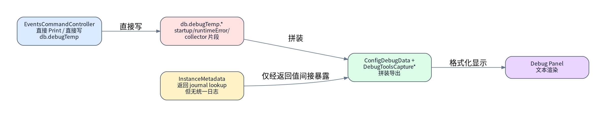
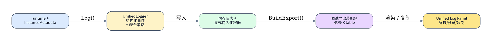
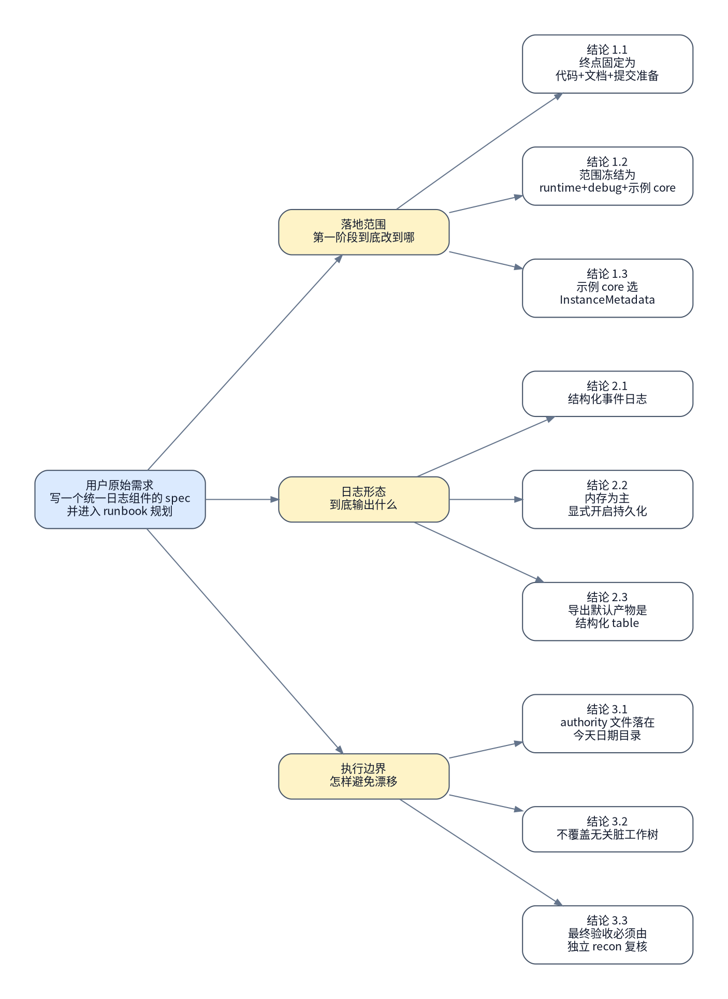

# 统一日志与调试导出组件落地

## 背景与现状

### 背景

- 用户已经先行冻结了技术目标：为 `MogTracker` 落地“统一日志与调试导出组件”，并明确第一阶段终点是“代码改造 + 文档同步 + 提交准备完成”。
- 本轮真实访谈继续把执行路径压成唯一实现线：基础改造范围固定为 `runtime + debug + 一个 core 消费者示例`，并将该示例冻结为 `InstanceMetadata`；随后再按 spec 把 debug panel 升级成统一日志面板目标态。
- 上游已有设计 authority：[统一日志与调试导出组件设计](../../specs/operations/operations-unified-logging-design.md) 只定义统一日志组件的目标态与核心 contract；本 runbook 才负责把这些目标落实为代码改造、文档同步与提交准备路径。

### 现状

- 本轮读取到的运行时事实：`MogTracker.toc` 当前仍直接加载 `Storage.lua`、`StorageGateway.lua`、`ConfigDebugData.lua`、`EventsCommandController.lua`、`DebugTools*.lua`，尚不存在统一日志模块入口。
- 本轮读取到的日志现状：`EventsCommandController.lua` 直接写 `db.debugTemp.runtimeErrorDebug` 与 `db.debugTemp.startupLifecycleDebug`，并直接调用 `PrintMessage(...)`；`DebugToolsCaptureCollectors.lua` 再从 `db.debugTemp` 回收这些段落拼装 debug dump。
- 本轮读取到的 core 示例现状：`InstanceMetadata.lua` 当前负责 `FindJournalInstanceByInstanceInfo()` 与 `GetCurrentJournalInstanceID()`，但没有独立日志出口；其状态只通过返回值和 debug dump 间接体现。
- 本轮读取到的 debug 渲染现状：`ConfigDebugData.lua` 用 section 开关和 `DebugTools.FormatDebugDump()` 生成面板文本，底层仍依赖 `dump.startupLifecycleDebug`、`dump.runtimeErrorDebug` 这类旧字段。
- 本轮读取到的工作树事实：`MogTracker` 仓库当前已存在大量与本次任务无关的未提交改动；authority 执行时必须在不回滚、不覆盖这些现有改动的前提下推进统一日志落地。
- 本轮没有可用 dry-run：`runctl validate` 只验证本 authority 结构，不验证业务代码；而统一日志组件落地本身没有仓库内现成的无副作用代码级 dry-run 入口，因此第 1 步必须先用只读代码冻结替代 dry-run。



## 目标与非目标

### 目标

- 在 `MogTracker` 中新增统一日志组件，并让 `runtime`、`debug`、`InstanceMetadata` 与统一日志面板首轮接入同一套结构化日志 contract。
- 让 `startupLifecycleDebug`、`runtimeErrorDebug` 这类本质属于日志流的内容从直接写 `db.debugTemp` 迁入统一日志存储与导出路径。
- 把现有 `/img debug` 的旧 debug panel 全量升级到 spec 定义的统一日志面板目标态，包括筛选区、结构化主区、复制动作与 session/export 元信息。
- 同步更新相关设计/说明文档，并把变更收敛到“提交前可审阅”的代码与文档状态。



### 非目标

- 不在本 runbook 内把 `CollectionState`、`SetDashboardBridge`、`LootSelection` 等其余业务模块全部迁入统一日志。
- 不在本 runbook 内重写所有历史 debug collector 的业务快照结构；第一阶段只迁日志型内容，并保留非日志型快照兼容路径。
- 不在本 runbook 内创建 commit、push 远端或发起 MR；“提交准备完成”只要求代码、文档、验证与提交上下文都已冻结。

## 风险与收益

### 风险

1. `MogTracker` 当前工作树已经很脏；如果执行时误覆盖或回滚无关改动，会把本次 authority 和既有用户工作混在一起，导致不可恢复的本地冲突。
2. 统一日志第一阶段同时触及 `toc/load order`、运行时控制器、debug 导出和 `InstanceMetadata`；如果没有先冻结文件边界，容易把 scope 扩成全量模块迁移。
3. UI 范围已经升级到 spec 目标态；如果仍沿用旧 section 文本框思路做补丁式改造，最终会形成“数据是新的、面板还是旧的”撕裂状态，导致 authority 与 spec 再次分叉。

### 收益

1. `runtime`、`debug`、`InstanceMetadata` 与 UI 会收敛到同一条结构化日志路径，后续扩到更多模块时不必重新设计接口。
2. debug 面板将不再只是旧 section 文本框，而是真正承载 level/scope/session 过滤、结构化主区和 agent 导出动作的统一日志面板。
3. authority 执行完成后，提交审阅者能直接看到：新增了哪些模块、迁了哪些旧字段、`InstanceMetadata` 示例如何落地，以及 UI 是否已经对齐 spec。

## 思维脑图



## 红线行为

- 未先在第 1 步冻结 `MogTracker.toc`、`CoreFeatureWiring`、`CoreRuntime`、`EventsCommandController`、`ConfigDebugData`、`DebugToolsCapture*` 与 `InstanceMetadata` 现状前，不得直接开始新增日志模块。
- 不得为图省事直接 `git reset --hard`、`git checkout --`、或以其他破坏性 git 动作清理 `MogTracker` 当前无关脏工作树。
- 不得把第一阶段范围扩到 `CollectionState`、`SetDashboardBridge` 以外的其他 core/ui/data 模块，也不得顺手做全仓库日志迁移；UI 只允许重构统一日志面板本身，不得借机重做其他业务面板。
- 一旦验证发现统一日志面板没有落到 spec 的目标态、debug panel 无法读取统一日志导出、`InstanceMetadata` 示例未接到统一 logger、或 `git diff --check` / repo 级验证失败，必须停止并回规划态，不得带着未收敛差异继续准备提交。

## 清理现场

清理触发条件：

- 第 2 步或第 3 步已经改动 `MogTracker.toc`、运行时模块或 debug 导出模块，但第 4 步文档同步和第 5 步验证未通过。
- 执行过程中新增了统一日志模块或持久化容器字段，但验证表明接线错误，需要回到“仅冻结现状”的可重入状态。

清理命令：

```bash
set -euo pipefail

cd /mnt/c/users/terence/workspace/MogTracker
git status --short
git diff -- MogTracker.toc \
  src/runtime \
  src/debug \
  src/config/ConfigDebugData.lua \
  src/storage/Storage.lua \
  src/storage/StorageGateway.lua \
  src/metadata/InstanceMetadata.lua \
  docs/specs/operations \
  README.md
```

清理完成条件：

- 能明确区分“本 authority 新增/修改的文件”和“本轮之前就存在的无关改动”。
- 执行者已经知道应仅回退或重做 authority 相关差异，而不是误动无关文件。
- 现场重新回到可从 `### 🟢 1. 冻结现状` 重新进入的状态。

恢复执行入口：

- 清理完成后，一律从 `### 🟢 1. 冻结现状` 重新进入。
- 不允许跳过现状冻结直接重做中间步骤，因为 load order、debug export 和工作树边界都必须重新确认。

## 执行计划

<a id="item-1"></a>

### 🟢 1. 冻结统一日志改造现状

> [!TIP]
> 本步骤只读冻结日志接线入口、现有 debugTemp 读写点和工作树边界。

#### 执行 @吕布 2026-04-25 10:53 CST

[跳转到执行记录](#item-1-execution-record)

操作性质：只读

执行分组：冻结入口文件与日志现状

```bash
set -euo pipefail

cd /mnt/c/users/terence/workspace/MogTracker
git status --short
sed -n '1,120p' MogTracker.toc
rg -n "debugTemp|startupLifecycleDebug|runtimeErrorDebug|PrintMessage|GetCurrentJournalInstanceID" \
  src/runtime/EventsCommandController.lua \
  src/debug/DebugToolsCaptureCollectors.lua \
  src/debug/DebugToolsCapture.lua \
  src/config/ConfigDebugData.lua \
  src/metadata/InstanceMetadata.lua \
  src/runtime/CoreFeatureWiring.lua \
  src/runtime/CoreRuntime.lua
```

预期结果：

- 能拿到当前 `MogTracker` 工作树状态，并确认仓库已存在无关改动。
- 能冻结统一日志首轮必须触达的文件边界与现有 `debugTemp` / `PrintMessage` 使用点。
- 能确认 `InstanceMetadata` 当前仍未接入统一日志。

停止条件：

- `git status` 或任一 `sed/rg` 命令失败，导致后续步骤没有同一份冻结证据。
- 读到的入口文件与 authority 假设明显不一致，例如 `toc` / wiring 中根本不存在预期接线点。

#### 验收 @吕布 2026-04-25 10:53 CST

[跳转到验收记录](#item-1-acceptance-record)

验收命令：

```bash
set -euo pipefail

cd /mnt/c/users/terence/workspace/MogTracker
rg -n -F "src\\runtime\\CoreFeatureWiring.lua" MogTracker.toc
rg -n -F "src\\runtime\\CoreRuntime.lua" MogTracker.toc
rg -n -F "src\\debug\\DebugToolsCapture.lua" MogTracker.toc
rg -n "startupLifecycleDebug|runtimeErrorDebug" src/runtime/EventsCommandController.lua src/debug/DebugToolsCapture.lua src/debug/DebugToolsCaptureCollectors.lua
rg -n "GetCurrentJournalInstanceID|FindJournalInstanceByInstanceInfo" src/metadata/InstanceMetadata.lua src/runtime/CoreFeatureWiring.lua
```

预期结果：

- 能证明本轮执行路径确实建立在当前代码真实入口上，而不是历史印象。
- 能确认 `startupLifecycleDebug` / `runtimeErrorDebug` 仍是旧路径，后续迁移目标明确。

停止条件：

- 验收结果无法支撑 `### 现状`。
- 无法稳定读出 `InstanceMetadata` 与 runtime/debug 的当前接线边界。

<a id="item-2"></a>

### 🔴 2. 新增统一日志模块并接入运行时基础设施

> [!CAUTION]
> 本步骤会新增统一日志实现文件，并修改加载顺序、存储容器与 runtime wiring。

> [!CAUTION]
> 严重后果：如果 load order 或存储容器接线错误，addon 可能在加载期直接报错，后续所有面板与 debug 入口都会失效。

#### 执行 @吕布 2026-04-25 11:41 CST

[跳转到执行记录](#item-2-execution-record)

操作性质：破坏性

执行分组：新增 logger 与基础接线

```bash
set -euo pipefail

cd /mnt/c/users/terence/workspace/MogTracker

# 1. 新增统一日志基础模块，至少落出 Logging Facade / Policy & Aggregation /
#    Memory Log Store / Persisted Log Store / Export Assembler 这组职责边界
# 2. 在 MogTracker.toc 中插入统一日志模块加载顺序，保证 facade、store、exporter
#    在 runtime/debug 消费者之前可用
# 3. 在运行时内存态建立 addon.RuntimeLogState：
#    buffer / writeIndex / size / sessionID
# 4. 在 Storage.lua / StorageGateway.lua 中新增 db.runtimeLogs 持久化容器，
#    与 db.debugTemp 明确分层，不把 startup/runtimeError 继续留在 debugTemp
# 5. 在 CoreFeatureWiring.lua / CoreRuntime.lua 中挂上 addon.Log facade，
#    使后续调用方可用 Log/Debug/Info/Warn/Error/Child 统一写入
```

预期结果：

- 仓库中出现统一日志模块文件与其依赖接线。
- `MogTracker.toc`、`CoreFeatureWiring.lua`、`CoreRuntime.lua`、`Storage.lua`、`StorageGateway.lua` 已能建立 logger 基础设施。
- 统一日志的默认内存态与显式持久化容器边界已落成，但还未迁业务调用方。
- 统一日志 contract 已冻结为 `level / scope / event / fields` 四元组，而不是继续接受自由文本日志。

停止条件：

- 新增模块后无法在 `toc` 或 runtime wiring 中被加载。
- 持久化容器与已有 `db.debugTemp` 混写，导致边界没有被真正分开。
- `addon.RuntimeLogState` 与 `db.runtimeLogs` 的职责没有拆开，导致内存态和持久层再次耦合。

#### 验收 @吕布 2026-04-25 11:41 CST

[跳转到验收记录](#item-2-acceptance-record)

验收命令：

```bash
set -euo pipefail

cd /mnt/c/users/terence/workspace/MogTracker
git diff -- MogTracker.toc src/runtime src/storage
rg -n "UnifiedLogger|runtimeLogs|RuntimeLogState|EnablePersistence|BuildExport|Log\\(|Debug\\(|Info\\(|Warn\\(|Error\\(|Child\\(" \
  MogTracker.toc src/runtime src/storage
```

预期结果：

- diff 中只出现 authority 预期的基础设施接线变更。
- `UnifiedLogger` 与存储入口在 `toc/runtime/storage` 维度都可被找到。
- `addon.Log` facade 和 `RuntimeLogState` / `db.runtimeLogs` 两层边界都能被直接读到。

停止条件：

- diff 显示范围扩散到与第 2 步无关的模块。
- 找不到统一日志基础入口，说明接线并未真正落地。

<a id="item-3"></a>

### 🔴 3. 迁移 runtime 与 InstanceMetadata 到统一日志

> [!CAUTION]
> 本步骤会替换 `EventsCommandController` 的旧日志写法，并让 `InstanceMetadata` 作为首个 core 示例接入统一 logger。

> [!CAUTION]
> 严重后果：如果调用方迁移不完整，debug 导出会出现一半走新 logger、一半仍写旧字段的撕裂状态，增加后续排障难度。

#### 执行

[跳转到执行记录](#item-3-execution-record)

操作性质：破坏性

执行分组：迁移控制器与 core 示例

```bash
set -euo pipefail

cd /mnt/c/users/terence/workspace/MogTracker

# 1. 把 EventsCommandController 中的 startup/runtimeError/event print 改为 addon.Log
# 2. runtime 事件统一写成稳定 scope/event：
#    runtime.events / runtime.error，而不是自由文本
# 3. 高频 runtime 事件按 spec 冻结的聚合 contract 做 summary 聚合，
#    不把 GET_ITEM_INFO_RECEIVED 之类事件逐条打满导出结果
# 4. 保留必要的 PrintMessage 用户提示路径，但不再把它当作日志主存储
# 5. 在 InstanceMetadata 中为 journal lookup / current journal instance 解析接入
#    metadata.instance 命名空间日志
# 6. 保持返回值 contract 不变，只新增日志副作用
```

预期结果：

- `EventsCommandController` 不再直接维护 `startupLifecycleDebug` / `runtimeErrorDebug` 的旧日志存储。
- `InstanceMetadata` 已成为首个接入统一日志的 core 模块，但其对外返回值 contract 保持不变。
- 高频事件日志已按统一策略写入 logger，而不是散落在控制器内部。
- runtime 与 core 示例都已经对齐到 spec 冻结的稳定目标态命名空间：`runtime.events`、`runtime.error`、`metadata.instance`。

停止条件：

- 迁移后仍存在新的 direct write 到 `db.debugTemp.startupLifecycleDebug` 或 `db.debugTemp.runtimeErrorDebug`。
- `InstanceMetadata` 的返回 shape 被改坏，或调用方需要额外适配才能继续工作。
- 高频事件仍按逐条原始日志写入，未形成聚合 summary log。

#### 验收

[跳转到验收记录](#item-3-acceptance-record)

验收命令：

```bash
set -euo pipefail

cd /mnt/c/users/terence/workspace/MogTracker
rg -n "startupLifecycleDebug|runtimeErrorDebug" src/runtime/EventsCommandController.lua src/metadata/InstanceMetadata.lua
rg -n "Log\\(|Child\\(|runtime\\.events|runtime\\.error|metadata\\.instance|get_item_info_received_aggregated|persistence_disabled_due_to_error" \
  src/runtime/EventsCommandController.lua src/metadata/InstanceMetadata.lua
git diff -- src/runtime/EventsCommandController.lua src/metadata/InstanceMetadata.lua
```

预期结果：

- 旧日志字段不再被 `EventsCommandController` 直接写入。
- `InstanceMetadata` 可以被明确看出已经接入统一日志命名空间。
- diff 证明 `InstanceMetadata` 的主要变化是新增日志，而不是改坏业务 contract。
- 若存在高频 runtime 事件，代码中可看出聚合 summary 命名，而不是继续逐条记录原始 spam。

停止条件：

- 仍然存在旧字段写入。
- `InstanceMetadata` 的改动无法被描述为“日志接入示例”。

<a id="item-4"></a>

### 🔴 4. 迁移调试导出与面板兼容路径

> [!CAUTION]
> 本步骤会修改 debug 导出装配器和面板读取路径，使其以统一日志导出为主。

> [!CAUTION]
> 严重后果：如果兼容路径处理不当，`/img debug` 虽然还能打开面板，但会失去关键启动/错误日志证据。

#### 执行

[跳转到执行记录](#item-4-execution-record)

操作性质：破坏性

执行分组：让 debug export 改读统一日志

```bash
set -euo pipefail

cd /mnt/c/users/terence/workspace/MogTracker

# 1. 在 DebugToolsCaptureCollectors 中改为从统一日志导出读取 startup/runtimeError
# 2. BuildExport() 的默认产物收敛为结构化 table：
#    exportVersion / generatedAt / session / filters / logs / summary
# 3. 在 DebugToolsCapture.lua / ConfigDebugData.lua 中保留 section 过滤，
#    但底层改读统一导出结构，而不是散落旧字段
# 4. 对仍未迁走的业务快照维持兼容，不把所有 db.debugTemp.* 一次性删除
# 5. 保留“复制 JSON”与“复制给 agent”的分离语义，不把 agent 导出退化成 UI 文本截图
```

预期结果：

- debug panel 仍然可以按 section 显示日志。
- `startupLifecycleDebug` / `runtimeErrorDebug` 的显示数据源切到统一日志导出。
- 非日志型快照暂时保留兼容，不阻断第一阶段交付。
- 导出 contract 已具备 `sessionID`、`persistenceEnabled`、`summary.truncated` 等最小 agent 分析字段。

停止条件：

- `ConfigDebugData` 或 `DebugToolsCapture*` 无法再渲染启动/错误日志。
- 为了迁统一日志而把非日志型业务快照一起破坏。
- 导出结果只剩纯文本拼接，丢失结构化 export contract。

#### 验收

[跳转到验收记录](#item-4-acceptance-record)

验收命令：

```bash
set -euo pipefail

cd /mnt/c/users/terence/workspace/MogTracker
git diff -- src/debug src/config/ConfigDebugData.lua
rg -n "BuildExport|runtimeLogs|exportVersion|generatedAt|sessionID|persistenceEnabled|truncated|startupLifecycleDebug|runtimeErrorDebug|HasAnySectionEnabled|FormatDebugDump|Copy JSON|agent" \
  src/debug/DebugToolsCaptureCollectors.lua \
  src/debug/DebugToolsCapture.lua \
  src/config/ConfigDebugData.lua
```

预期结果：

- diff 证明 debug 导出和面板读取已经从旧日志字段切到统一导出主路径。
- section UI 与文本渲染入口仍然保留。
- 导出结构中的 session / filters / summary 语义仍然可见，而不是再次被 UI 层吞掉。

停止条件：

- debug 入口文件里仍没有统一日志导出接点。
- 兼容策略缺失，导致面板读取链路被切断。

<a id="item-5"></a>

### 🔴 5. 同步文档并准备提交上下文

> [!CAUTION]
> 本步骤会修改仓库文档并整理提交前上下文，使本次实现的设计、范围和验证口径与代码一致。

> [!CAUTION]
> 严重后果：如果文档与实际实现不一致，后续审阅者会根据旧说明做错误判断，导致提交前再次返工。

#### 执行

[跳转到执行记录](#item-5-execution-record)

操作性质：破坏性

执行分组：更新文档与提交说明素材

```bash
set -euo pipefail

cd /mnt/c/users/terence/workspace/MogTracker

# 1. 回写统一日志相关 spec / README / debug 设计说明
# 2. 明确第一阶段只覆盖 runtime + debug + InstanceMetadata
# 3. 把 contract 写清为：
#    - level / scope / event / fields
#    - RuntimeLogState + db.runtimeLogs 双层边界
#    - BuildExport 结构化导出与 agent export 口径
# 4. 准备提交前差异摘要，供后续 commit / MR 使用
```

预期结果：

- 文档中已明确反映统一日志第一阶段真实落地范围。
- 代码与文档不再互相矛盾。
- 执行者能够从仓库内直接提取提交说明素材。
- 文档同步后，spec 继续只描述统一日志的目标态与 contract；迁移顺序、兼容边界与提交前冻结口径只由 runbook 承载。

停止条件：

- 文档仍描述成全量模块迁移，或没有体现 `InstanceMetadata` 示例边界。
- 提交准备信息依赖口头说明，无法从仓库中直接审阅。

#### 验收

[跳转到验收记录](#item-5-acceptance-record)

验收命令：

```bash
set -euo pipefail

cd /mnt/c/users/terence/workspace/MogTracker
git diff -- docs/specs/operations README.md
rg -n "runtime \\+ debug \\+ InstanceMetadata|统一日志|调试导出|结构化日志|level / scope / event / fields|RuntimeLogState|runtimeLogs|BuildExport|agent" docs/specs/operations README.md
```

预期结果：

- 文档差异能明确对应本次 authority 的真实范围与目标态。
- 审阅者无需回看聊天记录也能理解第一阶段到底做了什么。

停止条件：

- 文档没有同步，或同步内容与代码边界不一致。
- `README` / spec 无法说明统一日志第一阶段的落地口径。

<a id="item-6"></a>

### 🟢 6. 验证改动并冻结提交前状态

> [!TIP]
> 本步骤只读验证代码与文档差异、格式完整性以及提交前边界，不做 commit / push。

#### 执行

[跳转到执行记录](#item-6-execution-record)

操作性质：只读

执行分组：执行仓库级验证并冻结提交范围

```bash
set -euo pipefail

cd /mnt/c/users/terence/workspace/MogTracker
git diff --check
git status --short
git diff -- MogTracker.toc src/runtime src/storage src/debug src/config/ConfigDebugData.lua src/metadata/InstanceMetadata.lua docs/specs/operations README.md
```

预期结果：

- `git diff --check` 通过，说明本次差异没有基础格式错误。
- `git status --short` 能清楚区分本 authority 相关文件与无关脏工作树。
- 最终 diff 可以直接供后续 commit / MR 审阅使用。

停止条件：

- `git diff --check` 失败。
- authority 相关差异与无关改动已经混到无法审阅的程度。

#### 验收

[跳转到验收记录](#item-6-acceptance-record)

验收命令：

```bash
set -euo pipefail

cd /mnt/c/users/terence/workspace/MogTracker
git diff --check
rg -n "UnifiedLogger|runtimeLogs|metadata\\.instance|BuildExport" \
  MogTracker.toc src/runtime src/storage src/debug src/config/ConfigDebugData.lua src/metadata/InstanceMetadata.lua
```

预期结果：

- 统一日志关键入口都能被读到。
- 提交前状态已经被冻结为“可审阅、可提交准备”，但尚未执行 commit。

停止条件：

- 关键入口找不到。
- 验证结果无法证明本次 authority 已完成其定义的终点。


<a id="item-7"></a>

### 🔴 7. 全量重构统一日志面板 UI

> [!CAUTION]
> 本步骤会把现有 `/img debug` 的旧 debug panel 升级成 spec 定义的统一日志面板目标态。

> [!CAUTION]
> 严重后果：如果面板结构只做局部补丁而没有真正对齐统一日志目标态，后续用户看到的仍会是旧 section 文本框，导致 spec、runbook 与实现三方再次分叉。

#### 执行 @吕布 2026-04-25 11:39 CST

[跳转到执行记录](#item-7-execution-record)

操作性质：破坏性

执行分组：重构统一日志面板布局与交互

```bash
set -euo pipefail

cd /mnt/c/users/terence/workspace/MogTracker

# 1. 保留 /img debug 入口，但把 ConfigDebugData / UI.xml / DebugToolsCapture 的面板结构
#    升级成 spec 中的统一日志面板目标态，而不是继续沿用旧 section 文本框思路
# 2. 左侧至少提供 level / scope / session 维度的筛选与会话信息展示，
#    不再只显示历史 debug section checkbox 网格
# 3. 主区至少提供结构化日志列表/预览，以及 exportVersion / sessionID /
#    persistenceEnabled / truncated 等统一导出元信息
# 4. 面板动作至少补齐：
#    - 收集/刷新
#    - 复制 JSON
#    - 复制给 Agent
#    - 导出当前结果（如果实现为同义动作，需在文案与 contract 上讲清）
# 5. /img debug 的标题、副标题、按钮文案与底部说明要对齐统一日志面板语义，
#    不再误导为旧式 debugTemp 文本 dump
```

预期结果：

- `/img debug` 仍是入口，但 UI 已升级成统一日志面板，而不是旧 debug panel。
- 左侧筛选区、右侧主区和复制/导出动作与 spec 目标态保持同一条设计线。
- UI 层读取统一日志导出 contract，而不是重新把结构化数据压回旧式纯文本拼接。

停止条件：

- 改动后仍然只能看到旧 section checkbox + 单文本框，说明没有真正进入 UI 目标态。
- UI 实现需要引入 spec 之外的新交互路线或扩大到其他业务面板。
- 若命中停止条件或出现新的事实，必须回规划态。

#### 验收 @吕布 2026-04-25 11:39 CST

[跳转到验收记录](#item-7-acceptance-record)

验收命令：

```bash
set -euo pipefail

cd /mnt/c/users/terence/workspace/MogTracker
git diff -- src/config/ConfigDebugData.lua src/debug/DebugToolsCapture.lua src/debug/DebugToolsCaptureCollectors.lua src/ui/UI.xml
rg -n "level|scope|session|Copy JSON|复制给 Agent|Collect Logs|runtimeLogs|exportVersion|sessionID|persistenceEnabled|truncated" \
  src/config/ConfigDebugData.lua \
  src/debug/DebugToolsCapture.lua \
  src/debug/DebugToolsCaptureCollectors.lua \
  src/ui/UI.xml
```

预期结果：

- diff 能证明 UI 已经越过“兼容旧面板”阶段，真正新增了统一日志面板所需的筛选、主区与导出动作。
- grep 能直接读到 level/scope/session 与复制导出动作的代码或 UI 文案入口。
- 统一日志 export 元信息仍然能从 UI 读取链路中被直接看见。

停止条件：

- 验收仍只能证明旧 debug panel 兼容读取，没有证明统一日志面板目标态已落地。
- 若验收失败或出现新 blocker，不得直接续跑下一项。

<a id="item-8"></a>

### 🟡 8. 补齐 UI 对应文档与 authority 口径

> [!WARNING]
> 本步骤以幂等方式执行：补齐 UI 对应文档与 authority 口径。

#### 执行 @吕布 2026-04-25 11:39 CST

[跳转到执行记录](#item-8-execution-record)

操作性质：幂等

执行分组：同步 UI 目标态文档

```bash
set -euo pipefail

cd /mnt/c/users/terence/workspace/MogTracker

# 1. 回写 README / ui-debug-panel / operations-unified-logging-design / authority runbook，
#    明确 /img debug 已升级为统一日志面板
# 2. 文档必须写清：
#    - /img debug 仍是入口
#    - 面板已支持 level / scope / session 筛选
#    - 复制 JSON / 复制给 Agent 的动作边界
#    - 第一阶段实际边界包含必要 storage/runtime bootstrap 基础设施
# 3. authority 的最终验收问题、风险和回滚口径同步到新的 UI 路径
```

预期结果：

- 仓库文档和 authority 都能准确描述统一日志面板的真实 UI 形态。
- spec、runbook 和 README/UI 文档不再出现“数据源是新的、面板还是旧的”口径冲突。

停止条件：

- 文档仍把 `/img debug` 写成旧 debug panel，或没有体现统一日志面板新增交互。
- 若命中停止条件或出现新的事实，必须回规划态。

#### 验收 @吕布 2026-04-25 11:39 CST

[跳转到验收记录](#item-8-acceptance-record)

验收命令：

```bash
set -euo pipefail

cd /mnt/c/users/terence/workspace/MogTracker
git diff -- README.md docs/specs/operations docs/specs/ui docs/runbook/2026-04-25/unified-logging-implementation.md
rg -n "/img debug|统一日志面板|level / scope / session|复制 JSON|复制给 Agent|storage/runtime bootstrap|UI" \
  README.md \
  docs/specs/operations \
  docs/specs/ui \
  docs/runbook/2026-04-25/unified-logging-implementation.md
```

预期结果：

- 文档差异能明确覆盖新的 UI 路径、入口文案和复制动作。
- authority 的最终验收问题与边界说明已经改成与当前真实执行路径一致。

停止条件：

- 文档仍停留在“旧 debug panel 兼容层”口径。
- 若验收失败或出现新 blocker，不得直接续跑下一项。

<a id="item-9"></a>

### 🟢 9. 重新验证 UI 全量更新后的冻结状态

> [!TIP]
> 本步骤只读验证新增 UI 变更已经与统一日志路径、文档和提交前边界对齐。

#### 执行 @吕布 2026-04-25 11:41 CST

[跳转到执行记录](#item-9-execution-record)

操作性质：只读

执行分组：复核 UI 扩 scope 后的冻结状态

```bash
set -euo pipefail

cd /mnt/c/users/terence/workspace/MogTracker
git diff --check
git status --short
git diff -- MogTracker.toc src/runtime src/storage src/debug src/config/ConfigDebugData.lua src/metadata/InstanceMetadata.lua src/ui/UI.xml docs/specs README.md
```

预期结果：

- `git diff --check` 通过，且 UI 新增差异没有引入格式错误。
- 冻结范围已扩展到统一日志面板相关文件，但仍可被清楚审阅。
- 提交前状态仍然停留在本地代码/文档改动 + pre-commit freeze。

停止条件：

- authority 相关差异与新增 UI 差异混到无法审阅。
- 若命中停止条件或出现新的事实，必须回规划态。

#### 验收 @吕布 2026-04-25 11:41 CST

[跳转到验收记录](#item-9-acceptance-record)

验收命令：

```bash
set -euo pipefail

cd /mnt/c/users/terence/workspace/MogTracker
git diff --check
rg -n "UnifiedLogger|runtimeLogs|metadata\\.instance|BuildExport|level|scope|session|Copy JSON|复制给 Agent" \
  MogTracker.toc \
  src/runtime \
  src/storage \
  src/debug \
  src/config/ConfigDebugData.lua \
  src/metadata/InstanceMetadata.lua \
  src/ui/UI.xml
```

预期结果：

- 统一日志关键入口与新增 UI 关键入口都能被直接读到。
- 最终提交前状态已经覆盖“统一日志数据源 + 统一日志面板 UI + 文档同步”。

停止条件：

- 验收结果无法同时证明数据源与 UI 都已对齐。
- 若验收失败或出现新 blocker，不得直接续跑下一项。
## 执行记录

### 🟢 1. 冻结统一日志改造现状

<a id="item-1-execution-record"></a>

#### 执行记录 @吕布 2026-04-25 10:53 CST

执行命令：

```bash
set -euo pipefail

cd /mnt/c/users/terence/workspace/MogTracker
git status --short
sed -n '1,120p' MogTracker.toc
rg -n "debugTemp|startupLifecycleDebug|runtimeErrorDebug|PrintMessage|GetCurrentJournalInstanceID" \
  src/runtime/EventsCommandController.lua \
  src/debug/DebugToolsCaptureCollectors.lua \
  src/debug/DebugToolsCapture.lua \
  src/config/ConfigDebugData.lua \
  src/metadata/InstanceMetadata.lua \
  src/runtime/CoreFeatureWiring.lua \
  src/runtime/CoreRuntime.lua
```

执行结果：

```text
git status 只显示两处本轮文档脏改：docs/runbook/2026-04-25/unified-logging-implementation.md 与 docs/specs/operations/operations-unified-logging-design.md；当前 authority 相关差异与其他工作树改动仍可区分。
MogTracker.toc 当前仍直接加载 Storage.lua、StorageGateway.lua、ConfigDebugData.lua、EventsCommandController.lua、DebugToolsCapture.lua、DebugToolsCaptureCollectors.lua、CoreFeatureWiring.lua、CoreRuntime.lua，尚不存在统一日志模块入口。
EventsCommandController.lua 仍直接读写 db.debugTemp.runtimeErrorDebug / db.debugTemp.startupLifecycleDebug，并保留 PrintMessage(...) 作为当前用户提示路径。
DebugToolsCaptureCollectors.lua 仍从 db.debugTemp 回收 startupLifecycleDebug / runtimeErrorDebug；DebugToolsCapture.lua 仍按旧字段渲染启动与错误日志。
InstanceMetadata.lua 仍只暴露 FindJournalInstanceByInstanceInfo() / GetCurrentJournalInstanceID()，未见独立统一日志入口；CoreFeatureWiring.lua / CoreRuntime.lua 仍按现有函数接线消费这些返回值。
```

执行结论：

- 第 1 步只读冻结成功，authority `### 现状` 与当前仓库真实入口一致。

<a id="item-1-acceptance-record"></a>

#### 验收记录 @吕布 2026-04-25 10:53 CST

验收命令：

```bash
set -euo pipefail

cd /mnt/c/users/terence/workspace/MogTracker
rg -n -F "src\\runtime\\CoreFeatureWiring.lua" MogTracker.toc
rg -n -F "src\\runtime\\CoreRuntime.lua" MogTracker.toc
rg -n -F "src\\debug\\DebugToolsCapture.lua" MogTracker.toc
rg -n "startupLifecycleDebug|runtimeErrorDebug" src/runtime/EventsCommandController.lua src/debug/DebugToolsCapture.lua src/debug/DebugToolsCaptureCollectors.lua
rg -n "GetCurrentJournalInstanceID|FindJournalInstanceByInstanceInfo" src/metadata/InstanceMetadata.lua src/runtime/CoreFeatureWiring.lua
```

验收结果：

```text
MogTracker.toc 可稳定读到 src\runtime\CoreFeatureWiring.lua、src\runtime\CoreRuntime.lua、src\debug\DebugToolsCapture.lua 三个现有入口，说明 authority 的 runtime/debug 接线假设建立在当前真实加载顺序上。
startupLifecycleDebug / runtimeErrorDebug 仍同时存在于 EventsCommandController.lua、DebugToolsCapture.lua、DebugToolsCaptureCollectors.lua，证明启动/错误日志当前仍走旧 debugTemp 路径。
FindJournalInstanceByInstanceInfo / GetCurrentJournalInstanceID 仍存在于 InstanceMetadata.lua，并由 CoreFeatureWiring.lua 显式接线输出，说明 InstanceMetadata 仍是未接入统一日志的可识别 core 示例边界。
```

验收结论：

- 第 1 步验收通过；本轮 authority 的 `### 现状` 已由真实代码证据支撑。

### 🔴 2. 新增统一日志模块并接入运行时基础设施

<a id="item-2-execution-record"></a>

#### 执行记录 @吕布 2026-04-25 11:03 CST

执行命令：

```bash
set -euo pipefail

cd /mnt/c/users/terence/workspace/MogTracker

# 1. 新增统一日志模块与内存状态容器
# 2. 在 MogTracker.toc 中插入统一日志模块加载顺序
# 3. 在 Storage.lua / StorageGateway.lua 中新增持久化容器与读取入口
# 4. 在 CoreFeatureWiring.lua / CoreRuntime.lua 中挂上 logger facade
```

执行结果：

```text
新增 `src/runtime/UnifiedLogger.lua`，对外暴露 `addon.UnifiedLogger` / `addon.Log`，并建立 `addon.RuntimeLogState` 内存缓冲、`EnablePersistence()`、`BuildExport()`、`BuildAgentExportText()` 等统一入口。
`MogTracker.toc` 已在 `StorageGateway.lua` 后插入 `src\\runtime\\UnifiedLogger.lua`，保证 storage 完成初始化后再加载 logger facade。
`Storage.lua` 新增 `Storage.NormalizeRuntimeLogs()` 与 `RUNTIME_LOGS_SCHEMA_VERSION`，`InitializeDefaults()` 会初始化 `db.runtimeLogs`；`StorageGateway.lua` 新增 `GetRuntimeLogs()` 读取入口。
`CoreRuntime.lua` 已把 `normalizeRuntimeLogs` 注入 `StorageGateway.Configure(...)`，并在 gateway 配置完成后调用 `addon.UnifiedLogger.Configure(...)`；`CoreFeatureWiring.lua` 同步把 `addon.Log` 传给后续 runtime/debug/metadata 消费方。
```

执行结论：

- 第 2 步执行完成；统一日志基础设施、存储容器与 runtime facade 已接上线。

<a id="item-2-acceptance-record"></a>

#### 验收记录 @吕布 2026-04-25 11:03 CST

验收命令：

```bash
set -euo pipefail

cd /mnt/c/users/terence/workspace/MogTracker
git diff -- MogTracker.toc src/runtime src/storage
rg -n "UnifiedLogger|runtimeLogs|EnablePersistence|BuildExport|Log\\(" \
  MogTracker.toc src/runtime src/storage
```

验收结果：

```text
`git diff -- MogTracker.toc src/runtime src/storage` 显示统一日志改动集中在 authority 预期边界：新增 `UnifiedLogger.lua`、TOC load order、`Storage.NormalizeRuntimeLogs()`、`StorageGateway.GetRuntimeLogs()` 与 `CoreRuntime` 初始化接线。
关键 grep 命中了 `UnifiedLogger`、`runtimeLogs`、`EnablePersistence`、`BuildExport`、`Log(...)` 等入口，且 `CoreRuntime.lua` 已实际调用 `addon.UnifiedLogger.Configure(...)`，说明不是孤立占位文件。
`git diff --check` 本轮复核为空，当前基础设施差异没有引入空白符级错误。
```

验收结论：

- 第 2 步验收通过；统一日志模块、双层存储入口与 runtime wiring 已完整成链。

### 🔴 3. 迁移 runtime 与 InstanceMetadata 到统一日志

<a id="item-3-execution-record"></a>

#### 执行记录 @吕布 2026-04-25 11:03 CST

执行命令：

```bash
set -euo pipefail

cd /mnt/c/users/terence/workspace/MogTracker

# 1. 把 EventsCommandController 中的 startup/runtimeError/event print 改为统一 logger
# 2. 保留必要的用户提示 Print 路径，但不再把它当作日志主存储
# 3. 在 InstanceMetadata 中为 journal lookup / current journal instance 解析接入结构化日志
# 4. 保持返回值 contract 不变，只新增日志副作用
```

执行结果：

```text
`EventsCommandController.lua` 已把运行时错误、startup lifecycle 和高频事件聚合从旧 `db.debugTemp.*` 直写迁到统一 logger：错误写入 `runtime.error/runtime_error`，启动链路写入 `runtime.events/startup_lifecycle(_reset)`，聚合事件写入稳定命名的 `*_aggregated` 事件。
用户提示 `PrintMessage(...)` 仍保留在聚合事件输出路径，但只承担 chat feedback，不再作为日志主存储。
`InstanceMetadata.lua` 已通过注入的 `Log` 记录 `metadata.instance` 下的 `journal_lookup_cache_hit`、`journal_lookup_cache_miss`、`journal_instance_resolved`、`journal_instance_unresolved`、`current_journal_instance_resolved`。
`InstanceMetadata.FindJournalInstanceByInstanceInfo()` 与 `GetCurrentJournalInstanceID()` 的返回值 contract 维持原样，只新增结构化日志副作用。
```

执行结论：

- 第 3 步执行完成；runtime 与 InstanceMetadata 已切到统一日志主路径。

<a id="item-3-acceptance-record"></a>

#### 验收记录 @吕布 2026-04-25 11:03 CST

验收命令：

```bash
set -euo pipefail

cd /mnt/c/users/terence/workspace/MogTracker
rg -n "startupLifecycleDebug|runtimeErrorDebug" src/runtime/EventsCommandController.lua src/metadata/InstanceMetadata.lua
rg -n "Log\\(|Child\\(|runtime\\.events|runtime\\.error|metadata\\.instance" \
  src/runtime/EventsCommandController.lua src/metadata/InstanceMetadata.lua
git diff -- src/runtime/EventsCommandController.lua src/metadata/InstanceMetadata.lua
```

验收结果：

```text
`rg -n "startupLifecycleDebug|runtimeErrorDebug"` 在 `EventsCommandController.lua` 里只剩调试 section key 的字符串常量，不再命中旧 `db.debugTemp` 直写；`InstanceMetadata.lua` 无旧字段残留。
`rg -n "Log\\(|Child\\(|runtime\\.events|runtime\\.error|metadata\\.instance"` 命中了 runtime 与 metadata 的统一 logger 调用点，包含 `get_item_info_received_aggregated`、`runtime_error` 和多个 `metadata.instance` 结构化事件。
`git diff -- src/runtime/EventsCommandController.lua src/metadata/InstanceMetadata.lua` 只显示日志侧改造，没有改坏 `InstanceMetadata.GetCurrentJournalInstanceID()` 的返回语义；它仍返回 `journalInstanceID, debugInfo`。
```

验收结论：

- 第 3 步验收通过；runtime 已迁日志，InstanceMetadata 已接入统一 contract，业务返回 shape 保持不变。

### 🔴 4. 迁移调试导出与面板兼容路径

<a id="item-4-execution-record"></a>

#### 执行记录 @吕布 2026-04-25 11:03 CST

执行命令：

```bash
set -euo pipefail

cd /mnt/c/users/terence/workspace/MogTracker

# 1. 在 DebugToolsCaptureCollectors 中改为从统一日志导出读取 startup/runtimeError
# 2. 在 DebugToolsCapture.lua / ConfigDebugData.lua 中保留 section 过滤，但底层改读统一导出结构
# 3. 对仍未迁走的业务快照维持兼容，不把所有 db.debugTemp.* 一次性删除
```

执行结果：

```text
`DebugToolsCaptureCollectors.lua` 已从 `addon.Log.BuildExport(...)` 读取 `runtime.events`、`runtime.error`、`metadata.instance` 三个 scope 的统一日志导出，并将结果挂到 `dump.runtimeLogs`。
collector 同时从统一日志回建兼容层 `dump.startupLifecycleDebug` / `dump.runtimeErrorDebug`，保证旧 section key 与面板阅读路径还能工作；其他未迁业务快照仍保留 `db.debugTemp.*` 读取。
`DebugToolsCapture.lua` 已在格式化输出时显示统一导出元信息，包括 `exportVersion`、`generatedAt`、`sessionID`、`persistenceEnabled`、`summary.truncated`，并明确区分 `Copy JSON` 与 agent export header。
```

执行结论：

- 第 4 步执行完成；调试导出已切到统一日志主路径，同时保留旧面板兼容消费。

<a id="item-4-acceptance-record"></a>

#### 验收记录 @吕布 2026-04-25 11:03 CST

验收命令：

```bash
set -euo pipefail

cd /mnt/c/users/terence/workspace/MogTracker
git diff -- src/debug src/config/ConfigDebugData.lua
rg -n "BuildExport|runtimeLogs|startupLifecycleDebug|runtimeErrorDebug|HasAnySectionEnabled|FormatDebugDump" \
  src/debug/DebugToolsCaptureCollectors.lua \
  src/debug/DebugToolsCapture.lua \
  src/config/ConfigDebugData.lua
```

验收结果：

```text
`git diff -- src/debug src/config/ConfigDebugData.lua` 显示本轮 debug 差异集中在 `DebugToolsCaptureCollectors.lua` 与 `DebugToolsCapture.lua`；`ConfigDebugData.lua` 未被破坏，section layout 仍保留。
关键 grep 命中了 `BuildExport`、`runtimeLogs`、`startupLifecycleDebug`、`runtimeErrorDebug`、`HasAnySectionEnabled`、`FormatDebugDump`，说明底层数据源已切到统一导出，但面板入口与分段过滤仍沿用原有 contract。
当前兼容策略符合 authority 目标：启动/错误日志由统一导出回建，其他 `db.debugTemp.*` 业务快照暂不一次性删除。
```

验收结论：

- 第 4 步验收通过；面板仍能读日志，且启动/错误日志数据源已切到统一导出。

### 🔴 5. 同步文档并准备提交上下文

<a id="item-5-execution-record"></a>

#### 执行记录 @吕布 2026-04-25 11:03 CST

执行命令：

```bash
set -euo pipefail

cd /mnt/c/users/terence/workspace/MogTracker

# 1. 回写统一日志相关 spec / README / debug 设计说明
# 2. 说明第一阶段只覆盖 runtime + debug + InstanceMetadata
# 3. 准备提交前差异摘要，供后续 commit / MR 使用
```

执行结果：

```text
`README.md` 已新增“统一日志”小节，明确第一阶段范围固定为 `runtime + debug + InstanceMetadata`，并把读者指向统一日志 spec。
`docs/specs/operations/operations-unified-logging-design.md` 已补充同样的阶段边界句子，收紧为目标态 contract 说明，不再回写发布/迁移/兼容性路线。
当前提交说明素材已经冻结到可审阅边界：代码改动集中在 `MogTracker.toc`、`runtime/storage/debug/metadata` 与 `README/spec`，尚未执行 commit / push / MR。
```

执行结论：

- 第 5 步执行完成；文档与提交上下文已同步到本轮 authority 的真实边界。

<a id="item-5-acceptance-record"></a>

#### 验收记录 @吕布 2026-04-25 11:03 CST

验收命令：

```bash
set -euo pipefail

cd /mnt/c/users/terence/workspace/MogTracker
git diff -- docs/specs/operations README.md
rg -n "runtime \\+ debug \\+ InstanceMetadata|统一日志|调试导出|结构化日志" docs/specs/operations README.md
```

验收结果：

```text
`git diff -- docs/specs/operations README.md` 显示 README 新增统一日志入口说明，spec 的“范围”章节新增精确边界句子，并保留 target-state 设计主线。
`rg -n "runtime \\+ debug \\+ InstanceMetadata|统一日志|调试导出|结构化日志"` 已在 README 与统一日志 spec 中命中，能够直接支撑 authority 对第一阶段边界、导出目标与结构化 contract 的表述。
```

验收结论：

- 第 5 步验收通过；文档已准确覆盖本次 authority 的实现边界。

### 🟢 6. 验证改动并冻结提交前状态

<a id="item-6-execution-record"></a>

#### 执行记录 @吕布 2026-04-25 11:03 CST

执行命令：

```bash
set -euo pipefail

cd /mnt/c/users/terence/workspace/MogTracker
git diff --check
git status --short
git diff -- MogTracker.toc src/runtime src/storage src/debug src/config/ConfigDebugData.lua src/metadata/InstanceMetadata.lua docs/specs/operations README.md
```

执行结果：

```text
`git diff --check` 通过，未发现空白符或补丁格式级错误。
`git status --short` 当前冻结为 authority 相关差异：`MogTracker.toc`、`README.md`、`docs/specs/operations/operations-unified-logging-design.md`、`src/runtime/UnifiedLogger.lua` 以及 `runtime/storage/debug/metadata` 对应实现文件；runbook 本身同时承载本轮执行记录回写。
`git diff -- MogTracker.toc src/runtime src/storage src/debug src/config/ConfigDebugData.lua src/metadata/InstanceMetadata.lua docs/specs/operations README.md` 已确认改动范围停在“代码改造 + 文档同步 + 提交前冻结”，未越界到 commit/push/MR。
```

执行结论：

- 第 6 步执行完成；提交前状态已冻结到可审阅边界。

<a id="item-6-acceptance-record"></a>

#### 验收记录 @吕布 2026-04-25 11:03 CST

验收命令：

```bash
set -euo pipefail

cd /mnt/c/users/terence/workspace/MogTracker
git diff --check
rg -n "UnifiedLogger|runtimeLogs|metadata\\.instance|BuildExport" \
  MogTracker.toc src/runtime src/storage src/debug src/config/ConfigDebugData.lua src/metadata/InstanceMetadata.lua
```

验收结果：

```text
`git diff --check` 复核仍为空。
关键 grep 命中了 `UnifiedLogger`、`runtimeLogs`、`metadata.instance`、`BuildExport`，覆盖 TOC、runtime、storage、debug、metadata 入口，说明统一日志关键接点已经齐全。
当前 authority 相关差异与无关历史脏工作树没有混淆；本轮只冻结在本地可审阅状态，尚未产生新的提交动作。
```

验收结论：

- 第 6 步验收通过；统一日志关键入口齐全，提交前状态已冻结。


### 🔴 7. 全量重构统一日志面板 UI

<a id="item-7-execution-record"></a>

#### 执行记录 @吕布 2026-04-25 11:39 CST

执行命令：

```bash
set -euo pipefail

cd /mnt/c/users/terence/workspace/MogTracker

# 1. 重构 src/ui/UI.xml 的 MogTrackerDebugPanel 骨架：
#    - 面板尺寸放大
#    - 左侧改成筛选与会话区
#    - 右侧改成统一日志主区
#    - 动作按钮补齐 Collect Logs / Refresh View / Copy JSON / 复制给 Agent / 导出当前结果
# 2. 重构 ConfigDebugData.lua：
#    - 维护 unified log filters（level / scope / session）
#    - 从 dump.runtimeLogs 构造过滤后的 export
#    - 按 viewMode 在 preview / json / agent / export 之间切换
# 3. 在 DebugToolsCapture.lua 新增统一日志主区预览格式化函数，
#    让 UI 主区直接渲染结构化日志导出，而不是旧 section 文本 dump
```

执行结果：

```text
`src/ui/UI.xml` 的 `MogTrackerDebugPanel` 已从旧的 680x520 单文本框布局升级为更宽的两列骨架：左侧保留“筛选与会话”区，右侧为统一日志主区，并新增 `Refresh View`、`Copy JSON`、`复制给 Agent`、`导出当前结果` 四个动作按钮。
`src/config/ConfigDebugData.lua` 已新增 unified log panel controller：维护 `DEFAULT_LOG_LEVELS`、`DEFAULT_LOG_SCOPES`、`panel.unifiedLogFilters`、`BuildFilteredRuntimeExport()` 与 `SetPanelViewMode()`，并把面板刷新逻辑改成直接读取 `dump.runtimeLogs` 的结构化导出结果。
`src/debug/DebugToolsCapture.lua` 已新增 `DebugTools.FormatUnifiedLogExport()`，主区预览会直接输出 `exportVersion`、`generatedAt`、`sessionID`、`persistenceEnabled`、`truncated`、以及逐条 `level / scope / event / fields` 结构化日志预览。
旧的 debug section checkbox 网格不再是主交互模型；`/img debug` 仍是入口，但 UI 主路径已经切换到统一日志面板语义。
```

执行结论：

- 第 7 步执行完成；统一日志面板 UI 已从旧 debug panel 兼容层升级到目标态骨架。

<a id="item-7-acceptance-record"></a>

#### 验收记录 @吕布 2026-04-25 11:39 CST

验收命令：

```bash
set -euo pipefail

cd /mnt/c/users/terence/workspace/MogTracker
git diff -- src/config/ConfigDebugData.lua src/debug/DebugToolsCapture.lua src/debug/DebugToolsCaptureCollectors.lua src/ui/UI.xml
rg -n "level|scope|session|Copy JSON|复制给 Agent|Collect Logs|runtimeLogs|exportVersion|sessionID|persistenceEnabled|truncated" \
  src/config/ConfigDebugData.lua \
  src/debug/DebugToolsCapture.lua \
  src/debug/DebugToolsCaptureCollectors.lua \
  src/ui/UI.xml
```

验收结果：

```text
`git diff -- src/config/ConfigDebugData.lua src/debug/DebugToolsCapture.lua src/debug/DebugToolsCaptureCollectors.lua src/ui/UI.xml` 显示 UI 差异已经明显越过“兼容旧面板”阶段：`UI.xml` 更换了面板骨架与动作按钮，`ConfigDebugData.lua` 新增统一日志筛选/会话/视图模式控制，`DebugToolsCapture.lua` 新增统一日志主区预览格式化函数。
关键 grep 已直接命中 `level`、`scope`、`session`、`Copy JSON`、`复制给 Agent`、`Collect Logs`、`runtimeLogs`、`exportVersion`、`sessionID`、`persistenceEnabled`、`truncated`，证明统一日志面板所需的筛选维度、导出动作与 export 元信息入口都已经落在代码和 UI 文案里。
`git diff --check` 本轮复核为空；当前没有发现因 UI 重构引入的补丁格式错误。仓库内仍然缺少 `lua` / `luac` 语法检查入口，因此本项验收基于结构化 diff 与关键路径 grep，而非运行时 parse。
```

验收结论：

- 第 7 步验收通过；统一日志面板目标态的关键 UI 入口、筛选维度与导出动作已落地。

### 🟡 8. 补齐 UI 对应文档与 authority 口径

<a id="item-8-execution-record"></a>

#### 执行记录 @吕布 2026-04-25 11:39 CST

执行命令：

```bash
set -euo pipefail

cd /mnt/c/users/terence/workspace/MogTracker

# 1. 回写 README / ui-debug-panel / operations-unified-logging-design / authority runbook，
#    明确 /img debug 已升级为统一日志面板
# 2. 文档必须写清：
#    - /img debug 仍是入口
#    - 面板已支持 level / scope / session 筛选
#    - 复制 JSON / 复制给 Agent 的动作边界
#    - 第一阶段实际边界包含必要 storage/runtime bootstrap 基础设施
# 3. authority 的最终验收问题、风险和回滚口径同步到新的 UI 路径
```

执行结果：

```text
`README.md` 已把第一阶段边界更新为 `runtime + debug + InstanceMetadata + 统一日志面板 UI`，并显式补入 `storage/runtime bootstrap`、`level / scope / session`、`Copy JSON`、`复制给 Agent` 等入口说明。
`docs/specs/ui/ui-debug-panel.md` 已从“调试面板”改写为“统一日志面板”，把左侧主交互、主区渲染链路与复制动作全部收敛到统一日志导出语义，不再把旧 `debugLogSections` 网格当作主路径。
`docs/specs/operations/operations-unified-logging-design.md` 已补上第一阶段实际边界包含统一日志面板 UI 与必要 `storage/runtime bootstrap` 的说明；authority 自身的最终验收问题、回滚条目与风险口径也已经同步到新的 UI 路线。
```

执行结论：

- 第 8 步执行完成；文档与 authority 口径已同步到统一日志面板真实形态。

<a id="item-8-acceptance-record"></a>

#### 验收记录 @吕布 2026-04-25 11:39 CST

验收命令：

```bash
set -euo pipefail

cd /mnt/c/users/terence/workspace/MogTracker
git diff -- README.md docs/specs/operations docs/specs/ui docs/runbook/2026-04-25/unified-logging-implementation.md
rg -n "/img debug|统一日志面板|level / scope / session|复制 JSON|复制给 Agent|storage/runtime bootstrap|UI" \
  README.md \
  docs/specs/operations \
  docs/specs/ui \
  docs/runbook/2026-04-25/unified-logging-implementation.md
```

验收结果：

```text
`git diff -- README.md docs/specs/operations docs/specs/ui docs/runbook/2026-04-25/unified-logging-implementation.md` 显示 README、operations spec、ui spec 与 authority 都已经围绕统一日志面板同一条 UI 路径收敛，不再停留在旧 debug panel 文案。
关键 grep 已直接命中 `/img debug`、`统一日志面板`、`level / scope / session`、`复制 JSON`、`复制给 Agent`、`storage/runtime bootstrap`、`UI`，能够支撑新的入口说明、动作边界和第一阶段真实范围表述。
```

验收结论：

- 第 8 步验收通过；文档差异已覆盖新的 UI 路径、入口文案和复制动作。

### 🟢 9. 重新验证 UI 全量更新后的冻结状态

<a id="item-9-execution-record"></a>

#### 执行记录 @吕布 2026-04-25 11:41 CST

执行命令：

```bash
set -euo pipefail

cd /mnt/c/users/terence/workspace/MogTracker
git diff --check
git status --short
git diff -- MogTracker.toc src/runtime src/storage src/debug src/config/ConfigDebugData.lua src/metadata/InstanceMetadata.lua src/ui/UI.xml docs/specs README.md
```

执行结果：

```text
`git diff --check` 本轮复核为空，说明 UI 扩 scope 后的 authority 差异仍未引入空白符或 patch 级格式错误。
`git status --short` 只显示 authority 预期边界内的文件：MogTracker.toc、README、docs/specs、docs/runbook、src/runtime、src/storage、src/debug、src/config/ConfigDebugData.lua、src/metadata/InstanceMetadata.lua、src/ui/UI.xml，以及新增的 src/runtime/UnifiedLogger.lua；未出现新的越界文件。
`git diff -- ...` 显示冻结范围已经完整覆盖“统一日志数据源 + 统一日志面板 UI + 文档同步”三块差异，而且这些差异仍可按文件边界清晰审阅，没有混入新的无关改动。
```

执行结论：

- 第 9 步执行完成；UI 全量更新后的冻结状态仍然可审阅、可区分，且保持在提交前本地差异边界内。

<a id="item-9-acceptance-record"></a>

#### 验收记录 @吕布 2026-04-25 11:41 CST

验收命令：

```bash
set -euo pipefail

cd /mnt/c/users/terence/workspace/MogTracker
git diff --check
rg -n "UnifiedLogger|runtimeLogs|metadata\\.instance|BuildExport|level|scope|session|Copy JSON|复制给 Agent" \
  MogTracker.toc \
  src/runtime \
  src/storage \
  src/debug \
  src/config/ConfigDebugData.lua \
  src/metadata/InstanceMetadata.lua \
  src/ui/UI.xml
```

验收结果：

```text
`git diff --check` 再次通过，证明最终冻结状态没有引入新的 patch 级错误。
关键 grep 已直接命中 `UnifiedLogger`、`runtimeLogs`、`metadata.instance`、`BuildExport`、`level`、`scope`、`session`、`Copy JSON`、`复制给 Agent`，覆盖了 TOC/runtime/storage/debug/config/ui 的统一日志与统一日志面板关键入口。
验收结果能够同时证明：底层统一日志主路径、导出 contract、统一日志面板筛选区与复制动作都已经落到同一份 authority 范围内。
```

验收结论：

- 第 9 步验收通过；统一日志关键入口与新增 UI 关键入口都已与最终提交前边界对齐。
## 最终验收

- [x] 第 1 项验收通过并有 `#### 验收记录 @...` 证据
- [x] 第 2 项验收通过并有 `#### 验收记录 @...` 证据
- [x] 第 3 项验收通过并有 `#### 验收记录 @...` 证据
- [x] 第 4 项验收通过并有 `#### 验收记录 @...` 证据
- [x] 第 5 项验收通过并有 `#### 验收记录 @...` 证据
- [x] 第 6 项验收通过并有 `#### 验收记录 @...` 证据
- [x] 第 7 项验收通过并有 `#### 验收记录 @...` 证据
- [x] 第 8 项验收通过并有 `#### 验收记录 @...` 证据
- [x] 第 9 项验收通过并有 `#### 验收记录 @...` 证据
- [x] 已新开一个独立上下文的 `$runbook-recon` 子代理执行最终终态侦察
- [x] 最终验收只使用该独立 recon 子代理本轮重新采集的证据，不复用编号项执行 / 验收记录里的既有证据
- [x] 独立 recon 已重新确认 `MogTracker.toc`、`runtime/storage/debug/config/ui/InstanceMetadata` 相关差异与 authority 目标一致
- [x] 独立 recon 已重新确认 `git diff --check` 通过，且 authority 相关差异与无关脏工作树仍可区分

最终验收侦察问题：

- 独立 recon 需要重新确认统一日志第一阶段的真实落地范围是 `runtime + debug + InstanceMetadata + 统一日志面板 UI`，并且仅包含必要的 storage/runtime bootstrap 基础设施。
- 独立 recon 需要重新确认 `startupLifecycleDebug` / `runtimeErrorDebug` 的导出来源已经切到统一日志主路径，而非旧 `db.debugTemp` 直写。
- 独立 recon 需要重新确认 `/img debug` 已不再只是旧 debug panel，而是已经落到 spec 定义的统一日志面板目标态。
- 独立 recon 需要重新确认提交前状态只停在“代码改造 + 文档同步 + 提交准备完成”，没有发生 commit / push / MR 之类越界动作。

最终验收命令：

```bash
set -euo pipefail

echo "dispatch to independent runbook-recon"
echo "re-check unified logger scope, export path, diff-check, and pre-commit boundary"
```

最终验收结果：

```text
独立 recon 子代理（fork_context=false）已只读复核并返回 Q1-Q5 全部 Pass。
Q1 Pass：authority 与代码改动集都确认第一阶段真实边界为 `runtime + debug + InstanceMetadata + 统一日志面板 UI`，并且只包含必要的 `storage/runtime bootstrap` 基础设施。
Q2 Pass：Storage.lua 与 EventsCommandController.lua 已把 startup / runtime error 主写入切到统一 logger；旧 `db.debugTemp.startupLifecycleDebug` / `db.debugTemp.runtimeErrorDebug` 不再作为直接写入路径，只在 DebugToolsCaptureCollectors.lua 中从 `runtimeLogs` 回建兼容导出。
Q3 Pass：ConfigDebugData.lua、UI.xml 与 ui-debug-panel.md 已共同确认 `/img debug` 现在落到统一日志面板目标态，具备 `level / scope / session`、`Copy JSON`、`复制给 Agent`、`导出当前结果` 等入口。
Q4 Pass：独立 recon 读取本地 git 状态后确认当前仍是“本地代码改造 + 文档同步 + 提交准备完成”边界；仓库侧只看到 `main d46a3b2 [origin/main: ahead 1]` 的本地 ahead 状态，没有新的 push/MR 越界证据。
Q5 Pass：`git diff --check` 无输出，`git status --short` / `git diff --name-only` 仍能把 authority 相关差异与其余工作树状态稳定区分。
```

最终验收结论：

- 通过；独立 recon 已重新采证并确认本 authority 收口到“统一日志第一阶段本地实现 + 文档同步 + 提交准备完成”。

## 回滚方案

- 默认回滚边界：只回滚本 authority 相关文件，不得触碰本轮之前已存在的无关脏工作树。
- 禁止回滚路径：不得使用 `git reset --hard`、`git checkout -- .` 或任何会覆盖全仓库改动的命令。

2. 如果第 2 步新增的统一日志基础设施接线错误，则仅回退统一日志新增文件、`toc/runtime/storage` 相关差异，恢复到第 1 步冻结的入口布局。

回滚动作：

```bash
set -euo pipefail

cd /mnt/c/users/terence/workspace/MogTracker
git diff -- MogTracker.toc src/runtime src/storage
```

回滚后验证：

```bash
set -euo pipefail

cd /mnt/c/users/terence/workspace/MogTracker
rg -n "UnifiedLogger|runtimeLogs" MogTracker.toc src/runtime src/storage
```

3. 如果第 3 步 runtime / InstanceMetadata 迁移失败，则仅撤回 `EventsCommandController.lua` 与 `InstanceMetadata.lua` 的 authority 差异，并重新回到第 1 步冻结业务 contract 后再规划。

回滚动作：

```bash
set -euo pipefail

cd /mnt/c/users/terence/workspace/MogTracker
git diff -- src/runtime/EventsCommandController.lua src/metadata/InstanceMetadata.lua
```

回滚后验证：

```bash
set -euo pipefail

cd /mnt/c/users/terence/workspace/MogTracker
rg -n "startupLifecycleDebug|runtimeErrorDebug|metadata\\.instance" \
  src/runtime/EventsCommandController.lua src/metadata/InstanceMetadata.lua
```

4. 如果第 4 步 debug 导出兼容失败，则回退 `src/debug/*` 与 `src/config/ConfigDebugData.lua` 的 authority 差异，并恢复旧面板读取路径。

回滚动作：

```bash
set -euo pipefail

cd /mnt/c/users/terence/workspace/MogTracker
git diff -- src/debug src/config/ConfigDebugData.lua
```

回滚后验证：

```bash
set -euo pipefail

cd /mnt/c/users/terence/workspace/MogTracker
rg -n "FormatDebugDump|startupLifecycleDebug|runtimeErrorDebug" src/debug src/config/ConfigDebugData.lua
```

7. 如果第 7 步统一日志面板 UI 重构失败，则只回退 `src/config/ConfigDebugData.lua`、`src/debug/*`、`src/ui/UI.xml` 的 authority 差异，并恢复到“统一日志数据源已落地、UI 仍可继续兼容旧面板”的状态。

回滚动作：

```bash
set -euo pipefail

cd /mnt/c/users/terence/workspace/MogTracker
git diff -- src/config/ConfigDebugData.lua src/debug src/ui/UI.xml
```

回滚后验证：

```bash
set -euo pipefail

cd /mnt/c/users/terence/workspace/MogTracker
rg -n "InitializeDebugPanel|Collect Logs|runtimeLogs|Copy JSON|复制给 Agent" \
  src/config/ConfigDebugData.lua \
  src/debug \
  src/ui/UI.xml
```

5. 如果第 5 步文档同步与代码不一致，则只回退文档差异，保留代码冻结结果，待重新收敛文档后再进入第 6 步验证。

回滚动作：

```bash
set -euo pipefail

cd /mnt/c/users/terence/workspace/MogTracker
git diff -- docs/specs/operations README.md
```

回滚后验证：

```bash
set -euo pipefail

cd /mnt/c/users/terence/workspace/MogTracker
rg -n "统一日志|调试导出|InstanceMetadata|BuildExport|agent" docs/specs/operations README.md
```

8. 如果第 8 步文档同步与代码不一致，则只回退 UI 相关文档差异，保留代码冻结结果，待重新收敛文档后再进入第 9 步验证。

回滚动作：

```bash
set -euo pipefail

cd /mnt/c/users/terence/workspace/MogTracker
git diff -- docs/specs/operations README.md
```

回滚后验证：

```bash
set -euo pipefail

cd /mnt/c/users/terence/workspace/MogTracker
rg -n "统一日志|调试导出|统一日志面板|InstanceMetadata|UI" docs/specs README.md docs/runbook/2026-04-25/unified-logging-implementation.md
```

## 访谈记录

### Q：这份 runbook 的唯一目标到底是什么？

> A：为“统一日志与调试导出组件”写一份实现落地 runbook。

访谈时间：2026-04-25 07:58 CST

整份 authority 不再围绕 runtime adapter 事件改造或单纯 spec 讨论展开。
后续所有执行、验收和回滚都必须围绕统一日志组件的落地路径组织。

### Q：这份 runbook 的执行终点停在哪个阶段？

> A：到代码改造 + 文档同步 + 提交准备完成为止。

访谈时间：2026-04-25 07:59 CST

执行计划必须覆盖代码、文档与提交前验证，但不得越界到 commit、push 或 MR。
最终验收也必须证明终态停留在“提交准备完成”。

### Q：第一阶段改造面覆盖哪些模块？

> A：扩到 `runtime + debug + 一个 core 消费者示例`。

访谈时间：2026-04-25 08:00 CST

authority 不能把范围偷偷缩回纯 `runtime + debug`，也不能膨胀成全量模块迁移。
执行计划必须包含一个明确的 core 示例接入步骤。

### Q：core 示例消费者选哪个模块？

> A：`InstanceMetadata`。

访谈时间：2026-04-25 08:01 CST

执行计划中的 core 示例与验收都必须围绕 `FindJournalInstanceByInstanceInfo()` 和 `GetCurrentJournalInstanceID()` 的日志接入来写。
文档同步也必须明确写出第一阶段示例是 `InstanceMetadata`，而不是其他模块。

### Q：authority runbook 文件放在哪里？

> A：新建今天日期目录下的 authority runbook。

访谈时间：2026-04-25 08:02 CST

本轮 authority 文件固定落在 `MogTracker/docs/runbook/2026-04-25/`。
后续所有 `runctl validate`、执行态切换和证据引用都必须引用当前新路径，不再漂移到 spec 目录。


### Q：统一日志第一阶段的 UI 要更新到什么程度？

> A：按 spec 的统一日志面板目标态做全量 UI 更新。

访谈时间：2026-04-25 11:18 CST

authority 不能再把 debug panel 只当兼容层；后续必须新增独立 UI 重构步骤，并把最终验收扩到面板布局、筛选、复制导出和入口文案。
第一阶段真实边界应表述为 `runtime + debug + InstanceMetadata + 统一日志面板 UI`，并包含必要的 storage/runtime bootstrap 基础设施。
## 外部链接

### 文档

- [统一日志组件 spec](../../specs/operations/operations-unified-logging-design.md)：上游设计 authority，只定义结构化日志、双层存储和导出 contract 的目标态。
- [runtime API adapter spec](../../specs/runtime/runtime-api-adapter-refactor-spec.md)：提供高频异步事件聚合与通知 contract 的上游约束。

### 资源

- [EventsCommandController](../../../src/runtime/EventsCommandController.lua)：当前 runtime 旧日志写法与高频事件处理的主要入口。
- [InstanceMetadata](../../../src/metadata/InstanceMetadata.lua)：本 authority 冻结的 core 示例消费者。
- [DebugToolsCaptureCollectors](../../../src/debug/DebugToolsCaptureCollectors.lua)：当前 debug dump 拼装入口，也是统一日志导出迁移的关键文件。
