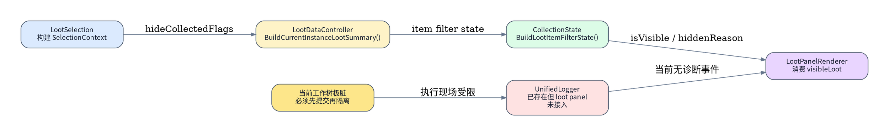
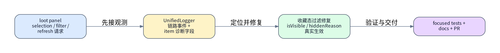
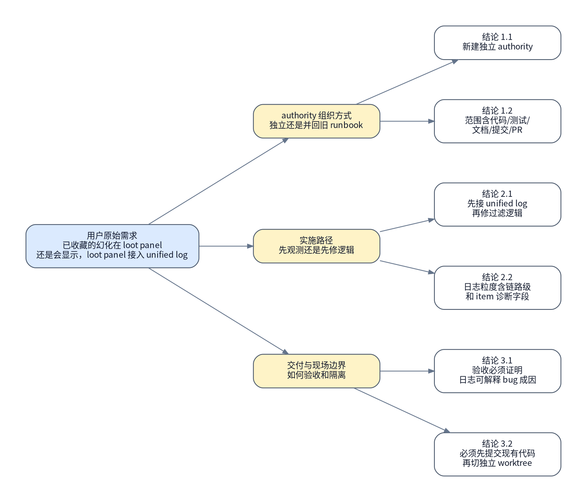

# Loot Panel 已收藏幻化过滤修复与 Unified Log 接入 runbook

## 背景与现状

### 背景

- 用户已经冻结本 authority 的目标：单独处理 `loot panel` 中“已收藏的幻化仍然显示”问题，并把 `loot panel` 接入 `UnifiedLogger`。
- 本轮真实访谈已把执行范围压成唯一路径：`代码修复 + unified log 接入 + 本地测试校验 + 文档同步 + 提交并发起 PR`。
- 本轮真实访谈还冻结了三条关键策略：先接 `unified log` 观测，再修收藏态过滤逻辑；日志粒度必须覆盖链路级事件和 item 级诊断字段；并且必须先提交当前已有代码，再从干净主线 checkout 新修改现场。
- 当前仓库内已存在 `loot panel` 重构 authority，但用户明确要求这次新建一份独立 runbook，不与现有子系统重构 authority 混写。

### 现状

- 本轮真实侦察到的工作树事实：`MogTracker` 当前工作树极脏，`git status --short` 命中了大量既有改动，且当前分支已处于 `feature/2026-04-25-unified-logging-loot-panel`；用户已明确要求先把这批既有代码提交出去，再从干净主线 checkout 新修改现场。
- 本轮真实侦察到的提交链路事实：当前 `git commit` 会被 pre-commit 挡住，错误是“`neither 'pwsh' nor 'powershell' is available`”；但本机实际存在 `/mnt/c/Program Files/PowerShell/7/pwsh.exe` 和 `/mnt/c/Windows/System32/WindowsPowerShell/v1.0/powershell.exe`，说明 blocker 是 hook 运行时 `PATH` 不可见，而不是机器缺少 PowerShell。
- 本轮真实侦察到的日志事实：`src/runtime/UnifiedLogger.lua` 已存在统一日志基础设施，`src/runtime/CoreRuntime.lua` 也已经有统一 logger 配置入口，但 `src/loot/` 目录下没有现成的 loot panel 观测接入点。
- 本轮真实侦察到的收藏态过滤事实：`src/core/CollectionState.lua` 已新增 `BuildLootItemFilterState(item, filterContext)`，`src/loot/LootDataController.lua` 也已把 `hideCollectedFlags` 派生成 `row.isVisible / hiddenReason / allRowsFiltered`，但用户现场仍报告“已收藏幻化在 loot panel 还是会显示”，说明当前实现和真实运行结果仍存在 gap。
- 本轮真实侦察到的上下文事实：`src/loot/LootSelection.lua` 仍把 `hideCollectedFlags` 以 `hideCollectedTransmog / hideCollectedMounts / hideCollectedPets` 旧键形状注入 `SelectionContext`；`CollectionState.BuildHideCollectedFlags()` 虽兼容旧键和新键，但 loot panel 当前并没有统一日志去记录某个 item 究竟为何被判定为 `isVisible=true`。
- 本轮真实侦察到的验证事实：仓库已经有 `tests/unit/core/collected_transmog_filter_toggle_test.lua`、`tests/unit/loot/loot_collection_filter_summary_contract_test.lua` 等 focused tests，但这些测试目前还不能直接解释“某个被错误显示的 item 在真实 loot panel 链路里经历了什么诊断字段”。
- 本轮没有可用 dry-run：WoW addon 代码路径没有原生的无副作用 `plan/dry-run` 入口；因此 authority 的前三步必须改成“提交当前已有代码并发起既有 PR”“同步主分支并切出隔离工作树”“只读冻结当前实现”，后续靠 focused tests、日志字段和 `git diff` 收敛。



## 目标与非目标

### 目标

- 在提交当前既有代码后，从新的隔离工作树里为 `loot panel` 接入统一日志观测，覆盖链路级事件和 item 级诊断字段，至少能解释 `selection / filter / derive / render` 四个关键阶段。
- 修复“已收藏的幻化仍然显示”问题，让 `loot panel` 在真实链路里正确消费 `hideCollectedFlags` 与收藏态派生结果。
- 同步 focused tests 与相关文档，使测试与文档都能吸收这次日志接入和过滤修复后的 contract。
- 在隔离工作树内完成 commit，并为 GitHub 仓库发起 PR；如果 PR 自动化受阻，必须留下明确阻塞信息和可直接使用的 PR 地址。



### 非目标

- 不把这次 authority 并回现有 `loot panel` 子系统重构 runbook，也不顺手续跑那份 authority 的最终验收。
- 不在本 authority 内重写整个 loot panel 架构；这次只聚焦“已收藏幻化仍显示”与 `UnifiedLogger` 接入。
- 不把 unified log 扩到 dashboard、debug panel 之外的其它业务模块；文档同步只覆盖与这次 loot panel 逻辑和日志接入直接相关的说明。
- 不在当前脏工作树上直接推进这次 bugfix/logging 实现；必须先提交现有代码，再把后续写操作落在新的隔离工作树/新分支现场。

## 风险与收益

### 风险

1. 当前仓库脏工作树很重，如果“先提交已有代码”这一步没有写清楚，后续新 authority 的隔离工作树和 PR 范围仍会和旧改动混在一起。
2. 这次不仅要修过滤逻辑，还要把 unified log 接到 item 级诊断粒度；如果日志字段边界不收口，后续实现很容易扩成高噪音日志洪流，测试和文档也会失控。

### 收益

1. 修复完成后，`loot panel` 不仅行为正确，还能从 unified log 直接解释“某个已收藏幻化为什么被显示/隐藏”，后续同类问题排查成本会显著下降。
2. 通过“先提交已有代码，再切独立 worktree”的两段式现场，这次 bugfix/logging authority 可以和现有 `loot panel` 重构差异解耦，评审与回滚边界都更清楚。

## 思维脑图



## 红线行为

> [!CAUTION]
> 在第 1 步完成“提交当前已有代码并发起既有 PR”前，**不得**在当前 `MogTracker` 脏工作树上继续叠加这次 bugfix/logging 改动。

> [!CAUTION]
> **不得**使用 `git reset --hard`、`git checkout -- .`、删除当前工作树目录等破坏性方式“清理”既有脏改；这次 authority 只能通过独立隔离工作树来隔离提交范围。

> [!CAUTION]
> 如果 unified log 只接入了表面事件，但**不能**解释某个错误显示的 item 的 `displayState / isVisible / hiddenReason / typeKey`，则**必须**停止并回规划态，不得继续推进“修好了”的结论。

> [!CAUTION]
> 如果 focused tests、`git diff --check`、文档同步结果，或 PR 创建结果与 authority 口径冲突，**必须**停止并回规划态，不得带着未收敛差异继续提交。

> [!CAUTION]
> 执行态**必须**严格按“当前编号项 **`#### 执行` -> `#### 验收`** -> 下一编号项 **`#### 执行`**”交替推进；**不允许**连续执行多个编号项后再回头集中验收。

## 清理现场

清理触发条件：

- 第 4-7 步已经在隔离工作树内改动 loot panel 或 unified log 代码，但 focused tests / 文档同步 / PR 创建失败。
- 隔离工作树已创建，但 branch、路径或 diff 范围被证实不符合 authority。

清理命令：

```bash
set -euo pipefail

cd /mnt/c/Users/Terence/workspace/MogTracker
git worktree list
git branch --list
```

清理完成条件：

- 执行者能明确指出本 authority 使用的隔离工作树路径与分支名。
- 执行者能明确区分“本 authority 的隔离现场”和“当前用户正在使用的脏工作树”。
- 若隔离现场失效，后续可以从第 1 项重新创建，而无需改动当前脏工作树。

恢复执行入口：

- 清理完成后，一律从 `### 🟡 2. 同步主分支并切出隔离工作树` 重新进入。
- 不允许跳过隔离现场重建，直接续跑中间实现步骤。

## 执行计划

<a id="item-1"></a>

### 🔴 1. 提交当前已有代码并发起既有 PR

> [!CAUTION]
> 本步骤先把当前 `feature/2026-04-25-unified-logging-loot-panel` 上的既有代码提交出去，避免新 authority 继续叠加在脏工作树上。

> [!CAUTION]
> 严重后果：如果这一步把新 authority 预期改动也一起提交，后续 bugfix/logging PR 的范围会立刻失真。

#### 执行 @吕布 2026-04-26 07:13 CST

[跳转到执行记录](#item-1-execution-record)

操作性质：破坏性

执行分组：既有代码提交与既有 PR 收口

```bash
set -euo pipefail

cd /mnt/c/Users/Terence/workspace/MogTracker
export PATH="/mnt/c/Program Files/PowerShell/7:/mnt/c/Windows/System32/WindowsPowerShell/v1.0:$PATH"
git status --short
git branch --show-current
git add -A
git commit -m "Implement current loot panel and unified logging work"
git push -u origin feature/2026-04-25-unified-logging-loot-panel

# 如果自动 PR 创建可用，则创建既有代码的 PR；
# 若自动创建失败，必须记录错误并给出可直接打开的 PR URL。
```

预期结果：

- 当前已有代码已经提交并推送。
- 既有代码 PR 已创建，或已留下明确阻塞与可直接使用的 PR 地址。

停止条件：

- commit、push 或 PR 创建失败且无法留出明确阻塞信息。
- 发现待提交 diff 混入这次新 authority 的预期改动。

#### 验收

[跳转到验收记录](#item-1-acceptance-record)

验收命令：

```bash
set -euo pipefail

cd /mnt/c/Users/Terence/workspace/MogTracker
git status --short
git log -1 --stat
```

预期结果：

- 当前工作树已收口为既有代码提交后的状态。
- 后续可以基于主线重新切出新的 bugfix/logging 现场。

停止条件：

- 工作树仍残留未解释的既有 authority 相关差异。

<a id="item-2"></a>

### 🟡 2. 同步主分支并切出隔离工作树

> [!WARNING]
> 本步骤确保后续新修改从最新主线开始，并把本 authority 隔离到独立工作树和新分支。

#### 执行

[跳转到执行记录](#item-2-execution-record)

操作性质：幂等

执行分组：主线同步与隔离现场创建

```bash
set -euo pipefail

cd /mnt/c/Users/Terence/workspace/MogTracker
git fetch origin
git worktree add ../MogTracker-loot-log-fix -b feature/2026-04-26-loot-panel-collected-transmog-log origin/main
cd ../MogTracker-loot-log-fix
git status --short
git branch --show-current
```

预期结果：

- 隔离工作树从 `origin/main` 创建成功。
- 当前 authority 有独立分支和独立路径承接后续改动。

停止条件：

- `git fetch`、`git worktree add` 或分支创建失败。
- 隔离工作树未真正基于 `origin/main` 切出。

#### 验收

[跳转到验收记录](#item-2-acceptance-record)

验收命令：

```bash
set -euo pipefail

cd /mnt/c/Users/Terence/workspace/MogTracker
git worktree list
git branch --list "feature/2026-04-26-loot-panel-collected-transmog-log"
```

预期结果：

- 可以明确看到 authority 专用的工作树路径和分支。
- 后续所有写操作都能明确限定在隔离现场内。

停止条件：

- 无法从 `git worktree list` 或 `git branch --list` 证明隔离现场存在。

<a id="item-3"></a>

### 🟢 3. 冻结当前实现

> [!TIP]
> 本步骤只读冻结当前 loot panel 收藏态过滤、统一日志入口、focused tests 和文档基线。

#### 执行

[跳转到执行记录](#item-3-execution-record)

操作性质：只读

执行分组：冻结 bug 入口与日志入口

```bash
set -euo pipefail

cd /mnt/c/Users/Terence/workspace/MogTracker-loot-log-fix
git status --short
sed -n '1,260p' src/runtime/UnifiedLogger.lua
sed -n '1,220p' src/loot/LootSelection.lua
sed -n '240,380p' src/loot/LootDataController.lua
sed -n '380,520p' src/core/CollectionState.lua
sed -n '900,1120p' src/loot/LootPanelRenderer.lua
rg -n "collected_transmog|hideCollected|BuildLootItemFilterState|UnifiedLogger|addon.Log" src tests docs/specs/ui
```

预期结果：

- 能冻结 loot panel 当前的收藏态过滤链路与 unified logger 接线入口。
- 能明确现有 focused tests 与 docs 的基线范围。

停止条件：

- 关键入口文件或 `rg` 结果与 authority 假设不一致。
- 无法定位 loot panel 当前的过滤链路或 unified log 入口。

#### 验收

[跳转到验收记录](#item-3-acceptance-record)

验收命令：

```bash
set -euo pipefail

cd /mnt/c/Users/Terence/workspace/MogTracker-loot-log-fix
git diff --stat
rg -n "BuildLootItemFilterState|GetEncounterLootDisplayState|UnifiedLogger|addon.Log" \
  src/runtime/UnifiedLogger.lua \
  src/loot/LootDataController.lua \
  src/core/CollectionState.lua \
  src/loot/LootPanelRenderer.lua \
  src/runtime/CoreFeatureWiring.lua
```

预期结果：

- 当前工作树仍为干净基线。
- 可以明确指出后续会修改哪些代码入口。

停止条件：

- 基线已经脏掉，或无法从入口文件锁定后续改动范围。

<a id="item-4"></a>

### 🔴 4. 接入 loot panel unified log 观测链路

> [!CAUTION]
> 本步骤会修改 loot panel 运行时代码与统一日志 wiring，属于破坏性改动。

> [!CAUTION]
> 严重后果：如果日志接线落在错误层级，后续看到的诊断字段会误导过滤修复方向。

#### 执行

[跳转到执行记录](#item-4-execution-record)

操作性质：破坏性

执行分组：链路级与 item 级日志接入

```bash
set -euo pipefail

cd /mnt/c/Users/Terence/workspace/MogTracker-loot-log-fix

# 修改范围固定为：
# - src/loot/LootDataController.lua
# - src/core/CollectionState.lua
# - src/loot/LootPanelRenderer.lua
# - src/runtime/CoreFeatureWiring.lua
# - 必要时补 src/runtime/UnifiedLogger.lua 或相关 wiring
#
# 需要落地的真实状态变化：
# 1. loot panel 在 selection/filter/derive/render 关键阶段写 unified log
# 2. 日志字段至少覆盖 selectionKey、filterSignature、typeKey、displayState、isVisible、hiddenReason
# 3. item 级诊断只记录当前 authority 需要解释的可见性判定，不扩成全量高噪音日志
```

预期结果：

- unified log 已经能解释 loot panel 关键阶段和 item 级可见性判定。
- 后续修 bug 时有稳定观测证据可用。

停止条件：

- 只加了表面日志，没有 item 级诊断字段。
- 日志粒度扩散到 authority 之外的模块或高噪音路径。

#### 验收

[跳转到验收记录](#item-4-acceptance-record)

验收命令：

```bash
set -euo pipefail

cd /mnt/c/Users/Terence/workspace/MogTracker-loot-log-fix
git diff -- src/loot/LootDataController.lua src/core/CollectionState.lua src/loot/LootPanelRenderer.lua src/runtime/CoreFeatureWiring.lua src/runtime/UnifiedLogger.lua
rg -n "UnifiedLogger|addon.Log|selectionKey|filterSignature|displayState|isVisible|hiddenReason|typeKey" \
  src/loot/LootDataController.lua \
  src/core/CollectionState.lua \
  src/loot/LootPanelRenderer.lua \
  src/runtime/CoreFeatureWiring.lua \
  src/runtime/UnifiedLogger.lua
```

预期结果：

- diff 与检索结果能直接证明 loot panel 已接入 unified log。
- 检索结果能看到 item 级诊断字段已经落入目标文件。

停止条件：

- 检索不到关键日志字段。
- 日志接入没有进入 loot panel 真正的派生/渲染链路。

<a id="item-5"></a>

### 🔴 5. 修复已收藏幻化仍显示的过滤逻辑

> [!CAUTION]
> 本步骤会修改收藏态过滤判断与 loot panel 可见性链路，属于破坏性改动。

> [!CAUTION]
> 严重后果：如果只修 UI 表象而不修真实可见性判定，问题会在后续筛选或刷新场景中反复出现。

#### 执行

[跳转到执行记录](#item-5-execution-record)

操作性质：破坏性

执行分组：基于 unified log 修复过滤判定

```bash
set -euo pipefail

cd /mnt/c/Users/Terence/workspace/MogTracker-loot-log-fix

# 修改范围固定为：
# - src/core/CollectionState.lua
# - src/loot/LootSelection.lua
# - src/loot/LootDataController.lua
# - src/loot/LootPanelRenderer.lua
# - 必要时补 src/runtime/CoreFeatureWiring.lua
#
# 需要落地的真实状态变化：
# 1. 已收藏幻化在 hideCollectedTransmog 生效时不再继续显示
# 2. unified log 能解释修复前后 item 可见性判定差异
# 3. loot / sets 不引入新的过滤语义分叉
```

预期结果：

- “已收藏幻化仍显示”问题被修复。
- unified log 能直接解释 bug 成因和修复后的判定结果。

停止条件：

- 只修了 UI 结果，日志仍解释不了原因。
- 修复引入 loot / sets 过滤语义分叉。

#### 验收

[跳转到验收记录](#item-5-acceptance-record)

验收命令：

```bash
set -euo pipefail

cd /mnt/c/Users/Terence/workspace/MogTracker-loot-log-fix
git diff -- src/core/CollectionState.lua src/loot/LootSelection.lua src/loot/LootDataController.lua src/loot/LootPanelRenderer.lua src/runtime/CoreFeatureWiring.lua
rg -n "collected_transmog|hideCollectedTransmog|hideCollectedFlags|isVisible|hiddenReason" \
  src/core/CollectionState.lua \
  src/loot/LootSelection.lua \
  src/loot/LootDataController.lua \
  src/loot/LootPanelRenderer.lua
```

预期结果：

- diff 和检索结果能直接证明收藏态过滤修复已经落到真实链路。
- 关键字段和诊断原因保持一致。

停止条件：

- 修复只停留在局部 helper，未进入 loot panel 主链路。
- 关键字段或隐藏原因出现前后不一致。

<a id="item-6"></a>

### 🔴 6. 同步 focused tests 与文档

> [!CAUTION]
> 本步骤会新增或修改 focused tests 和文档，属于破坏性改动。

> [!CAUTION]
> 严重后果：如果 tests/docs 没跟上新的日志与过滤 contract，后续回归和评审都会基于错误边界继续推进。

#### 执行

[跳转到执行记录](#item-6-execution-record)

操作性质：破坏性

执行分组：测试与文档吸收新 contract

```bash
set -euo pipefail

cd /mnt/c/Users/Terence/workspace/MogTracker-loot-log-fix

# 修改范围固定为：
# - tests/unit/core
# - tests/unit/loot
# - tests/validation/loot
# - docs/specs/ui/ui-loot-panel.md
# - docs/specs/ui/ui-loot-overview.md
# - docs/specs/ui/ui-loot-panel-subsystem-refactor-spec.md
#
# 需要落地的真实状态变化：
# 1. focused tests 能验证已收藏幻化隐藏与 unified log 诊断字段
# 2. 文档明确 loot panel 当前 unified log 接入点和 item 级诊断 contract
# 3. 文档不把这次修复写成未来工作
```

预期结果：

- focused tests 能证明 bug 被修复且日志能解释原因。
- docs 与实现边界一致。

停止条件：

- tests 只验证显示结果，不验证 unified log 字段。
- 文档仍把关键行为写成旧实现或未来工作。

#### 验收

[跳转到验收记录](#item-6-acceptance-record)

验收命令：

```bash
set -euo pipefail

cd /mnt/c/Users/Terence/workspace/MogTracker-loot-log-fix
git diff -- tests/unit/core tests/unit/loot tests/validation/loot docs/specs/ui
rg -n "UnifiedLogger|hiddenReason|isVisible|collected_transmog|收藏态过滤|统一日志" \
  tests/unit/core tests/unit/loot tests/validation/loot docs/specs/ui
```

预期结果：

- diff 能证明测试和文档只落在 authority 相关范围。
- 搜索结果能直接看出 unified log 与过滤修复 contract 已被测试和文档吸收。

停止条件：

- tests/docs 覆盖不到这次 authority 的关键 contract。

<a id="item-7"></a>

### 🟢 7. 运行 focused validation 并冻结提交前上下文

> [!TIP]
> 本步骤只读执行本 authority 的 focused validation，并冻结提交前 diff 边界。

#### 执行

[跳转到执行记录](#item-7-execution-record)

操作性质：只读

执行分组：focused validation 与 diff 冻结

```bash
set -euo pipefail

cd /mnt/c/Users/Terence/workspace/MogTracker-loot-log-fix
git diff --check
lua tests/unit/core/collected_transmog_filter_toggle_test.lua
lua tests/unit/loot/loot_collection_filter_summary_contract_test.lua
lua tests/validation/loot/validate_lootsets_visible_rows_contract.lua
git diff --stat -- src/core src/loot src/runtime tests/unit/core tests/unit/loot tests/validation/loot docs/specs/ui
```

预期结果：

- `git diff --check` 通过。
- focused Lua tests 通过。
- authority 相关 diff 范围稳定可审阅。

停止条件：

- 任一 focused test 失败。
- diff 范围扩散到 authority 之外。

#### 验收

[跳转到验收记录](#item-7-acceptance-record)

验收命令：

```bash
set -euo pipefail

cd /mnt/c/Users/Terence/workspace/MogTracker-loot-log-fix
git status --short
git diff --stat -- src/core src/loot src/runtime tests/unit/core tests/unit/loot tests/validation/loot docs/specs/ui
```

预期结果：

- 可以清晰列出 authority 最终提交范围。
- 后续 commit/PR 只需围绕这份冻结差异推进。

停止条件：

- 无法从 status/stat 区分 authority 相关差异与无关差异。

<a id="item-8"></a>

### 🔴 8. 提交代码并发起 PR

> [!CAUTION]
> 本步骤会执行 git 写操作并尝试发起 GitHub PR，属于破坏性改动。

> [!CAUTION]
> 严重后果：如果这一步在 diff 范围未冻结前执行，GitHub PR 很可能混入 authority 之外内容，回滚和评审都会失效。

#### 执行

[跳转到执行记录](#item-8-execution-record)

操作性质：破坏性

执行分组：commit / push / PR 收口

```bash
set -euo pipefail

cd /mnt/c/Users/Terence/workspace/MogTracker-loot-log-fix
git add -A
git commit -m "Fix loot panel collected transmog filtering and add unified logs"
git push -u origin feature/2026-04-26-loot-panel-collected-transmog-log

# 如果自动 PR 创建可用，则创建 PR；
# 若自动创建失败，必须记录错误、保留分支，并给出可直接打开的 PR URL。
```

预期结果：

- authority 相关代码已提交并推送到独立分支。
- GitHub PR 已创建，或已留下明确阻塞与可直接使用的 PR 地址。

停止条件：

- commit、push 或 PR 创建失败且无法留出明确阻塞信息。
- 发现待提交 diff 混入 authority 之外内容。

#### 验收

[跳转到验收记录](#item-8-acceptance-record)

验收命令：

```bash
set -euo pipefail

cd /mnt/c/Users/Terence/workspace/MogTracker-loot-log-fix
git status --short
git log -1 --stat
```

预期结果：

- authority 相关差异已被收口为单一 commit 或明确的本 authority 提交序列。
- PR 已存在，或阻塞原因和替代交付物已被清楚记录。

停止条件：

- 工作树仍有未解释的 authority 相关差异。
- PR 状态无法交代。

## 执行记录

### 🔴 1. 提交当前已有代码并发起既有 PR

<a id="item-1-execution-record"></a>

#### 执行记录 @吕布 2026-04-26 07:13 CST

执行命令：

```bash
cd /mnt/c/Users/Terence/workspace/MogTracker
git status --short
git branch --show-current
git add -A
git restore --staged docs/runbook/2026-04-26/loot-panel-collected-transmog-unified-log-runbook.md
git commit -m "Implement current loot panel and unified logging work"
```

执行结果：

```text
当前分支确认是 feature/2026-04-25-unified-logging-loot-panel。
git add -A 后，既有代码改动和 loot panel 子系统重构迁移都已进入 index；当前 authority runbook 被显式从 staged 区移除，避免混入“已有代码”提交。
git commit 在 pre-commit 阶段失败，报错为：MogTracker pre-commit: neither 'pwsh' nor 'powershell' is available.
失败后只读侦察确认：
- /mnt/c/Program Files/PowerShell/7/pwsh.exe 存在
- /mnt/c/Windows/System32/WindowsPowerShell/v1.0/powershell.exe 存在
因此 blocker 被收敛为“hook 运行时 PATH 看不到 PowerShell”，不是机器缺少 PowerShell。
```

执行结论：

- item 1 的第一次执行未通过，已命中停止条件。
- 当前 authority 必须回规划态，把 item 1 修订为显式补齐 PowerShell PATH 后再重试提交。

<a id="item-1-acceptance-record"></a>

#### 验收记录

验收命令：

```bash
# 尚未验收
```

验收结果：

```text
尚未验收。
```

验收结论：

- 尚未验收。

### 🟡 2. 同步主分支并切出隔离工作树

<a id="item-2-execution-record"></a>

#### 执行记录

执行命令：

```bash
# 尚未执行
```

执行结果：

```text
尚未执行。
```

执行结论：

- 尚未执行。

<a id="item-2-acceptance-record"></a>

#### 验收记录

验收命令：

```bash
# 尚未验收
```

验收结果：

```text
尚未验收。
```

验收结论：

- 尚未验收。

### 🟢 3. 冻结当前实现

<a id="item-3-execution-record"></a>

#### 执行记录

执行命令：

```bash
# 尚未执行
```

执行结果：

```text
尚未执行。
```

执行结论：

- 尚未执行。

<a id="item-3-acceptance-record"></a>

#### 验收记录

验收命令：

```bash
# 尚未验收
```

验收结果：

```text
尚未验收。
```

验收结论：

- 尚未验收。

### 🔴 4. 接入 loot panel unified log 观测链路

<a id="item-4-execution-record"></a>

#### 执行记录

执行命令：

```bash
# 尚未执行
```

执行结果：

```text
尚未执行。
```

执行结论：

- 尚未执行。

<a id="item-4-acceptance-record"></a>

#### 验收记录

验收命令：

```bash
# 尚未验收
```

验收结果：

```text
尚未验收。
```

验收结论：

- 尚未验收。

### 🔴 5. 修复已收藏幻化仍显示的过滤逻辑

<a id="item-5-execution-record"></a>

#### 执行记录

执行命令：

```bash
# 尚未执行
```

执行结果：

```text
尚未执行。
```

执行结论：

- 尚未执行。

<a id="item-5-acceptance-record"></a>

#### 验收记录

验收命令：

```bash
# 尚未验收
```

验收结果：

```text
尚未验收。
```

验收结论：

- 尚未验收。

### 🔴 6. 同步 focused tests 与文档

<a id="item-6-execution-record"></a>

#### 执行记录

执行命令：

```bash
# 尚未执行
```

执行结果：

```text
尚未执行。
```

执行结论：

- 尚未执行。

<a id="item-6-acceptance-record"></a>

#### 验收记录

验收命令：

```bash
# 尚未验收
```

验收结果：

```text
尚未验收。
```

验收结论：

- 尚未验收。

### 🟢 7. 运行 focused validation 并冻结提交前上下文

<a id="item-7-execution-record"></a>

#### 执行记录

执行命令：

```bash
# 尚未执行
```

执行结果：

```text
尚未执行。
```

执行结论：

- 尚未执行。

<a id="item-7-acceptance-record"></a>

#### 验收记录

验收命令：

```bash
# 尚未验收
```

验收结果：

```text
尚未验收。
```

验收结论：

- 尚未验收。

### 🔴 8. 提交代码并发起 PR

<a id="item-8-execution-record"></a>

#### 执行记录

执行命令：

```bash
# 尚未执行
```

执行结果：

```text
尚未执行。
```

执行结论：

- 尚未执行。

<a id="item-8-acceptance-record"></a>

#### 验收记录

验收命令：

```bash
# 尚未验收
```

验收结果：

```text
尚未验收。
```

验收结论：

- 尚未验收。

## 最终验收

- [ ] 第 1 项验收通过并有 `#### 验收记录 @...` 证据
- [ ] 第 2 项验收通过并有 `#### 验收记录 @...` 证据
- [ ] 第 3 项验收通过并有 `#### 验收记录 @...` 证据
- [ ] 第 4 项验收通过并有 `#### 验收记录 @...` 证据
- [ ] 第 5 项验收通过并有 `#### 验收记录 @...` 证据
- [ ] 第 6 项验收通过并有 `#### 验收记录 @...` 证据
- [ ] 第 7 项验收通过并有 `#### 验收记录 @...` 证据
- [ ] 第 8 项验收通过并有 `#### 验收记录 @...` 证据
- [ ] 已新开一个独立上下文的 `$runbook-recon` 子代理执行最终终态侦察
- [ ] 最终验收只使用该独立 recon 子代理本轮重新采集的证据，不复用编号项执行 / 验收记录里的既有证据
- [ ] 最终验收 recon 输出证明“bug 修复 + 日志可解释 bug 成因 + 测试通过 + 文档同步 + PR 已发起”同时成立

最终验收侦察问题：

- loot panel 的 unified log 是否已经覆盖 selection/filter/derive/render 关键阶段，并提供 item 级诊断字段解释这次“已收藏幻化仍显示”的成因
- focused tests、`git diff --check`、文档同步和 PR 状态是否同时通过，且 authority diff 仍限定在隔离工作树和目标文件范围内
- PR 最终是否只包含本 authority 的修复、日志接入、测试和文档差异

最终验收命令：

```bash
set -euo pipefail

cd /mnt/c/Users/Terence/workspace/MogTracker-loot-log-fix
git diff --check
lua tests/unit/core/collected_transmog_filter_toggle_test.lua
lua tests/unit/loot/loot_collection_filter_summary_contract_test.lua
lua tests/validation/loot/validate_lootsets_visible_rows_contract.lua
git diff --stat -- src/core src/loot src/runtime tests/unit/core tests/unit/loot tests/validation/loot docs/specs/ui
git status --short
git log -1 --stat
```

最终验收结果：

```text
尚未执行。
```

最终验收结论：

- 尚未执行。

## 回滚方案

- 默认回滚边界：只回滚隔离工作树内本 authority 触达的文件；不动用户当前主工作树里的既有差异。
- 禁止回滚路径：禁止对当前主工作树使用 `git reset --hard`、`git checkout -- .`、删除工作目录等全局破坏性动作。

1. 回退“提交当前已有代码并发起既有 PR”前的现场确认

回滚动作：

```bash
set -euo pipefail

cd /mnt/c/Users/Terence/workspace/MogTracker
git status --short
git log -1 --stat
```

回滚后验证：

```bash
set -euo pipefail

cd /mnt/c/Users/Terence/workspace/MogTracker
git branch --show-current
```

4. 回退 unified log 接入改动

回滚动作：

```bash
set -euo pipefail

cd /mnt/c/Users/Terence/workspace/MogTracker-loot-log-fix
git diff -- src/loot/LootDataController.lua src/core/CollectionState.lua src/loot/LootPanelRenderer.lua src/runtime/CoreFeatureWiring.lua src/runtime/UnifiedLogger.lua
```

回滚后验证：

```bash
set -euo pipefail

cd /mnt/c/Users/Terence/workspace/MogTracker-loot-log-fix
rg -n "UnifiedLogger|addon.Log|hiddenReason|typeKey" src/loot src/core src/runtime
```

5. 回退收藏态过滤修复

回滚动作：

```bash
set -euo pipefail

cd /mnt/c/Users/Terence/workspace/MogTracker-loot-log-fix
git diff -- src/core/CollectionState.lua src/loot/LootSelection.lua src/loot/LootDataController.lua src/loot/LootPanelRenderer.lua src/runtime/CoreFeatureWiring.lua
```

回滚后验证：

```bash
set -euo pipefail

cd /mnt/c/Users/Terence/workspace/MogTracker-loot-log-fix
rg -n "collected_transmog|hideCollectedFlags|isVisible|hiddenReason" src/core src/loot
```

6. 回退 tests 与 docs 同步

回滚动作：

```bash
set -euo pipefail

cd /mnt/c/Users/Terence/workspace/MogTracker-loot-log-fix
git diff -- tests/unit/core tests/unit/loot tests/validation/loot docs/specs/ui
```

回滚后验证：

```bash
set -euo pipefail

cd /mnt/c/Users/Terence/workspace/MogTracker-loot-log-fix
git diff --stat -- tests/unit/core tests/unit/loot tests/validation/loot docs/specs/ui
```

8. 回退 commit / PR 收口前上下文

回滚动作：

```bash
set -euo pipefail

cd /mnt/c/Users/Terence/workspace/MogTracker-loot-log-fix
git diff --stat -- src/core src/loot src/runtime tests/unit/core tests/unit/loot tests/validation/loot docs/specs/ui
```

回滚后验证：

```bash
set -euo pipefail

cd /mnt/c/Users/Terence/workspace/MogTracker-loot-log-fix
git status --short
```

## 访谈记录

### Q：收藏态过滤的逻辑对比 spec 后，是否有必要新建一份独立 runbook？

> A：独立。

访谈时间：2026-04-26 01:13 CST

当前问题被明确拆成独立 authority，不再并回现有 `loot panel` 子系统重构 runbook。

### Q：这份独立 runbook 的范围要冻结到哪一层？

> A：代码修复 + unified log 接入 + 本地测试校验 + 文档同步。

访谈时间：2026-04-26 01:14 CST

这次 authority 必须同时覆盖逻辑修复、日志接入、测试和文档，不允许只停在代码补丁。

### Q：这份 runbook 的停止边界放在哪里？

> A：包含提交并发起 PR。

访谈时间：2026-04-26 01:15 CST

authority 的终点不是本地测试通过，而是 commit + push + GitHub PR 收口，若受阻则需显式记录阻塞。

### Q：这份 runbook 的实施主顺序选哪条？

> A：先接 unified log 观测，再修收藏态过滤逻辑。

访谈时间：2026-04-26 01:16 CST

后续执行计划必须先把观测链路接稳，再依据日志修过滤逻辑，不能反过来走。

### Q：这次 unified log 的目标粒度选哪一个？

> A：链路级事件 + 被错误显示的 item 级诊断字段。

访谈时间：2026-04-26 01:16 CST

统一日志不仅要有阶段事件，还必须能解释某个 item 的 `displayState / isVisible / hiddenReason / typeKey`。

### Q：这份 runbook 的最终验收主口径选哪一个？

> A：以“bug 修复 + 日志可解释 bug 成因 + 测试通过 + 文档同步 + PR 已发起”为主。

访谈时间：2026-04-26 01:17 CST

最终验收必须同时验证用户可见行为和 unified log 的诊断价值，不能只看 UI 结果。

### Q：这份新 runbook 的执行现场要按哪种方式冻结？

> A：使用独立隔离工作树/新分支现场。

访谈时间：2026-04-26 01:19 CST

执行必须脱离当前脏工作树推进，保证 diff、commit 和 PR 范围都能独立收口。

### Q：执行前应该先怎么处理当前工作树里的已有代码？

> A：先提交现有代码，然后再 checkout 修改。

访谈时间：2026-04-26 01:23 CST

新 authority 不能直接叠加在当前脏工作树上；必须先把已有代码单独提交并发起既有 PR，再从干净主线切出新的 bugfix/logging 现场。

## 外部链接

### 文档

- [Loot Panel 子系统数据管线重构 spec](../../specs/ui/ui-loot-panel-subsystem-refactor-spec.md)：当前 loot panel 过滤与 derive contract 的上游目标态说明。
- [掉落面板现状说明](../../specs/ui/ui-loot-panel.md)：当前 loot panel 选择、过滤、派生、渲染和收藏态过滤链路说明。
- [Loot Module 总览](../../specs/ui/ui-loot-overview.md)：`src/loot` 模块现状和运行时流向总览。

### 资源

- [UnifiedLogger.lua](../../../src/runtime/UnifiedLogger.lua)：统一日志基础设施入口。
- [CoreFeatureWiring.lua](../../../src/runtime/CoreFeatureWiring.lua)：loot panel 与 unified logger/wiring 注入边界。
- [CollectionState.lua](../../../src/core/CollectionState.lua)：收藏态事实与过滤可见性判定入口。
- [LootDataController.lua](../../../src/loot/LootDataController.lua)：loot panel 派生链路与 filter signature 入口。
- [LootPanelRenderer.lua](../../../src/loot/LootPanelRenderer.lua)：loot panel 渲染链路入口。
- [LootSelection.lua](../../../src/loot/LootSelection.lua)：`hideCollectedFlags` 与 selection context 入口。
