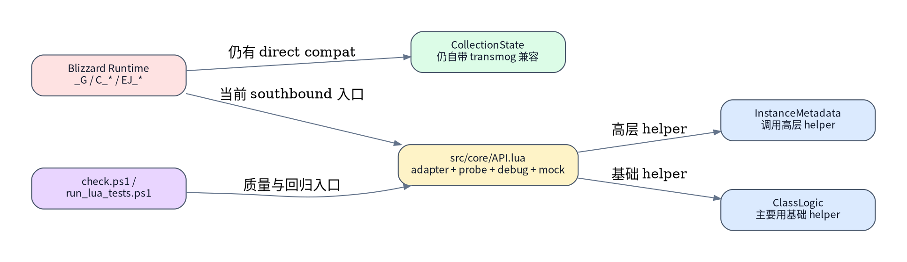
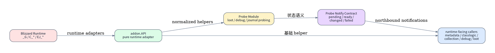
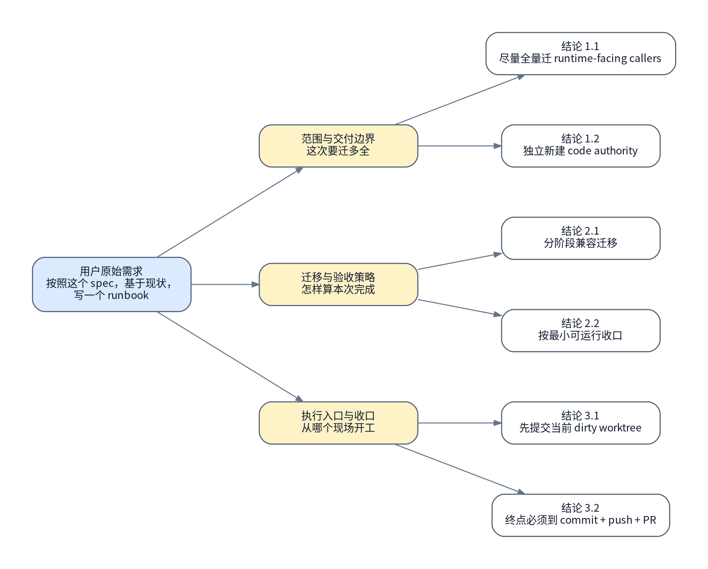

# MogTracker Runtime API Adapter / Probe Refactor

> [!NOTE]
> 当前主题：`code`

## 背景与现状

### 背景

- 用户已冻结本 authority 的组织方式：新建独立 runbook，不覆盖旧 runtime / unified logging runbook。
- 用户已冻结本 authority 的范围：尽量全量迁移 runtime-facing callers，而不是只做 `API.lua` 局部整理。
- 用户已冻结本 authority 的交付终点：必须走到 `commit + push + PR`。
- 用户已冻结本 authority 的迁移策略：采用分阶段兼容迁移，允许短期保留薄兼容桥。
- 用户已冻结本 authority 的主验收口径：按最小可运行收口，只要求新 adapter/probe 主链路和通知 contract 跑通，剩余 caller 允许留可解释兼容桥。
- 上游目标态已冻结在 [`runtime-api-adapter-refactor-spec.md`](../specs/runtime/runtime-api-adapter-refactor-spec.md)；本 runbook 负责把该 spec 落成一条可执行的实施路径。
- 用户进一步冻结了当前 dirty worktree 的处理方式：先提交当前改动，而不是 stash 或静默保留。

### 现状

- 本轮真实侦察到的仓库状态事实：主仓真实路径位于 `/mnt/c/World of Warcraft/_retail_/Interface/AddOns/MogTracker`，当前分支是 `main`，最新提交是 `38de4bb`，但工作区并不干净。
- 本轮真实侦察到的 dirty worktree 事实：当前主仓包含 `docs/specs/runtime/runtime-api-adapter-refactor-spec.md` 的新增、`runtime-api-adapter-refactor-design.md` 的删除、两份 docs 链接修正以及未跟踪的 `docs/runbook/2026-04-26/` 目录；因此 authority 的第 `1.` 步必须先按用户选择走“先提交当前改动”分叉。
- 本轮真实侦察到的 worktree 事实：仓库已经存在一个独立 worktree `/mnt/c/World of Warcraft/_retail_/Interface/AddOns/MogTracker-unified-log-full-migration`，分支为 `feature/2026-04-26-unified-log-full-migration`；本 authority 不应复用该 worktree，而应切出新的 adapter/probe worktree。
- 本轮真实侦察到的 adapter/probe 边界事实：[`src/core/API.lua`](../../../src/core/API.lua) 仍同时承载 `UseMock` / `ResetMock` 这类 runtime mock、`GetClassInfo` / `GetJournalLootInfoByIndexForEncounter` 这类 adapter helper，以及 `GetCurrentJournalInstanceID` / `BuildCurrentEncounterKillMap` / `CollectCurrentInstanceLootData` / `CaptureEncounterDebugDump` 这类组合 probe。
- 本轮真实侦察到的 caller 分布事实：[`src/metadata/InstanceMetadata.lua`](../../../src/metadata/InstanceMetadata.lua) 当前通过 `GetAPI().GetCurrentJournalInstanceID(...)` 读取高层 helper；[`src/core/CollectionState.lua`](../../../src/core/CollectionState.lua) 仍内嵌 `GetNormalizedAppearanceSourceInfo` / `GetNormalizedAppearanceInfoBySource` 并直接兼容 `C_TransmogCollection`；[`src/core/ClassLogic.lua`](../../../src/core/ClassLogic.lua) 已经相对稳定地通过 `dependencies.API or addon.API` 读取基础 helper。
- 本轮真实侦察到的验证入口事实：仓库已有统一质量入口 [`tools/check.ps1`](../../../tools/check.ps1)，会执行 `luac`、`luacheck`、`LuaLS`、`stylua -Check` 与 [`run_lua_tests.ps1`](../../../tools/run_lua_tests.ps1)；Lua focused tests 中至少已有 `validate_storage_layer_metadata.lua`、`validate_event_chat_logging.lua` 与 `debug_collection_state_visible_classes_test.lua` 可作为本 authority 的最小验证闭环。
- 本轮没有安全 dry-run：adapter/probe 重构不存在原生无副作用 `plan/dry-run` 入口，因此后续 authority 需要用只读冻结、focused tests、`git diff --check`、质量脚本和 PR diff 审阅代替 dry-run。



- `### 现状` 来自本轮对仓库状态、`API.lua`、`ClassLogic.lua`、`InstanceMetadata.lua`、`CollectionState.lua`、`tools/check.ps1` 与 `tools/run_lua_tests.ps1` 的只读检索，不是旧文档复述。
- 当前没有 code-level dry-run；后续执行项必须以 focused tests、质量脚本、`git diff --check`、worktree 证据和 PR diff 作为替代收敛手段。

## 目标与非目标

### 目标

- 在新的隔离 worktree 中，把 `addon.API` 收回成 pure runtime adapter，让高层组合 probe 从 `API.lua` 中拆出独立模块。
- 定义并落地最小 probe 通知 contract，至少覆盖 `pending / ready / changed / failed`，并让 northbound caller 不再直接围绕 Blizzard 原生事件做等待逻辑。
- 尽量全量迁移 runtime-facing callers 到新边界，至少让关键 caller 不再依赖 `API.lua` 内混杂的高层 helper；允许短期保留可解释的薄兼容桥。
- 把 transmog / loot / journal 相关兼容归一尽可能收回 adapter 层，缩小 `CollectionState` 等消费者里的原生 API 漂移逻辑。
- 同步 focused tests、spec / runbook / 相关 docs，并以 commit、push、PR 作为最终交付物。



### 非目标

- 不把这次 authority 扩成 runtime 全仓大重命名或通用事件总线框架设计。
- 不要求一次性删除所有旧高层 helper；这次选择的是分阶段兼容迁移，允许保留薄兼容桥，但不允许继续扩大旧边界。
- 不重构 `Storage.lua`、`EncounterState.lua`、`UIChromeController.lua` 等与 adapter/probe 主链路无直接关系的模块职责。
- 不把 unified log 全量迁移、dashboard 业务改造或无关 UI 修复混入本次 PR。

## 风险与收益

### 风险

1. `API.lua` 中的高层 probe 和基础 adapter 当前深度混写，如果拆分时清单不完整，容易出现“表面建了新 probe 模块，但旧 helper 仍然偷偷承载主路径”的假完成。
2. 这次允许 probe contract 一次性整理，若迁移点太多而 focused tests 不足，northbound caller 很容易在参数、返回值或异步状态语义上出现静默回归。

### 收益

1. southbound runtime 风险会被压回 adapter 层，后续 Blizzard API 漂移有单点修复位置，而不是继续外溢到 `CollectionState` 或其他消费者。
2. probe 模块和通知 contract 独立后，后续 loot/debug/journal 相关能力可以围绕明确的业务语义继续演进，而不再被 `API.lua` 的历史混合边界拖住。

## 思维脑图



## 红线行为

> [!CAUTION]
> 在第 `3.` 步拿到“当前哪些 helper 仍混在 `API.lua`、哪些 caller 仍直连 Blizzard runtime、哪些测试已覆盖新 contract”的真实清单前，**不得**宣称 adapter/probe 边界已经收口。

> [!CAUTION]
> 既然这次选择的是**分阶段兼容迁移**，就**不得**把“保留薄兼容桥”扩大成长期并存的第二主路径；旧高层 helper 只能作为过渡桥，而不能继续承载目标态主 contract。

> [!CAUTION]
> 如果执行后 `CollectionState`、loot/debug caller 或 probe 订阅方仍然主要依赖旧 `API.lua` 混合 helper 或直接监听 Blizzard 原生事件，则**必须**停止并回规划态，不得带着“已完成 adapter/probe 重构”的结论继续提交。

> [!CAUTION]
> **不得**使用 `git reset --hard`、`git checkout -- .`、删除用户已有 worktree，或用破坏性方式清理与本 authority 无关的现场；所有变更只能在新的隔离 worktree 内推进。

> [!CAUTION]
> 执行态**必须**严格按“当前编号项 **`#### 执行` -> `#### 验收`** -> 下一编号项 **`#### 执行`**”交替推进；**不允许**连续执行多个编号项后再回头集中验收。

## 清理现场

清理触发条件：

- 第 `4-7.` 步已经在隔离 worktree 中开始拆 adapter/probe 边界，但 focused tests、通知 contract 验收或质量脚本失败。
- 旧高层 helper 已部分迁出 `API.lua`，但验证发现 caller 仍大量依赖旧路径，导致“新边界和旧边界都不完整”的混合态。

清理命令：

```bash
set -euo pipefail

cd /mnt/c/World\ of\ Warcraft/_retail_/Interface/AddOns/MogTracker
git worktree list
git branch --list

cd /mnt/c/World\ of\ Warcraft/_retail_/Interface/AddOns/MogTracker-runtime-api-adapter-probe-refactor 2>/dev/null || true
git status --short || true
git log --oneline -5 || true
```

清理完成条件：

- 执行者能明确指出本 authority 使用的隔离 worktree 路径和分支名。
- 执行者能明确区分“本 authority 的 adapter/probe 新差异”和现有 unified-log worktree / 历史 feature 分支差异。
- 若隔离现场失效，可以从 `### 🟡 1. 同步主分支最新代码并切出工作分支` 重新进入，而不影响当前用户已有分支与 worktree。

恢复执行入口：

- 清理完成后，一律从 `### 🟡 1. 同步主分支最新代码并切出工作分支` 重新进入。
- 不允许跳过新的隔离 worktree 创建，直接在脏的 `main` 或其他历史 feature 分支上续跑。

## 执行计划

如果这份 authority runbook 的目标是代码仓库内的实现 / 重构 / 测试 / 文档同步，最后一个编号项默认必须是“提交并发起 PR/MR”的收口步骤，名称按仓库类型决定；若环境受阻，则该末项必须显式记录阻塞条件、替代交付物和交接动作。

如果这份 authority runbook 的目标是代码仓库内的实现 / 重构 / 测试 / 文档同步，前两步默认也应写成：

- `### 🟡 1. 同步主分支最新代码并切出工作分支`
- `### 🟢 2. 冻结当前实现`

不要把代码类 runbook 的第一步继续写成 `冻结现状`。

<a id="item-1"></a>

### 🟡 1. 同步主分支最新代码并切出工作分支

> [!WARNING]
> 本步骤会先按用户冻结的“先提交当前改动”分叉处理脏工作区，再从最新主线切出独立 worktree 与实现分支。

#### 执行

[跳转到执行记录](#item-1-execution-record)

操作性质：幂等

执行分组：dirty worktree 收口与隔离 worktree 创建

```bash
set -euo pipefail

REPO='/mnt/c/World of Warcraft/_retail_/Interface/AddOns/MogTracker'
PLANNING_BRANCH='chore/2026-04-27-runtime-api-adapter-probe-planning-baseline'
WORKTREE='/mnt/c/World of Warcraft/_retail_/Interface/AddOns/MogTracker-runtime-api-adapter-probe-refactor'
FEATURE_BRANCH='feature/2026-04-27-runtime-api-adapter-probe-refactor'

cd "$REPO"

if [ -n "$(git status --short)" ]; then
  if git branch --list "$PLANNING_BRANCH" | rg -q "$PLANNING_BRANCH"; then
    git switch "$PLANNING_BRANCH"
  else
    git switch -c "$PLANNING_BRANCH"
  fi
  git add docs/specs/runtime/runtime-api-adapter-refactor-spec.md \
    docs/specs/operations/operations-unified-logging-design.md \
    docs/runbook/2026-04-25/unified-logging-implementation.md \
    docs/runbook/2026-04-26 \
    docs/runbook/2026-04-27
  git commit -m "Add runtime adapter/probe planning artifacts" || true
  git switch main
fi

git fetch origin
git pull --ff-only origin main

if git worktree list | rg -Fq "$WORKTREE"; then
  printf 'worktree already exists, reuse it\n'
else
  git worktree add "$WORKTREE" -b "$FEATURE_BRANCH" origin/main
fi

cd "$WORKTREE"
if git rev-parse --verify "$PLANNING_BRANCH" >/dev/null 2>&1; then
  PLANNING_COMMIT=$(git rev-parse "$PLANNING_BRANCH")
  git merge-base --is-ancestor "$PLANNING_COMMIT" HEAD || git cherry-pick "$PLANNING_COMMIT"
fi

git status --short
git branch --show-current
```

预期结果：

- 当前 dirty worktree 已按用户选择转成真实提交，而不是继续悬空在 `main` 上。
- 主仓 `main` 已同步到最新 `origin/main`。
- 后续实现已经落在新的独立 worktree 与新分支中，而不是复用旧 unified-log worktree。

停止条件：

- 脏工作区无法被稳定提交，或提交后无法切回 `main`。
- `git pull --ff-only`、`git worktree add`、`git cherry-pick` 或分支切换失败。

#### 验收

[跳转到验收记录](#item-1-acceptance-record)

验收命令：

```bash
set -euo pipefail

cd /mnt/c/World\ of\ Warcraft/_retail_/Interface/AddOns/MogTracker-runtime-api-adapter-probe-refactor
git status --short
git branch --show-current
git rev-parse --abbrev-ref --symbolic-full-name @{upstream}
git log --oneline -2
```

预期结果：

- 能确认后续所有改动都落在新的独立 worktree 与实现分支中。
- 能确认规划基线提交已可在新 worktree 中看到，且当前分支与上游主线关系清晰。

停止条件：

- worktree 并未真正隔离。
- 当前分支或 upstream 关系不符合 authority 预期。

<a id="item-2"></a>

### 🟢 2. 冻结当前实现

> [!TIP]
> 本步骤只读冻结当前 adapter/probe 混合状态、关键 caller 分布和最小验证入口，生成后续重构与验收基线。

#### 执行

[跳转到执行记录](#item-2-execution-record)

操作性质：只读

执行分组：实现与验证基线冻结

```bash
set -euo pipefail

cd /mnt/c/World\ of\ Warcraft/_retail_/Interface/AddOns/MogTracker-runtime-api-adapter-probe-refactor
git status --short
git log --oneline -1
rg -n "UseMock|ResetMock|GetCurrentJournalInstanceID|BuildCurrentEncounterKillMap|CollectCurrentInstanceLootData|CaptureEncounterDebugDump" \
  src/core/API.lua src/metadata/InstanceMetadata.lua src/core/CollectionState.lua src/core/ClassLogic.lua
rg -n "run_lua_tests|validate_storage_layer_metadata|validate_event_chat_logging|debug_collection_state_visible_classes_test|run_luals_check|run_stylua|run_luacheck" \
  tools tests docs/specs/tooling
```

预期结果：

- 已冻结当前 `API.lua` 混合 adapter/probe/helper 的真实代码基线。
- 已冻结最小可运行收口所依赖的 focused tests 与质量脚本入口。

停止条件：

- 无法稳定读出当前代码与验证基线。
- 冻结结果不足以支撑后续迁移清单与 focused acceptance。

#### 验收

[跳转到验收记录](#item-2-acceptance-record)

验收命令：

```bash
set -euo pipefail

cd /mnt/c/World\ of\ Warcraft/_retail_/Interface/AddOns/MogTracker-runtime-api-adapter-probe-refactor
rg -n "GetCurrentJournalInstanceID\\(|BuildCurrentEncounterKillMap\\(|CollectCurrentInstanceLootData\\(|CaptureEncounterDebugDump\\(" src/core/API.lua
rg -n "GetCurrentJournalInstanceID\\(|GetNormalizedAppearanceSourceInfo|GetNormalizedAppearanceInfoBySource" src/metadata/InstanceMetadata.lua src/core/CollectionState.lua
```

预期结果：

- 能证明高层 probe 仍混在 `API.lua`，且 `CollectionState` 仍保留自带 transmog 兼容逻辑。
- 能确认 authority 的 `### 现状` 不是旧 spec 摘抄，而是本轮冻结结果。

停止条件：

- 关键旧入口无法被稳定定位出来。
- 验收结果不足以支撑 `item 3` 的迁移清单。

<a id="item-3"></a>

### 🟢 3. 冻结 runtime-facing caller 清单与迁移边界

> [!TIP]
> 本步骤只读生成“尽量全量迁 runtime-facing callers”必须覆盖的模块与 contract 清单，避免后续拆 adapter/probe 时漏 caller 或误清边界。

#### 执行

[跳转到执行记录](#item-3-execution-record)

操作性质：只读

执行分组：caller 与 contract 清单冻结

```bash
set -euo pipefail

cd /mnt/c/World\ of\ Warcraft/_retail_/Interface/AddOns/MogTracker-runtime-api-adapter-probe-refactor
rg -n "addon\\.API|dependencies\\.API|GetAPI\\(|BuildCurrentEncounterKillMap|CollectCurrentInstanceLootData|CaptureEncounterDebugDump|GetCurrentJournalInstanceID" \
  src tests > /tmp/mogtracker-runtime-api-adapter-probe-scan.txt
sed -n '1,260p' /tmp/mogtracker-runtime-api-adapter-probe-scan.txt
```

预期结果：

- 已得到本次 authority 必须覆盖的 runtime-facing caller 与高层 helper 清单。
- 已明确哪些调用点应迁到 adapter、哪些应迁到 probe、哪些可以短期留兼容桥。

停止条件：

- 检索结果噪声过大，无法拆出真实迁移边界。
- 仍无法判断哪些 caller 必须在本次 PR 中改接到新 contract。

#### 验收

[跳转到验收记录](#item-3-acceptance-record)

验收命令：

```bash
set -euo pipefail

test -s /tmp/mogtracker-runtime-api-adapter-probe-scan.txt
rg -n "API.lua|CollectionState|InstanceMetadata|ClassLogic|tests" /tmp/mogtracker-runtime-api-adapter-probe-scan.txt
```

预期结果：

- 清单至少覆盖 `API.lua`、关键 consumer 与测试入口。
- 后续 destructive 步骤可以据此判断“是否仍有旧混合边界残留”。

停止条件：

- 关键 caller 未进入清单。
- 清单无法支撑“尽量全量迁 runtime-facing callers”的范围判断。

<a id="item-4"></a>

### 🔴 4. 收口 runtime adapter 边界并迁入兼容归一

> [!CAUTION]
> 本步骤会修改 `API.lua` 的职责边界，并把 transmog / loot / journal 相关兼容归一收回 adapter 层。

> [!CAUTION]
> 严重后果：如果 adapter contract 改错，后续所有 probe 与 caller 都会同时失稳，甚至出现 southbound runtime 入口整体损坏。

#### 执行

[跳转到执行记录](#item-4-execution-record)

操作性质：破坏性

执行分组：adapter-only 边界与 compatibility normalizer 收口

```bash
set -euo pipefail

cd /mnt/c/World\ of\ Warcraft/_retail_/Interface/AddOns/MogTracker-runtime-api-adapter-probe-refactor

# 目标：
# 1. 让 addon.API 只承载 Blizzard runtime adapter、compat normalizer 与 runtime mock 边界。
# 2. 把 CollectionState 内现有 transmog 兼容归一尽量迁回 adapter 层。
# 3. 保留必要最薄 bridge，但不再让 addon.API 继续扩大高层 probe 面。
```

预期结果：

- `API.lua` 的 northbound surface 更接近 pure adapter，而不是继续混装高层 probe。
- `CollectionState` 中的原生兼容逻辑显著下降，adapter 成为统一的 compatibility normalizer。

停止条件：

- adapter contract 无法同时支撑现有基础 caller 与后续 probe 模块读取。
- 兼容归一迁移后仍需要消费者继续大量拼字段分支。

#### 验收

[跳转到验收记录](#item-4-acceptance-record)

验收命令：

```bash
set -euo pipefail

cd /mnt/c/World\ of\ Warcraft/_retail_/Interface/AddOns/MogTracker-runtime-api-adapter-probe-refactor
rg -n "GetNormalizedAppearanceSourceInfo|GetNormalizedAppearanceInfoBySource" src/core/API.lua src/core/CollectionState.lua
rg -n "UseMock|ResetMock|GetClassInfo|GetJournalLootInfoByIndexForEncounter" src/core/API.lua
```

预期结果：

- transmog 兼容 helper 已主要收回 adapter 边界，或至少在 `CollectionState` 中明显收缩。
- `API.lua` 仍保留明确的 runtime adapter / mock surface，而不是直接被删空或混乱扩张。

停止条件：

- adapter boundary 仍旧模糊。
- caller 仍必须广泛依赖消费者本地兼容逻辑。

<a id="item-5"></a>

### 🔴 5. 拆出独立 probe 模块并建立通知 contract

> [!CAUTION]
> 本步骤会把高层 probe 从 `API.lua` 迁出，并定义 `pending / ready / changed / failed` 通知 contract。

> [!CAUTION]
> 严重后果：如果 probe 与通知语义设计不稳，northbound caller 可能同时失去旧 helper 和新状态 contract，形成最难调的中间态。

#### 执行

[跳转到执行记录](#item-5-execution-record)

操作性质：破坏性

执行分组：probe 模块化与异步通知语义建立

```bash
set -euo pipefail

cd /mnt/c/World\ of\ Warcraft/_retail_/Interface/AddOns/MogTracker-runtime-api-adapter-probe-refactor

# 目标：
# 1. 新建独立 probe 模块，承接 GetCurrentJournalInstanceID / BuildCurrentEncounterKillMap /
#    CollectCurrentInstanceLootData / CaptureEncounterDebugDump。
# 2. 让 probe 只读取 adapter contract，不再直接触碰 _G / C_* / EJ_*。
# 3. 建立最小 notify contract，至少覆盖 pending / ready / changed / failed。
# 4. 若短期保留旧 API helper，只允许保留为最薄 delegating bridge。
```

预期结果：

- 高层 probe 已经有独立模块边界。
- 旧 `API.lua` 高层 helper 若继续存在，也只作为薄 delegator，而不是主实现位置。
- 最小通知 contract 已能被 northbound caller 订阅。

停止条件：

- probe 仍需大量直连 Blizzard runtime 才能工作。
- 新旧 helper 同时承载主实现，导致无法判断目标态主路径。

#### 验收

[跳转到验收记录](#item-5-acceptance-record)

验收命令：

```bash
set -euo pipefail

cd /mnt/c/World\ of\ Warcraft/_retail_/Interface/AddOns/MogTracker-runtime-api-adapter-probe-refactor
rg -n "pending|ready|changed|failed|Subscribe|Watch" src
rg -n "BuildCurrentEncounterKillMap|CollectCurrentInstanceLootData|CaptureEncounterDebugDump|GetCurrentJournalInstanceID" src/core/API.lua src
```

预期结果：

- 通知 contract 的最小状态语义已能在代码中被稳定读到。
- 高层 probe 主实现已经不再只存在于 `API.lua` 里。

停止条件：

- 通知 contract 不可读或不可定位。
- 旧 `API.lua` 仍明显承载高层 probe 主实现。

<a id="item-6"></a>

### 🔴 6. 迁移 runtime-facing callers 并保留最薄兼容桥

> [!CAUTION]
> 本步骤会改接 `ClassLogic`、`InstanceMetadata`、`CollectionState` 及相关 loot/debug caller 到新 adapter/probe contract。

> [!CAUTION]
> 严重后果：如果这里只迁了一半，会留下“新 probe 已存在，但主要 caller 仍依赖旧 API 混合 helper”的残留状态，后续很难判断哪个才是主路径。

#### 执行

[跳转到执行记录](#item-6-execution-record)

操作性质：破坏性

执行分组：northbound caller 改接与兼容桥收缩

```bash
set -euo pipefail

cd /mnt/c/World\ of\ Warcraft/_retail_/Interface/AddOns/MogTracker-runtime-api-adapter-probe-refactor

# 目标：
# 1. 尽量全量迁移 runtime-facing callers 到 adapter/probe 新边界。
# 2. 允许短期保留旧 API 高层 helper bridge，但它必须足够薄且不再承载主实现。
# 3. 让 CollectionState 不再主要依赖本地 Blizzard compat 逻辑。
```

预期结果：

- 关键 caller 已经能围绕新 adapter/probe contract 工作。
- 旧高层 helper 只剩薄兼容桥，而不是继续作为主入口。

停止条件：

- 关键 caller 仍必须通过旧 API 混合 helper 才能运行。
- caller 改接后出现大面积 contract 回归，无法维持最小可运行收口。

#### 验收

[跳转到验收记录](#item-6-acceptance-record)

验收命令：

```bash
set -euo pipefail

cd /mnt/c/World\ of\ Warcraft/_retail_/Interface/AddOns/MogTracker-runtime-api-adapter-probe-refactor
rg -n "GetCurrentJournalInstanceID\\(|BuildCurrentEncounterKillMap\\(|CollectCurrentInstanceLootData\\(|CaptureEncounterDebugDump\\(" \
  src/core src/metadata src/debug src/loot src/runtime
rg -n "C_TransmogCollection" src/core/CollectionState.lua
```

预期结果：

- caller 依赖已经向新 probe 模块明显迁移，旧 helper 命中有明确 bridge 理由。
- `CollectionState` 中的 direct `C_TransmogCollection` 依赖显著下降，剩余项可被解释。

停止条件：

- 仍有关键 caller 没迁走，且没有明确兼容桥解释。
- `CollectionState` 仍主要承担 Blizzard compat 归一职责。

<a id="item-7"></a>

### 🟢 7. 运行 focused tests 并同步文档

> [!TIP]
> 本步骤只读验证 adapter/probe 新 contract，并同步反映分阶段兼容迁移与最小通知 contract 的文档。

#### 执行

[跳转到执行记录](#item-7-execution-record)

操作性质：只读

执行分组：focused validation 与文档收口

```bash
set -euo pipefail

cd /mnt/c/World\ of\ Warcraft/_retail_/Interface/AddOns/MogTracker-runtime-api-adapter-probe-refactor

# focused tests:
# - tests/validation/data/validate_storage_layer_metadata.lua
# - tests/validation/runtime/validate_event_chat_logging.lua
# - tests/unit/loot/debug_collection_state_visible_classes_test.lua
#
# quality entry:
# - tools/check.ps1
#
# docs:
# - runtime-api-adapter-refactor-spec.md
# - runtime overview / operations docs / 相关 runbook 引用
# - git diff --check
```

预期结果：

- focused tests、最小质量入口和 `git diff --check` 全部通过。
- 文档已明确反映 adapter-only、独立 probe 模块、最小通知 contract 和兼容桥边界。

停止条件：

- focused tests、`tools/check.ps1` 或 `git diff --check` 失败。
- 文档仍描述旧 `API.lua` 混合边界为目标态。

#### 验收

[跳转到验收记录](#item-7-acceptance-record)

验收命令：

```bash
set -euo pipefail

cd /mnt/c/World\ of\ Warcraft/_retail_/Interface/AddOns/MogTracker-runtime-api-adapter-probe-refactor
git diff --check
git status --short
```

预期结果：

- 当前差异已进入可提交、可评审状态。
- focused validation 与文档收口结果足以支撑后续 commit / push / PR。

停止条件：

- 仍存在格式性错误或未解释的差异。
- 文档与代码 contract 不一致。

<a id="item-8"></a>

### 🔴 8. 提交并发起 PR

> [!CAUTION]
> 本步骤会创建提交、推送远端并发起 PR，作为这次 code authority 的最终收口。

> [!CAUTION]
> 严重后果：如果在 adapter/probe 主链路、focused tests 或最小通知 contract 还未稳定时就提交推送，会把“未完成的边界重构”固化进 PR 范围。

#### 执行

[跳转到执行记录](#item-8-execution-record)

操作性质：破坏性

执行分组：提交与评审单收口

```bash
set -euo pipefail

cd /mnt/c/World\ of\ Warcraft/_retail_/Interface/AddOns/MogTracker-runtime-api-adapter-probe-refactor
git status --short
git add -A
git commit -m "Refactor runtime API adapter and probe contracts"
git push -u origin feature/2026-04-27-runtime-api-adapter-probe-refactor

# 如果 GitHub CLI / automation 可用，则发起 PR；
# 如果自动发起受阻，必须记录错误、给出 compare URL，并留下可直接使用的 PR 标题与摘要。
```

预期结果：

- 新分支已经提交并推送。
- PR 已创建，或已留下明确阻塞、compare URL 和可直接使用的 PR 文案。

停止条件：

- commit、push 或 PR 创建失败且无法留出明确交接物。
- 发现 PR diff 里仍混入与本 authority 无关的脏历史。

#### 验收

[跳转到验收记录](#item-8-acceptance-record)

验收命令：

```bash
set -euo pipefail

cd /mnt/c/World\ of\ Warcraft/_retail_/Interface/AddOns/MogTracker-runtime-api-adapter-probe-refactor
git log -1 --stat
git status --short
git branch --show-current
```

预期结果：

- 本 authority 的差异已被独立封装到单独提交和单独分支。
- 评审者可以直接在 PR 中验证这次 adapter/probe 边界重构与最小通知 contract。

停止条件：

- 工作树仍残留未提交差异。
- 最终交付物无法独立评审。

## 执行记录

### 🟡 1. 同步主分支最新代码并切出工作分支

<a id="item-1-execution-record"></a>

#### 执行记录

执行命令：

```bash
...
```

执行结果：

```text
...
```

执行结论：

- 待执行

<a id="item-1-acceptance-record"></a>

#### 验收记录

验收命令：

```bash
...
```

验收结果：

```text
...
```

验收结论：

- 待执行

### 🟢 2. 冻结当前实现

<a id="item-2-execution-record"></a>

#### 执行记录

执行命令：

```bash
...
```

执行结果：

```text
...
```

执行结论：

- 待执行

<a id="item-2-acceptance-record"></a>

#### 验收记录

验收命令：

```bash
...
```

验收结果：

```text
...
```

验收结论：

- 待执行

### 🟢 3. 冻结 runtime-facing caller 清单与迁移边界

<a id="item-3-execution-record"></a>

#### 执行记录

执行命令：

```bash
...
```

执行结果：

```text
...
```

执行结论：

- 待执行

<a id="item-3-acceptance-record"></a>

#### 验收记录

验收命令：

```bash
...
```

验收结果：

```text
...
```

验收结论：

- 待执行

### 🔴 4. 收口 runtime adapter 边界并迁入兼容归一

<a id="item-4-execution-record"></a>

#### 执行记录

执行命令：

```bash
...
```

执行结果：

```text
...
```

执行结论：

- 待执行

<a id="item-4-acceptance-record"></a>

#### 验收记录

验收命令：

```bash
...
```

验收结果：

```text
...
```

验收结论：

- 待执行

### 🔴 5. 拆出独立 probe 模块并建立通知 contract

<a id="item-5-execution-record"></a>

#### 执行记录

执行命令：

```bash
...
```

执行结果：

```text
...
```

执行结论：

- 待执行

<a id="item-5-acceptance-record"></a>

#### 验收记录

验收命令：

```bash
...
```

验收结果：

```text
...
```

验收结论：

- 待执行

### 🔴 6. 迁移 runtime-facing callers 并保留最薄兼容桥

<a id="item-6-execution-record"></a>

#### 执行记录

执行命令：

```bash
...
```

执行结果：

```text
...
```

执行结论：

- 待执行

<a id="item-6-acceptance-record"></a>

#### 验收记录

验收命令：

```bash
...
```

验收结果：

```text
...
```

验收结论：

- 待执行

### 🟢 7. 运行 focused tests 并同步文档

<a id="item-7-execution-record"></a>

#### 执行记录

执行命令：

```bash
...
```

执行结果：

```text
...
```

执行结论：

- 待执行

<a id="item-7-acceptance-record"></a>

#### 验收记录

验收命令：

```bash
...
```

验收结果：

```text
...
```

验收结论：

- 待执行

### 🔴 8. 提交并发起 PR

<a id="item-8-execution-record"></a>

#### 执行记录

执行命令：

```bash
...
```

执行结果：

```text
...
```

执行结论：

- 待执行

<a id="item-8-acceptance-record"></a>

#### 验收记录

验收命令：

```bash
...
```

验收结果：

```text
...
```

验收结论：

- 待执行

## 最终验收

最终验收命令：

```bash
set -euo pipefail

cd /mnt/c/World\ of\ Warcraft/_retail_/Interface/AddOns/MogTracker-runtime-api-adapter-probe-refactor
git diff --check
git status --short
rg -n "BuildCurrentEncounterKillMap|CollectCurrentInstanceLootData|CaptureEncounterDebugDump|GetCurrentJournalInstanceID" src
rg -n "pending|ready|changed|failed" src
```

最终验收结果：

```text
- adapter/probe 主链路与最小通知 contract 已重新落到可解释的目标边界
- focused tests、质量脚本与 git diff --check 已通过
- 旧高层 helper 若仍存在，已降为可解释的薄兼容桥
```

最终验收结论：

- [ ] `addon.API` 已收回成可解释的 runtime adapter 边界，且 probe 主实现已迁出
- [ ] 最小通知 contract 已跑通，并能支撑 northbound caller 的最小可运行收口
- [ ] 本 authority 的差异已通过 commit、push 和 PR 独立交付

## 回滚方案

回滚原则：

- 这次是代码仓库内的分阶段兼容迁移；回滚以隔离 worktree 中的提交和分支为边界，不直接修改主仓既有历史。
- 若在第 `4-6.` 步发现 adapter/probe 新边界无法支撑 caller 或 focused tests，优先回到最近一个通过验收的编号项边界，而不是在半迁移状态继续补丁式前进。
- 若在第 `8.` 步后发现 PR 范围或 contract 方向错误，优先通过后续修正提交或关闭错误 PR 处理。

回滚动作：

```bash
set -euo pipefail

cd /mnt/c/World\ of\ Warcraft/_retail_/Interface/AddOns/MogTracker-runtime-api-adapter-probe-refactor
git status --short
git log --oneline --decorate -5
```

4. 对应执行计划第 4 项的回滚边界、回滚动作和回滚后验证

回滚边界：

- adapter-only 与 compatibility normalizer 切换后，但 probe 模块尚未完全拆出前。

回滚动作：

- 在隔离 worktree 内回退第 `4.` 步对 adapter contract 与 compat helper 的差异，恢复到第 `2-3.` 步冻结基线。

回滚后验证：

- `API.lua` 与 `CollectionState` 的职责边界重新符合 `item 2` 的冻结状态。
- 不存在 adapter 改了一半、consumer compat 又失效的中间态。

5. 对应执行计划第 5 项的回滚边界、回滚动作和回滚后验证

回滚边界：

- 独立 probe 模块与通知 contract 已部分建立，但 caller 尚未大规模迁移前。

回滚动作：

- 仅在隔离 worktree 内回退第 `5.` 步 probe / notify 差异，恢复到“adapter 已收口、旧高层 helper 仍保持基线”的边界。

回滚后验证：

- 不会留下新 probe 不完整、旧 helper 又被抽空的断裂状态。

6. 对应执行计划第 6 项的回滚边界、回滚动作和回滚后验证

回滚边界：

- caller 已部分迁移，但 focused validation 或最小运行路径无法成立。

回滚动作：

- 在隔离 worktree 内回退第 `6.` 步 caller 改接差异，恢复到第 `5.` 步验收通过后的边界。

回滚后验证：

- caller 回到上一验收边界，不会留下新旧 contract 混杂、责任不清的状态。

8. 对应执行计划第 8 项的回滚边界、回滚动作和回滚后验证

回滚边界：

- 提交、push 或 PR 已执行，但评审发现 PR 范围错误或 contract 方向不满足 authority。

回滚动作：

- 若仅 PR 文案或 compare 目标错误，关闭错误 PR 并重新创建。
- 若提交内容错误，优先在隔离分支上追加修正提交；只有在不会影响他人消费的前提下，才允许在隔离分支范围内重写该分支历史。

回滚后验证：

- PR diff 重新只包含本 authority 的 adapter/probe 重构差异。
- 当前主仓 `main` 与已有 unified-log worktree 不被误伤。

## 访谈记录

### Q：这次 runbook 的范围是只落 adapter/probe 主链路，还是把直接消费者一起迁到位？

> A：尽量全量迁 runtime-facing callers。
>
访谈时间：2026-04-27 00:10 CST

这条回答把 authority 的范围冻结为尽量全量迁移 runtime-facing callers，不允许只做 `API.lua` 内部抽象整理；后续执行计划必须覆盖关键 consumer 与 compat 迁移边界。

### Q：这次 runbook 的终点是停在本地收敛、提交准备完成，还是直接走到 commit、push 和 PR？

> A：走到 commit + push + PR。
>
访谈时间：2026-04-27 00:11 CST

这条回答把 code authority 的默认收口固定为 commit、push、PR；后续执行计划必须包含独立分支交付与 PR 创建，不能停在本地测试或文档完成。

### Q：这次迁移策略是一把切换，还是保留阶段性兼容层？

> A：分阶段兼容迁移。
>
访谈时间：2026-04-27 00:12 CST

这条回答把迁移策略冻结为分阶段兼容；因此后续 destructive 步骤必须允许薄兼容桥存在，但要明确禁止把兼容桥继续扩大成长期双主路径。

### Q：这次最终验收按架构边界收口、调用方面收口，还是最小可运行收口？

> A：最小可运行收口。
>
访谈时间：2026-04-27 00:13 CST

这条回答把最终验收口径冻结为最小可运行收口；因此最终目标必须强调 adapter/probe 主链路和通知 contract 跑通，而不是要求本次 PR 一次性删尽所有旧 bridge。

### Q：这份 authority 是新建独立 runbook，还是覆盖/续写已有 runtime 相关 runbook？

> A：新建独立 runbook。
>
访谈时间：2026-04-27 00:14 CST

这条回答冻结了文档组织方式：保留旧 runtime / unified-log runbook 作为历史资料，本次新建独立 authority 文件；因此背景部分需要引用旧文档，但不在旧文件里续写执行编号。

### Q：当前主仓 `main` 工作区不干净，这次 authority 的第 `1.` 步要走“先提交当前改动”还是“先 stash 当前改动”？

> A：先提交当前改动。
>
访谈时间：2026-04-27 00:20 CST

这条回答把 dirty worktree 分叉冻结为先提交当前改动；因此第 `1.` 步必须先把当前 planning/spec/runbook 差异转成真实提交，再同步主线并切新 worktree。

## 外部链接

### 文档

- [Runtime API Adapter / Probe Refactor spec](../../specs/runtime/runtime-api-adapter-refactor-spec.md)：上游目标态 authority，定义 adapter-only、独立 probe 模块与最小通知 contract。
- [统一日志组件 spec](../../specs/operations/operations-unified-logging-design.md)：已引用 runtime adapter/probe spec 的近邻设计文档，可作为 unified log 与通知 contract 的相邻约束参考。
- [统一日志与调试导出组件落地 runbook](../2026-04-25/unified-logging-implementation.md)：历史 runbook，可作为 worktree / docs / PR 收口方式的近邻参考，但不并入本次 scope。
- [MogTracker Runbooks README](../README.md)：说明 spec 与 runbook 的职责分工。

### 代码与工具

- [src/core/API.lua](../../../src/core/API.lua)：当前 adapter / probe / debug / mock 混合边界的主要入口。
- [src/core/CollectionState.lua](../../../src/core/CollectionState.lua)：当前仍内嵌 transmog compat 逻辑的关键 consumer。
- [src/metadata/InstanceMetadata.lua](../../../src/metadata/InstanceMetadata.lua)：当前经由 `GetAPI()` 消费高层 helper 的关键 consumer。
- [src/core/ClassLogic.lua](../../../src/core/ClassLogic.lua)：当前较稳定使用基础 adapter helper 的近邻 consumer。
- [tools/check.ps1](../../../tools/check.ps1)：统一质量检查入口。
- [tools/run_lua_tests.ps1](../../../tools/run_lua_tests.ps1)：Lua unit / validation 回归入口。
