# MogTracker 运行时轻量化数据方案

## 结论

这版方案以一个核心原则为前提：

**运行时不允许做重的全表更新操作。**

对 MogTracker 来说：

- 重操作只能走专门的扫描功能
- 日常运行时只允许做小修小补
- 统计面板打开时是只读摘要页，但运行时事件必须能定向维护摘要
- 掉落面板只允许按“当前副本 + 当前难度”做局部补建
- storage 层允许整体重写，不要求旧 schema 数据迁移

这意味着：

- 可以直接定义新的持久化结构
- 不需要为旧 `SavedVariables` 设计字段级迁移
- schema 不匹配时，允许在加载阶段直接重置 storage 并要求重新扫描

---

## 一、硬约束

### 1. 统计面板打开时

绝不允许：

- 全表扫描
- 全局索引重建
- 全量摘要重算
- 为了展示而隐式补数据

如果没有可展示数据：

- 只显示空态
- 明确提示“请先扫描副本”

### 2. 掉落面板打开时

优先只读现有数据库和现有摘要。

如果现有数据不足以支持展示：

- 只允许补建“当前副本 + 当前难度”的数据和索引
- 不允许恢复全局索引
- 不允许顺手扫描别的副本、别的难度、别的资料片

### 3. 收到幻化更新事件时

绝不允许全表更新。

只能对涉及到的对象做定向更新：

- 套装
- 物品
- 职业
- 副本
- 难度

### 4. 扫描功能与运行时路径必须分离

扫描功能是唯一合法的重建入口：

- 全量采集
- 全局索引构建
- 大范围摘要生成
- 大范围修复

运行时路径只允许：

- 读取已有数据
- 局部补建
- 局部失效
- 局部修补

### 6. 幻化事件导致的统计事实必须反映到 dashboard

如果收藏状态发生变化，并且该变化影响到已经缓存的 dashboard 统计事实，那么：

- dashboard 必须反映这个变化
- 但不能因此退回全表刷新或全表重建

允许的方式只有两种：

- 精确增量 patch
  - 已知受影响的 `sourceID / itemID / setID / appearanceID`
  - 直接修正命中的 dashboard buckets
- 有界对账 reconcile
  - 事件 payload 不够精确
  - 只对已经缓存到 dashboard summary 里的成员做有限范围校正
  - 不允许借机扫描全游戏数据或重建全局索引

### 5. 必须显式表达“数据是否可用于展示”

不能再只用“有没有表”来判断页面能不能展示。

每类 summary 至少要区分这 4 种状态：

- `missing`
  - 从未扫描过
- `partial`
  - 只有局部补建结果
- `ready`
  - 已有完整扫描产物
- `stale`
  - 规则版本变化，或依赖 facts 已变化但摘要未重建

不同状态的 UI 语义必须不同：

- `missing`
  - 提示“请先扫描副本”
- `partial`
  - 只允许当前 selection 页面使用
- `ready`
  - 允许 dashboard / 汇总页直接读
- `stale`
  - 提示“数据已过期，请重新扫描”

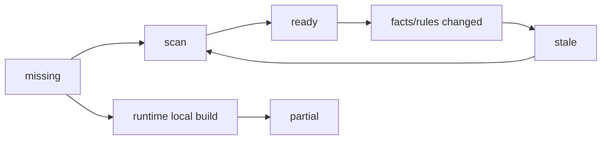

---

## 二、总体架构

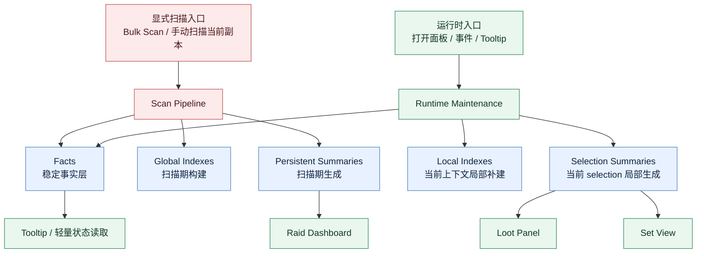

这个架构的关键点是：

- `Scan Pipeline` 可以重
- `Runtime Maintenance` 必须轻
- 两者写入同一套存储，但权限和粒度不同

---

## 三、数据分层

## 1. Facts

`Facts` 只存稳定事实，不存展示结果。

建议对象：

- `itemFacts[itemID]`
- `sourceFacts[sourceID]`
- `instanceFacts[journalInstanceID][difficultyID]`
- `characters[*].lockouts`
- `characters[*].bossKillCounts`

原则：

- facts 可以渐进补全
- facts 缺字段时允许当前上下文小范围补写
- 不允许因为 facts 不完整，就在运行时触发全局恢复

### Facts 字段所有权

`Facts` 里的字段需要再区分“运行时可补写”和“仅扫描可写”。

#### A. 运行时可补写字段

这些字段允许在当前 selection 上下文里被渐进补全：

- `name`
- `link`
- `icon`
- 当前 selection 下可确认的 `itemID/sourceID`

#### B. 仅扫描可写字段

这些字段默认视为全局语义，不能由运行时局部观察直接改写：

- 全局 `setIDs`
- 跨副本来源映射
- 跨难度来源归并
- 跨职业汇总事实

结论：

- runtime 可以补“当前看到了什么”
- scan 才能写“全局确认是什么”

## 2. Indexes

索引必须拆成两类。

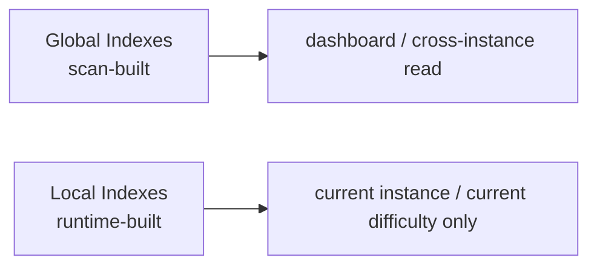

### A. 全局索引

特征：

- 只允许扫描路径构建或重建
- 用于跨副本、跨套装、跨难度查询
- 可持久化

示例：

- `sourceID -> setIDs`
- `setID -> sourceIDs`
- `appearanceID -> itemIDs`
- `journalInstanceID + difficultyID -> loot rows`

### B. 局部索引

特征：

- 只允许运行时按当前上下文补建
- 生命周期短
- 范围明确
- 不追求全局完备

示例：

- 当前副本当前难度的 `loot rows`
- 当前 selection 的 `setID -> current loot rows`
- 当前 selection 的 collectible/source 反查

### 索引写权限

索引层不只要分“全局 / 局部”，还要分“谁有权写”。

| 层 | Scan Pipeline | Runtime Pipeline |
| --- | --- | --- |
| Facts | 可写 | 只允许当前上下文小范围补写 |
| Global Indexes | 可写 | 不可写 |
| Persistent Summaries | 可写 | 不可做全量重写；仅允许定向小修补 |
| Local Indexes | 不需要 | 可写 |
| Selection Summaries | 不需要 | 可写 |

这张表是硬边界，不是建议。

## 3. Summaries

摘要也拆成两类。

### A. Persistent Summaries

- 由扫描路径生成基线
- dashboard 打开时只读它
- runtime 允许按 bucket 做小范围维护
- 没有就显示空态

示例：

- `raidDashboardCache`
- `dungeonDashboardCache`

这意味着 persistent summary 不是“scan-only immutable dump”，而是：

- scan 负责建立基线
- runtime 负责维护已缓存 bucket 的事实一致性
- 但 runtime 绝不能把它重新做成一轮全量生成

### B. Selection Summaries

- 由运行时按当前 selection 局部生成
- 只服务当前副本当前难度
- 不扩展到全局

示例：

- `CurrentInstanceLootSummary`
- `CurrentInstanceSetSummary`

### Summary key 必须编码完整作用域

selection summary 和 local index 的 key 不能只写 `instance + difficulty` 这种宽键。

至少要编码：

- `journalInstanceID`
- `difficultyID`
- `instanceType`
- `scope mode`
- `class/filter scope`

如果这些语义字段不进 key，后面很容易再次出现：

- 当前副本 / 选定副本串缓存
- 职业过滤切换后沿用旧摘要
- summary 命中，但语义其实错了

### Dashboard Summary Namespace

dashboard 的 bucket key 还需要再包一层 summary namespace。

原因：

- 同一个 `bucketKey` 可能在不同统计语义下复用
- 例如 `collectSameAppearance`、summary rules version、`instanceType` 都会改变 bucket 含义
- 如果没有 namespace，runtime patch 可能把事件写进错误的 dashboard family

建议显式引入 `summaryScopeKey`，至少编码：

- `instanceType`
- `summary rules version`
- `collectSameAppearance`

结论：

- `bucketKey` 只在某个 `summaryScopeKey` 内唯一
- manifest、membership index、reconcile queue 都必须按 `summaryScopeKey` 隔离

---

## 四、两条管线

## 1. 扫描管线

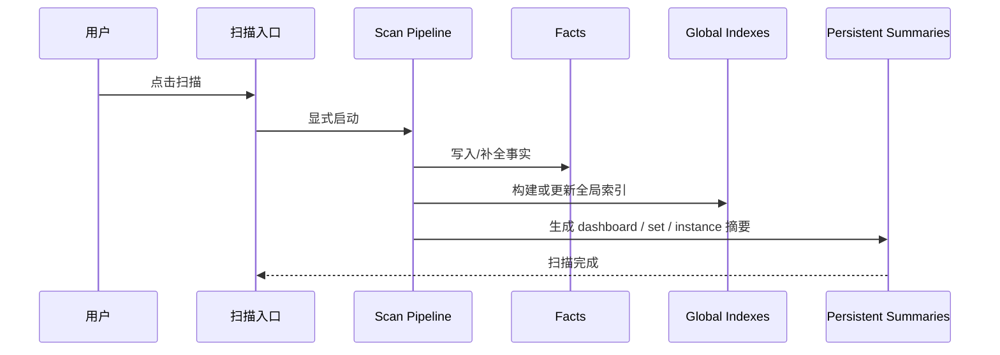

扫描路径负责：

- 全量或批量采集
- 全局索引构建
- 持久化摘要生成
- 大范围修复

扫描路径之外，任何地方都不能承担这些职责。

## 2. 运行时维护管线

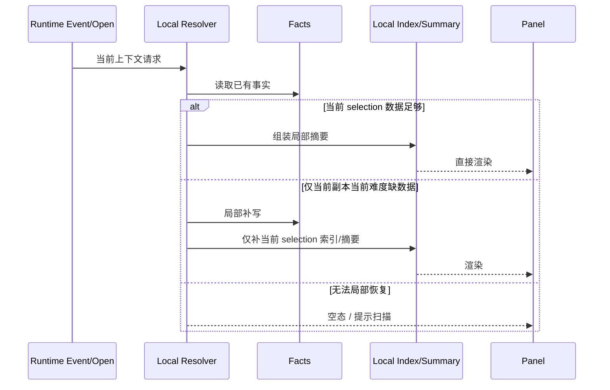

运行时路径只允许：

- 读取 facts
- 读取已存在的 persistent summary
- 生成当前 selection 的局部摘要
- 对当前 selection 做小范围补写

不允许：

- 全局索引重建
- 全表回扫
- 全量 snapshot 重算

### 运行时预算

“只允许小修小补”必须落成预算约束，否则后面仍会出现“局部补建但实际上很重”的路径。

运行时预算原则：

- 打开 dashboard
  - 不允许 `O(全库)` 工作
- 打开 loot panel
  - 只允许 `O(当前 selection)`
- 单次事件处理
  - 不允许遍历整张 snapshot / 整张 fact 表
- 超出预算时
  - 不做重建
  - 只标记 `stale` 或返回空态
  - 让用户走显式扫描

结论：

- “算不出来”优先退化成空态/过期态
- 不允许为了把页面补出来而偷偷升级成重操作

---

## 五、页面级规则

## 1. Raid Dashboard

Raid dashboard 必须是“打开路径只读、运行时事件可定向维护”的 bucket summary reader。

规则：

- 打开时只读 `raidDashboardCache`
- 如果没有数据，显示空态
- 空态明确写“请先扫描副本”
- 不允许在打开时：
  - 扫 Encounter Journal
  - 重建 `itemFacts` 全局索引
  - 现算整张矩阵

同时：

- runtime 事件必须能够修正已缓存 bucket 的 collected / total 事实
- 这种修正必须是定向 patch 或有界 reconcile
- 不允许因为 dashboard 要反映变化，就在事件里重建整张统计表

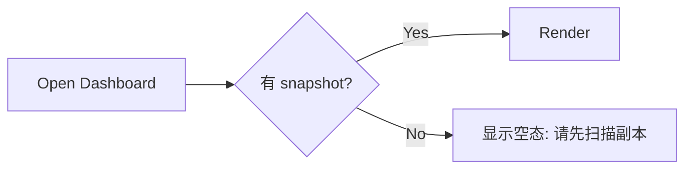

## 2. Loot Panel

Loot panel 是 selection-scoped resolver。

规则：

- 只服务当前 `journalInstanceID + difficultyID`
- 优先使用已有 selection summary
- 缺数据时只允许补当前 selection
- 当前 selection 允许生成自己的 `selection-local set membership`
- 该结构只服务当前副本 set 视图和 local resolver
- 不允许把这份局部 set 归属回写成全局 `itemFacts.setIDs`
- 不允许：
  - 修别的副本
  - 修别的难度
  - 顺手恢复全局索引

## 3. Set View

当前副本 set 页面必须依赖 loot panel 的 selection summary。

规则：

- 当前副本套装缺件：从当前 selection summary 派生
- 跨副本、跨历史的 set 统计：只读扫描产物
- 不允许 set 页面自己触发跨副本重算

---

## 六、事件更新策略

## 1. `TRANSMOG_COLLECTION_UPDATED`

新规则：

- 不允许刷新整张页面
- 不允许整表 summary 重算
- 只能先解析受影响实体，再做局部更新

建议的受影响键：

- `itemID`
- `sourceID`
- `appearanceID`
- `setID`

再映射到这些作用域：

- 哪些职业受影响
- 哪些当前 selection row 受影响
- 哪些副本/难度摘要受影响

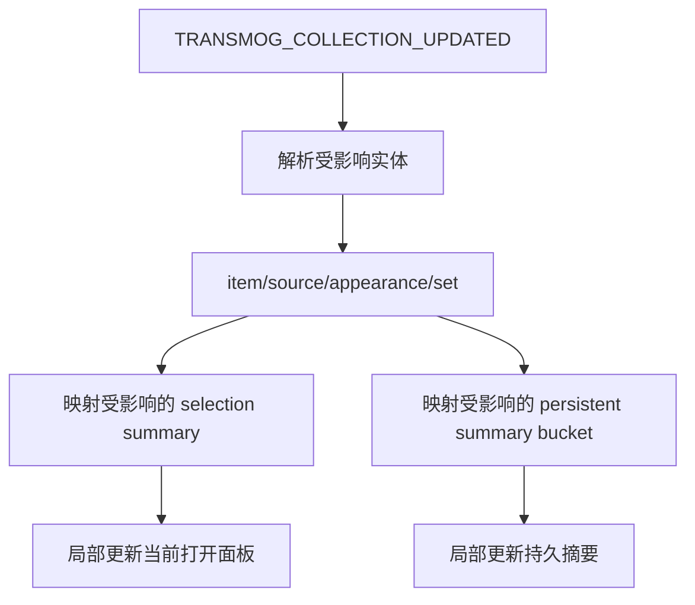

如果事件拿不到足够精确的对象：

- 只更新当前打开页面中可确认受影响的部分
- 不能退回全表刷新
- 其余修复留给显式扫描

### Dashboard 双模式更新

为了满足“统计事实必须反映变化”但又不做全表重算，dashboard 事件更新需要明确分成两种模式：

#### A. 精确 patch

适用条件：

- 已知具体受影响对象

步骤：

1. 定位受影响实体键
2. 通过 membership index 找到相关 dashboard bucket
3. 只修这些 bucket 的成员 collected 状态和派生计数

#### B. 有界 reconcile

适用条件：

- 事件只表示“收藏有变化”，但没有精确对象

步骤：

1. 只枚举已缓存 dashboard summary 内的成员
2. 仅对 `unknown/not_collected` 或标记为 `dirty` 的成员做状态核对
3. 回写受影响 bucket 的 collected / total

约束：

- reconcile 的范围只能是“dashboard 已缓存成员宇宙”
- 不能扩展成对 facts、EJ 或全局索引的全表扫描

### Dashboard Reconcile Queue

为了防止 bounded reconcile 退化成一次大的 runtime 遍历，还需要显式队列化。

规则：

- 队列单位必须是 `bucketKey`
- 队列本身必须按 `summaryScopeKey` 分桶
- 每 tick 只允许处理预算内成员数
- 未完成 bucket 必须保留 `nextMemberKey` continue token
- 调度策略优先：
  - 当前可见 bucket
  - 最近被标脏 bucket
  - 其余 bucket

这意味着：

- runtime 事件可以保证 dashboard 最终追平真实收藏事实
- 但不会为了“立刻追平”而在单帧扫完整个 cached dashboard universe

### 最小失效粒度

为了保证事件更新真的“定向”，需要明确系统允许的最小失效键。

建议最小键：

- `sourceID`
- `setID`
- `selectionKey`
- `dashboardBucketKey`

也就是：

- 先按实体键定位受影响对象
- 再映射到当前页面 summary
- 不允许直接把“一个页面”当成最小失效单位

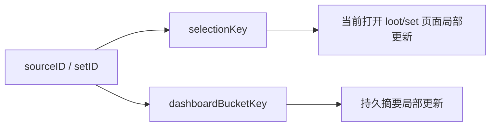

## 2. `GET_ITEM_INFO_RECEIVED`

规则：

- 只补当前等待的物品
- 不允许因为 item info 到了就重建整张来源/套装索引

## 3. `UPDATE_INSTANCE_INFO`

规则：

- 只更新 lockout facts
- 只更新与当前 selection 直接相关的轻量状态
- dashboard 主摘要仍然由扫描路径负责

---

## 七、索引策略

当前最需要纠偏的一点是：

**索引不能再用一个概念同时表达“完整全局索引”和“运行时会话热索引”。**

## 1. 全局索引

定义：

- 扫描产物
- 完整
- 稳定
- 可持久化

读者：

- dashboard
- 跨副本 set 查询
- 跨副本 collectible 统计

重建方式：

- 只允许显式扫描入口

## 2. 局部索引

定义：

- 当前 selection 或当前页面的运行时派生
- 不完整，但范围清晰

读者：

- loot panel
- set tab
- 当前页 tooltip

重建方式：

- 只允许当前上下文局部补建

结论：

- `StorageGateway` 不应该在读路径决定“怎么救全局索引”
- 读路径应该只读取现有全局索引，或转给 local resolver 做 selection-scoped 补建

### Dashboard Membership Index

为了支持 dashboard 的增量维护，需要额外引入一层 membership index。

用途：

- 把实体键映射到 dashboard bucket
- 支撑事件来的时候做定向 patch

建议索引：

- `itemID -> bucketKey -> memberKeys`
- `sourceID -> bucketKey -> memberKeys`
- `setID -> bucketKey -> memberKeys`
- `appearanceID -> bucketKey -> memberKeys`

其中：

- `dashboardBucketKey` 需要明确固定成叶子 bucket key，不直接指向 expansion 汇总行
- `membership index` 本身也必须带 `summaryScopeKey`
- runtime patch 命中后应该直接定位到 `memberKey`，而不是命中 bucket 后再扫整桶

### Dashboard Bucket Key

bucket key 约定：

- `instanceKey`
- `difficultyID`
- `scopeType`
- `scopeValue`

建议格式：

`<instanceType>::<journalInstanceID>::<difficultyID>::<scopeType>::<scopeValue>`

字段定义：

- `instanceType`
  - `raid` 或 `party`
- `journalInstanceID`
  - EJ instance ID
- `difficultyID`
  - 该 bucket 对应的具体难度
- `scopeType`
  - `TOTAL` 或 `CLASS`
- `scopeValue`
  - `ALL`，或具体 `classFile`

示例：

- `raid::457::16::TOTAL::ALL`
- `raid::457::16::CLASS::PRIEST`

这个 key 的语义是：

- 只对应 leaf summary bucket
- 不对应 expansion 汇总行
- 不区分 metric mode，因为同一 bucket 同时承载 set 和 collectible 两种成员
- 只在对应的 `summaryScopeKey` 内唯一

### Dashboard Bucket Canonical Shape

dashboard 持久化摘要中的叶子 bucket 建议统一成下面的 canonical shape：

```lua
bucket = {
  bucketKey = "raid::457::16::CLASS::PRIEST",
  state = "ready", -- missing/partial/ready/stale/dirty
  counts = {
    setCollected = 0,
    setTotal = 0,
    collectibleCollected = 0,
    collectibleTotal = 0,
  },
  members = {
    setPieces = {
      ["SETPIECE::SOURCE::67224"] = { ... },
    },
    collectibles = {
      ["SOURCE::67224"] = { ... },
    },
  },
}
```

约束：

- `counts` 是缓存投影，不是唯一真相
- `members` 才是 runtime patch / reconcile 的事实基础
- patch 完成员后，必须同步刷新 `counts`

### Dashboard Member Shape

#### A. SetPieceMember

```lua
setPieceMember = {
  memberKey = "SETPIECE::SOURCE::67224",
  family = "set_piece",
  collectionState = "collected", -- collected/not_collected/unknown
  itemID = 115585,
  sourceID = 67224,
  appearanceID = 23865,
  setIDs = { 1840 },
  slotKey = "INVTYPE_HAND",
  name = "暗影议会手套",
}
```

字段要求：

- `memberKey`
  - leaf member 稳定标识
- `collectionState`
  - 不能只存布尔 `collected`
  - 至少区分 `collected / not_collected / unknown`
- `itemID/sourceID/appearanceID`
  - 尽量齐全，便于事件映射
- `setIDs`
  - 该 member 属于哪些 set
- `slotKey`
  - 语义槽位，用于必要时做 set-piece 语义对账

#### B. CollectibleMember

```lua
collectibleMember = {
  memberKey = "SOURCE::67224",
  family = "collectible",
  collectibleType = "appearance", -- appearance/mount/pet/other
  collectionState = "collected",
  itemID = 115585,
  sourceID = 67224,
  appearanceID = 23865,
  name = "暗影议会手套",
}
```

字段要求：

- `collectibleType`
  - 明确 collectible family
- `collectionState`
  - 同样使用三态，不只布尔
- `itemID/sourceID/appearanceID`
  - 至少要保留能回查 membership index 的键

### Membership Index Shape

建议结构：

```lua
dashboardMembershipIndex = {
  summaryScopeKey = "raid::rv3::csa0",
  byItemID = {
    [115585] = {
      ["raid::457::16::CLASS::PRIEST"] = {
        ["SETPIECE::SOURCE::67224"] = true,
        ["SOURCE::67224"] = true,
      },
    },
  },
  bySourceID = {
    [67224] = {
      ["raid::457::16::CLASS::PRIEST"] = {
        ["SETPIECE::SOURCE::67224"] = true,
        ["SOURCE::67224"] = true,
      },
    },
  },
  byAppearanceID = {
    [23865] = {
      ["raid::457::16::CLASS::PRIEST"] = {
        ["SETPIECE::SOURCE::67224"] = true,
        ["SOURCE::67224"] = true,
      },
    },
  },
  bySetID = {
    [1840] = {
      ["raid::457::16::CLASS::PRIEST"] = {
        ["SETPIECE::SOURCE::67224"] = true,
      },
    },
  },
}
```

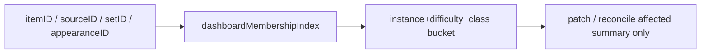

这层索引的构建建议：

- 基线由 scan pipeline 产出
- runtime 只维护受影响 bucket 的 membership，不做全量重建
- runtime patch / reconcile 应优先命中 `memberKey`，避免再次整桶扫描

### Scan Manifest

除了索引本身，还需要一层显式的“扫描覆盖清单”。

用途：

- 判断某个副本/难度是否真正扫描过
- 区分“未扫描”和“扫描后确实为空”
- 判断某份 summary 对应的是哪次扫描、哪套规则

建议字段：

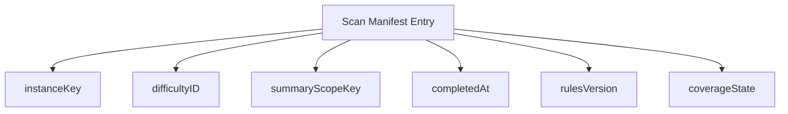

建议 `coverageState` 至少支持：

- `missing`
- `partial`
- `ready`
- `stale`

这样 dashboard 和 loot panel 才能对“空态”给出正确解释。
同时也能判断某个 dashboard family 是否与当前 `summaryScopeKey` 兼容。

---

## 八、模块边界建议

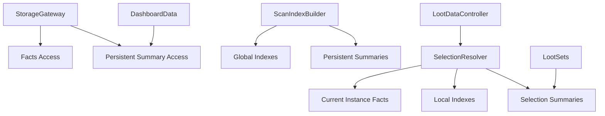

建议职责：

- `StorageGateway`
  - 只做 DB 访问
  - 不在读路径做智能全局恢复
- `ScanIndexBuilder`
  - 扫描期构建全局索引和 persistent summaries
- `SelectionResolver`
  - 只负责当前副本当前难度
  - 只做局部补建
- `DerivedSummaryStore`
  - 继续只负责 summary family 的版本和命中规则
  - 不承担跨层修复语义

---

## 九、建议执行顺序

## Phase 1. 先封边界

目标：

- 先阻止运行时越界

动作：

- dashboard 打开路径只读 snapshot
- dashboard 无数据时统一空态提示
- loot panel 打开路径禁止触发全局索引恢复
- 事件路径禁止全表失效
- 引入 `missing / partial / ready / stale` 状态模型
- 引入 scan manifest
- 纠正文档和代码语义：
  - dashboard 打开路径只读
  - dashboard runtime 事件可定向维护

## Phase 2. 拆全局索引与局部索引

目标：

- 把“完整索引”和“当前 selection 索引”从设计上分开

动作：

- 保留 `itemFacts`
- 新增 scan-only 全局索引容器
- 当前 selection 的 set/source/row 映射搬到 local resolver
- 新增 `selection-local set membership`
- 明确 facts 字段所有权
- 明确 runtime 不得改写 scan-owned 字段
- 新增 dashboard membership index
- 新增 dashboard `summaryScopeKey`

## Phase 3. 统一摘要族

目标：

- loot 和 dashboard 都有清晰、各自独立的摘要边界

摘要对象建议：

- `RaidDashboardSummary`
- `CurrentInstanceLootSummary`
- `CurrentInstanceSetSummary`

每个摘要都需要明确：

- producer
- consumer
- invalidator
- rulesVersion
- readiness state
- scope key

对于 dashboard summary 还需要额外明确：

- member shape
- bucket key
- membership index key
- patch strategy
- reconcile strategy

## Phase 4. Storage Schema Cutover

目标：

- 允许整体重写 storage，而不是背着旧结构继续演化

规则：

- 新 storage schema 可以与旧 schema 完全不兼容
- schema 不匹配时，在加载阶段直接清空旧 storage 并初始化新容器
- 不在打开 dashboard 或 loot panel 时做字段级迁移
- 不在运行时尝试恢复历史全局索引
- cutover 后需要数据时，统一提示用户重新扫描
- `stale` 只用于“当前 schema 下数据已过期”，不再承担“旧结构兼容失败”的语义

这条的核心是：

**允许用一次 schema cutover 换掉整个旧 storage，而不是在运行时长期背负迁移复杂度。**

---

## 十、方案结论

这版方案的直接结论是：

1. 统计面板必须是纯 snapshot reader
2. 统计面板打开是只读的，但 runtime 事件必须能定向维护 dashboard buckets
3. 掉落面板必须是 selection-scoped resolver
4. 运行时不再负责恢复完整全局索引
5. 扫描功能是唯一合法的重建入口
6. 事件系统只做定向修补或有界 reconcile，不做全局修复
7. 每类摘要必须显式携带 readiness state
8. facts / indexes / summaries 的写权限必须分清
9. dashboard summary family 必须显式带 `summaryScopeKey`
10. 当前副本 set 归属必须使用 `selection-local set membership`
11. dashboard 的有界 reconcile 必须通过 queue + continue token 执行
12. storage schema 允许整体 cutover，不做旧数据迁移
13. schema 不匹配时在加载阶段直接重置 storage，并要求重新扫描

一句话总结：

**把“扫描系统”和“运行时维护系统”彻底分开，前者负责建立基线，后者只负责局部维护和有界对账。**
