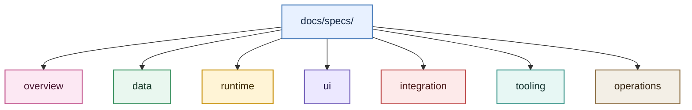

# MogTracker Specs

`docs/specs/` 是 MogTracker 的统一 spec 文档入口，承接设计、实现、维护和工具链相关说明。

## 分层说明

- [`overview/`](./overview/)：项目总览、设计索引、历史整理说明，以及适合先读的导航类文档。
- [`data/`](./data/)：存储分层、元数据、静态数据、数据契约和数据方案文档。
- [`runtime/`](./runtime/)：运行时接线、事件流、运行时边界和重构方案文档。
- [`ui/`](./ui/)：配置面板、掉落面板、统计看板、调试面板和 UI 外壳相关文档。
- [`integration/`](./integration/)：`Locale`、`Libs`、`types` 等外部契约和集成边界文档。
- [`tooling/`](./tooling/)：开发工具、测试、fixtures、vendored 依赖说明。
- [`operations/`](./operations/)：开发流程、调试流程和维护操作文档。

## 建议阅读顺序

1. 先看 [`overview/overview-project-design-index.md`](./overview/overview-project-design-index.md) 了解整体版图。
2. 需要理解产品表面和交互时，从 [`ui/README.md`](./ui/README.md) 开始。
3. 需要排查运行时或数据边界时，分别进入 `runtime/` 和 `data/`。
4. 需要开发、调试或检查工具链时，进入 `operations/` 和 `tooling/`。
