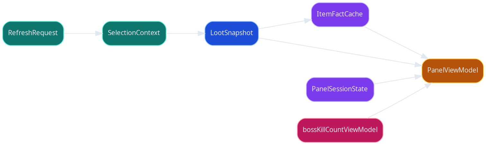
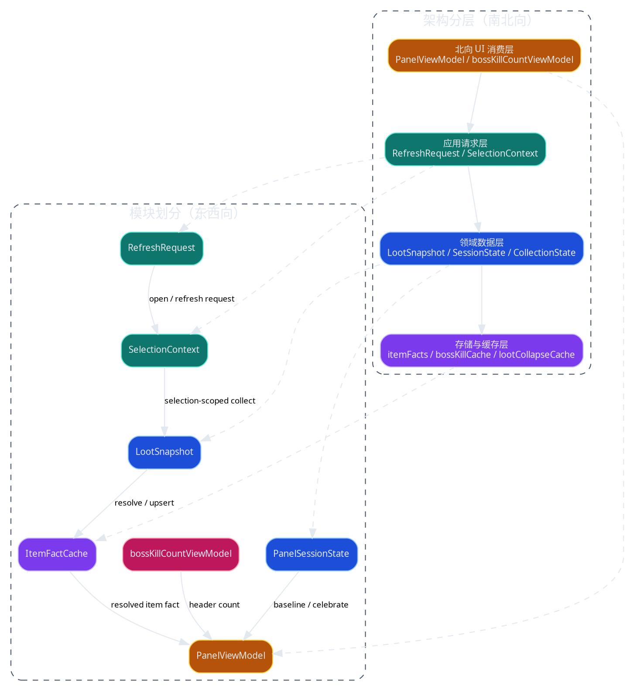

# 掉落面板数据模型与存储设计文档

> [!NOTE]
> 当前 spec 类型：技术向 spec

> 把 loot panel 当前分散在 selection、snapshot、item fact、session baseline 和 boss kill count 里的数据模型与存储边界收敛成独立 authority spec。

## 背景与现状

### 背景

> 掉落面板已经不只是“临时扫一遍 EJ 然后立刻渲染”的 UI，而是同时依赖运行时对象、selection-scoped snapshot、item fact cache 和持久化统计数据的复合数据面。

当前 `MogTracker` 里的掉落面板至少同时读写四类不同生命周期的数据：

- 打开期间有效的 `lootPanelSessionState`
- 当前 selection 范围内有效的 `LootSnapshot`
- 跨 selection 复用的 `itemFacts`
- 跨角色与跨统计周期聚合的 boss kill count / collapse cache

如果这些对象继续只散落在代码里，而没有单独 authority，`ui-loot-panel-spec.md` 会同时背 UI、请求语义、数据模型和存储边界，评审面过大。

### 现状

> 当前实现已经有可用的数据面雏形，但它们分散在 API、storage、runtime session 和 encounter 统计模块里，缺少统一命名和明确 owner。

```dot
digraph LootPanelDataCurrentState {
  rankdir=LR;
  graph [bgcolor="transparent", ranksep="0.8", nodesep="0.35"];
  node [shape=box, style="rounded,filled", fontname="Microsoft YaHei", fontsize=10, color="#94A3B8", fillcolor="#1E293B", fontcolor="#E5E7EB"];
  edge [color="#E2E8F0", fontname="Microsoft YaHei", fontsize=9];

  controller [label="LootPanelController\nBuildRefreshRequest()", fillcolor="#0F766E", color="#5EEAD4"];
  selection [label="LootSelection\nBuildSelectionContext()", fillcolor="#0F766E", color="#5EEAD4"];
  data [label="LootDataController\nCollectCurrentInstanceLootData()", fillcolor="#1D4ED8", color="#93C5FD"];
  api [label="core/API.lua\nResolveLootItemFact()", fillcolor="#1D4ED8", color="#93C5FD"];
  runtime [label="CoreRuntime\nlootPanelSessionState", fillcolor="#7C3AED", color="#C4B5FD"];
  storage [label="StorageGateway\nitemFacts / indexes", fillcolor="#7C3AED", color="#C4B5FD"];
  encounter [label="EncounterState\nbossKillCache / lootCollapseCache", fillcolor="#BE185D", color="#FDA4AF"];
  collection [label="CollectionState\nDisplayCollectionState", fillcolor="#BE185D", color="#FDA4AF"];

  controller -> selection [label="request / tab / selection"];
  selection -> data [label="selectedInstance / class scope"];
  data -> api [label="raw EJ loot"];
  api -> storage [label="getItemFact / upsertItemFact"];
  data -> runtime [label="selectionKey / partial state"];
  collection -> storage [label="appearance/source 补全"];
  encounter -> runtime [label="session compensation"];
}
```

当前已经确认的事实：

- `SelectionContext` 由 [LootSelection.lua](/mnt/c/users/terence/workspace/MogTracker/src/loot/LootSelection.lua:286) 负责组装。
- `RefreshRequest` 由 [LootPanelController.lua](/mnt/c/users/terence/workspace/MogTracker/src/loot/LootPanelController.lua:66) 负责规范化。
- `LootSnapshot` 的源头是 [LootDataController.lua](/mnt/c/users/terence/workspace/MogTracker/src/loot/LootDataController.lua:138) 的 `CollectCurrentInstanceLootData()` 返回值。
- item 本身已经有独立缓存层：`StorageGateway.GetItemFactCache()` / `GetItemFact()` / `GetItemFactBySourceID()`，见 [StorageGateway.lua](/mnt/c/users/terence/workspace/MogTracker/src/storage/StorageGateway.lua:129)。
- `lootPanelSessionState` 由 [CoreRuntime.lua](/mnt/c/users/terence/workspace/MogTracker/src/runtime/CoreRuntime.lua:109) 管理。
- boss kill count 的派生输出是 [EncounterState.lua](/mnt/c/users/terence/workspace/MogTracker/src/core/EncounterState.lua:612) 的 `BuildBossKillCountViewModel()`。

## 目标与非目标

### 目标

> 目标态是把 loot panel 的核心数据对象、缓存层和持久化边界独立冻结下来，让 UI spec 不再承担数据模型 authority。

本次目标：

- 把 `RefreshRequest`、`SelectionContext`、`LootSnapshot`、`PanelSessionState`、`PanelViewModel` 的职责冻结成独立数据模型 contract。
- 把 `itemFacts` 明确成 item 级缓存层，而不是混在 selection snapshot 里。
- 把掉落模块加载链路冻结成 `RefreshRequest -> SelectionContext -> LootSnapshot -> PanelViewModel` 的主路径。
- 把 item 补全冻结成“`itemFacts` 渐进补全，`LootSnapshot` 只暴露 partial signal”的语义。
- 把 boss kill count 的聚合范围、session compensation 和展示 contract 从 UI spec 里剥离出来。
- 让 `ui-loot-panel-spec.md` 只引用本 spec，而不再重复承载数据模型 authority。

### 非目标

> 本 spec 只冻结模型和存储边界，不重新讨论 UI、打开链路和渲染视觉。

- 不重写 `loot / sets` 页面交互说明
- 不重画 header / rows / badge 的视觉设计
- 不扩展新的持久化介质或外部数据库
- 不单独定义执行迁移 runbook

## 风险与红线

### 风险

- 如果把 selection-scoped snapshot 和 item 级 fact cache 混成一层，会继续导致 refresh 粒度不清。
- 如果 session baseline 和持久化统计边界不清，`newly_collected` 与 boss kill count 都会出现时态漂移。
- 如果把缓存索引规则写死在 UI 文档里，后续 storage 重构仍会缺 authority。

### 红线行为

> [!CAUTION]
> 不允许把 `itemFacts` 当成某次 selection 的临时快照附属物。

> [!CAUTION]
> 不允许 presenter 直接拥有 boss kill count 聚合逻辑。

> [!CAUTION]
> 不允许把 `unknown` / `missingItemData` 简化成“未收集”。

> [!CAUTION]
> 不允许破坏当前 WoW addon 运行时的同步调用模型。

> [!CAUTION]
> 不允许把 item fact cache 改成依赖外部服务的异步存储。

> [!CAUTION]
> 不允许让同一 item 的 `appearanceID/sourceID` 在多个缓存层长期双写。

## 边界与契约

### 稳定数据边界

- 本 spec 只冻结 loot panel 的核心数据对象、缓存层和持久化边界，包括 `RefreshRequest`、`SelectionContext`、`LootSnapshot`、`PanelSessionState`、`PanelViewModel` 输入边界、`itemFacts`、`bossKillCountViewModel` 以及 `lootCollapseCache` / `bossKillCache` / session compensation`
- 当前依旧使用 SavedVariables 作为持久化载体
- `CollectionState`、`EncounterState`、`StorageGateway` 继续作为独立模块存在
- UI 仍通过 `PanelViewModel` 消费这些对象，而不是直接跨层读 storage

### 核心对象

> 这几个对象是 loot panel 数据面的最小 authority 集合。

| 字段名 | 字段描述 |
| --- | --- |
| `RefreshRequest` | 打开、selection 切换、filter 切换、手动刷新、运行时事件的统一请求对象 |
| `SelectionContext` | 当前 selection、tab、scope、filter 与恢复态的统一上下文 |
| `LootSnapshot` | 一次 selection-scoped collect 的原始数据快照与 partial/error 信号 |
| `PanelSessionState` | 打开会话内的 baseline、itemCelebrated、encounterBaseline、delayedAutoCollapseUntil |
| `PanelViewModel` | UI 最终消费的统一视图模型 |
| `bossKillCountViewModel` | loot header 消费的击杀次数聚合结果 |

### 掉落模块加载链路

> 掉落模块的 authority 主链路是“请求归一化 -> selection 收敛 -> EJ collect -> item fact 渐进补全 -> 视图派生”，而不是 renderer 临时拉数据。

当前冻结的 owner 边界：

- `LootPanelController.BuildRefreshRequest()` 只决定刷新原因与是否 `invalidateData` / `resetSession` / `resetScroll`，不直接持有 item 补全状态。
- `LootSelection.BuildSelectionContext()` 负责把当前 `selectedInstance`、`currentTab`、`classScopeMode`、`selectedLootTypes` 与 hide flags 收敛成稳定上下文。
- `LootDataController.CollectCurrentInstanceLootData()` 负责 selection-scoped cache 命中、触发 API collect，并把结果返回成单次 `LootSnapshot`。
- `API.CollectCurrentInstanceLootData()` 负责扫描 EJ encounter / loot 行，并在 `ResolveLootItemFact()` 内把单个 item 的缓存命中与补全写回 `itemFacts`。
- `PanelViewModel` 只能消费 `LootSnapshot` + `itemFacts` + session / encounter 派生结果，不反向定义 collect 和补刷语义。

### item 级缓存层

> item 本身已经有独立缓存层，这一层不应再被说成“只是 snapshot 的一部分”。

当前事实来自 [StorageGateway.lua](/mnt/c/users/terence/workspace/MogTracker/src/storage/StorageGateway.lua:129)：

- `db.itemFacts` 是 item fact cache 的底座。
- `GetItemFact(itemID)` 以 `itemID` 为主键读取。
- `GetItemFactBySourceID(sourceID)` 通过增量维护的索引反查 item。
- `GetItemFactsByAppearanceID()` / `GetItemFactsBySetID()` 提供横向查询入口。

`itemFacts` 里的核心字段包括：

| 字段名 | 字段描述 |
| --- | --- |
| `itemID` | 物品主键 |
| `name` / `link` / `icon` | 基础展示信息 |
| `equipLoc` / `itemType` / `itemSubType` | 类型与槽位信息 |
| `itemClassID` / `itemSubClassID` | 分类信息 |
| `appearanceID` / `sourceID` | 幻化相关标识 |
| `basicResolved` / `appearanceResolved` | 基础信息和 appearance 信息是否已补全 |
| `lastCheckedAt` / `lastResolvedAt` | 最近检查与补全时间 |

这一层的冻结语义：

- `itemFacts` 是跨 selection 复用的渐进补全缓存，不是某次打开的临时副本。
- `UpsertItemFact(itemID, fact)` 可以接受“本次只补到一半”的增量事实；是否完整由 `basicResolved` / `appearanceResolved` 判定。
- `NormalizeItemFactEntry()` 会在 `name/link` 或 `appearanceID/sourceID` 缺失时回退对应 resolved flag，避免把半成品误记成完整事实。
- item cache 的主键仍然是 `itemID`，`sourceID` / `appearanceID` / `setID` 只通过索引反查，不拥有第二份长期真相。

### item 补全语义

> item 补全发生在 `itemFacts` 层，`LootSnapshot` 只负责报告“这次 collect 仍是 partial”，不逐项持有长期补全状态。

当前 `ResolveLootItemFact()` 的真实阶段如下：

| 阶段 | 触发条件 | 行为 | 落点 |
| --- | --- | --- | --- |
| 命中缓存 | `GetItemFact(itemID)` 命中 | 复用已有 `name/link/icon/type/appearance/source` | `itemFacts` |
| 基础信息补全 | `basicResolved=false` 或缺 `name/link` | 调 `GetItemInfo(itemID)`，必要时 `RequestLoadItemDataByID()` | `itemFacts` |
| 外观信息补全 | 需要 appearance 且 `appearanceResolved=false` | 调 `C_TransmogCollection.GetItemInfo()`，必要时再次请求 item data | `itemFacts` |
| collect 结果出快照 | 单次 selection collect 完成 | 把 item 行写入 `LootSnapshot.encounters[*].loot[*]`，并仅暴露全局 `missingItemData` | `LootSnapshot` |

冻结规则：

- `LootSnapshot` 不新增逐 item 的补全阶段枚举；这一层只保留本次 collect 的全局 completeness signal，例如 `missingItemData`、`zeroLootRetrySuggested`。
- 单个 item 当前是否已经补全，唯一 authority 是 `itemFacts` 上的 `basicResolved` / `appearanceResolved` 与相关字段是否存在。
- `missingItemData=true` 表示“至少一个 item 的事实仍在渐进补全”，不是“本次 selection 没有掉落”，也不是“该 item 未收集”。
- `lastCheckedAt` 允许每次 collect 更新；`lastResolvedAt` 只在本次 collect 至少补全了 `basic` 或 `appearance` 事实时推进。

### selection-scoped snapshot

> `LootSnapshot` 是按 selection 生成的一次性快照，不和 item fact cache 共用生命周期。

当前 `CollectCurrentInstanceLootData()` 已具备这些边界：

- 由 `BuildLootDataCacheKey(selectedInstance)` 命中 selection-scoped cache。
- snapshot 自带 `missingItemData` / `zeroLootRetrySuggested` 等 completeness signal。
- `missingItemData=true` 不等于“缓存失效”，只表示 item fact 仍在补全中。
- `state=partial` 由 `LootDataController.BuildCurrentInstanceLootSummary()` 基于 `missingItemData` 派生，而不是由 UI 私自重命名。
- snapshot 里的 item 行是“本次 collect 看见的展示切片”；长期事实仍以下游 `itemFacts` 为准。

### 补刷与重试边界

> 自动补刷是打开链路 / refresh 语义的一部分，目标态不再把它冻结成 renderer 私有调度细节。

当前事实：

- `LootPanelRenderer.EvaluateMissingItemRefresh()` / `EvaluateZeroLootRefresh()` 仍根据 `LootSnapshot` 的全局 signal 决定是否调度延迟补刷。
- 当前预算是每 `3` 秒一次，最多 `40` 次；选择粒度由 `selectionKey` 隔离。
- 定时器最终仍回到 `RefreshLootPanel()` 触发下一次 collect。

目标态冻结：

- `missingItemData` / `zeroLootRetrySuggested` 的 owner 保持在 `LootSnapshot`，因为它们描述的是“这次 collect 的完整度”。
- “是否继续重试、何时停止、是否已在 pending” 属于 `RefreshRequest` / 打开链路语义，不属于 renderer 的长期 authority。
- renderer 最终只消费已经决定好的 refresh 结果，不再私自拥有补刷预算模型。

### 会话态与展示态

> `PanelSessionState` 承接的是“本次打开期间的稳定态”，不是持久化长期事实。

当前 `lootPanelSessionState` 包含：

| 字段名 | 字段描述 |
| --- | --- |
| `active` | 当前会话是否有效 |
| `itemCollectionBaseline` | item 收集态的会话基线 |
| `itemCelebrated` | 已触发首次获取动画的 item 集合 |
| `encounterBaseline` | encounter 自动折叠稳定态 |
| `delayedAutoCollapseUntil` | 延迟自动折叠的临时时钟 |

### 击杀次数统计

> boss kill count 是独立 contract，不是 header 临时拼出来的数字。

当前派生入口是 [EncounterState.lua](/mnt/c/users/terence/workspace/MogTracker/src/core/EncounterState.lua:612) 的 `BuildBossKillCountViewModel()`，语义冻结如下：

- 默认聚合范围：`当前 SavedVariables 可见角色集合`
- 默认统计口径：`当前副本 + 当前难度 + 当前统计周期`
- 当前 run 已击杀但尚未落盘时，允许 session compensation 补 `1`
- UI 默认只显示数字，不外挂统计口径标签

## 架构总览

> 这份 spec 的总览要同时说清南北向数据流和东西向模型分区。

## 架构分层

### 北向 UI 消费层

> UI 不直接拥有存储模型，它只消费 `PanelViewModel` 和 `bossKillCountViewModel`。

- rows / headers / badge / collection icon 都只读派生后的展示态
- `√ / × / ❓` 是 display state 的结果，不是存储层枚举本体

### 应用请求层

> 打开、切换、刷新都先收敛成 `RefreshRequest` 和 `SelectionContext`。

- `RefreshRequest` 决定这次是否 invalidate data / reset session / reset scroll
- `SelectionContext` 决定 selection、tab、class scope、filter 和恢复态
- item 补全的后续重试预算，目标态也归在这一层的 refresh 语义，而不是继续埋在 renderer

### 领域数据层

> selection 一旦确定，领域层负责生成 `LootSnapshot`，再派生出 UI 需要的稳定模型。

- `LootSnapshot` 承接 collect 结果和 partial/error signal
- `ResolveLootItemFact()` 在 collect 期间把 item 的渐进补全写回 `itemFacts`
- `PanelSessionState` 承接会话稳定态
- `CollectionState` / `EncounterState` 提供跨 selection 的领域判断

### 存储与缓存层

> 存储层负责持久化事实和可复用缓存，但不直接生成 UI 语义。

- `itemFacts` 负责 item 元数据与 appearance/source 事实缓存
- `bossKillCache` 承接当前周期内的击杀缓存
- `lootCollapseCache` 承接 encounter 折叠稳定态的持久化

## 模块划分

### RefreshRequest / SelectionContext

> 这组对象负责“本次为什么刷新、刷新哪一份 selection”。

- owner：`LootPanelController` / `LootSelection`
- 生命周期：一次 request 到一次 snapshot 之间

### LootSnapshot / PanelSessionState

> 这组对象负责“当前 selection 扫到了什么、当前打开会话如何解释这些结果”。

- owner：`LootDataController` / `CoreRuntime`
- 生命周期：selection-scoped snapshot + panel-open session
- `LootSnapshot` 只暴露全局 partial signal，不承担逐 item 长期补全真相

### ItemFactCache

> 这是 item 本身的缓存层，不依赖当前 selection 的生命周期。

- owner：`StorageGateway`
- 入口：`GetItemFact` / `GetItemFactBySourceID` / `UpsertItemFact`
- 语义：单 item 的补全状态 authority，支持渐进写回

### 击杀与折叠统计

> 这组对象负责跨角色、跨周期或跨会话的稳定统计与折叠状态。

- owner：`EncounterState`
- 包含：`bossKillCache`、`lootCollapseCache`、`bossKillCountViewModel`

## 验收标准

- [ ] `ui-loot-panel-spec.md` 不再自己维护数据模型 authority，而是引用本 spec
- [ ] `itemFacts` 被明确成 item 级缓存层，而不是 selection snapshot 的附属字段
- [ ] reviewer 可以从本 spec 直接看清 `BuildRefreshRequest -> BuildSelectionContext -> CollectCurrentInstanceLootData -> ResolveLootItemFact -> UpsertItemFact` 的加载主链路
- [ ] `item` 补全被明确冻结成“`itemFacts` 渐进补全，`LootSnapshot` 只暴露 partial signal”
- [ ] 自动补刷的目标 owner 被明确上收进 `RefreshRequest` / 打开链路语义，而不是 renderer 私有逻辑
- [ ] `RefreshRequest`、`SelectionContext`、`LootSnapshot`、`PanelSessionState`、`PanelViewModel` 的职责边界被写清
- [ ] `bossKillCountViewModel` 的聚合范围、session compensation 和展示 contract 被单独冻结
- [ ] reviewer 可以仅靠本 spec 回答“这个字段属于 snapshot、session、item cache 还是持久化统计”

## 访谈记录

> Q：数据模型和存储，是否要从掉落面板主 spec 里拆成单独一份 authority？
>
> A：要，数据模型和存储单独开一个 spec。

收敛影响：`ui-loot-panel-spec.md` 不再自己承担数据模型 authority，而是只保留对这份新 spec 的引用入口。

> Q：boss 击杀次数统计，是普通展示细节，还是需要冻结成独立 contract？
>
> A：击杀次数统计也是契约。

收敛影响：新 spec 必须单独保留 `击杀次数统计` 这一块，而不是把它埋进 UI header 说明里。

> Q：主 spec 里“范围”的 `不包含` 应该继续放在范围里，还是移动到 `非目标`？
>
> A：范围里面的不包含，拆到非目标里面。

收敛影响：新 spec 继续沿用这条边界表达规则：`范围` 只写覆盖面，明确不做的项统一收口到 `非目标`。

> Q：`边界与契约` 下的下属结构，是否允许继续套多层？
>
> A：边界与契约，下面应该只有一层子标题。

收敛影响：新 spec 的 `边界与契约` 只使用 `###` 一层块，不在这一章继续下钻 `####`。

> Q：`边界与契约` 下的子标题，是否还要显式带 `contract` 后缀？
>
> A：子标题就不需要带 contract 了。

收敛影响：新 spec 里的数据模型块名直接使用业务语义，例如 `item 级缓存层`、`击杀与折叠统计`，不再机械追加 `contract`。

> Q：`item` 补全的 authority，更想冻结成哪种语义？
>
> A：`itemFacts` 是渐进补全缓存，`LootSnapshot` 只暴露这次 collect 是否 partial。

收敛影响：本 spec 不给 `LootSnapshot` 新增逐 item 补全阶段字段；单 item 的长期补全真相统一收敛到 `itemFacts.basicResolved` / `appearanceResolved`。

> Q：自动补刷的 owner，这次想把目标态写到哪一步？
>
> A：直接把目标态冻结成：补刷属于 `RefreshRequest` / 打开链路语义，不再属于 renderer 私有逻辑。

收敛影响：本 spec 需要同时保留 renderer 当前仍在补刷的现状证据，并明确目标态 owner 上收，不再把 retry budget 当成 presenter 私有 contract。

## 参考文档

- [掉落面板主 spec](../ui/ui-loot-panel-spec.md)
- [UI 页面索引](../ui/README.md)
- [StorageGateway](../../../src/storage/StorageGateway.lua)
- [LootDataController](../../../src/loot/LootDataController.lua)
- [core/API.lua](../../../src/core/API.lua)
- [CollectionState](../../../src/core/CollectionState.lua)
- [EncounterState](../../../src/core/EncounterState.lua)
- [CoreRuntime](../../../src/runtime/CoreRuntime.lua)
