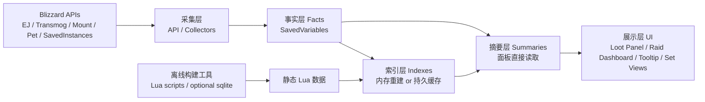
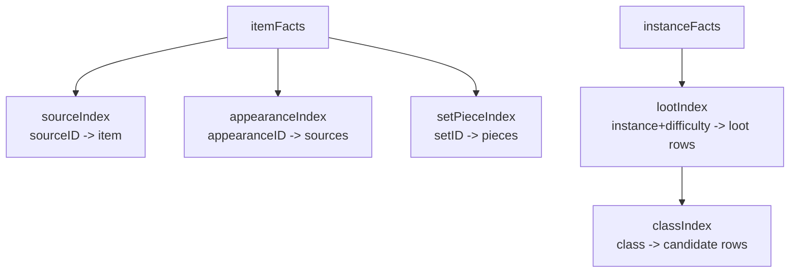
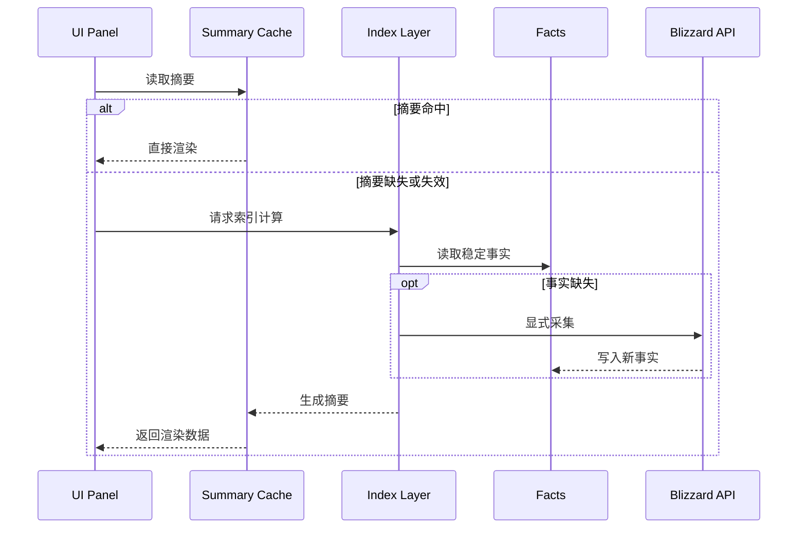
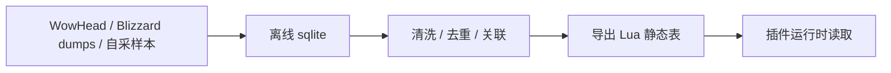
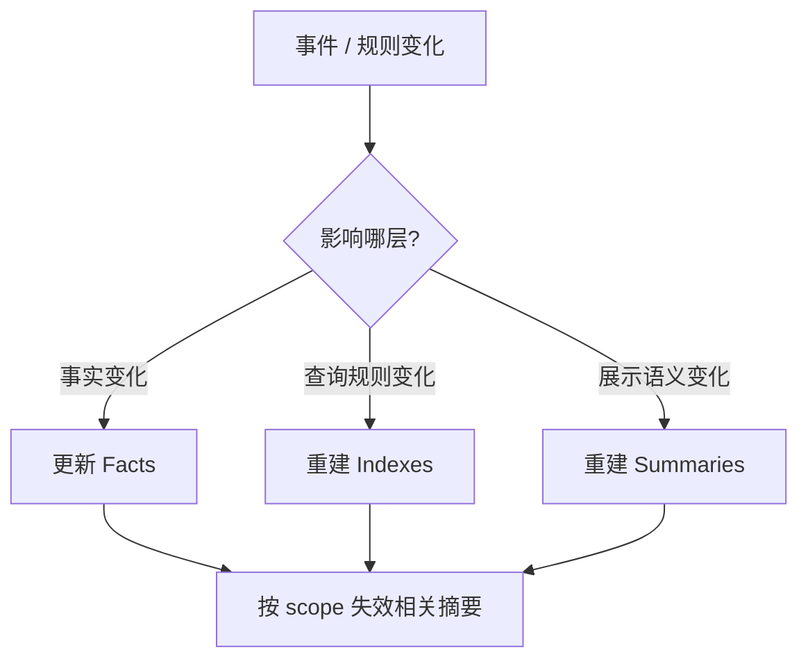

# MogTracker 幻化底层数据方案

## 结论

不建议把 `sqlite` 作为 MogTracker 在游戏内的运行时底层数据库。

建议方案是：

- 运行时持久化：继续使用 `SavedVariables`
- 运行时查询：使用 Lua table + 索引层 + 摘要层
- 离线构建：如有需要，可在 `tools/` 链路中使用 `sqlite`

原因不在于 `sqlite` 功能不够好，而在于 WoW 插件运行环境并不适合把它作为正式运行时依赖。对插件来说，正确方向不是“换数据库”，而是把现有 `SavedVariables` 数据层做成更像数据库的结构。

---

## 目标

这套方案要解决四类问题：

- 幻化数据体量越来越大，`itemID/sourceID/appearanceID/setID` 关系越来越复杂
- 面板打开时不能再做重扫描或重计算
- 全量扫描结果、单次 loot 刷新结果、UI 展示语义需要解耦
- 后续扩展套装、来源、职业、难度、掉落副本时不能继续把逻辑堆在 UI 层

---

## 总体架构



设计原则：

1. `Facts` 是稳定事实，不掺 UI 状态
2. `Indexes` 只服务查询，不代表最终真相
3. `Summaries` 只服务 UI，不在打开时现场重算
4. Bulk scan 负责写摘要，Dashboard 只读摘要
5. `sqlite` 只允许出现在离线构建链路，不进入插件运行时

---

## 分层设计

## 1. Facts 层

`Facts` 是唯一真相源，放进 `SavedVariables`。它只存稳定、可复用、可迁移的数据。

建议持久化这些对象：

- `characters[*].lockouts`
- `characters[*].bossKillCounts`
- `itemFacts[itemID]`
- `appearanceFacts[appearanceID/sourceID]`
- `instanceFacts[journalInstanceID][difficultyID]`
- `setFacts[setID]`
- `scanFacts[instanceKey+difficultyID]`

示意结构：

```lua
Facts = {
  itemFacts = {
    [113978] = {
      itemID = 113978,
      sourceID = 67241,
      appearanceID = 23639,
      typeKey = "LEATHER",
      equipLoc = "INVTYPE_HEAD",
      setIDs = { 1840 },
      lastVerifiedAt = 123456789,
    },
  },
  instanceFacts = {
    [457] = {
      name = "黑石铸造厂",
      difficultyFacts = {
        [16] = {
          difficultyName = "史诗",
          encounters = 10,
          lootSourceIDs = { 67241, 67243, 67245 },
          scannedAt = 123456789,
        },
      },
    },
  },
}
```

不应该放进 `Facts` 的内容：

- 行展开/折叠状态
- 当前筛选结果
- 当前页面排序结果
- 当前面板正在显示哪一档
- 任何纯展示语义

---

## 2. Indexes 层

`Indexes` 是运行时的查询加速层，作用类似数据库索引。它可以纯内存重建，也可以部分持久化。

建议至少建立这些索引：

- `sourceID -> itemFact`
- `appearanceID -> {sourceIDs}`
- `setID -> {itemIDs/sourceIDs}`
- `journalInstanceID + difficultyID -> loot rows`
- `classFile -> candidate loot rows`
- `instanceName/difficultyID -> summary key`

结构关系：



索引层的价值：

- Loot Panel 不必每次从原始 facts 全表扫描
- Set 页面可以直接反查“当前副本有哪些该套装 piece”
- Dashboard 不必现场计算“每个职业这一档掉多少件”

`Indexes` 的要求：

- 可重建
- 可丢弃
- 不直接暴露给 UI
- 带独立规则版本

---

## 3. Summaries 层

`Summaries` 是 UI 直接读取的摘要缓存。它们应该小、稳定、带版本号，不做现场重算。

当前项目里已经比较接近这个方向的对象包括：

- `raidDashboardCache.entries[raidKey].difficultyData[difficultyID]`
- `dungeonDashboardCache.entries[...]`
- `tooltipLockoutLookup[...]`

后续建议继续明确为页面级摘要：

- `RaidDashboardSummary`
- `DungeonDashboardSummary`
- `LootSelectionSummary`
- `SetCategorySummary`

这些摘要应只由以下路径更新：

- 单 selection 刷新
- bulk scan
- `TRANSMOG_COLLECTION_UPDATED`
- schema/rules version 变化

页面行为必须遵守：

- Dashboard 打开时只读摘要
- Loot Panel 打开时优先读现成 selection 摘要
- Tooltip 读取轻量快照，不触发 bulk scan
- Set 页面只读 set summary，不现场扫全副本

---

## 查询路径

推荐的统一查询链路：



这条链路的核心约束是：

- `UI` 不直接扫大表
- `UI` 不直接跑全量 EJ
- `Facts` 和 `Summaries` 职责分离
- “采集”与“渲染”是两个阶段

---

## 为什么不建议运行时 sqlite

## 1. 不适合插件运行时

WoW 插件环境里，真正稳定可依赖的持久化方式是 `SavedVariables`。插件不能像桌面程序一样自由加载原生 sqlite 库，也不能把它当成标准运行时依赖来设计。

运行时引入 sqlite 的问题：

- 环境不支持原生依赖加载
- 文件读写模型受限
- 发布和兼容成本高
- 调试难度高
- 最终很可能仍要把数据再落回 Lua/SavedVariables

因此，对 MogTracker 这类插件来说，瓶颈通常不在“Lua table 不够像数据库”，而在：

- 事实、索引、摘要没有分层
- 大量查询没有建立索引
- UI 仍然掺杂采集和重算

## 2. 适合离线构建

如果未来要做很重的资料清洗、掉落来源整合、套装反查、第三方站点数据合并，那么 sqlite 适合出现在离线链路里。



也就是：

- sqlite 负责离线 ETL
- 导出结果仍然是 Lua 静态表或生成文件
- 游戏内插件不直接依赖 sqlite

---

## 面向 MogTracker 的推荐实现

## Phase 1. 稳定现有存储结构

目标：不改持久化介质，先把职责拆清。

建议动作：

1. 保持 `SavedVariables` 为唯一持久化底座
2. 在命名上明确三层：
   - `Facts`
   - `Indexes`
   - `Summaries`
3. 所有摘要对象加独立 `schemaVersion/rulesVersion`
4. 禁止 Dashboard 打开时触发全量采集

## Phase 2. 补索引层

建议集中化这些索引模块：

- `TransmogIndex`
- `InstanceLootIndex`
- `SetPieceIndex`
- `CollectionStateIndex`

职责：

- 统一 `itemID/sourceID/appearanceID/setID` 映射
- 统一 `instance+difficulty -> loot rows`
- 统一“某职业/某套装/某来源”的反查入口

## Phase 3. 强化摘要层

让每个页面只读自己的 summary：

- `RaidDashboardSummary`
- `DungeonDashboardSummary`
- `LootSelectionSummary`
- `SetCategorySummary`

其中：

- bulk scan 负责写 raid/dungeon summaries
- loot panel 单次刷新负责写当前 selection summary
- collection 更新事件负责做增量刷新

## Phase 4. 可选离线构建

如果未来数据量和规则进一步复杂化，再增加：

- `tools/build_*`
- 可选 sqlite 中间构建库
- 导出 Lua 静态数据

---

## 建议的数据契约

## Facts

- 只存稳定事实
- 字段名保持长期稳定
- 可以做迁移

## Indexes

- 可以整层删除重建
- 不直接给 UI 用
- 带索引规则版本

## Summaries

- 体积小
- 语义稳定
- 页面直接消费
- 带 summary 版本
- 允许按页面或按 scope 精准失效

---

## 版本与失效策略

建议将版本拆开，不要一个总版本处理所有事情。

- `FACTS_SCHEMA_VERSION`
- `INDEX_RULES_VERSION`
- `SUMMARY_RULES_VERSION`

失效关系：



建议的具体原则：

- 事实变化：只失效依赖该事实的索引和摘要
- 索引规则变化：重建相关索引，摘要按需失效
- 展示规则变化：只 bump summary 版本

---

## 与当前项目现状的结合点

MogTracker 目前最值得继续强化的方向不是“换数据库”，而是：

- 把 `difficultyData`、loot summary、set summary 做成稳定页面摘要
- 把 `item/source/appearance/set/instance+difficulty` 索引集中化
- 把 bulk scan、单次刷新、UI 展示语义彻底解耦
- 用 schema/version 管理缓存失效

一句话总结：

**运行时别上 sqlite，应该把 `SavedVariables + Lua table` 做成有索引、有摘要、有版本的轻量数据库。**

---

## 后续可执行项

下一步建议继续产出两份文档：

1. 面向当前目录结构的模块拆分方案
2. 面向 `Facts / Indexes / Summaries` 的字段契约清单

建议落点目录：

- `src/core`
- `src/storage`
- `src/dashboard`
- `src/loot`
- `tools`

如果继续推进，实现优先级建议是：

1. 统一 facts/summary 命名
2. 提取索引模块
3. 固化 summary schema
4. 增加离线 validator
5. 最后再考虑离线 sqlite 构建链路
