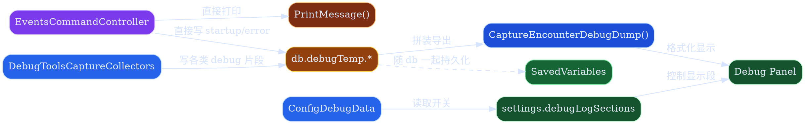
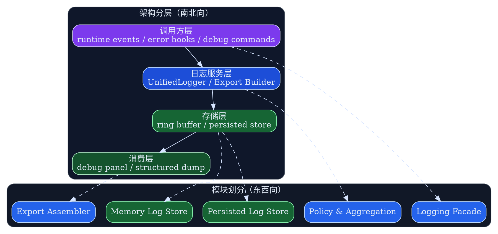
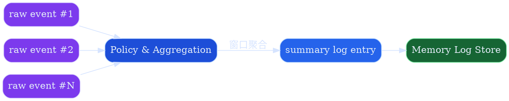

# 统一日志与调试导出组件设计

> 为 `runtime` 与调试导出链路引入统一的结构化日志组件，收敛运行时日志写入、内存聚合、按需持久化和 debug 导出边界。

## 背景与现状

### 背景

当前 `MogTracker` 已经有多条“像日志但并不统一”的观测链路：

- `EventsCommandController` 里直接 `PrintMessage(...)`
- runtime 启动链路把调试信息直接写入 `db.debugTemp.startupLifecycleDebug`
- 运行时错误直接写入 `db.debugTemp.runtimeErrorDebug`
- bulk scan、set dashboard、loot regression 等调试 collector 各自把片段写入 `db.debugTemp.*`
- `ConfigDebugData` 与 `DebugToolsCaptureCollectors` 再从 `db.debugTemp` 拼装 debug dump

这套机制能工作，但它不是一个明确的日志组件，而是“打印、临时状态、调试导出”混杂在一起的结果。  
当 runtime 事件变多、异步链路变复杂、debug panel 要承接更多排障场景时，现有形态已经不够稳定。

### 现状

> 当前日志、调试状态和导出逻辑分散在多个模块里，调用方直接碰 `db.debugTemp`，没有统一 contract。



### 问题

- 日志写入路径分散：调用方各自决定是 `PrintMessage`、写 `db.debugTemp`，还是交给 debug collector。
- 数据形态不统一：有的存字符串，有的存 `{ entries = {} }`，有的存一次性 dump 片段，无法稳定过滤或聚合。
- 存储边界不清晰：`debugTemp` 名义上是临时数据，但又挂在 `db` 下，和持久化边界混在一起。
- 导出路径不清晰：debug panel 想展示的是“结构化排障信息”，现在却依赖各模块自行往 `debugTemp` 塞内容。
- 高频事件容易退化成消息风暴：例如 runtime 事件打印或 item 补齐通知，如果没有统一节流/聚合策略，会放大 UI 刷新和排障噪声。

当前日志面板按 `UI.xml` + `ConfigDebugData.InitializeDebugPanel()` 的真实结构，大致是下面这个样子：

```svg
<svg width="760" height="620" viewBox="0 0 760 620" xmlns="http://www.w3.org/2000/svg">
  <rect x="20" y="20" width="720" height="580" fill="#F8FAFC" stroke="#94A3B8" stroke-width="2"/>
  <rect x="650" y="28" width="72" height="24" fill="#E2E8F0" stroke="#94A3B8"/>
  <text x="686" y="44" text-anchor="middle" font-size="12" fill="#0F172A">关闭</text>

  <text x="360" y="58" text-anchor="middle" font-size="24" font-weight="700" fill="#0F172A">调试日志</text>
  <text x="360" y="84" text-anchor="middle" font-size="13" fill="#475569">仅通过 /img debug ... 打开</text>

  <text x="44" y="126" font-size="15" font-weight="700" fill="#0F172A">日志分段</text>
  <rect x="40" y="138" width="640" height="116" fill="#FFFBEB" stroke="#F59E0B" stroke-dasharray="5 4"/>
  <text x="56" y="164" font-size="13" fill="#0F172A">[ ] Bulk Scan Queue Debug</text>
  <text x="266" y="164" font-size="13" fill="#0F172A">[ ] Current Loot Debug</text>
  <text x="486" y="164" font-size="13" fill="#0F172A">[ ] Runtime Error Debug</text>
  <text x="56" y="192" font-size="13" fill="#0F172A">[ ] Dashboard Snapshot Debug</text>
  <text x="266" y="192" font-size="13" fill="#0F172A">[ ] Loot API Raw Debug</text>
  <text x="486" y="192" font-size="13" fill="#0F172A">[ ] Startup Lifecycle Debug</text>
  <text x="56" y="220" font-size="13" fill="#0F172A">[ ] Loot Panel Selection Debug</text>
  <text x="266" y="220" font-size="13" fill="#0F172A">[ ] Minimap Tooltip Debug</text>
  <text x="486" y="220" font-size="13" fill="#0F172A">[ ] 其他调试段...</text>
  <text x="56" y="244" font-size="12" fill="#92400E">当前实现是 3 列复选框网格，数量由 GetDebugLogSectionLayout() 决定</text>

  <text x="44" y="284" font-size="15" font-weight="700" fill="#0F172A">Debug Output</text>
  <rect x="604" y="266" width="116" height="28" fill="#DBEAFE" stroke="#60A5FA"/>
  <text x="662" y="284" text-anchor="middle" font-size="12" fill="#0F172A">Collect Logs</text>

  <rect x="40" y="304" width="672" height="238" fill="#DCFCE7" stroke="#4ADE80" stroke-width="1.5"/>
  <rect x="54" y="320" width="630" height="204" fill="#FFFFFF" stroke="#94A3B8" stroke-dasharray="4 3"/>
  <text x="68" y="346" font-size="12" fill="#334155">Tip: click "Collect Logs" to auto-select the text ...</text>
  <text x="68" y="372" font-size="12" fill="#334155">== Startup Lifecycle Debug ==</text>
  <text x="68" y="392" font-size="12" fill="#334155">[08:00:01] initialize_defaults_done | event=ADDON_LOADED ...</text>
  <text x="68" y="418" font-size="12" fill="#334155">== Runtime Error Debug ==</text>
  <text x="68" y="438" font-size="12" fill="#334155">[1] at=08:01:12 | repeats=1</text>
  <text x="68" y="458" font-size="12" fill="#334155">message = ...</text>
  <text x="68" y="478" font-size="12" fill="#334155">stack = ...</text>
  <text x="68" y="506" font-size="12" fill="#64748B">当前主体是单个可滚动多行文本框，不是结构化列表视图</text>

  <rect x="714" y="304" width="10" height="238" fill="#E2E8F0" stroke="#94A3B8"/>
  <rect x="714" y="344" width="10" height="68" fill="#CBD5E1" stroke="#64748B"/>

  <text x="360" y="576" text-anchor="middle" font-size="12" fill="#64748B">/img debug · v当前版本</text>
</svg>
```

## 目标与非目标

### 目标

> 第一阶段只覆盖 `runtime + debug 导出`，先把结构化日志、双层存储和结构化导出闭环打通。


目标态要求：

- runtime 调用方统一写入结构化日志事件，而不是直接操作 `db.debugTemp`
- 默认走内存环形缓冲区，只有显式开启持久化时才写持久层
- debug 导出默认产物是结构化 table dump，而不是散乱文本拼接
- debug panel 读取的是统一导出 contract，而不是每个模块自定义的临时字段
- 目标面板必须支持一键复制日志包，方便直接导出给 agent 做后续分析
- 为后续把 `core`、`ui` 其他模块接入统一日志保留扩展边界

```svg
<svg width="820" height="650" viewBox="0 0 820 650" xmlns="http://www.w3.org/2000/svg">
  <rect x="20" y="20" width="780" height="610" fill="#F8FAFC" stroke="#94A3B8" stroke-width="2"/>

  <rect x="32" y="32" width="756" height="56" fill="#DBEAFE" stroke="#60A5FA"/>
  <text x="52" y="56" font-size="22" font-weight="700" fill="#0F172A">统一日志面板</text>
  <text x="52" y="76" font-size="13" fill="#334155">Unified Logger / Debug Export · 结构化日志与调试导出</text>
  <rect x="734" y="40" width="34" height="30" rx="3" fill="#E2E8F0" stroke="#94A3B8"/>
  <text x="751" y="60" text-anchor="middle" font-size="15" font-weight="700" fill="#0F172A">X</text>

  <rect x="32" y="98" width="756" height="44" fill="#E5E7EB" stroke="#94A3B8"/>
  <rect x="44" y="106" width="86" height="28" fill="#DBEAFE" stroke="#60A5FA"/>
  <text x="87" y="124" text-anchor="middle" font-size="12" fill="#0F172A">收集日志</text>
  <rect x="138" y="106" width="70" height="28" fill="#DBEAFE" stroke="#60A5FA"/>
  <text x="173" y="124" text-anchor="middle" font-size="12" fill="#0F172A">刷新</text>
  <rect x="216" y="106" width="124" height="28" fill="#DBEAFE" stroke="#60A5FA"/>
  <text x="278" y="124" text-anchor="middle" font-size="12" fill="#0F172A">导出结构化数据</text>
  <rect x="348" y="106" width="102" height="28" fill="#DBEAFE" stroke="#60A5FA"/>
  <text x="399" y="124" text-anchor="middle" font-size="12" fill="#0F172A">复制给 Agent</text>
  <rect x="458" y="106" width="114" height="28" fill="#FEF3C7" stroke="#F59E0B"/>
  <text x="515" y="124" text-anchor="middle" font-size="12" fill="#0F172A">持久化：关闭</text>
  <rect x="584" y="106" width="98" height="28" fill="#FFFFFF" stroke="#94A3B8"/>
  <text x="633" y="124" text-anchor="middle" font-size="12" fill="#64748B">搜索 scope</text>
  <rect x="690" y="106" width="86" height="28" fill="#FFFFFF" stroke="#94A3B8"/>
  <text x="733" y="124" text-anchor="middle" font-size="12" fill="#64748B">2s 聚合</text>

  <rect x="32" y="154" width="190" height="426" fill="#FFFBEB" stroke="#F59E0B" stroke-width="1.5"/>
  <text x="48" y="178" font-size="15" font-weight="700" fill="#0F172A">筛选与会话</text>
  <text x="48" y="206" font-size="13" font-weight="700" fill="#0F172A">日志级别</text>
  <text x="48" y="228" font-size="12" fill="#0F172A">[x] trace</text>
  <text x="116" y="228" font-size="12" fill="#0F172A">[x] debug</text>
  <text x="48" y="248" font-size="12" fill="#0F172A">[x] info</text>
  <text x="116" y="248" font-size="12" fill="#0F172A">[x] warn</text>
  <text x="48" y="268" font-size="12" fill="#0F172A">[x] error</text>
  <text x="48" y="302" font-size="13" font-weight="700" fill="#0F172A">Scope</text>
  <text x="48" y="324" font-size="12" fill="#0F172A">[x] runtime.events</text>
  <text x="48" y="344" font-size="12" fill="#0F172A">[x] runtime.error</text>
  <text x="48" y="364" font-size="12" fill="#0F172A">[x] metadata.instance</text>
  <text x="48" y="384" font-size="12" fill="#0F172A">[x] debug.export</text>
  <text x="48" y="418" font-size="13" font-weight="700" fill="#0F172A">会话信息</text>
  <rect x="44" y="430" width="166" height="94" fill="#FFFFFF" stroke="#94A3B8" stroke-dasharray="4 3"/>
  <text x="54" y="452" font-size="12" fill="#334155">sessionID = session-20260425-1</text>
  <text x="54" y="472" font-size="12" fill="#334155">persistenceEnabled = false</text>
  <text x="54" y="492" font-size="12" fill="#334155">totalLogs = 180</text>
  <text x="54" y="512" font-size="12" fill="#334155">truncated = false</text>
  <text x="48" y="554" font-size="12" fill="#92400E">左侧不再只是 section 开关，增加 level/scope/session 过滤</text>

  <rect x="234" y="154" width="554" height="426" fill="#DCFCE7" stroke="#4ADE80" stroke-width="1.5"/>
  <text x="250" y="178" font-size="15" font-weight="700" fill="#0F172A">日志主区</text>
  <rect x="246" y="190" width="530" height="42" fill="#E2E8F0" stroke="#94A3B8"/>
  <text x="258" y="208" font-size="11" fill="#334155">时间</text>
  <text x="314" y="208" font-size="11" fill="#334155">级别</text>
  <text x="370" y="208" font-size="11" fill="#334155">scope</text>
  <text x="438" y="208" font-size="11" fill="#334155">event</text>
  <text x="522" y="208" font-size="11" fill="#334155">摘要 / fields 预览</text>
  <text x="258" y="226" font-size="11" fill="#334155">右侧主区统一承载日志列表、结构化摘要和导出预览</text>

  <rect x="246" y="242" width="530" height="54" fill="#DBEAFE" stroke="#60A5FA"/>
  <text x="256" y="260" font-size="11" fill="#0F172A">08:00:02  info  runtime.events</text>
  <text x="256" y="278" font-size="11" fill="#0F172A">get_item_info_received_aggregated</text>
  <text x="512" y="260" font-size="11" fill="#334155">windowSeconds=2</text>
  <text x="512" y="278" font-size="11" fill="#334155">eventCount=41 distinctItemIDs=28</text>
  <text x="256" y="294" font-size="11" fill="#334155">聚合日志在列表中直接展示关键字段，不再依赖单独详情栏</text>

  <rect x="246" y="304" width="530" height="54" fill="#FFFFFF" stroke="#94A3B8"/>
  <text x="256" y="322" font-size="11" fill="#0F172A">08:00:03  warn  runtime.error</text>
  <text x="256" y="340" font-size="11" fill="#0F172A">persistence_disabled_due_to_error</text>
  <text x="512" y="322" font-size="11" fill="#334155">reason=save_failed</text>
  <text x="512" y="340" font-size="11" fill="#334155">sessionID=session-20260425-1</text>

  <rect x="246" y="366" width="530" height="54" fill="#FFFFFF" stroke="#94A3B8"/>
  <text x="256" y="384" font-size="11" fill="#0F172A">08:00:05  info  metadata.instance</text>
  <text x="256" y="402" font-size="11" fill="#0F172A">current_journal_instance_resolved</text>
  <text x="512" y="384" font-size="11" fill="#334155">journalInstanceID=1203</text>
  <text x="512" y="402" font-size="11" fill="#334155">resolution=normalized_name</text>

  <rect x="246" y="432" width="530" height="96" fill="#FFFFFF" stroke="#94A3B8" stroke-dasharray="4 3"/>
  <text x="258" y="454" font-size="12" font-weight="700" fill="#0F172A">结构化导出预览</text>
  <text x="258" y="476" font-size="11" fill="#334155">{ exportVersion = 1, logs = [...], summary = {...} }</text>
  <text x="258" y="498" font-size="11" fill="#334155">当前过滤结果的结构化数据可以在主区底部直接预览并复制给 agent</text>

  <rect x="778" y="190" width="10" height="338" fill="#E2E8F0" stroke="#94A3B8"/>
  <rect x="778" y="254" width="10" height="104" fill="#CBD5E1" stroke="#64748B"/>
  <text x="760" y="520" text-anchor="end" font-size="11" fill="#64748B">日志列表滚动条</text>

  <rect x="246" y="540" width="78" height="28" fill="#DBEAFE" stroke="#60A5FA"/>
  <text x="285" y="558" text-anchor="middle" font-size="12" fill="#0F172A">复制 JSON</text>
  <rect x="332" y="540" width="86" height="28" fill="#DBEAFE" stroke="#60A5FA"/>
  <text x="375" y="558" text-anchor="middle" font-size="12" fill="#0F172A">复制文本</text>
  <rect x="426" y="540" width="100" height="28" fill="#DBEAFE" stroke="#60A5FA"/>
  <text x="476" y="558" text-anchor="middle" font-size="12" fill="#0F172A">复制给 Agent</text>
  <rect x="534" y="540" width="94" height="28" fill="#DBEAFE" stroke="#60A5FA"/>
  <text x="581" y="558" text-anchor="middle" font-size="12" fill="#0F172A">导出当前结果</text>
  <text x="642" y="558" font-size="12" fill="#64748B">两列布局：左侧筛选，右侧主区统一承载列表、预览与 agent 导出</text>

  <rect x="32" y="590" width="756" height="24" fill="#EDE9FE" stroke="#8B5CF6"/>
  <text x="48" y="606" font-size="12" fill="#334155">最近刷新时间 08:00:05</text>
  <text x="274" y="606" font-size="12" fill="#334155">当前过滤结果 23</text>
  <text x="458" y="606" font-size="12" fill="#334155">导出版本 v1</text>
  <text x="612" y="606" font-size="12" fill="#334155">截断提示：无</text>
</svg>
```

### 非目标

- 这份 spec 不在第一阶段把 `core`、`ui`、`data` 全量模块全部迁入统一日志
- 不把所有现有 debug collector 立即重写成日志驱动模型
- 不在第一阶段引入远程上报、外部日志服务或文件落盘
- 不把 debug panel 改造成复杂查询控制台；第一阶段只保证可筛选、可导出、可阅读
- 不要求现有所有 `PrintMessage` 立刻消失；但新增 runtime/debug 路径应优先使用统一组件

### 范围

- 第一阶段实现边界固定为 `runtime + debug + InstanceMetadata + 统一日志面板 UI`
- 第一阶段允许包含必要的 `storage/runtime bootstrap` 基础设施，但不扩到其他业务面板或全量业务模块
- `runtime` 负责统一事件/错误写入，`debug` 负责结构化导出与面板消费，`InstanceMetadata` 作为首个 core 邻接模块接入稳定 `scope / event / level / fields` contract
- 新增统一日志组件的技术设计与对外 contract
- 定义 `runtime` 模块的接入边界
- 定义 debug 导出的结构化产物
- 定义内存日志与显式持久化日志的双层模式
- 定义与 `SavedVariables`、debug panel、slash/debug 入口的交互边界

## 风险与收益

### 风险

- 如果日志结构设计过重，会让 WoW 运行时热点路径产生不必要开销
- 如果持久化边界设计不清，会让 SavedVariables 体积快速膨胀
- 如果“日志”和“业务快照”混成一类，会让导出产物继续失控

### 收益

- 运行时事件、错误、启动链路、调试导出拥有统一 contract
- 高频日志与异步事件可以在同一组件内做聚合和节流
- debug panel 的数据来源更稳定，不再依赖分散的 `db.debugTemp.*`
- 后续把 `core`、`ui` 模块逐步接入时，不需要重新定义日志语义

## 假设与约束

### 假设

- WoW 运行时里最有价值的第一阶段日志仍然集中在 `runtime` 与 debug 排障链路
- 调试持久化只在显式开启时使用，默认玩家不会长期开启
- 现有 debug panel 仍是主要的人机查看入口，但底层导出 contract 应以结构化 table 为准

### 约束

- 必须兼容 Lua/WoW addon 运行时，不引入外部持久化依赖
- 默认路径必须轻量，不能把每次日志写入都变成高成本 table 深拷贝
- SavedVariables 持久化必须有容量上限和截断策略
- 统一日志组件必须区分“结构化日志事件”和“业务快照/调试 dump”
- 涉及外部组件交互的路径必须有图说明，尤其是 `WoW Runtime`、`SavedVariables`、`Debug Panel` 三者关系

## 架构总览

> 统一日志组件位于 runtime 调用方与 debug 导出链路之间，向上收敛写入契约，向下管理内存与持久化边界。



### 外部交互总览

> 统一日志组件需要同时管理运行时写入、SavedVariables 持久化以及 debug panel 导出三类外部交互。


## 架构分层

> 日志路径按“调用方 -> 日志服务 -> 存储 -> 导出消费”分层，而不是继续把打印、收集、导出混在一个控制器里。

### 调用方层

- 第一阶段调用方只包括 `runtime` 相关入口：
  - `EventsCommandController`
  - runtime error handler
  - `/img debug`、debug capture 入口
- 这一层只负责声明“发生了什么”，不负责决定落在哪个 `db.debugTemp` 字段
- 调用方写入的是结构化事件，而不是最终展示文本

### 日志服务层

- 统一提供结构化日志接口
- 负责：
  - 日志级别过滤
  - scope/event 归一
  - 高频事件聚合
  - 写入内存存储
  - 在显式开启时附加写入持久层
  - 构建 debug 导出快照
- 这一层还负责把“日志事件”和“业务快照”分开管理

### 存储层

- `Memory Log Store`
  - 默认主存储
  - 使用环形缓冲区
  - 存放当前会话最近 N 条结构化日志
- `Persisted Log Store`
  - 只在显式开启持久化时启用
  - 使用固定上限和截断策略
  - 存入 SavedVariables 下专用日志容器，而不是继续复用 `debugTemp`

### 导出消费层

- `Export Assembler`
  - 从 memory store 与 persisted store 读取日志
  - 组装结构化导出产物
  - 可按 section/scope/level 过滤
- `Debug Panel`
  - 消费导出产物
  - 可以把结构化 table 转为文本显示
  - 但组件 contract 仍以结构化 table 为准

## 模块划分

> 横向上把统一日志拆成五个高内聚模块，避免未来再次把写入、存储和导出揉成一个控制器。

### Logging Facade

- 对外主入口
- 建议职责：
  - `Log(level, scope, event, fields)`
  - `Child(scopeDefaults)`
  - `EnablePersistence(options)`
  - `DisablePersistence()`
- 统一补齐基础字段：
  - `timestamp`
  - `sessionID`
  - `scope`
  - `event`
  - `level`

### Policy & Aggregation

- 负责运行时日志策略：
  - level 过滤
  - scope 白名单/黑名单
  - 高频事件聚合
  - 去重窗口
- 第一阶段至少支持两类策略：
  - 普通结构化事件直接写入
  - 高频事件按时间窗口聚合后写入一条汇总日志

### Memory Log Store

- 使用环形缓冲区保存最近日志
- 负责：
  - 固定容量
  - 覆盖最旧记录
  - 暴露只读快照
- 这是默认主存储

### Persisted Log Store

- 负责把允许持久化的日志写入 SavedVariables 专用容器
- 必须显式开启
- 必须有：
  - 总容量上限
  - 单条字段大小控制
  - 截断标记
  - 会话边界信息

### Export Assembler

- 把结构化日志、会话信息、可选 debug 快照组装成统一导出产物
- 第一阶段输出：
  - 结构化日志数组
  - 会话元信息
  - 导出时的过滤条件
  - 持久化是否开启
- 不负责产生最终 UI 文本排版；文本排版属于 debug panel adapter

## 方案设计

### 接口与契约

> 统一日志对外提供的是结构化事件接口，而不是自由文本拼接接口。

#### 核心写入 contract

- 推荐事件形态：

```lua
{
  id = "log-000001",
  at = 1714032000,
  sessionID = "session-20260425-1",
  level = "info",
  scope = "runtime.events",
  event = "update_instance_info_processed",
  fields = {
    numSaved = 12,
    changed = true,
  },
}
```

- 字段要求：
  - `level`: `trace | debug | info | warn | error`
  - `scope`: 稳定命名空间，例如 `runtime.events`、`runtime.error`
  - `event`: 稳定事件名，不直接复用 UI 文案
  - `fields`: 只放结构化字段，不放大段格式化文本

#### 写入接口

- 第一阶段建议接口：
  - `addon.Log.Log(level, scope, event, fields)`
  - `addon.Log.Debug(scope, event, fields)`
  - `addon.Log.Info(scope, event, fields)`
  - `addon.Log.Warn(scope, event, fields)`
  - `addon.Log.Error(scope, event, fields)`
  - `addon.Log.Child(defaultScope, defaultFields)`

- 调用约束：
  - runtime 调用方不再直接写 `db.debugTemp.runtimeErrorDebug`
  - runtime 调用方不再直接拼接最终展示文案后再决定是否记录
  - 需要 UI 提示时，`PrintMessage` 属于独立用户提示路径，不能替代结构化日志

#### 高频事件聚合 contract

> 高频 runtime 事件不能逐条污染导出产物，必须先经过聚合策略。



- 聚合日志示例：

```lua
{
  level = "info",
  scope = "runtime.events",
  event = "get_item_info_received_aggregated",
  fields = {
    windowSeconds = 2,
    eventCount = 41,
    distinctItemIDs = 28,
  },
}
```

- `GET_ITEM_INFO_RECEIVED` 这类高频事件应使用与 runtime adapter spec 一致的时间窗口聚合策略
- 聚合结果写成一条 summary log，而不是生成 41 条近似等价的日志

#### 导出接口

- 第一阶段默认导出产物是结构化 table：

```lua
{
  exportVersion = 1,
  generatedAt = 1714032000,
  session = {
    sessionID = "session-20260425-1",
    persistenceEnabled = true,
  },
  filters = {
    levels = { "info", "warn", "error" },
    scopes = { "runtime.events", "runtime.error" },
  },
  logs = { ... },
  summary = {
    totalLogs = 180,
    truncated = false,
  },
}
```

- debug panel 可以把这个结构渲染成人可读文本
- 但组件 contract 不承诺“导出默认就是排版文本”

#### Agent 导出 contract

- debug panel 必须提供“一键复制给 agent”能力
- 复制给 agent 的内容不是当前 UI 文本截图，也不是自由排版日志，而是稳定的结构化导出文本块
- 这份文本块至少应包含：
  - `exportVersion`
  - `session` 元信息
  - 当前 `filters`
  - 当前导出的 `logs`
  - `summary.truncated`
- 目标是让外部 agent 可以直接基于复制内容做分析，而不是先反向解析 UI 文案

- 建议复制文本形态：

```text
[MogTracker Agent Log Export v1]
generatedAt: 1714032000
sessionID: session-20260425-1
persistenceEnabled: false
filters:
  levels: info,warn,error
  scopes: runtime.events,runtime.error
summary:
  totalLogs: 180
  truncated: false
logs:
  - at: 1714032002
    level: info
    scope: runtime.events
    event: get_item_info_received_aggregated
    fields: { windowSeconds = 2, eventCount = 41, distinctItemIDs = 28 }
```

- 如果当前过滤结果过大：
  - 可以按现有导出策略截断日志数组
  - 但必须保留 `truncated = true`
  - 并在头部声明这是“当前过滤结果的截断导出”
- `复制 JSON` 和 `复制给 agent` 应是两个不同动作：
  - `复制 JSON` 面向程序化复制原始结构
  - `复制给 agent` 面向 chat/agent 分析，允许保留稳定文本包装，但字段语义不能丢

### 数据模型或存储变更

> 第一阶段不重写全部 debug 数据，但要把结构化日志从 `debugTemp` 中独立出来。

- 新增建议存储形态：

```lua
db.runtimeLogs = {
  persistenceEnabled = false,
  sessions = {
    {
      sessionID = "session-20260425-1",
      startedAt = 1714032000,
      truncated = false,
      entries = { ... },
    },
  },
}
```

- 内存态建议不直接等同于 `db.runtimeLogs`
- 推荐运行时维护独立 `addon.RuntimeLogState`：
  - `buffer`
  - `writeIndex`
  - `size`
  - `sessionID`

- `db.debugTemp` 在第一阶段仍可保留给非日志型业务快照使用，例如：
  - `lootApiRawDebug`
  - `collectionStateDebug`
  - `setDashboardPreviewDebug`

- 但 `startupLifecycleDebug`、`runtimeErrorDebug` 这类本质是日志流的内容，应迁入统一日志组件

### 失败处理与可观测性

> 日志组件本身不能成为新的崩溃源；即使日志写入失败，也不能中断主业务路径。

- 写日志失败时：
  - 丢弃当前条目
  - 设置组件级 `lastError`
  - 不抛出到业务主流程
- 持久化写入失败时：
  - 自动降级到只写内存
  - 在内存日志中记录一条 `warn` 级 `persistence_disabled_due_to_error`
- 导出失败时：
  - 返回最小错误导出结构
  - 允许 debug panel 展示“导出失败”而不是空白面板

- 可观测性要求：
  - 组件自身也应记录：
    - buffer 覆盖次数
    - 持久化截断次数
    - 聚合窗口命中次数
    - 丢弃日志次数

## 访谈记录

> [!NOTE]
> Q：这份 spec 的目标范围选哪个？
>
> A：**统一日志 + 调试导出组件**。
>
> 收敛影响：这份文档不是纯 runtime logger，也不是全局 observability 平台，而是围绕 runtime 与 debug 导出闭环设计统一组件。

> [!NOTE]
> Q：日志主存储形态选哪个？
>
> A：**双层模式：内存为主，显式开启后再持久化**。
>
> 收敛影响：默认路径必须轻量，持久化只能是显式开关，不允许默认持续写 SavedVariables。

> [!NOTE]
> Q：对外日志接口以什么粒度为主？
>
> A：**结构化事件日志**。
>
> 收敛影响：统一日志 contract 必须围绕 `scope / event / level / fields` 设计，而不是自由文本。

> [!NOTE]
> Q：第一阶段哪些模块必须接入统一日志？
>
> A：**runtime + debug 导出**。
>
> 收敛影响：第一阶段不追求全量迁移，优先打通 runtime 与 debug export 闭环。

> [!NOTE]
> Q：调试导出默认产物选哪个？
>
> A：**结构化 table dump**。
>
> 收敛影响：debug panel 可以渲染文本，但底层导出 contract 以结构化 table 为准。

## 外部链接

- [运行时 API 适配重构 spec](../runtime/runtime-api-adapter-refactor-spec.md)
- [调试设计入口](./operations-debug-design.md)
- [DebugToolsCaptureCollectors 实现](/mnt/c/users/terence/workspace/MogTracker/src/debug/DebugToolsCaptureCollectors.lua)
