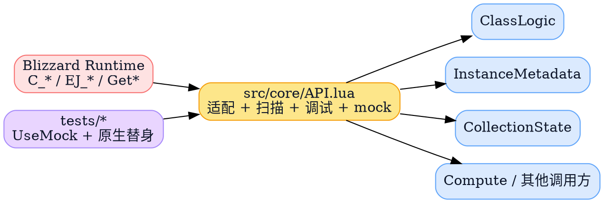
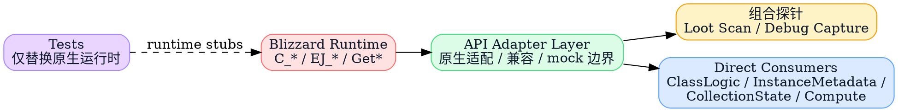
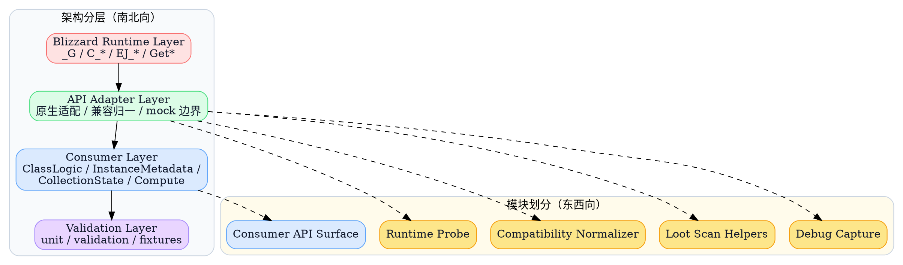
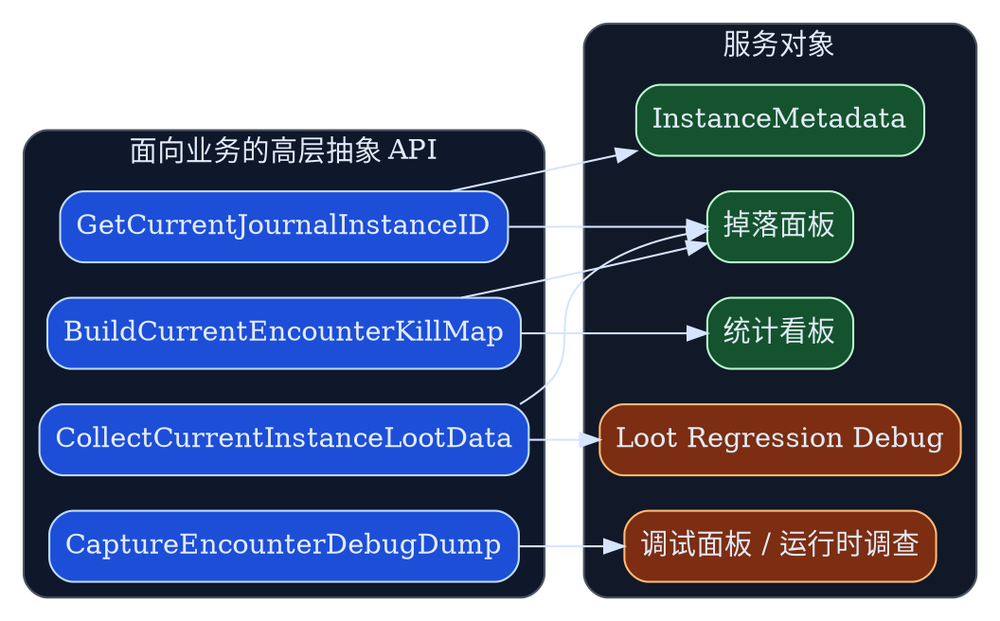

# API 层设计 spec

> 这份 spec 定义 `addon.API` 的目标态：它应作为 Blizzard 原生运行时的稳定适配层，对消费者暴露清晰 contract，并把 mock 与兼容策略收口在边界内。

## 背景与现状

### 背景

> `addon.API` 已经成为 `MogTracker` 里 WoW 原生运行时的事实入口，但它当前同时承担了兼容、组合扫描、调试抓取和测试替身入口，边界已经开始变糊。

`MogTracker` 当前把大量 Blizzard 原生运行时访问集中在 `src/core/API.lua`，这让上层模块避免了直接散落访问 `C_EncounterJournal`、`C_TransmogCollection`、`GetInstanceInfo`、`GetSavedInstanceInfo` 等全局入口。  
这条方向本身是对的，但随着掉落扫描、调试抓取、兼容 fallback 和 mock 入口不断累积，`API.lua` 逐渐从“适配层”变成了“运行时功能桶”。

当前又有一个新的设计约束被明确下来：

- API 层的第一优先级是 **测试与 mock 友好**
- 对外 contract 继续保持 **Lua 多返回值风格**
- mock 只允许替换 **Blizzard 原生函数与全局运行时**
- 兼容 fallback 可以作为适配层内部策略存在，但它不是这份设计 spec 的主线；清理与迁移节奏由单独 runbook 定义

这意味着现有 `addon.API` 需要先被定义成一个清晰的目标态边界，而不是继续在实现细节里自然生长。

### 现状

> 当前 `addon.API` 既包了原生调用，也包了组合型扫描和调试抓取；上层消费者虽然不直接碰多数 Blizzard API，但仍然依赖了过宽的 API 面。

当前代码里已经能看到三类不同性质的职责混在一起：

- 原生适配：
  - `GetClassInfo`
  - `GetJournalNumLootForEncounter`
  - `GetJournalLootInfoByIndexForEncounter`
  - `GetCurrentJournalInstanceID`
- 组合型运行时流程：
  - `BuildCurrentEncounterKillMap`
  - `CollectCurrentInstanceLootData`
- 调试抓取与离线支持：
  - `CaptureEncounterDebugDump`
  - `UseMock` / `ResetMock`

直接消费者也已经形成稳定入口：

- [`ClassLogic.lua`](/mnt/c/users/terence/workspace/MogTracker/src/core/ClassLogic.lua:40) 通过 `GetAPI()` 读取职业与 EJ 相关 helper
- [`InstanceMetadata.lua`](/mnt/c/users/terence/workspace/MogTracker/src/metadata/InstanceMetadata.lua:59) 通过 `GetAPI()` 获取当前副本 Journal 解析能力
- [`CollectionState.lua`](/mnt/c/users/terence/workspace/MogTracker/src/core/CollectionState.lua:54) 目前仍直接访问部分 `C_TransmogCollection`
- [`Compute.lua`](/mnt/c/users/terence/workspace/MogTracker/src/core/Compute.lua:22) 和其他调用方通过 `addon.API` 读取共享运行时能力

### 问题

> 当前最大的问题不是“有没有 API 层”，而是 API 层的职责没有被严格限制，导致 mock、兼容和组合逻辑的边界都不够清楚。

主要问题有四类：

- `API.lua` 过宽：
  - 既暴露原生适配，也暴露高层组合扫描，导致“什么该进 API 层”没有明确规则。
- mock 边界不够制度化：
  - 目前 `UseMock()` 本质上允许替换运行时入口，但 spec 没明确“只替换原生入口，不替换业务 helper”的纪律。
- 直接消费者不完全统一：
  - `ClassLogic` / `InstanceMetadata` 已经通过 `dependencies.API or addon.API` 调用。
  - `CollectionState` 仍直接接触 `C_TransmogCollection` 的多个形态兼容逻辑。
- 兼容策略没有清晰归属：
  - 某些 fallback 和字段别名兼容确实应该存在，但它们现在没有被明确归类为“适配层内部实现策略”，导致消费者和适配层之间的职责边界模糊。

## 目标与非目标

### 目标

> 目标不是讨论“怎么改代码”，而是把 `addon.API` 的目标态说清楚：它应该只对 Blizzard 原生运行时负责，对消费者提供稳定 contract，并把适配、兼容、mock 边界定义明确。

这份设计要明确这些目标态要求：

- `src/core/API.lua` 只承载 Blizzard 原生运行时适配、兼容归一和 mock 边界。
- 对外 contract 保持现有 Lua 多返回值风格，不强推 table-return。
- 直接消费者只依赖 `dependencies.API or addon.API`，不再各自实现同类兼容逻辑。
- 凡是依赖 Blizzard 异步事件补齐的数据，都由 API 层消费事件并通知订阅方；消费者不直接等待原生事件。
- mock 纪律被制度化：测试只替换 `_G` / `C_*` / `EJ_*` / `Get*` 这类原生入口。
- 兼容 fallback 被明确定义为 API 层内部实现策略，而不是让消费者分散承担的隐式职责。

### 非目标

> 这份 spec 只定义 API 层应该是什么，不负责实现步骤、迁移顺序或执行编排。

- 不重构 `Storage.lua`、`EncounterState.lua`、`UIChromeController.lua` 的职责边界。
- 不在这份 spec 里定义代码迁移顺序、发布步骤或拆文件计划；这些内容应进入单独 runbook。
- 不要求为了文档成立而先完成所有实现改造；实现是否分阶段推进由后续 runbook 决定。

### 范围

> 范围锁定在 API 层本体和直接消费者，不扩展到整个 runtime。

覆盖模块：

- `src/core/API.lua`
- `src/core/ClassLogic.lua`
- `src/metadata/InstanceMetadata.lua`
- `src/core/CollectionState.lua`
- 直接依赖 `addon.API` 的少量 `Compute` / bridge 调用点
- 对应的 `tests/unit/*` 与 `tests/validation/*`

## 风险与收益

### 风险

> 风险主要来自 WoW 原生 API 形态脆弱和 Lua 调用约定敏感，而不是文档结构本身。

- tuple contract 一旦被误改，现有调用点会静默读错位返回值。
- `CollectionState` 收口过程中，若仍残留直接调用 Blizzard API，边界会再次回退。
- 过度抽象会让简单原生调用变成“又一层包装噪音”，削弱可读性。

### 收益

> 收益的核心是把运行时不稳定性压缩在一层，并让测试真正验证适配层而不是绕过它。

- 原生运行时入口集中，兼容漂移有单点修复位置。
- mock-first 测试闭环更清楚，离线验证能稳定复用。
- 直接消费者更轻，职责从“兼容 + 业务”回到“业务判断”。
- 兼容 fallback 从散落私货变成适配层内部的显式策略，边界更清楚。

## 假设与约束

### 假设

> 这份设计默认 `MogTracker` 仍要在 Blizzard API 形态漂移明显的环境里运行，因此需要一个明确的适配层而不是让消费者直连原生入口。

- 当前主运行环境仍会遇到 `C_*` / `EJ_*` 新旧形态并存。
- 现有测试资产允许继续以 `_G` 和 `C_*` 替身的方式模拟运行时。
- 直接消费者接受继续使用 tuple contract，不要求统一成 table-return。

### 约束

> 这轮设计必须服从 WoW addon 的运行时现实：Lua、多返回值、全局 API、离线 mock 验证。

- 不引入需要额外运行时框架的依赖注入系统。
- 不把 `addon.API` 改造成面向对象实例。
- 不要求现有全部调用点同步迁移到新文件名或新命名空间。
- 所有关键接口必须保留当前位置参数和返回值顺序，除非后续另有单独设计确认。

## 架构总览

> 先把南北向运行时路径和东西向模块切片同时放在一张图里，明确“原生适配”与“业务消费”的真正边界。

这张图表达两件事：

- 南北向上，`addon.API` 是 Blizzard Runtime 与业务消费者之间唯一允许的直接收口层。
- 东西向上，`API.lua` 内部要区分“原生适配”“兼容归一”“组合探针”“调试抓取”，而不是继续作为一个无边界函数集合。

## 架构分层

> 这里不是在讨论实施步骤，而是在定义每一层在目标态中各自负责什么。

### Blizzard Runtime Layer

> 这一层只包含游戏客户端提供的真实运行时入口，不包含任何 MogTracker 自己的兼容判断。

包括但不限于：

- `_G.GetClassInfo`
- `_G.GetInstanceInfo`
- `_G.GetSavedInstanceInfo`
- `_G.EJ_*`
- `_G.C_EncounterJournal`
- `_G.C_TransmogCollection`
- `_G.C_CreatureInfo`

对这层的要求：

- 只允许被 `API Adapter Layer` 直接读取。
- 测试时只替换这一层，不直接替换业务 helper。

### API Adapter Layer

> 这一层是本次 spec 的主体，它负责把不稳定 Blizzard 运行时变成稳定的 addon 内部调用契约。

这层内部要明确分成两层能力：

- 原生 API 适配：
  - 直接包 Blizzard 原生入口
  - 负责兼容归一、fallback 和稳定 tuple contract
- 面向业务的高层抽象：
  - 在适配层之上组合多个原生入口与运行时状态
  - 直接为掉落扫描、Journal 解析、debug capture 这类业务语义服务
  - 可以继续存在，但实现代码必须和原生 API 适配层分开，不与基础原生包装混在同一个实现单元里

在这两层能力之上，再补充异步事件消费与 mock 边界。

具体职责包括：

- 原生探针：
  - 判断某个原生函数是否存在
  - 在新旧 API 之间择优调用
- 兼容归一：
  - 把旧形态多返回值、现代 table-return、字段别名差异统一成稳定 tuple 或稳定语义
- 事件消费与订阅通知：
  - 对需要异步就绪的数据发起查询、消费 Blizzard 事件、维护 pending / ready 状态
  - 在数据就绪后通知订阅方，而不是把事件处理散给消费者
- 组合探针：
  - 为掉落扫描、当前副本 journal 解析、debug dump 这些“仍强依赖原生运行时”的流程提供入口
- mock 边界：
  - `UseMock` / `ResetMock` 只用于原生入口替换，不穿透到业务层

### Consumer Layer

> 直接消费者只消费 `addon.API` 的稳定 contract，不再自己发明 Blizzard 兼容逻辑。

目标态下直接消费者分工：

- `ClassLogic`
  - 读职业信息、专精数量、部分 EJ helper
- `InstanceMetadata`
  - 读当前 Journal instance 解析与 lookup 结果
- `CollectionState`
  - 通过 `addon.API` 消费 transmog 兼容结果，而不是自己兼容 Blizzard 形态
- `Compute` / bridge
  - 只消费已经被 API 层规范化过的输入
- 事件驱动消费者
  - 只订阅 API 层发出的 ready / changed 通知，不直接监听 Blizzard 原生事件

### Validation Layer

> 测试不是补充品，而是这层架构的约束执行器。

测试层要分成两种：

- unit：
  - 验证单个适配 helper 的返回形状、兼容归一和 tuple contract
- validation：
  - 验证掉落扫描、journal 解析、debug capture 这类组合路径在 mocked runtime 下仍成立

## 模块划分

> 这里先定义 API 层内部该有哪些职责切片，不讨论它们是否立刻拆成独立文件。

### Runtime Probe

> Runtime Probe 只负责“调用哪个原生入口”，不负责业务判断。

代表能力：

- `GetRuntimeFunction(name)`
- `GetClassInfo()`
- `GetJournalInstanceForMap()`
- `GetJournalNumLootForEncounter()`
- `GetJournalLootInfoByIndexForEncounter()`

设计要求：

- 优先现代 API，必要时 fallback 到旧 API。
- 输出必须是稳定 tuple，不把原始 table 直接暴露给消费者。
- 对需要异步补齐的数据，只负责发起查询，不直接承担订阅方通知逻辑。

### Compatibility Normalizer

> Compatibility Normalizer 负责把 Blizzard 形态漂移压平，但不把这件事散落给消费者。

这部分当前一部分在 `API.lua`，一部分还散在 `CollectionState.lua`。  
目标态要求是：

- `sourceInfo` / `appearanceInfo` 这类 transmog 兼容读取进入 API 层
- EJ loot info 的 table-return / positional-return 差异进入 API 层
- “字段别名兼容”是 API 层职责，不再让消费者自己判 `isCollected` / `collected` / `usable`

### Business-Facing Helpers

> 高层抽象 API 可以保留，但它们必须作为独立的业务抽象层存在，而不是继续和原生 API 适配代码混写在一起。

包括：

- `GetCurrentJournalInstanceID`
- `BuildCurrentEncounterKillMap`
- `CollectCurrentInstanceLootData`
- `CaptureEncounterDebugDump`

设计要求：

- 它们可以继续依赖原生 API 适配层提供的 tuple helper
- 但实现代码必须独立于原生 API 适配层，不再与 `GetClassInfo`、`GetJournalLootInfoByIndexForEncounter` 这类基础包装混在同一个实现单元
- 不应该再新增直接触碰 `_G` / `C_*` 的私货逻辑
- 它们属于面向业务的高层抽象，而不是基础原生包装的一部分

### Debug Capture

> 调试抓取是 API 层的近邻能力，但不应继续和基础探针无限耦合。

包括：

- `CaptureEncounterDebugDump`

设计要求：

- 允许依赖适配层
- 不反向决定基础适配 contract
- 调试 enrich 失败不能影响主逻辑路径

## 方案设计

### 接口与契约

> 契约目标不是追求新潮接口风格，而是把不稳定运行时压成稳定 tuple contract。

接口规则：

- 原生适配 helper：
  - 保持 `Get*` 风格
  - 返回值顺序固定
  - 缺失 API 时返回 `nil` / `0` / 空值，而不是随机 table
- 事件驱动 helper：
  - 由 API 层注册和消费 Blizzard 事件
  - 对外暴露订阅接口，而不是要求消费者自己等 `GET_ITEM_INFO_RECEIVED` 这类事件
  - 数据未就绪时，返回 contract 必须明确是 `pending`、空值还是最近一次缓存结果
- 组合探针 helper：
  - 允许返回 table 结果，因为它们本来就是聚合产物
  - 但内部只能读适配层 contract，不能再直接兼容 Blizzard 形态
- mock 接口：
  - `UseMock(mockFunctions)` 只接受原生运行时函数映射
  - spec 不鼓励把 `addon.API` 方法本身当成 mock 入口

对外 surface 规则：

- 保持多返回值 contract，不向消费者暴露“可能是 table 也可能是 tuple”的不稳定形态
- 命名按用途分层：
  - 原生探针型：`Get*`
  - 事件订阅型：`Subscribe*` / `Watch*`
  - 组合探针型：`Build*` / `Collect*` / `Capture*`

事件模型规则：

- Blizzard 原生事件属于 API 层内部实现细节，不直接成为消费者 contract。
- 对依赖异步补齐的数据，API 层负责：
  - 发起查询
  - 消费事件
  - 维护 `pending / ready / failed` 语义
  - 向订阅方发出 ready / changed 通知
- `GET_ITEM_INFO_RECEIVED` 这类高频事件不得逐条向订阅方透传。
  - 对 item 数据补齐结果，API 层必须按 2 秒时间窗口聚合后再发出单次批量通知。
  - 订阅方接收到的是一次聚合后的 `changed` 回调，而不是每个 item 一次回调。
- 消费者只订阅 API 层定义的通知，不直接监听 `GET_ITEM_INFO_RECEIVED`、`ENCOUNTER_LOOT_RECEIVED` 等 Blizzard 事件。

### 当前 API 清单

> 这里按“原生 API 适配”和“面向业务的高层抽象”两层来列当前对外 API，避免把 wrapper 和业务抽象混成一张平表。

#### 原生 API 适配

| 对外 API | 主要职责 | 对应 Blizzard API / 运行时入口 |
| --- | --- | --- |
| `UseMock` | 注入 runtime mock | 无直接 Blizzard API；替换 `_G` / `C_*` / `EJ_*` / `Get*` 入口 |
| `ResetMock` | 清空 runtime mock | 无 |
| `IsUsingMock` | 查询是否启用 mock | 无 |
| `GetClassInfo` | 查询职业名与 class file | `_G.GetClassInfo` 或 `C_CreatureInfo.GetClassInfo` |
| `GetClassSortRank` | 计算职业排序权重 | 间接依赖 `GetClassInfo` |
| `CompareClassFiles` | 比较 class file 顺序 | 间接依赖 `GetClassSortRank` |
| `CompareClassIDs` | 比较 class ID 顺序 | 间接依赖 `GetClassInfo`、`GetClassSortRank` |
| `GetSpecInfoForClassID` | 查询职业专精信息 | `_G.GetSpecializationInfoForClassID` |
| `GetNumSpecializationsForClassID` | 查询职业专精数量 | `_G.GetNumSpecializationsForClassID` |
| `GetJournalInstanceForMap` | 用地图解析 Journal instance | `C_EncounterJournal.GetInstanceForGameMap` |
| `GetJournalNumLoot` | 查询当前 Journal loot 数量 | `C_EncounterJournal.GetNumLoot` |
| `GetJournalNumLootForEncounter` | 查询指定 encounter loot 数量 | `C_EncounterJournal.GetNumLoot` 或 `_G.EJ_GetNumLoot` |
| `GetJournalLootInfoByIndex` | 查询当前 Journal loot 条目 | `C_EncounterJournal.GetLootInfoByIndex` |
| `GetJournalLootInfoByIndexForEncounter` | 查询指定 encounter loot 条目 | `C_EncounterJournal.GetLootInfoByIndex` 或 `_G.EJ_GetLootInfoByIndex` |
| `GetJournalSlotFilter` | 读取 Journal slot filter | `C_EncounterJournal.GetSlotFilter` |
| `SetJournalSlotFilter` | 设置 Journal slot filter | `C_EncounterJournal.SetSlotFilter` |
| `ResetJournalSlotFilter` | 重置 Journal slot filter | `C_EncounterJournal.ResetSlotFilter` |

这一层的特征是：

- 大多数方法都还能明确映射回一个或一组 Blizzard 原生入口
- 主要职责是兼容和归一，而不是承载完整业务流程
- 输出应该优先保持稳定 tuple contract

#### 面向业务的高层抽象

| 对外 API | 服务对象 | 主要职责 | 依赖的下层 API / Blizzard 运行时入口 |
| --- | --- | --- | --- |
| `GetCurrentJournalInstanceID` | `InstanceMetadata`、掉落面板当前副本上下文、运行时 Journal lookup | 解析当前 Journal instance | `_G.GetInstanceInfo`、`C_Map.GetBestMapForUnit`、`C_EncounterJournal.GetInstanceForGameMap` |
| `BuildCurrentEncounterKillMap` | 掉落面板、统计看板、当前副本击杀进度逻辑 | 构建当前副本击杀映射 | `_G.GetInstanceLockTimeRemaining`、`_G.GetInstanceLockTimeRemainingEncounter`、`_G.GetNumSavedInstances`、`_G.GetSavedInstanceInfo`、`_G.GetNumSavedInstanceEncounters`、`_G.GetSavedInstanceEncounterInfo`、`_G.GetInstanceInfo` |
| `CollectCurrentInstanceLootData` | 掉落面板主流程、loot regression debug、当前副本掉落扫描 | 聚合当前副本掉落数据 | `_G.EJ_SelectInstance`、`_G.EJ_SetDifficulty`、`_G.EJ_GetEncounterInfoByIndex`、`_G.EJ_SetLootFilter`、`_G.EJ_SelectEncounter`、`_G.EJ_GetInstanceInfo`、`C_EncounterJournal.*`、`_G.EJ_GetNumLoot`、`_G.EJ_GetLootInfoByIndex`、`_G.GetItemInfo`、`C_Item.RequestLoadItemDataByID`、`C_Item.GetItemInfoInstant`、`C_TransmogCollection.GetItemInfo` |
| `CaptureEncounterDebugDump` | 调试面板、问题复现、运行时调查 | 抓取 encounter / instance 调试快照 | `_G.GetInstanceInfo`、`_G.EJ_GetEncounterInfoByIndex`、`_G.GetInstanceLockTimeRemaining`、`_G.GetInstanceLockTimeRemainingEncounter`、`_G.GetNumSavedInstances`、`_G.GetSavedInstanceInfo`、`_G.GetNumSavedInstanceEncounters`、`_G.GetSavedInstanceEncounterInfo`、`_G.GetDifficultyInfo`、`_G.EJ_IsValidInstanceDifficulty`、`C_EncounterJournal.IsValidInstanceDifficulty` |

这一层的特征是：

- 不再是一对一映射 Blizzard API
- 会组合多个原生入口、运行时状态和兼容逻辑
- 直接服务于明确的业务对象，而不是单纯暴露底层能力

### 当前异步事件清单

> 这里单独列当前已经注册和已经形成异步补齐语义的事件，避免把事件消费现状和 API surface 混在一段里。

```dot
digraph AsyncEventConsumers {
  rankdir=LR;
  graph [bgcolor="transparent"];
  node [shape=box, style="rounded,filled", fillcolor="#1E293B", color="#D6E4FF", fontcolor="#E2EBF7"];
  edge [color="#D6E4FF", fontcolor="#D6E4FF"];

  subgraph cluster_blizzard {
    label="Blizzard 异步事件";
    color="#4B5563";
    fontcolor="#E2EBF7";
    style="rounded,filled";
    fillcolor="#0F172A";

    playerLogin [label="PLAYER_LOGIN", fillcolor="#7C3AED", color="#DDD6FE"];
    updateInstanceInfo [label="UPDATE_INSTANCE_INFO", fillcolor="#7C3AED", color="#DDD6FE"];
    itemInfoReceived [label="GET_ITEM_INFO_RECEIVED", fillcolor="#7C3AED", color="#DDD6FE"];
    encounterLootReceived [label="ENCOUNTER_LOOT_RECEIVED", fillcolor="#7C3AED", color="#DDD6FE"];
    encounterEnd [label="ENCOUNTER_END", fillcolor="#7C3AED", color="#DDD6FE"];
  }

  subgraph cluster_api {
    label="API 层目标态";
    color="#4B5563";
    fontcolor="#E2EBF7";
    style="rounded,filled";
    fillcolor="#111827";

    requestBackfill [label="异步查询发起\nRequestRaidInfo() / RequestLoadItemDataByID()", fillcolor="#1D4ED8", color="#BFDBFE"];
    pendingState [label="pending / ready 状态维护", fillcolor="#1D4ED8", color="#BFDBFE"];
    readyNotify [label="ready / changed 通知", fillcolor="#1D4ED8", color="#BFDBFE"];
  }

  subgraph cluster_current {
    label="当前实现中的回流点";
    color="#4B5563";
    fontcolor="#E2EBF7";
    style="rounded,filled";
    fillcolor="#172554";

    runtimeController [label="EventsCommandController\ncontroller 刷新路径", fillcolor="#2563EB", color="#BFDBFE"];
    cacheInvalidate [label="失效 cache / 触发 refresh", fillcolor="#2563EB", color="#BFDBFE"];
  }

  subgraph cluster_consumers {
    label="业务调用方";
    color="#4B5563";
    fontcolor="#E2EBF7";
    style="rounded,filled";
    fillcolor="#0F3D2E";

    lootPanel [label="掉落面板", fillcolor="#14532D", color="#BBF7D0"];
    instanceMetadata [label="InstanceMetadata", fillcolor="#14532D", color="#BBF7D0"];
    dashboard [label="统计看板", fillcolor="#14532D", color="#BBF7D0"];
    lootDebug [label="Loot Regression Debug", fillcolor="#7C2D12", color="#FDBA74"];
    debugPanel [label="调试面板 / 运行时调查", fillcolor="#7C2D12", color="#FDBA74"];
  }

  playerLogin -> requestBackfill [label="触发回补"];
  requestBackfill -> updateInstanceInfo [label="等待结果"];
  updateInstanceInfo -> pendingState [label="saved instance 就绪"];

  itemInfoReceived -> pendingState [label="item 数据补齐"];
  encounterLootReceived -> pendingState [style=dashed, label="目标态应纳入"];
  encounterEnd -> pendingState [style=dashed, label="战斗结果通知"];

  pendingState -> readyNotify [label="归一后发通知"];
  readyNotify -> instanceMetadata;
  readyNotify -> lootPanel;
  readyNotify -> dashboard;
  readyNotify -> lootDebug;
  readyNotify -> debugPanel;

  updateInstanceInfo -> runtimeController [label="当前已消费"];
  itemInfoReceived -> runtimeController [label="当前已消费"];
  encounterLootReceived -> runtimeController [style=dashed, label="当前未形成 contract"];
  runtimeController -> cacheInvalidate [label="失效 cache"];
  cacheInvalidate -> lootPanel [label="刷新"];
  cacheInvalidate -> instanceMetadata [label="刷新相关状态"];
}
```

这张图表达两件事：

- 当前实现里，异步事件主要经由 controller 失效 cache 并驱动 UI 刷新。
- 目标态里，调用方不直接依赖 Blizzard 事件，而是依赖 API 层维护的 `pending / ready` 状态与统一通知 contract。

当前 runtime 已注册的相关事件：

- 生命周期 / 状态刷新
  - `ADDON_LOADED`
  - `PLAYER_LOGIN`
  - `UPDATE_INSTANCE_INFO`
- 掉落 / Item 数据相关
  - `GET_ITEM_INFO_RECEIVED`
  - `ENCOUNTER_LOOT_RECEIVED`
  - `ENCOUNTER_END`

当前真正已经形成异步补齐语义的事件链路：

```dot
digraph ItemInfoAggregationFlow {
  rankdir=LR;
  graph [bgcolor="transparent"];
  node [shape=box, style="rounded,filled", fillcolor="#1E293B", color="#D6E4FF", fontcolor="#E2EBF7"];
  edge [color="#D6E4FF", fontcolor="#D6E4FF"];

  subgraph cluster_blizzard {
    label="Blizzard 高频事件";
    color="#4B5563";
    fontcolor="#E2EBF7";
    style="rounded,filled";
    fillcolor="#0F172A";

    itemEvent1 [label="GET_ITEM_INFO_RECEIVED #1", fillcolor="#7C3AED", color="#DDD6FE"];
    itemEvent2 [label="GET_ITEM_INFO_RECEIVED #2", fillcolor="#7C3AED", color="#DDD6FE"];
    itemEventN [label="GET_ITEM_INFO_RECEIVED #N", fillcolor="#7C3AED", color="#DDD6FE"];
  }

  subgraph cluster_api {
    label="API 层聚合 contract";
    color="#4B5563";
    fontcolor="#E2EBF7";
    style="rounded,filled";
    fillcolor="#111827";

    pendingItems [label="记录受影响 itemIDs", fillcolor="#1D4ED8", color="#BFDBFE"];
    aggregationWindow [label="2s 聚合窗口", fillcolor="#1D4ED8", color="#BFDBFE"];
    singleNotify [label="单次 changed 回调\nbatch itemIDs / invalidation hint", fillcolor="#1D4ED8", color="#BFDBFE"];
  }

  subgraph cluster_consumers {
    label="订阅方";
    color="#4B5563";
    fontcolor="#E2EBF7";
    style="rounded,filled";
    fillcolor="#0F3D2E";

    lootPanel [label="掉落面板", fillcolor="#14532D", color="#BBF7D0"];
    dashboard [label="统计看板", fillcolor="#14532D", color="#BBF7D0"];
    debugConsumer [label="debug / regression consumer", fillcolor="#7C2D12", color="#FDBA74"];
  }

  itemEvent1 -> pendingItems;
  itemEvent2 -> pendingItems;
  itemEventN -> pendingItems;
  pendingItems -> aggregationWindow [label="窗口内累积"];
  aggregationWindow -> singleNotify [label="窗口结束"];
  singleNotify -> lootPanel;
  singleNotify -> dashboard;
  singleNotify -> debugConsumer;
}
```

这条链路的目标态是：

- `GET_ITEM_INFO_RECEIVED` 可以高频到达，但 API 层只在 2 秒窗口结束后通知一次订阅方。
- 通知内容是聚合后的批量结果，不是把每次 Blizzard 事件逐条上抛。

- `GET_ITEM_INFO_RECEIVED`
  - `CollectCurrentInstanceLootData` 在 item 数据未就绪时会请求补齐
  - 当前事件到达后由 controller 失效 cache 并刷新 loot panel
  - 目标态应改为 API 层按 2 秒窗口聚合 item 补齐结果，再向订阅方发出单次批量通知
- `UPDATE_INSTANCE_INFO`
  - `PLAYER_LOGIN` 后通过 `RequestRaidInfo()` 触发一次运行时状态回补
  - 事件到达后更新 saved instances、刷新缓存和面板

当前需要单独标记的“已注册但未形成完整异步消费 contract”的事件：

- `ENCOUNTER_LOOT_RECEIVED`
  - 当前已注册
  - 但在 controller 里还没有形成明确的消费分支和对外通知 contract
- `ENCOUNTER_END`
  - 当前有消费逻辑
  - 但它更接近“战斗结果通知”，不是 item 数据异步补齐事件

当前缺失但目标态应补齐的能力：

- API 层还没有真正落地的 `Subscribe*` / `Watch*` 订阅接口
- 现有异步事件消费仍主要停留在 controller 刷新 UI，而不是 API 层统一发出 ready / changed 通知
- `GET_ITEM_INFO_RECEIVED` 还没有聚合节流 contract；当前实现接近“事件到达就刷新”，目标态应收敛为 2 秒窗口批量回调

### 数据模型或存储变更

> 这份设计不引入新的持久化 schema，它主要定义运行时 contract 应该归谁负责。

不新增 SavedVariables 结构。  
主要变化是运行时 contract 归属变化：

- `CollectionState` 不再自己定义 transmog 兼容 contract，而是消费 API 层给出的结果
- 调用方继续消费原有 tuple / state 结果，不新增持久化 schema

### 失败处理与可观测性

> 兼容策略可以留在 API 层内部，但它必须可定位、可观察、可测试，不能继续隐式散落。

设计要求：

- 每个 fallback 路径都应能定位到：
  - 触发条件
  - 影响 helper
  - 返回 contract
- 对高风险运行时路径保留 debug capture 或 validation fixture
- 当缺失关键原生 API 时，组合探针返回结构化错误，而不是让消费者自己拼错误信息

### 实施边界

> 这份 spec 只定义目标态设计，不定义实施 runbook。

- 代码迁移顺序、拆文件步骤、发布窗口、回滚方案不在本文定义。
- 如果后续需要落实实现步骤，应单独编写 runbook。
- runbook 应以本文定义的目标态 contract 和边界作为落地依据，而不是反过来改写目标态。

## 访谈记录

> [!NOTE]
> Q：这份 spec 的主类型选哪个？
>
> A：面向 **API 层目标态设计**。

收敛影响：文档按 API 层目标态设计来写，不写当前实现说明，也不承担实施 runbook。

> [!NOTE]
> Q：这份 spec 的范围选哪个？
>
> A：**连同直接消费者一起收敛**。

收敛影响：范围覆盖 `API.lua` 以及 `ClassLogic`、`InstanceMetadata`、`CollectionState` 等直接消费者，不扩到整个 `src/core`。

> [!NOTE]
> Q：API 层设计第一优先是什么？
>
> A：以 **测试与 mock 友好** 为第一优先。

收敛影响：spec 把 mock contract、验证闭环和运行时替身边界作为第一设计原则。

> [!NOTE]
> Q：API 层最终对外 contract 风格选哪个？
>
> A：保留 **Lua 多返回值风格**，只在内部做规范化。

收敛影响：设计不推动 table-return 统一，对外保持 tuple contract，内部负责兼容归一。

> [!NOTE]
> Q：mock 的边界选哪个？
>
> A：mock 只替换 **Blizzard 原生函数与全局运行时**。

收敛影响：测试替身只允许作用于 `_G` / `C_*` / `EJ_*` / `Get*`，不把 `addon.API` 本身当业务 mock 点。

> [!NOTE]
> Q：设计 spec 和实施文档怎么分工？
>
> A：**目标态设计** 写在 spec；迁移步骤、发布窗口、回滚和执行顺序单独写 runbook。

收敛影响：本文只保留 API 层目标态与 contract 设计，不再承载实施顺序和迁移计划。

## 外部链接

- [src/core/API.lua](/mnt/c/users/terence/workspace/MogTracker/src/core/API.lua)
- [src/core/ClassLogic.lua](/mnt/c/users/terence/workspace/MogTracker/src/core/ClassLogic.lua)
- [src/core/CollectionState.lua](/mnt/c/users/terence/workspace/MogTracker/src/core/CollectionState.lua)
- [src/metadata/InstanceMetadata.lua](/mnt/c/users/terence/workspace/MogTracker/src/metadata/InstanceMetadata.lua)
- [runtime-core-design.md](/mnt/c/users/terence/workspace/MogTracker/docs/specs/runtime/runtime-core-design.md)
- [runtime-core-overview.md](/mnt/c/users/terence/workspace/MogTracker/docs/specs/runtime/runtime-core-overview.md)
