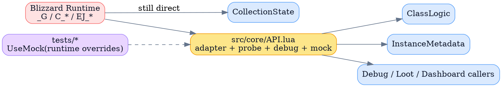
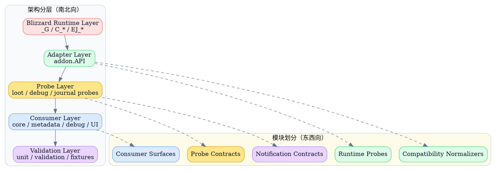

# Runtime API Adapter / Probe Refactor spec

> 这份 spec 把 `addon.API` 收回成 Blizzard runtime adapter，并把组合型 probe helpers 与异步通知 contract 拆成独立目标态，供后续执行重构直接落地。

## 背景与现状

### 背景

> `MogTracker` 已经形成了“运行时适配层”的事实入口，但它现在同时承担原生兼容、组合扫描、调试抓取和 mock 纪律，边界已经不足以支撑下一轮重构。

当前仓库已经有一个事实上的 runtime-facing 入口：[`src/core/API.lua`](../../../src/core/API.lua)。  
它帮上层模块避免了四处直接读 `_G.GetInstanceInfo`、`C_EncounterJournal`、`EJ_*`、`C_TransmogCollection`，这条方向本身是对的。

但随着以下能力持续堆叠，`API.lua` 已经不再只是“原生适配层”：

- 原生 helper：
  - `GetClassInfo`
  - `GetJournalLootInfoByIndexForEncounter`
  - `GetCurrentJournalInstanceID`
- 组合 probe：
  - `BuildCurrentEncounterKillMap`
  - `CollectCurrentInstanceLootData`
- 调试抓取：
  - `CaptureEncounterDebugDump`
- mock 边界：
  - `UseMock`
  - `ResetMock`

这次访谈进一步冻结了 5 个约束：

- 这份文档是给**未来执行重构的人**看的 technical spec
- spec 范围覆盖 `addon.API` + 组合型 probe helpers
- 组合 probe 最终**从 `addon.API` 拆出独立模块**
- probe 层 contract **允许一次性整理**
- 事件订阅 / 通知机制**纳入目标态**

这意味着这份 spec 不能只描述“代码看起来怎么整理”，而必须定义一个清晰的目标态：

- `addon.API` 只对 Blizzard runtime 负责
- 组合 probe 成为上层模块
- 异步补齐与通知 contract 成为 probe 层的一等能力
- mock 纪律只作用于原生入口，不渗透到业务层

### 现状

> 当前 southbound runtime 入口已经部分收敛，但 east-west 职责仍然混在 `API.lua` 与消费者里。



从当前代码能读到这些真实结构：

- [`API.lua`](../../../src/core/API.lua) 既定义基础 tuple helpers，也直接定义高层组合流程。
- [`ClassLogic.lua`](../../../src/core/ClassLogic.lua) 已经通过 `dependencies.API or addon.API` 读取职业 / EJ 相关 helper。
- [`InstanceMetadata.lua`](../../../src/metadata/InstanceMetadata.lua) 已经通过 `GetAPI()` 读取 Journal 解析能力，并把 lookup 过程写入 unified log。
- [`CollectionState.lua`](../../../src/core/CollectionState.lua) 仍然自己兼容 `C_TransmogCollection.GetSourceInfo`、`GetAppearanceInfoBySource`、`GetItemInfo` 等多种返回形态。
- probe 相关高层能力目前没有自己的独立模块边界，组合流程和 adapter 混在同一个实现单元里。

如果把当前 southbound 路径再拆开看，会更清楚：


### 问题

> 当前最大问题不是“有没有 API 层”，而是 adapter、probe、compat、notification 四个职责没有被强制分层。

主要问题分四类：

- `API.lua` 过宽：
  - 它同时承载原生适配和完整业务 probe，导致“什么该进 API 层”没有边界。
- 兼容逻辑仍然外溢：
  - `CollectionState` 仍然自己归一 `sourceInfo` / `appearanceInfo` 多种字段形态。
- 事件语义没有统一 contract：
  - 旧草稿已经意识到 item 信息补齐和高频事件需要聚合，但当前目标态没有被正式定义。
- mock 纪律虽然存在，但没有被制度化：
  - `UseMock` 当前是 runtime override，但 spec 没明确“只替换 Blizzard 运行时，不替换业务 helper”。

如果这轮重构没有先把目标态写清楚，后续实现会反复在两种错误之间摇摆：

- 把高层业务流程继续塞回 `API.lua`
- 或者把 Blizzard 兼容重新散回调用方

## 目标与非目标

### 目标

> 目标态是“纯 adapter + 独立 probe + 明确通知 contract”，而不是继续扩大 `addon.API` 的职责。

```dot
digraph TargetState {
  rankdir=LR;
  graph [bgcolor="transparent"];
  node [shape=box, style="rounded,filled", fillcolor="#F3F4F6", color="#94A3B8", fontcolor="#0F172A"];
  edge [color="#64748B"];

  blizzard [label="Blizzard Runtime\n_G / C_* / EJ_*", fillcolor="#FEE2E2", color="#F87171"];
  adapter [label="addon.API\npure runtime adapter", fillcolor="#DCFCE7", color="#4ADE80"];
  probe [label="Probe Module\nloot / debug / journal probing", fillcolor="#FDE68A", color="#F59E0B"];
  notify [label="Probe Notification Contract\npending / ready / changed / failed", fillcolor="#E9D5FF", color="#A78BFA"];
  consumers [label="Consumers\nClassLogic / InstanceMetadata /\nCollectionState / Debug callers", fillcolor="#DBEAFE", color="#60A5FA"];
  tests [label="tests/*\nmock only runtime layer", fillcolor="#E9D5FF", color="#A78BFA"];

  blizzard -> adapter;
  adapter -> probe;
  probe -> notify;
  adapter -> consumers;
  notify -> consumers;
  tests -> blizzard [style=dashed, label="runtime stubs"];
}
```



这份 spec 的目标态要求是：

- `addon.API` 只承载 Blizzard runtime adapter、兼容归一和 runtime mock 边界。
- `BuildCurrentEncounterKillMap`、`CollectCurrentInstanceLootData`、`CaptureEncounterDebugDump` 这类组合 probe 从 `addon.API` 拆出独立模块。
- probe 层 contract 允许一次性整理，不要求机械保持旧签名。
- adapter 层对外仍保持清晰稳定的 helper 语义，不把“可能是 table / 也可能是 tuple”的返回漂移暴露给消费者。
- 事件订阅 / 通知机制成为 probe 层正式 contract，用来承接异步补齐、批量变化通知和失败语义。
- `CollectionState` 这类消费者不再自己兼容 Blizzard 形态，而是消费 adapter 或 probe 已归一的结果。

目标态 UI 没有大改，但会影响用户可见的调试与异步刷新节奏，主要体现在“数据等待”和“批量 ready 通知”的位置与语义。

```svg
<svg width="760" height="300" viewBox="0 0 760 300" xmlns="http://www.w3.org/2000/svg">
  <rect x="20" y="20" width="720" height="260" fill="#101923" stroke="#9FC3FF" stroke-width="2"/>
  <rect x="36" y="36" width="688" height="42" fill="#1B2736" stroke="#9FC3FF" stroke-width="1.5"/>
  <text x="54" y="62" font-size="14" fill="#E2EBF7">Consumers: Loot Panel / Debug Panel / Metadata View</text>
  <rect x="36" y="92" width="688" height="36" fill="#152130" stroke="#64748B" stroke-width="1.2"/>
  <text x="54" y="115" font-size="12" fill="#CBD5E1">Northbound calls only read adapter / probe contracts</text>
  <rect x="36" y="142" width="688" height="40" fill="#2B1F11" stroke="#FCD34D" stroke-width="1.2"/>
  <text x="54" y="166" font-size="12" fill="#FDE68A">Probe state banner: pending / ready / changed / failed</text>
  <rect x="36" y="196" width="328" height="64" fill="#0E1620" stroke="#4ADE80" stroke-width="1.2"/>
  <text x="54" y="222" font-size="13" fill="#E2EBF7">addon.API</text>
  <text x="54" y="244" font-size="11" fill="#CBD5E1">pure runtime adapter / compatibility normalizer</text>
  <rect x="396" y="196" width="328" height="64" fill="#0E1620" stroke="#F59E0B" stroke-width="1.2"/>
  <text x="414" y="222" font-size="13" fill="#E2EBF7">Probe Module</text>
  <text x="414" y="244" font-size="11" fill="#CBD5E1">loot probe / debug capture / async notifications</text>
</svg>
```

### 非目标

> 这份 spec 定义目标态和 contract，不负责把整个 runtime 一次性重写。

- 不重构 `Storage.lua`、`EncounterState.lua`、`UIChromeController.lua` 的主职责。
- 不在这份 spec 中定义执行顺序、窗口、回滚和操作证据；这些属于单独 runbook。
- 不把所有 runtime-facing helper 都塞进新 probe 模块；只覆盖当前混入 `API.lua` 的组合 probe 主路径。
- 不把这轮设计扩成通用事件总线框架；通知 contract 只为 probe 层服务。

### 范围

> 范围锁定在 adapter、probe、直接消费者和必要验证资产。

覆盖模块：

- `src/core/API.lua`
- 新的 probe 模块落点（文件名后续实现决定，但职责在本 spec 中冻结）
- `src/core/ClassLogic.lua`
- `src/metadata/InstanceMetadata.lua`
- `src/core/CollectionState.lua`
- probe 的直接消费者，例如 loot/debug/runtime 相关调用点
- `tests/unit/*` 与 `tests/validation/*` 中直接验证 adapter/probe contract 的资产

## 风险与收益

### 风险

> 风险主要集中在 contract 整理和事件语义定义，不在“拆不拆文件”。

- probe 层允许一次性整理 contract，这会放大调用方迁移成本。
- 如果 adapter / probe 的职责边界写得不够硬，执行时很容易再次把新 helper 塞回 `API.lua`。
- 如果通知 contract 过宽，会退化成新的通用事件系统，反而增加耦合。
- 如果 `CollectionState` 兼容逻辑迁移不彻底，后续还会继续出现“API 层和消费者都在适配 Blizzard”的双重边界。

### 收益

> 收益是让 southbound runtime 风险被压缩在 adapter 层，让 northbound 业务探针有独立 contract 和测试面。

- `addon.API` 的职责会重新变得可解释，可维护。
- 组合 probe 的 contract 可以按业务语义重设计，不再被原生 helper 风格绑架。
- 异步补齐语义被正式制度化，消费者不需要继续直接围着 Blizzard 事件打补丁。
- mock 纪律更清晰：测试只替换 runtime，不替换业务逻辑。
- `CollectionState` 等消费者可以回到“业务判断”职责，而不是继续兼容原生 API 漂移。

## 假设与约束

### 假设

> 这份设计默认 WoW runtime 仍会持续存在 API 形态漂移和异步补齐延迟，因此 adapter 与 probe 分层不是一次性清理，而是长期边界。

- Blizzard 原生 API 仍会同时存在 modern table-return 与 legacy positional-return 的差异。
- item / transmog / journal 相关数据仍然存在异步就绪窗口。
- 当前仓库的 tests 允许继续使用 runtime stub / mock 的方式验证离线路径。

### 约束

> 这轮设计必须服从 Lua、多返回值、全局 runtime API 和现有仓库组织方式。

- 不引入额外 DI 框架或 runtime 容器。
- adapter 层不改造成 OO 实例；继续采用 `addon.API` facade。
- probe 层虽然允许重设计 contract，但 northbound 语义必须明确、稳定、可测试。
- implementation plan 的最后一步必须以提交代码并发起 PR 收口。

## 架构总览

> 先把 north-south 分层和 east-west 模块切片放到一张图里，执行者才能知道后续每一类 helper 应该往哪层迁。



## 架构分层

### Blizzard Runtime Layer

> 这一层只包含游戏客户端真实提供的函数与全局状态，不承载任何 addon 自己的兼容语义。

这一层包括：

- `_G.GetClassInfo`
- `_G.GetInstanceInfo`
- `_G.GetSavedInstanceInfo`
- `_G.GetSavedInstanceEncounterInfo`
- `_G.EJ_*`
- `_G.C_EncounterJournal`
- `_G.C_TransmogCollection`
- `_G.C_CreatureInfo`

目标态规则：

- 只有 adapter 层允许直接读这层。
- tests 只允许替换这一层，不允许直接替换 probe 或业务 consumer。

### Adapter Layer

> adapter 层只负责“如何安全读取 Blizzard runtime”，不负责“如何完成一次业务探针”。

这层职责固定为：

- runtime function lookup：
  - 例如 `GetRuntimeFunction(name)`
- modern / legacy API 选择：
  - 例如 `C_EncounterJournal.*` vs `EJ_*`
- 返回形态归一：
  - table-return / positional-return
- 字段兼容：
  - `isCollected` / `collected`
  - `appearanceIsCollected` / `isCollected`
- runtime mock 边界：
  - `UseMock`
  - `ResetMock`
  - `IsUsingMock`

这层明确不做：

- 当前副本掉落扫描
- encounter kill map 聚合
- debug dump 抓取
- northbound ready / changed 通知

### Probe Layer

> probe 层负责组合多个 adapter helper 与 runtime state，产出面向业务的聚合结果和通知语义。

这层承接的现有能力包括：

- `GetCurrentJournalInstanceID`
- `BuildCurrentEncounterKillMap`
- `CollectCurrentInstanceLootData`
- `CaptureEncounterDebugDump`

目标态规则：

- probe 层只读 adapter contract，不再自己直连 `_G` / `C_*` / `EJ_*`。
- probe 层 contract 允许一次性整理。
- probe 层对外同时暴露：
  - 同步调用 contract
  - 异步通知 contract

### Consumer Layer

> consumer 层只消费 adapter/probe 的稳定 contract，不再自行兼容 Blizzard runtime。

关键消费者边界：

- `ClassLogic`
  - 继续消费 adapter helper
- `InstanceMetadata`
  - 既消费 adapter，也可以消费 probe 输出的 journal lookup / ready 语义
- `CollectionState`
  - 不再自行兼容 `C_TransmogCollection` 形态，改为消费 adapter 提供的 normalized transmog helpers
- debug / loot / dashboard callers
  - 消费 probe 产物与通知 contract，而不是自己组合 runtime probing

## 模块划分

### Runtime Adapter Surface

> 这一组方法仍保留在 `addon.API`，但它们只负责 runtime adapter 语义。

典型 API：

| 对外 API | 目标职责 | 目标来源 |
| --- | --- | --- |
| `UseMock` | 注入 runtime 替身 | runtime-only |
| `ResetMock` | 清空 runtime 替身 | runtime-only |
| `GetClassInfo` | 读取职业信息 | `_G.GetClassInfo` / `C_CreatureInfo.GetClassInfo` |
| `GetJournalNumLootForEncounter` | 读取 loot count | `C_EncounterJournal` / `EJ_*` |
| `GetJournalLootInfoByIndexForEncounter` | 读取 loot 条目 | `C_EncounterJournal` / `EJ_*` |
| `GetJournalSlotFilter` | 读取 slot filter | `C_EncounterJournal` |
| `SetJournalSlotFilter` | 设置 slot filter | `C_EncounterJournal` |

这组 surface 的 contract 要求：

- adapter 风格命名保持 `Get*` / `Set*`
- 输出优先保持稳定 helper 语义
- northbound 不暴露 Blizzard 形态分叉

### Compatibility Normalizers

> compatibility normalizer 不是独立业务模块，而是 adapter 层内部必须显式存在的一类职责。

优先迁入 adapter 的现有兼容点：

- loot info table-return / positional-return 归一
- `sourceInfo` 字段归一
- `appearanceInfo` 字段归一
- `GetItemInfo` / `C_Item` / transmog 相关补齐语义的最低层包装

这一层完成后，像 `CollectionState` 这样的消费者不应再写出下面这类逻辑：

- `sourceInfo.isCollected or sourceInfo.collected`
- `appearanceInfo.appearanceIsCollected or appearanceInfo.isCollected`

### Probe Contracts

> 这一组 contract 从 `addon.API` 拆出，允许按业务语义重设计。

建议拆出的 probe surface：

| 当前 helper | 目标归属 | contract 方向 |
| --- | --- | --- |
| `GetCurrentJournalInstanceID` | probe 模块 | 可继续返回解析结果 + debug metadata |
| `BuildCurrentEncounterKillMap` | probe 模块 | 返回聚合状态对象，而不是 runtime 细节 |
| `CollectCurrentInstanceLootData` | probe 模块 | 围绕 loot probe 结果、pending 状态和批量变化整理 |
| `CaptureEncounterDebugDump` | probe 模块 | 返回 debug/export 产物，不反向决定 adapter contract |

这些 contract 可以一次性整理，但要满足两条：

- northbound 语义必须比旧 helper 更清晰
- probe 不得重新发明新的 Blizzard 兼容逻辑

### Notification Contracts

> 事件通知是 probe 层的一部分，不是 adapter 的副产品，也不是消费者直接面对 Blizzard 事件。

最小通知 contract 要覆盖：

- `pending`
- `ready`
- `changed`
- `failed`

建议 contract 形状：

| contract | 语义 | 使用方 |
| --- | --- | --- |
| `SubscribeItemInfoReady` | item 数据从 pending 进入 ready | loot/debug consumers |
| `SubscribeProbeChanged` | probe 结果发生批量变化 | loot/debug/dashboard consumers |
| `SubscribeProbeFailed` | probe 进入可见失败状态 | debug / observability consumers |

约束：

- 高频 Blizzard 事件不得逐条透传给 northbound。
- item 相关高频补齐事件需要按固定时间窗口聚合后再通知。
- 通知 payload 应围绕业务语义，例如 itemIDs、selectionKey、probe kind，而不是原生 event 名。

## 方案设计

### 接口与契约

> 接口边界的核心原则是：adapter 保持 runtime-facing，probe 改成 business-facing。

adapter contract 规则：

- 命名保持 `Get*` / `Set*`
- 尽量返回简单稳定的 helper 语义
- 对 modern / legacy API 差异做内部归一

probe contract 规则：

- 允许放弃旧 tuple 风格，改成更适合 northbound 的聚合返回对象
- 返回值中可以显式带：
  - `state`
  - `pending`
  - `data`
  - `debug`
  - `errors`
- 但这些结构只属于 probe，不回流到 adapter 层

### 数据模型与状态语义

> probe 层需要把“数据尚未就绪”和“数据已经变化”表达成显式状态，而不是靠消费者猜测。

建议统一的最小状态模型：

| 字段 | 字段描述 |
| --- | --- |
| `state` | `pending` / `ready` / `changed` / `failed` |
| `reason` | 进入该状态的简短原因 |
| `updatedAt` | 最近一次状态更新时间 |
| `selectionKey` | 当前 probe 所属选择上下文 |
| `itemIDs` | 本次变化相关 item 集合 |
| `payload` | 业务数据载荷 |
| `debug` | 可选调试补充 |

这套状态模型不要求所有 probe 完全同形，但 northbound 至少要能稳定判断：

- 现在是不是 pending
- 哪次变化已经 ready
- 哪些 item / selection 被影响
- 这次失败是否可恢复

### 失败处理与可观测性

> adapter 的失败是 runtime-facing 失败，probe 的失败是 business-facing 失败，两者必须分开。

adapter 层：

- 记录 runtime 入口缺失、fallback 命中、字段兼容路径
- 不把业务失败伪装成 runtime 失败

probe 层：

- 记录 probe kind、selectionKey、pending 批次、ready 批次和失败原因
- 对高频补齐结果按窗口聚合后记录

统一日志约束：

- adapter/probe 的新通知语义要接入 unified log scope
- 日志记录的是状态迁移与批次信息，不是把所有原生事件逐条展开

### 发布 / 迁移 / 兼容性

> 这次 target state 允许 probe contract 一次性整理，但迁移边界仍要清楚。

迁移原则：

- 先固化 adapter / probe 边界
- 再把旧 helper 从 `API.lua` 迁出
- 最后清理消费者直连 Blizzard runtime 的逻辑

兼容原则：

- adapter 层尽量保持现有 helper 语义稳定
- probe 层允许 breaking change，但必须在 spec 中先冻结 northbound 新 contract
- 旧 helper 兼容期是否保留、保留多久，交给后续 runbook 决定

### 实施计划

> 这份 spec 既然是给执行重构的人看的，计划就必须明确到最终 PR 收口，而不是停在“代码改完”。

1. 固化 `addon.API` 的 adapter-only 边界，并列出当前必须迁出的 probe helpers。
2. 为 normalized transmog / loot / journal helper 定义新的 adapter contract，并补齐 focused tests。
3. 新建独立 probe 模块，迁出 `GetCurrentJournalInstanceID`、`BuildCurrentEncounterKillMap`、`CollectCurrentInstanceLootData`、`CaptureEncounterDebugDump`。
4. 为 probe 模块补齐 northbound contract 和通知 contract，包括 `pending / ready / changed / failed` 语义。
5. 迁移 `ClassLogic`、`InstanceMetadata`、`CollectionState` 与相关 debug/loot callers 到新 contract，并移除直连 Blizzard runtime 的消费者兼容逻辑。
6. 同步更新相关 runtime/debug/spec 文档，并验证 unified log 与 probe 通知语义一致。
7. 运行 focused tests、格式检查与回归验证。
8. 提交代码并发起 PR，在描述中附上验证结果、迁移范围和剩余风险。

## 访谈记录

> [!NOTE]
> Q：这份文档的主边界要怎么冻结？
>
> 1. 只收敛 `addon.API` 作为 Blizzard runtime adapter 的边界  
> 推荐理由：scope 最稳，适合先把 contract、mock 纪律和消费者边界写清。
> 2. 同时覆盖 `addon.API` + 组合型 probe helpers  
> 推荐理由：更贴近当前代码现实，能一起定义高层 helper 的去留。
> 3. 直接把整个 runtime-facing helper 面都纳入  
> 推荐理由：最完整，但 scope 最重。
>
> A：选 `2`。

收敛影响：spec 范围不仅要写 adapter，还要写 `Build*` / `Collect*` / `Capture*` 这类组合 probe 的目标归属。

> [!NOTE]
> Q：这份 spec 的目标读者与评审中心是谁？
>
> 1. 以核心开发者评审为主  
> 推荐理由：更适合深挖代码边界和接口语义。
> 2. 以未来执行重构的人为主  
> 推荐理由：更需要明确模块拆分、迁移约束和 implementation plan。
> 3. 以 wider maintainers 评审为主  
> 推荐理由：更强调整体 shape、风险和 why。
>
> A：选 `2`。

收敛影响：正文必须对执行边界、模块拆分和 implementation plan 更明确，不能只停在架构概念层。

> [!NOTE]
> Q：组合型 probe helpers 的目标去向是什么？
>
> 1. 保留在 `addon.API` 名下，但分层重组  
> 推荐理由：迁移成本最低，外部入口基本不变。
> 2. 从 `addon.API` 拆出独立 `probe` 模块  
> 推荐理由：边界最清晰，`API.lua` 回到纯 runtime adapter。
> 3. 保留少量稳定 probe，其余全部拆出  
> 推荐理由：折中方案，只保留少量天然像 API 的高层 helper。
>
> A：选 `2`。

收敛影响：`addon.API` 的目标态被收紧为 adapter-only，probe 将拥有独立模块与 contract。

> [!NOTE]
> Q：对外 contract 的稳定性要求是什么？
>
> 1. 保持现有 consumer 调用签名基本不变  
> 推荐理由：最适合分阶段迁移，风险最稳。
> 2. 允许对 probe 层 contract 做一次性整理  
> 推荐理由：新 probe 模块可以从第一天就用更清晰的参数和返回值设计。
> 3. adapter 层签名稳定，probe 层允许重设计  
> 推荐理由：最自然的拆层策略。
>
> A：选 `2`。

收敛影响：probe 层不需要机械保留旧 helper 签名，spec 需要明确新的 northbound contract 方向。

> [!NOTE]
> Q：这次 spec 是否把事件订阅 / 通知机制一起纳入目标态？
>
> 1. 纳入  
> 推荐理由：可以一次性把异步补齐和通知 contract 定义清楚，避免后续返工。
> 2. 不纳入  
> 推荐理由：可以先只聚焦 adapter/probe 拆层。
> 3. 只纳入最小通知 contract  
> 推荐理由：折中方案，只定义必要通知，不扩成通用事件系统。
>
> A：选 `1`。

收敛影响：这份 spec 必须正式定义 probe 层的通知 contract，而不是把 Blizzard 原生事件继续留给消费者自行处理。

## 外部链接

- [runtime core overview](./runtime-core-overview.md)
- [runtime bootstrap design](./runtime-bootstrap-design.md)
- [统一日志组件 spec](../operations/operations-unified-logging-design.md)
- [API.lua](../../../src/core/API.lua)
- [ClassLogic.lua](../../../src/core/ClassLogic.lua)
- [InstanceMetadata.lua](../../../src/metadata/InstanceMetadata.lua)
- [CollectionState.lua](../../../src/core/CollectionState.lua)
