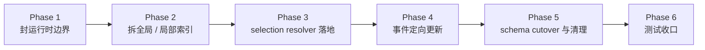

# MogTracker 运行时轻量化改造清单

## 目的

这份清单把 [runtime-lightweight-data-plan.md](runtime-lightweight-data-plan.md) 落到当前代码文件。

目标不是“一次性重写”，而是按阶段收缩边界：

1. 先禁止运行时越界
2. 再拆分全局索引和局部索引
3. 再把事件更新改成真正的定向更新
4. 最后完成 storage schema cutover 并清理旧结构

---

## 总原则

- 扫描功能是唯一允许做重操作的入口
- dashboard 打开只读 persistent summaries
- loot panel 打开最多只补建当前副本 + 当前难度
- 事件只做定向修补，不做全表重算
- storage 层允许整体重写，不要求旧 schema 迁移
- schema 不匹配时，在加载阶段直接重置 storage，而不是运行时迁移

---

## 阶段图

---

## Phase 1. 先封运行时边界

### 目标

- 让 dashboard 和 loot panel 的打开路径不再承担隐式修复职责
- 先把“运行时不许重建全局”的边界钉死

### 文件改造

#### 1. [RaidDashboardData.lua](../../src/dashboard/raid/RaidDashboardData.lua)

- [ ] 明确区分 `missing / partial / ready / stale`
- [ ] `BuildData()` 只读取 `raidDashboardCache` 和对应 manifest
- [ ] 没有 `ready` snapshot 时，直接返回空态所需数据
- [ ] 删除或禁用任何“读路径顺手修 bucket / 补全视图缓存”的大范围逻辑
- [ ] 将 runtime view cache 命中条件增加 `readinessState`
- [ ] 保留 runtime bucket patch 入口，但仅供事件路径调用
- [ ] 引入 `summaryScopeKey`，让 bucket family 与统计语义命名空间显式化
- [ ] 引入 canonical bucket shape：
  - [ ] `bucketKey`
  - [ ] `state`
  - [ ] `counts`
  - [ ] `members.setPieces`
  - [ ] `members.collectibles`

#### 2. [RaidDashboard.lua](../../src/dashboard/raid/RaidDashboard.lua)

- [ ] 增加 dashboard 空态渲染
- [ ] 明确区分：
  - [ ] `missing` -> “请先扫描副本”
  - [ ] `stale` -> “数据已过期，请重新扫描”
  - [ ] `partial` -> “当前只有局部数据，无法显示统计”

#### 3. [DashboardPanelController.lua](../../src/dashboard/DashboardPanelController.lua)

- [ ] 打开统计面板时只触发轻量 `BuildData()`
- [ ] 禁止打开路径调用任何 bulk scan / rebuild / repair 逻辑

#### 4. [CoreRuntime.lua](../../src/runtime/CoreRuntime.lua)

- [ ] 检查 `ToggleDashboardPanel()` 调用链
- [ ] 删除或阻断任何“打开统计面板时顺手刷新重数据”的分支

### 验收

- [ ] 没有 snapshot 时，打开统计面板不会扫 EJ、不会重建索引
- [ ] 只显示空态提示
- [ ] 离线校验能证明 `BuildData()` 不依赖扫描副作用
- [ ] 打开路径只读，但事件路径仍可更新已缓存 bucket

---

## Phase 2. 引入 readiness state 和 scan manifest

### 目标

- 让“有没有数据”变成显式状态模型
- 让页面知道某个副本/难度到底是否真的扫描过

### 文件改造

#### 1. [Storage.lua](../../src/storage/Storage.lua)

- [ ] 新增持久化容器：
  - [ ] `db.scanManifest`
- [ ] 为 manifest 增加元数据：
  - [ ] `layer`
  - [ ] `kind`
  - [ ] `schemaVersion`

#### 2. [StorageGateway.lua](../../src/storage/StorageGateway.lua)

- [ ] 增加 manifest 访问入口：
  - [ ] `GetScanManifest(instanceType)`
  - [ ] `GetScanManifestEntry(instanceKey, difficultyID)`
  - [ ] `UpsertScanManifestEntry(...)`
- [ ] manifest 访问需要显式区分 `summaryScopeKey`
- [ ] 所有 dashboard 读取路径通过 manifest 判断 readiness

#### 3. [DerivedSummaryStore.lua](../../src/core/DerivedSummaryStore.lua)

- [ ] 增加 readiness state 常量和 matcher
- [ ] 不再只看 `rulesVersion`，还要看 `state`

#### 4. [DashboardBulkScan.lua](../../src/dashboard/bulk/DashboardBulkScan.lua)

- [ ] 每次 scan 完成时写 manifest
- [ ] 标记：
  - [ ] `instanceKey`
  - [ ] `difficultyID`
  - [ ] `summaryScopeKey`
  - [ ] `completedAt`
  - [ ] `rulesVersion`
  - [ ] `coverageState`
- [ ] 产出 dashboard membership index 基线
- [ ] 产出 canonical bucket shape 基线

### 验收

- [ ] 能区分“未扫描”和“扫描后为空”
- [ ] dashboard 空态文案可以按 state 正确区分
- [ ] rulesVersion 变化时，旧 manifest 可转 `stale`
- [ ] scan 后 dashboard bucket 都有可用 membership index

---

## Phase 3. 拆全局索引与局部索引

### 目标

- 停止把 `StorageGateway` 里的反查索引同时当成“全局真相”和“运行时热缓存”
- 建立 selection-scoped resolver

### 文件改造

#### 1. [StorageGateway.lua](../../src/storage/StorageGateway.lua)

- [ ] 明确 `itemFacts` 反查索引的定位
- [ ] 禁止读路径触发全局索引恢复
- [ ] 把当前“会话增量索引”重命名或注释成 local/runtime 语义
- [ ] 把 scan-built global index 访问接口和 runtime local lookup 接口区分开
- [ ] 增加 dashboard membership index 访问接口
- [ ] 增加 canonical bucket 访问接口
- [ ] 增加 `summaryScopeKey` 维度的 dashboard summary / membership index 访问接口

建议未来接口形态：

- [ ] `GetGlobalSetIDsBySourceID(...)`
- [ ] `GetGlobalSourceIDsBySetID(...)`
- [ ] `GetRuntimeItemFactBySourceID(...)`
- [ ] `GetDashboardSummaryScopeKey(...)`
- [ ] `GetDashboardBucket(bucketKey)`
- [ ] `GetDashboardBucketKeysBySourceID(...)`
- [ ] `GetDashboardBucketKeysBySetID(...)`
- [ ] `GetDashboardBucketKeysByAppearanceID(...)`
- [ ] `GetDashboardBucketKeysByItemID(...)`

#### 2. 新模块建议：[SelectionResolver.lua](../../src/loot/SelectionResolver.lua)

- [ ] 新建 module，专门负责当前 selection 的局部补建
- [ ] 输入 key 至少包括：
  - [ ] `journalInstanceID`
  - [ ] `difficultyID`
  - [ ] `instanceType`
  - [ ] `scopeMode`
  - [ ] `classScope`
- [ ] 输出：
  - [ ] local indexes
  - [ ] selection summaries
  - [ ] `selectionSetMembership`

#### 3. [LootDataController.lua](../../src/loot/LootDataController.lua)

- [ ] 把当前 `BuildCurrentInstanceLootSummary()` 的上游“局部补建”职责迁到 `SelectionResolver`
- [ ] 自己只消费 resolver 的结果
- [ ] 明确 `CurrentInstanceLootSummary.state`
- [ ] 挂接 `selectionSetMembership`

#### 4. [LootSets.lua](../../src/loot/sets/LootSets.lua)

- [ ] 停止直接把 `itemFacts` 反查缺口当成全局恢复入口
- [ ] 只读：
  - [ ] 当前 selection summary
  - [ ] scan-built global summaries
- [ ] 缺少跨副本 set 信息时，返回降级结果，不顺手修全局

### 验收

- [ ] loot panel 打开只会补当前副本 + 当前难度
- [ ] 打开 loot panel 不会顺手恢复历史 `itemFacts` 全局索引
- [ ] 当前 selection summary key 包含完整 scope 语义

---

## Phase 4. Facts 字段所有权收口

### 目标

- 防止 runtime 把局部观察写成全局事实

### 文件改造

#### 1. [Storage.lua](../../src/storage/Storage.lua)

- [ ] 为 `itemFacts` 字段定义所有权注释/契约
- [ ] 明确哪些字段属于：
  - [ ] `runtime_patchable`
  - [ ] `scan_owned`

#### 2. [StorageGateway.lua](../../src/storage/StorageGateway.lua)

- [ ] `UpsertItemFact()` 增加来源语义
- [ ] runtime patch 路径禁止写入 `scan_owned` 字段
- [ ] scan pipeline 路径允许全量写入

#### 3. [SetDashboardBridge.lua](../../src/core/SetDashboardBridge.lua)

- [ ] 清理“fallback 命中后回写 facts”的策略
- [ ] 只允许回写 runtime_patchable 字段

#### 4. [CollectionState.lua](../../src/core/CollectionState.lua)

- [ ] 保持 collection resolution 只读 facts
- [ ] 不承担 facts 修复职责

### 验收

- [ ] runtime 路径无法把局部 `setIDs/source relations` 写成全局事实
- [ ] scan 路径仍然可以正式写入完整事实

---

## Phase 5. 事件改造成真正的定向更新

### 目标

- 让 `TRANSMOG_COLLECTION_UPDATED`、`GET_ITEM_INFO_RECEIVED` 等事件只更新受影响对象

### 文件改造

#### 1. 新模块建议：[TransmogImpactResolver.lua](../../src/core/TransmogImpactResolver.lua)

- [ ] 新建 module，负责把事件映射成最小失效粒度
- [ ] 最小键建议：
  - [ ] `itemID`
  - [ ] `sourceID`
  - [ ] `setID`
  - [ ] `selectionKey`
  - [ ] `dashboardBucketKey`
- [ ] 输出必须携带 `summaryScopeKey`
- [ ] 输出支持两种模式：
  - [ ] 精确 patch
  - [ ] 有界 reconcile

#### 2. [CoreRuntime.lua](../../src/runtime/CoreRuntime.lua)

- [ ] 改造 `TRANSMOG_COLLECTION_UPDATED` 处理逻辑
- [ ] 删除整页 invalidation / refresh fallback
- [ ] 改成：
  - [ ] 解析 impact
  - [ ] 只更新当前打开页面受影响部分
  - [ ] 必要时标记持久摘要 bucket 为 `stale`
  - [ ] 如果 impact 不精确，进入 dashboard 有界 reconcile，而不是全表刷新
- [ ] 所有 reconcile 通过 queue + budget 驱动，不允许单帧清空 dirty universe

#### 3. [RaidDashboardData.lua](../../src/dashboard/raid/RaidDashboardData.lua)

- [ ] 把当前 row-level refresh 逻辑改成 bucket-level targeted refresh
- [ ] 增加 dashboard member shape：
  - [ ] `SetPieceMember`
  - [ ] `CollectibleMember`
- [ ] `collectionState` 改成三态，不再只存布尔 collected
- [ ] 增加 bucket patch helper
- [ ] 增加 bounded reconcile helper
- [ ] 增加 reconcile queue helper
- [ ] 让 reconcile queue 支持 `nextMemberKey` continue token
- [ ] 让 reconcile queue 按 `summaryScopeKey` 隔离
- [ ] 不允许遍历整张 dashboard rows 做“全表修 collected state”

#### 4. [LootDataController.lua](../../src/loot/LootDataController.lua)

- [ ] 当前页面打开时，只更新命中的 `selectionKey`
- [ ] item info / collection change 只修局部 row

### 验收

- [ ] `TRANSMOG_COLLECTION_UPDATED` 不会再导致整页全刷新
- [ ] dashboard 只更新相关 bucket
- [ ] loot/set 页面只更新当前 selection 内受影响对象
- [ ] 如果没有精确 payload，dashboard 只对已缓存 bucket members 做 reconcile
- [ ] dashboard reconcile 以批次运行，并保留未完成 bucket 的 continue token
- [ ] dashboard patch/reconcile 只依赖 canonical bucket + membership index，不依赖重新扫矩阵

---

## Phase 6. Storage Schema Cutover

### 目标

- 明确允许 storage 整体重写，不再为旧 schema 设计迁移路径

### 文件改造

#### 1. [Storage.lua](../../src/storage/Storage.lua)

- [ ] 引入新的顶层 `STORAGE_SCHEMA_VERSION`
- [ ] schema 不匹配时，在加载阶段直接丢弃旧 storage 容器
- [ ] 初始化新 schema 所需的空容器
- [ ] 不做字段级迁移或兼容填充

#### 2. [RaidDashboardData.lua](../../src/dashboard/raid/RaidDashboardData.lua)

- [ ] schema cutover 后只处理新 canonical shape
- [ ] 打开路径不再承担旧 bucket 结构兼容
- [ ] 没有新 schema snapshot 时，直接退化为“请扫描副本”

#### 3. [LootDataController.lua](../../src/loot/LootDataController.lua)

- [ ] schema cutover 后只接受新 selection summary 结构
- [ ] 没有新 schema selection 数据时，最多局部补当前 selection
- [ ] 不允许为兼容旧 cache 恢复全局索引

### 验收

- [ ] schema 不匹配时不会引发运行时大工作
- [ ] 旧 schema 会在加载阶段被清空，而不是在页面打开时迁移
- [ ] 页面表现退化为“请扫描副本”或局部空态，而不是卡顿

---

## Phase 7. 删除旧职责和混合路径

### 目标

- 把新旧双轨彻底收口，避免“看起来迁完了，实际上两个系统都在跑”

### 重点清理项

#### 1. [StorageGateway.lua](../../src/storage/StorageGateway.lua)

- [ ] 删除或废弃任何“读路径智能恢复全局索引”的历史分支

#### 2. [RaidDashboardData.lua](../../src/dashboard/raid/RaidDashboardData.lua)

- [ ] 删除“没有 snapshot 也尝试算一版”的历史容错思路
- [ ] 删除 runtime 全行扫描式 collection refresh

#### 3. [LootSets.lua](../../src/loot/sets/LootSets.lua)

- [ ] 删除“通过 facts 缺口反推出全局 set/index”的路径

#### 4. [README.md](../../README.md)

- [ ] 在边界稳定后，更新架构图和数据流描述
- [ ] 明确 scan pipeline / runtime maintenance 的分离

### 验收

- [ ] 新架构下没有关键功能仍依赖旧混合路径
- [ ] 文档描述与代码事实一致

---

## Phase 8. 测试清单

### 必加验证

#### Dashboard

- [ ] `validate_dashboard_missing_snapshot.lua`
  - 打开 dashboard 无 snapshot 时，只显示空态，不触发扫描
- [ ] `validate_dashboard_stale_snapshot.lua`
  - 当前 schema 下 rules 过期的 snapshot 只返回 `stale`
- [ ] `validate_dashboard_missing_membership_index.lua`
  - 新 schema 下缺失 membership index 时，不在打开路径补建
- [ ] `validate_dashboard_missing_summary_scope.lua`
  - 新 schema 下缺失 `summaryScopeKey` 时直接 `stale`
- [ ] `validate_dashboard_summary_scope_key.lua`
  - dashboard summary / manifest / membership index 必须共用同一 `summaryScopeKey`
- [ ] `validate_dashboard_bucket_key_contract.lua`
  - bucket key 形状固定为 `instanceType::journalInstanceID::difficultyID::scopeType::scopeValue`
- [ ] `validate_dashboard_member_shape.lua`
  - set/collectible member 至少具备约定字段和三态 `collectionState`
- [ ] `validate_dashboard_membership_index_precision.lua`
  - membership index 必须命中到 `bucketKey -> memberKey`
- [ ] `validate_dashboard_targeted_bucket_refresh.lua`
  - collection 更新只修相关 bucket
- [ ] `validate_dashboard_bounded_reconcile.lua`
  - payload 不精确时，只对已缓存 bucket members 做 reconcile
- [ ] `validate_dashboard_reconcile_queue_budget.lua`
  - reconcile 必须走队列和预算，不允许单次扫完所有 dirty bucket

#### Loot panel

- [ ] `validate_loot_selection_local_rebuild_only.lua`
  - 缺数据时只补当前副本 + 当前难度
- [ ] `validate_loot_selection_scope_key.lua`
  - scope 变化时不会串 selection summary
- [ ] `validate_selection_set_membership.lua`
  - 当前 selection 的 set 归属只写局部结构，不写回全局 `itemFacts.setIDs`

#### Facts / indexes

- [ ] `validate_runtime_patchable_itemfacts.lua`
  - runtime 不能写 scan-owned 字段
- [ ] `validate_scan_manifest_states.lua`
  - manifest 正确区分 `missing / partial / ready / stale`
- [ ] `validate_storage_schema_cutover.lua`
  - 旧 schema 在加载阶段直接被丢弃，不进入运行时迁移

#### Events

- [ ] `validate_transmog_targeted_update.lua`
  - `TRANSMOG_COLLECTION_UPDATED` 不会触发全表刷新
- [ ] `validate_iteminfo_targeted_patch.lua`
  - `GET_ITEM_INFO_RECEIVED` 只补等待对象

### 现有测试需要保留并调整预期

- [ ] [validate_item_fact_cold_start.lua](../../tools/validate_item_fact_cold_start.lua)
- [ ] [validate_dashboard_collection_refresh.lua](../../tools/validate_dashboard_collection_refresh.lua)
- [ ] [validate_dashboard_metric_views.lua](../../tools/validate_dashboard_metric_views.lua)
- [ ] [validate_lootdata_current_instance_summary.lua](../../tools/validate_lootdata_current_instance_summary.lua)

---

## 推荐执行顺序

建议严格按下面顺序推进：

1. Phase 1
   - 先把 dashboard/loot 的越界路径封掉
2. Phase 2
   - 加 readiness state 和 manifest
3. Phase 3
   - 拆 global / local indexes
4. Phase 4
   - 收口 facts 字段所有权
5. Phase 5
   - 改事件定向更新
6. Phase 6
   - 完成 storage schema cutover
7. Phase 7
   - 删除旧混合路径
8. Phase 8
   - 把测试锁死

不建议跳步。

特别是不建议：

- 先改事件，再去定义最小失效粒度
- 先改 facts 回写，再去定义字段所有权
- 先改 dashboard 渲染，再不定义 readiness state
- 先要求 dashboard 反映事件事实，再不先引入 membership index
- 在没定义 `summaryScopeKey` 和 reconcile queue 之前先实现 dashboard reconcile
- 在没有 schema cutover 方案时，继续为旧 storage 叠加兼容分支

---

## 退出条件

这轮改造只有满足下面条件才算完成：

- [ ] 打开 dashboard 永不触发重操作
- [ ] dashboard 已缓存统计能反映 runtime 幻化事件的事实变化
- [ ] dashboard patch/reconcile 永远局限在命中的 `summaryScopeKey` 内
- [ ] 打开 loot panel 最多只补当前 selection
- [ ] runtime 不再恢复完整全局索引
- [ ] event update 只做定向修补
- [ ] storage schema 不匹配时不会触发运行时迁移
- [ ] scan pipeline 与 runtime maintenance 的职责在代码中已经分离
- [ ] 相关 validator 已覆盖这些边界

