# 统一日志面板设计文档

本文是 `debug` 页面唯一 authority spec，已承接统一日志面板的入口、筛选、导出和 focused dump 语义。

本文说明 MogTracker 的统一日志面板如何打开、如何基于统一日志导出构造界面，以及当前 `/img debug ...` 入口如何落到统一日志面板而不是旧 debugTemp 文本框。

## 1. 面板定位

统一日志面板不是主配置面板里的一个 tab，而是独立 frame。

当前入口是：

- `/img debug`
- `/img debug setboard`
- `/img debug sets=...`
- `/img debug raid=...`
- `/img debug dungeon=...`
- `/img debug pvpsets`

`EventsCommandController` 先解析 slash 命令，再决定：

- 是否刷新统一日志导出。
- 是否抓取专项 dump。
- 是否直接显示统一日志面板。

## 2. 面板结构

面板初始化由 `ConfigDebugData.InitializeDebugPanel()` 完成。当前结构已经从旧 debug panel 升级为统一日志面板，主要包含：

- 标题和副标题。
- 左侧 `level / scope / session` 筛选与会话信息。
- 右侧统一日志主区，展示结构化日志预览。
- `Collect Logs`、`Refresh View`、`Copy JSON`、`复制给 Agent`、`导出当前结果` 五个动作按钮。

副标题仍明确写了“只能通过 `/img debug ...` 打开”，避免把统一日志面板混进普通玩家的主配置流里。

## 3. 筛选与会话

统一日志面板不再把左侧主交互做成历史 `settings.debugLogSections` 网格，而是把筛选收敛到统一日志 contract 本身：

- `level`
- `scope`
- `session`

当前默认 scope 至少覆盖：

- `runtime.events`
- `runtime.error`
- `metadata.instance`

会话信息区会直接展示：

- `sessionID`
- `persistenceEnabled`
- `totalLogs`
- `truncated`

旧 `debugLogSections` 仍然保留给专项 dump 采集和非日志型业务快照兼容，但它已经不是统一日志面板的主筛选模型。

## 4. 数据链路图

统一日志面板的数据链路已经变成“命令 -> collector -> unified export -> 过滤后的 export -> 主区渲染 / 复制动作”。

```dot
digraph DebugDataFlow {
  rankdir=LR;
  graph [fontsize=10];
  node [shape=box style="rounded,filled" fillcolor="#FFFBEB" color="#B45309" fontname="Microsoft YaHei" fontsize=10];
  edge [color="#92400E" fontsize=9 fontname="Microsoft YaHei"];

  Slash [label="/img debug ..."];
  Handle [label="HandleDebugSlash()"];
  Capture [label="Capture*DebugDump()"];
  Last [label="lastDebugDump"];
  Export [label="runtimeLogs / BuildExport()"];
  Filter [label="level/scope/session filters"];
  Format [label="FormatUnifiedLogExport()"];

  Slash -> Handle;
  Handle -> Capture;
  Capture -> Last;
  Last -> Export;
  Export -> Filter;
  Filter -> Format;
}
```

如果是专项命令，比如 `/img debug raid=...`，中间的 collector 会换成对应 capture 函数，但统一日志主区仍优先读取 `lastDebugDump.runtimeLogs`。

## 5. 渲染链路图

统一日志面板的渲染链路是“准备 panel -> 过滤 export -> 生成主区文本 / JSON / agent export -> 填进滚动文本框”。

```dot
digraph DebugRenderFlow {
  rankdir=LR;
  graph [fontsize=10];
  node [shape=box style="rounded,filled" fillcolor="#EEF6FF" color="#2563EB" fontname="Microsoft YaHei" fontsize=10];
  edge [color="#2563EB" fontsize=9 fontname="Microsoft YaHei"];

  Show [label="ShowDebugOutputPanel()"];
  Init [label="InitializeDebugPanel()"];
  Refresh [label="RefreshPanelText()"];
  Format [label="FormatUnifiedLogExport()"];
  Text [label="scroll child text"];
  Focus [label="focus + select text"];

  Show -> Init -> Refresh -> Format -> Text -> Focus;
}
```

## 6. 为什么统一日志面板仍然是“focused dump”

统一日志面板的目标不是长期开着看日志，而是快速生成一次可复制的聚焦输出。

因此它有几个显式设计：

- slash 命令优先决定收集范围。
- 文本框在打开后会自动 focus 并高亮内容。
- `Collect Logs` 会重新抓当前统一日志导出。
- `Copy JSON` 与 `复制给 Agent` 分别对应原始结构化导出和 agent export 文本，不再要求外部先反向解析 UI 文案。

这让用户可以更快地执行“抓一份、复制、贴给维护者”的流程。

## 7. 与主配置面板的关系

主配置面板不再承载 debug tab，但两者仍共享一部分配置状态或运行时依赖：

- `settings.debugLogSections`
- `lastDebugDump`
- `runtimeLogs`
- 必要的 `storage/runtime bootstrap`

也就是说：

- 专项 dump 的旧分段开关仍存在，但统一日志面板主路径已经改为 `level / scope / session` 过滤。
- 主区文本来自统一日志 export 的格式化结果，而不是旧 `db.debugTemp.startupLifecycleDebug` / `runtimeErrorDebug` 直读。
- 非日志型业务快照仍可通过 dump 兼容存在，但不再决定统一日志面板的主布局。

## 8. 什么时候看这份文档

下面这些问题优先看调试面板文档：

- 为什么 `/img debug` 打开的是独立窗口而不是主面板。
- 为什么我只看到某几个 level / scope / session 过滤结果。
- 为什么某条命令抓的是 setboard / raid / dungeon 专项 dump。
- 为什么 `Copy JSON`、`复制给 Agent` 和“导出当前结果”是三个不同动作。
