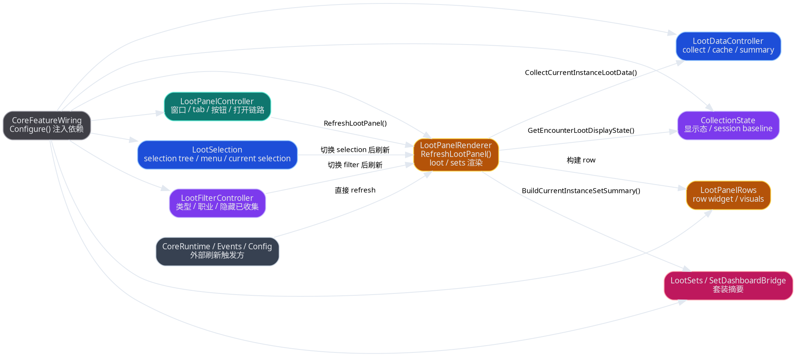
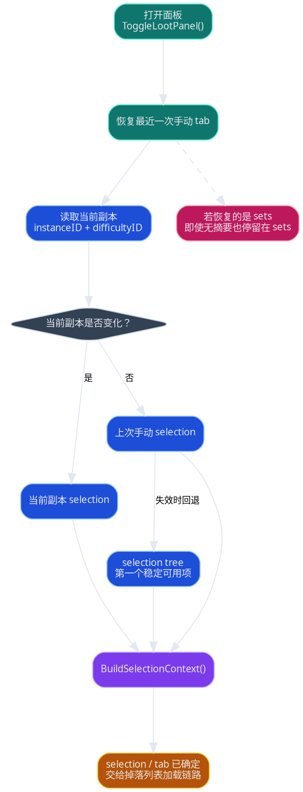
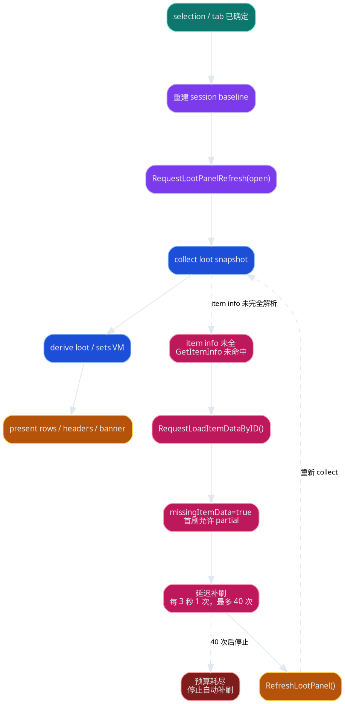
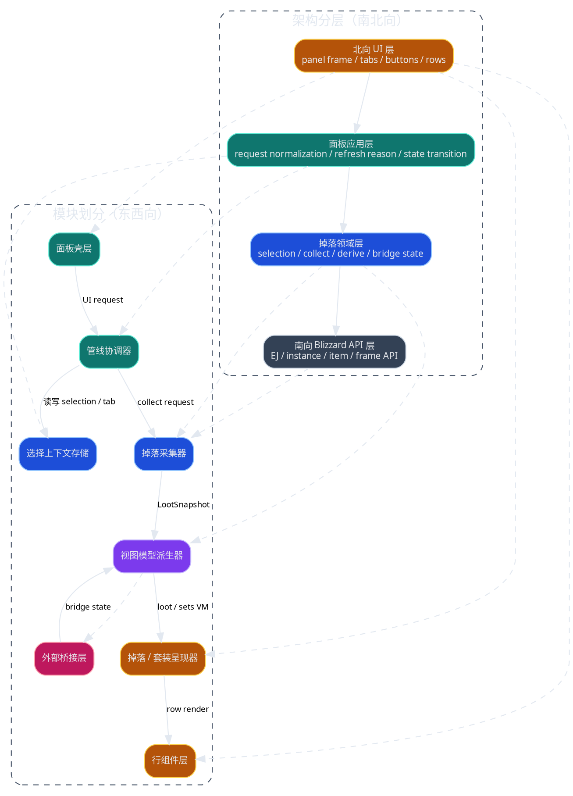
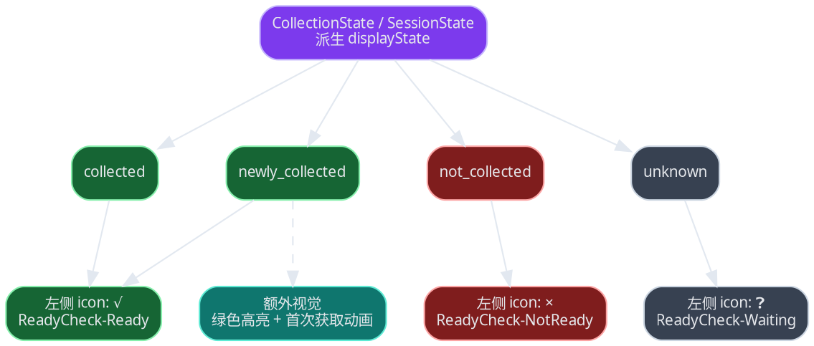

# 掉落面板设计文档

> [!NOTE]
> 当前 spec 类型：产品向 spec

> 把当前以 `RefreshLootPanel()` 为中心的掉落面板实现，收敛成以 `selection -> collect -> derive -> render` 数据管线为中心的独立子系统；本文件以原 `ui-loot-panel-subsystem-refactor-spec.md` 为主 authority，再吸收原 `panel / overview / design` 的页面链路说明。

## 背景与现状

### 背景

> 掉落面板已经从单一窗口演化成一个跨 `selection`、EJ 采集、收集状态、套装摘要、会话稳定态和运行时事件的复合子系统。

当前 `MogTracker` 中的掉落面板不再只是一个 UI 面板。它同时承载：

- 选择树构建：`src/loot/LootSelection.lua`
- 数据采集与缓存：`src/loot/LootDataController.lua`
- 面板生命周期与布局：`src/loot/LootPanelController.lua`
- 过滤与收藏态显示：`src/loot/LootFilterController.lua`、`src/core/CollectionState.lua`
- 主渲染与补刷：`src/loot/LootPanelRenderer.lua`
- 套装摘要桥接：`src/loot/sets/LootSets.lua`、`src/core/SetDashboardBridge.lua`

这些能力目前已经是“功能上可用、结构上重叠”的状态：模块名存在，但主 owner 还没有真正稳定到数据管线层。

### 现状

> 当前实现表面上分成多个模块，实际仍由 `CoreFeatureWiring -> RefreshLootPanel()` 串起多个跨层职责。



当前实现里已经形成以下事实：

- `LootPanelController` 负责窗口壳层，但打开流程里会触发 selection 偏好、session reset、cache invalidation 和 render refresh。
- `LootSelection` 不只是选择树，还承担 `BuildLootDataCacheKey()`、滚动重置、selection 切换后的刷新时机。
- `LootDataController` 除了 collect，还生成 `currentInstanceLootSummary`，已经开始承担 derived data owner。
- `LootPanelRenderer` 既是 presenter，又是 orchestration owner，还直接管理缺失 item / zero loot 的 retry。
- `src/loot/sets/` 提供 set summary assembly、missing-piece derivation，以及可选 ATT enhancement hook；它 enrich `sets` 页，不接管通用 loot render 或 selection owner。

> 当前主问题不是文件太长，而是 owner 边界以“谁能调用 refresh”为准，而不是以“谁拥有哪一段数据语义”为准。

核心结构性问题：

- `RefreshLootPanel()` 同时承担 orchestration、data fetch、derive、render、retry 调度，导致调用方向反向穿透。
- `selection`、`filter`、`session state`、`data cache` 的 owner 分散在多个模块，难以判断单次刷新应该重算到哪一层。
- `loot` 与 `sets` 两个 tab 共享 collect 结果，但没有稳定的 view model contract，只能在 renderer 内部临时拼装。
- 运行时事件和 UI 交互都可以直接要求刷新，缺少统一的 `refresh reason` 与 pipeline phase 边界。

## 目标与非目标

### 目标

> 目标态是把 loot panel 定义成一个可测试的数据管线子系统，而不是一组围绕 `RefreshLootPanel()` 聚合的 helper。

```dot
digraph LootPanelTargetState {
  rankdir=LR;
  graph [bgcolor="transparent", ranksep="0.8", nodesep="0.35"];
  node [shape=box, style="rounded,filled", fontname="Microsoft YaHei", fontsize=10, color="#94A3B8", fillcolor="#1E293B", fontcolor="#E5E7EB"];
  edge [color="#E2E8F0", fontname="Microsoft YaHei", fontsize=9];

  shell [label="面板壳层\n窗口生命周期 / UI 事件转发", fillcolor="#0F766E", color="#5EEAD4"];
  selection [label="选择上下文\n当前 selection / class scope / tab", fillcolor="#1D4ED8", color="#93C5FD"];
  collect [label="采集层\nselection-scoped collect / cache", fillcolor="#1D4ED8", color="#93C5FD"];
  derive [label="视图模型派生层\nloot VM / sets VM / empty state", fillcolor="#7C3AED", color="#C4B5FD"];
  presenter [label="呈现层\n只消费 VM 渲染 frame/rows", fillcolor="#B45309", color="#FCD34D"];
  bridges [label="外部桥接层\nCollectionState / EncounterState / LootSets", fillcolor="#BE185D", color="#FDA4AF"];
  triggers [label="UI / 运行时触发层\nopen / switch / refresh / event", fillcolor="#374151", color="#CBD5E1"];

  triggers -> shell;
  shell -> selection;
  selection -> collect;
  collect -> derive;
  bridges -> derive;
  derive -> presenter;
}
```



本次目标：

- 定义稳定的 loot panel 子系统边界，使主链路收敛为 `selection -> collect -> derive -> render`
- 把当前 UI 事件、运行时事件和手动刷新统一成同一种 `RefreshRequest` 语义
- 为 `loot` 与 `sets` 两个 tab 建立共享输入、分支输出的 view model contract
- 把 retry、empty state、partial state、error state 从 renderer 私有判断提升为子系统级语义
- 保持玩家主要使用习惯不变，只允许小幅修正明显不合理的刷新和空态语义

### 非目标

> 本次不把 loot panel 借机扩展成新的产品功能面板。

- 不重做小地图入口、配置面板入口或 dashboard 入口
- 不重写 `CollectionState`、`EncounterState`、`SetDashboardBridge` 的业务规则本体
- 不在本文件里展开 step-by-step runbook
- 不借这次重构同步重新设计全部视觉样式
- 不覆盖 dashboard 子系统整体重构
- 不覆盖 tooltip 主链路重构
- 不覆盖存储分层重写

## 风险与红线

### 风险

- 旧模块名字还在，但 owner 变化后，短期内 wiring 和测试会同时调整。
- 如果 `refresh reason` 没有定义清楚，只是把逻辑搬家，会把缠绕从 renderer 转移到 coordinator。
- `loot` 和 `sets` 共用 collect 结果时，如果 derived contract 设计过粗，会让 tab 分支再次回退到 presenter 内临时拼装。
- 小幅行为修正如果没有边界，容易演化成 UI 语义重做，扩大评审范围。

### 红线行为

> [!CAUTION]
> 不允许继续把 `RefreshLootPanel()` 当成默认总调度器，绕过中间层 contract。

> [!CAUTION]
> 不允许 presenter 继续直接 collect、derive 或调 retry。

> [!CAUTION]
> 不允许 `src/loot/sets/` 反向接管通用 loot selection 或 render owner。

> [!CAUTION]
> 不允许改变当前 `loot` / `sets` 双 tab 基线。

> [!CAUTION]
> 不允许改变当前 `selected` / `current` 职业范围模式。

> [!CAUTION]
> 不允许把 `CollectionState`、`EncounterState`、`LootSets` 并回 loot panel 子系统。

> [!CAUTION]
> 不允许脱离 Lua / WoW Frame API 与 `Configure()` + 依赖注入接线模型另起并行实现。

> [!CAUTION]
> 不允许引入需要长期双写的并行 UI 面板。

> [!CAUTION]
> 不允许破坏当前 fixtures 与 offline validation 的可扩展空间。

## 边界与契约

### 稳定模块边界

- 本文只冻结 loot panel 子系统内部 contract，以及它与 `LootSets`、`CollectionState`、`EncounterState`、`SetDashboardBridge`、`CoreFeatureWiring` 的交界面
- 当前玩家可见基线仍然是 `loot` / `sets` 双 tab
- 当前职业范围模式仍然是 `selected` / `current`
- `CollectionState`、`EncounterState`、`LootSets` 继续作为外部能力模块存在，由 loot panel 消费而不是反向接管 owner

### 副本选择

> `open` 的前半段不是简单 show frame，而是一次显式的 tab 恢复和 selection 决策流程。



默认打开顺序应显式定义为：

1. 恢复最近一次手动 tab
2. 计算默认 selection：
   - 当前副本
   - 上次手动选择
   - selection tree 的第一个稳定可用项
3. 仅当 `instanceID + difficultyID` 相比上次记录发生变化时，才允许当前副本重新抢回优先级
4. 把确定后的 selection / tab 交给掉落列表加载链路

### 掉落列表加载

> `open` 的后半段才是 session baseline 建立、首刷 collect 和 item 延迟补刷。



打开链路里需要着重强调一条现实约束：

- 首次打开某个 selection 时，EJ 返回的 item 列表不保证所有 `GetItemInfo()` / transmog 相关信息都已即时可用。
- 当前实现会在 `src/core/API.lua` 里对未解析完成的物品显式调用 `C_Item.RequestLoadItemDataByID()`，并把这次首刷标成 `missingItemData=true`。
- 这意味着 `open` 的首刷语义必须允许 `partial` 结果，而不能把“首刷不完整”误判成普通错误或空数据。
- 当前 renderer 会基于 `missingItemData` 走带 budget 的延迟补刷路径：`C_Timer.After(...) -> RefreshLootPanel()`；目标态里这个 owner 应上收进打开链路 / refresh request 语义，而不是继续藏在 presenter 私有逻辑里。

推荐主接口：

- `RequestLootPanelRefresh(request)`
- `BuildSelectionContext()`
- `CollectLootSnapshot(context)`
- `DeriveLootPanelViewModel(context, snapshot)`
- `PresentLootPanel(viewModel)`

### 刷新语义

- `open`
  - 可更新默认 selection
  - 记住并恢复上次手动 tab
  - 重建 session baseline
- `selection_changed`
  - invalidate selection-scoped raw cache
  - 清空当前 selection 相关的 collapse 稳定态与手动折叠态
  - reset scroll
- `filter_changed`
  - 默认不重 collect，优先重 derive
  - 若 filter 改变了 collect scope，再升级为重 collect
  - `class scope` 变化默认属于 collect scope 变化
- `runtime_event`
  - 默认先更新 external bridge state
  - 仅在当前 context 受影响时重 derive / re-present
  - 默认不重建 session baseline
- `manual_refresh`
  - 必须重 collect + reset session baseline

### 数据模型或存储

> 数据模型和存储边界已经拆成独立 authority，请直接以 [data-loot-panel-data-model-storage-spec.md](../data/data-loot-panel-data-model-storage-spec.md) 为准。

本页只关心这些对象在 UI 子系统里的消费位置和调用时机，不再重复维护它们的字段形态、存储语义或 owner contract。

### 击杀次数统计

> 击杀次数 contract 以 data spec 为准，UI spec 这里只冻结 presenter 的消费方式。

- 聚合范围、统计口径、session compensation 与展示 contract 以 [data-loot-panel-data-model-storage-spec.md](../data/data-loot-panel-data-model-storage-spec.md) 为唯一 authority。
- loot header 只消费已经派生好的 `bossKillCountViewModel`，不在 presenter 内临时拼累计值。
- UI 默认只显示数字，不额外挂统计口径标签；若后续要改为“数字 + 口径标签”，应先改 data spec 再改 presenter。

### 失败处理与可观测性

> retry 和 partial 不是 renderer 的临时技巧，而是 pipeline 的状态输出。

目标态要求：

- `missingItemData`、`zeroLootRetrySuggested` 保持为 `LootSnapshot` 的全局 completeness signal；字段形态以 [data-loot-panel-data-model-storage-spec.md](../data/data-loot-panel-data-model-storage-spec.md) 为准
- 由 coordinator 决定是否发起 retry request
- presenter 只显示当前 banner / hint，不直接 `C_Timer.After(...)`
- refresh 调试记录至少覆盖 `reason`、`phase`、`selectionKey`、`cacheStatus`、`viewStatus`

## 架构总览

> 先把 loot panel 当成一个独立子系统，看清它从北向 UI 到南向 Blizzard API 的主链，以及东西向模块切片。



## 架构分层

### 北向 UI 层

> 北向 UI 层只负责承接玩家可见的面板壳层、按钮、tab 和 rows，不直接拥有业务语义。

<svg viewBox="0 0 860 1280" width="100%" xmlns="http://www.w3.org/2000/svg">
  <style>
    .bg { fill: #0f172a; stroke: #64748b; stroke-width: 1; }
    .shell { fill: #111827; stroke: #94a3b8; stroke-width: 1.2; }
    .header { fill: #0f766e; stroke: #5eead4; stroke-width: 1; }
    .control { fill: #1d4ed8; stroke: #93c5fd; stroke-width: 1; }
    .scroll { fill: #312e81; stroke: #c4b5fd; stroke-width: 1; }
    .loot { fill: #92400e; stroke: #fcd34d; stroke-width: 1; }
    .sets { fill: #9d174d; stroke: #fda4af; stroke-width: 1; }
    .muted { fill: #334155; stroke: #cbd5e1; stroke-width: 1; }
    .label { fill: #e5e7eb; font: 12px sans-serif; }
    .small { fill: #cbd5e1; font: 10px sans-serif; }
    .title { fill: #f8fafc; font: 13px sans-serif; font-weight: bold; }
  </style>

  <rect x="20" y="20" width="820" height="1240" class="shell"/>
  <text x="36" y="48" class="title">Loot Panel 现有 UI 线框（按当前实现对齐）</text>

  <rect x="36" y="64" width="56" height="28" class="header"/>
  <text x="48" y="82" class="small">info</text>

  <rect x="100" y="64" width="448" height="28" class="header"/>
  <text x="112" y="81" class="label">title: 当前副本名（可能追加难度）</text>

  <rect x="556" y="64" width="68" height="28" class="header"/>
  <text x="568" y="82" class="small">refresh</text>
  <rect x="632" y="64" width="68" height="28" class="header"/>
  <text x="646" y="82" class="small">config</text>
  <rect x="708" y="64" width="96" height="28" class="header"/>
  <text x="742" y="82" class="small">close</text>

  <line x1="36" y1="106" x2="804" y2="106" stroke="#94a3b8" stroke-width="1"/>

  <rect x="36" y="122" width="470" height="38" class="control"/>
  <text x="50" y="143" class="label">instanceSelectorButton: customText + dropdown arrow</text>
  <text x="50" y="154" class="small">宽约 196~202 / 高 24~28，左对齐文本，右侧 12x12 下拉箭头</text>

  <rect x="518" y="122" width="286" height="38" class="control"/>
  <text x="532" y="143" class="label">classScopeButton: checkbox + 文本</text>
  <text x="532" y="154" class="small">current / selected</text>

  <rect x="36" y="180" width="768" height="448" class="scroll"/>
  <text x="50" y="202" class="title">Loot tab 内容变体</text>
  <text x="50" y="218" class="small">scrollFrame + content，单列纵向滚动</text>

  <rect x="52" y="232" width="736" height="40" class="muted"/>
  <text x="66" y="255" class="label">Banner row: partial / zero-loot retry / no selected classes / empty summary</text>

  <rect x="52" y="286" width="736" height="54" class="loot"/>
  <rect x="66" y="300" width="18" height="18" class="muted"/>
  <text x="69" y="313" class="small">折叠</text>
  <rect x="92" y="302" width="16" height="16" class="muted"/>
  <text x="95" y="313" class="small">头图</text>
  <rect x="116" y="303" width="14" height="14" class="muted"/>
  <text x="118" y="313" class="small">收集</text>
  <rect x="140" y="298" width="412" height="22" class="loot"/>
  <text x="152" y="313" class="label">Boss 名称 / encounter 标题</text>
  <rect x="564" y="298" width="210" height="22" class="loot"/>
  <text x="576" y="313" class="small">countText: x击杀次数 + filtered/total 收集进度</text>

  <rect x="52" y="354" width="736" height="132" class="loot"/>
  <text x="66" y="374" class="label">loot item row 展开（16px 行高，实际重复）</text>
  <rect x="66" y="388" width="15" height="15" class="muted"/>
  <text x="68" y="399" class="small">item</text>
  <rect x="89" y="389" width="12" height="12" class="muted"/>
  <text x="90" y="399" class="small">收集</text>
  <rect x="109" y="386" width="360" height="20" class="loot"/>
  <text x="121" y="399" class="label">item link / item name</text>
  <rect x="477" y="386" width="126" height="20" class="loot"/>
  <text x="489" y="399" class="small">slot / armorType</text>
  <rect x="611" y="386" width="163" height="20" class="loot"/>
  <text x="623" y="399" class="small">右侧状态 / extra text</text>
  <rect x="109" y="414" width="238" height="18" class="muted"/>
  <text x="121" y="426" class="small">class icons / eligible classes（可选）</text>
  <rect x="355" y="414" width="192" height="18" class="muted"/>
  <text x="367" y="426" class="small">newly collected 高亮 / dashed border</text>
  <rect x="555" y="414" width="219" height="18" class="muted"/>
  <text x="567" y="426" class="small">tooltip / click -> wardrobe items</text>
  <rect x="66" y="442" width="708" height="30" class="muted"/>
  <text x="80" y="461" class="small">重复行组：同一 encounter 下按 item 垂直堆叠，bodyFrame 高度随 visibleLoot 增长</text>

  <rect x="52" y="500" width="736" height="34" class="loot"/>
  <text x="66" y="521" class="label">空结果行: 没有符合当前过滤条件的掉落</text>

  <rect x="52" y="552" width="156" height="28" class="muted"/>
  <text x="66" y="570" class="small">debugButton（仅错误分支）</text>
  <rect x="224" y="552" width="564" height="52" class="muted"/>
  <text x="238" y="573" class="small">debugScrollFrame + debugEditBox（仅错误分支）</text>
  <text x="238" y="588" class="small">出错时 scrollFrame 顶部下移、底部上抬</text>

  <rect x="36" y="654" width="768" height="448" class="scroll"/>
  <text x="50" y="676" class="title">Sets tab 内容变体</text>
  <text x="50" y="692" class="small">仍复用同一个 scrollFrame + content，只是 row 结构不同</text>

  <rect x="52" y="706" width="736" height="40" class="muted"/>
  <text x="66" y="729" class="label">Banner row: summary / empty / class hint</text>

  <rect x="52" y="760" width="736" height="48" class="sets"/>
  <text x="66" y="781" class="label">class group header row (20px)</text>
  <text x="66" y="795" class="small">彩色职业名 | countText 为空</text>

  <rect x="52" y="822" width="736" height="62" class="sets"/>
  <text x="66" y="844" class="label">set row (16px，重复)</text>
  <text x="66" y="858" class="small">set icon | set name (collected/total) | 左键进入 wardrobe sets</text>

  <rect x="52" y="898" width="736" height="70" class="sets"/>
  <text x="66" y="920" class="label">missing piece row (16px，重复)</text>
  <text x="66" y="934" class="small">缩进 item link/name | waiting icon | 右侧 source boss / instance / difficulty</text>

  <line x1="36" y1="1124" x2="804" y2="1124" stroke="#94a3b8" stroke-width="1"/>

  <rect x="36" y="1140" width="94" height="26" class="header"/>
  <text x="48" y="1157" class="small">lootTabButton</text>
  <rect x="142" y="1140" width="94" height="26" class="header"/>
  <text x="156" y="1157" class="small">setsTabButton</text>
  <rect x="734" y="1138" width="70" height="30" class="muted"/>
  <text x="748" y="1157" class="small">resize</text>
</svg>

```svg
<svg viewBox="0 0 860 1280" width="100%" xmlns="http://www.w3.org/2000/svg">
  <style>
    .bg { fill: #0f172a; stroke: #64748b; stroke-width: 1; }
    .shell { fill: #111827; stroke: #94a3b8; stroke-width: 1.2; }
    .header { fill: #0f766e; stroke: #5eead4; stroke-width: 1; }
    .control { fill: #1d4ed8; stroke: #93c5fd; stroke-width: 1; }
    .scroll { fill: #312e81; stroke: #c4b5fd; stroke-width: 1; }
    .loot { fill: #92400e; stroke: #fcd34d; stroke-width: 1; }
    .sets { fill: #9d174d; stroke: #fda4af; stroke-width: 1; }
    .muted { fill: #334155; stroke: #cbd5e1; stroke-width: 1; }
    .label { fill: #e5e7eb; font: 12px sans-serif; }
    .small { fill: #cbd5e1; font: 10px sans-serif; }
    .title { fill: #f8fafc; font: 13px sans-serif; font-weight: bold; }
  </style>

  <rect x="20" y="20" width="820" height="1240" class="shell"/>
  <text x="36" y="48" class="title">Loot Panel 现有 UI 线框（按当前实现对齐）</text>
  <rect x="36" y="64" width="56" height="28" class="header"/>
  <text x="48" y="82" class="small">info</text>
  <rect x="100" y="64" width="448" height="28" class="header"/>
  <text x="112" y="81" class="label">title: 当前副本名（可能追加难度）</text>
  <rect x="556" y="64" width="68" height="28" class="header"/>
  <text x="568" y="82" class="small">refresh</text>
  <rect x="632" y="64" width="68" height="28" class="header"/>
  <text x="646" y="82" class="small">config</text>
  <rect x="708" y="64" width="96" height="28" class="header"/>
  <text x="742" y="82" class="small">close</text>
  <line x1="36" y1="106" x2="804" y2="106" stroke="#94a3b8" stroke-width="1"/>
  <rect x="36" y="122" width="470" height="38" class="control"/>
  <text x="50" y="143" class="label">instanceSelectorButton: customText + dropdown arrow</text>
  <text x="50" y="154" class="small">宽约 196~202 / 高 24~28，左对齐文本，右侧 12x12 下拉箭头</text>
  <rect x="518" y="122" width="286" height="38" class="control"/>
  <text x="532" y="143" class="label">classScopeButton: checkbox + 文本</text>
  <text x="532" y="154" class="small">current / selected</text>
  <rect x="36" y="180" width="768" height="448" class="scroll"/>
  <text x="50" y="202" class="title">Loot tab 内容变体</text>
  <text x="50" y="218" class="small">scrollFrame + content，单列纵向滚动</text>
  <rect x="52" y="232" width="736" height="40" class="muted"/>
  <text x="66" y="255" class="label">Banner row: partial / zero-loot retry / no selected classes / empty summary</text>
  <rect x="52" y="286" width="736" height="54" class="loot"/>
  <rect x="66" y="300" width="18" height="18" class="muted"/>
  <text x="69" y="313" class="small">折叠</text>
  <rect x="92" y="302" width="16" height="16" class="muted"/>
  <text x="95" y="313" class="small">头图</text>
  <rect x="116" y="303" width="14" height="14" class="muted"/>
  <text x="118" y="313" class="small">收集</text>
  <rect x="140" y="298" width="412" height="22" class="loot"/>
  <text x="152" y="313" class="label">Boss 名称 / encounter 标题</text>
  <rect x="564" y="298" width="210" height="22" class="loot"/>
  <text x="576" y="313" class="small">countText: x击杀次数 + filtered/total 收集进度</text>
  <rect x="52" y="354" width="736" height="132" class="loot"/>
  <text x="66" y="374" class="label">loot item row 展开（16px 行高，实际重复）</text>
  <rect x="66" y="388" width="15" height="15" class="muted"/>
  <text x="68" y="399" class="small">item</text>
  <rect x="89" y="389" width="12" height="12" class="muted"/>
  <text x="90" y="399" class="small">收集</text>
  <rect x="109" y="386" width="360" height="20" class="loot"/>
  <text x="121" y="399" class="label">item link / item name</text>
  <rect x="477" y="386" width="126" height="20" class="loot"/>
  <text x="489" y="399" class="small">slot / armorType</text>
  <rect x="611" y="386" width="163" height="20" class="loot"/>
  <text x="623" y="399" class="small">右侧状态 / extra text</text>
  <rect x="109" y="414" width="238" height="18" class="muted"/>
  <text x="121" y="426" class="small">class icons / eligible classes（可选）</text>
  <rect x="355" y="414" width="192" height="18" class="muted"/>
  <text x="367" y="426" class="small">newly collected 高亮 / dashed border</text>
  <rect x="555" y="414" width="219" height="18" class="muted"/>
  <text x="567" y="426" class="small">tooltip / click -> wardrobe items</text>
  <rect x="66" y="442" width="708" height="30" class="muted"/>
  <text x="80" y="461" class="small">重复行组：同一 encounter 下按 item 垂直堆叠，bodyFrame 高度随 visibleLoot 增长</text>
  <rect x="52" y="500" width="736" height="34" class="loot"/>
  <text x="66" y="521" class="label">空结果行: 没有符合当前过滤条件的掉落</text>
  <rect x="52" y="552" width="156" height="28" class="muted"/>
  <text x="66" y="570" class="small">debugButton（仅错误分支）</text>
  <rect x="224" y="552" width="564" height="52" class="muted"/>
  <text x="238" y="573" class="small">debugScrollFrame + debugEditBox（仅错误分支）</text>
  <text x="238" y="588" class="small">出错时 scrollFrame 顶部下移、底部上抬</text>
  <rect x="36" y="654" width="768" height="448" class="scroll"/>
  <text x="50" y="676" class="title">Sets tab 内容变体</text>
  <text x="50" y="692" class="small">仍复用同一个 scrollFrame + content，只是 row 结构不同</text>
  <rect x="52" y="706" width="736" height="40" class="muted"/>
  <text x="66" y="729" class="label">Banner row: summary / empty / class hint</text>
  <rect x="52" y="760" width="736" height="48" class="sets"/>
  <text x="66" y="781" class="label">class group header row (20px)</text>
  <text x="66" y="795" class="small">彩色职业名 | countText 为空</text>
  <rect x="52" y="822" width="736" height="62" class="sets"/>
  <text x="66" y="844" class="label">set row (16px，重复)</text>
  <text x="66" y="858" class="small">set icon | set name (collected/total) | 左键进入 wardrobe sets</text>
  <rect x="52" y="898" width="736" height="70" class="sets"/>
  <text x="66" y="920" class="label">missing piece row (16px，重复)</text>
  <text x="66" y="934" class="small">缩进 item link/name | waiting icon | 右侧 source boss / instance / difficulty</text>
  <line x1="36" y1="1124" x2="804" y2="1124" stroke="#94a3b8" stroke-width="1"/>
  <rect x="36" y="1140" width="94" height="26" class="header"/>
  <text x="48" y="1157" class="small">lootTabButton</text>
  <rect x="142" y="1140" width="94" height="26" class="header"/>
  <text x="156" y="1157" class="small">setsTabButton</text>
  <rect x="734" y="1138" width="70" height="30" class="muted"/>
  <text x="748" y="1157" class="small">resize</text>
</svg>
```

这一层包含：

- 面板 frame 生命周期
- tab / header button / refresh button
- loot rows / sets rows 的最终视觉落地
- 玩家可见的 `√ / × / ❓` collection icon 与高亮动画

边界要求：

- UI 层不直接 collect
- UI 层不直接 derive
- UI 层不直接决定 retry 或补刷 budget
- UI 层只把用户动作转成标准 request，或消费最终 `PanelViewModel`

### 面板应用层

> 面板应用层负责把“打开面板 / 切 tab / 切 selection / 切 filter / 手动刷新 / 运行时事件”统一收敛成 request 语义。

这一层的主 owner 是 `管线协调器` 与 `SelectionContext`，负责：

- 接收统一 request
- 更新 `SelectionContext`
- 恢复最近一次手动 tab 与 selection
- 决定本次推进到哪一阶段：仅换 tab、重 derive、重 collect、全量刷新
- 重建或保留 session baseline
- 调用 collector / deriver / presenter
- 记录 refresh debug / reason

`RefreshRequest` 的字段形态以 data spec 为准；UI 侧只依赖它至少能表达 `reason`、cache invalidation、session reset、scroll reset 与 tab 切换意图。

### 掉落领域层

> 掉落领域层只关心从 selection 生成 snapshot，再从 snapshot 生成 loot / sets 的 view model。

这一层包含：

- `掉落采集器`
  - 输入：`SelectionContext`
  - 输出：`LootSnapshot`
  - 责任：selection-scoped collect、raw cache、summary cache、partial/error 标记
- `视图模型派生器`
  - 输入：`LootSnapshot + SelectionContext + SessionState + ExternalBridgeState`
  - 输出：`LootTabViewModel` 或 `SetsTabViewModel`
  - 责任：空态、过滤态、collapse state、banner state、row-level state
- 外部 bridge state 的消费
  - `CollectionState`
  - `EncounterState`
  - `LootSets`
  - `SetDashboardBridge`

领域层约束：

- 首刷允许 `missingItemData=true` 的 partial 结果
- item info 延迟加载与补刷预算属于领域语义；其 authority 边界以 data spec 为准，不属于 UI 私有技巧
- `loot` / `sets` 共用 collect 输入，但各自导出独立 VM

### 南向 Blizzard API 层

> 南向 Blizzard API 层是 loot panel 依赖的客户端数据与运行时 API 边界，不参与 UI 决策。

这一层主要包括：

- Encounter Journal API
- `GetItemInfo()` / `GetItemInfoInstant()`
- `C_Item.RequestLoadItemDataByID()`
- transmog / wardrobe 相关 API
- frame runtime 与 `C_Timer`

这一层的作用是：

- 为领域层提供副本、encounter、loot item 和 item info
- 在 item info 尚未就绪时触发延迟加载
- 不反向决定 selection、session baseline 或 UI 展示语义

## 模块划分

### 面板壳层

> `面板壳层` 只拥有 frame 生命周期、按钮注册和用户输入，不拥有数据语义。

建议保留在 `LootPanelController` 侧的责任：

- `InitializeLootPanel()`
- frame / scroll / resize / tab button / header button 初始化
- UI 事件转发为标准 request

### 选择上下文存储

> selection、tab、class scope、type filter 必须组成一个统一上下文，而不是四散在不同 helper。

`SelectionContext` 的字段 authority 以 data spec 为准；UI 侧要求它至少能稳定提供当前 `selection`、`tab`、class scope、type filter 与最近一次手动恢复态。

### 掉落采集器

> collector 只负责得到当前 selection 的可信 snapshot。

建议 collector 层承担：

- `BuildLootDataCacheKey(selectedInstance)` 及其后继版本
- `CollectCurrentInstanceLootData()`
- `BuildCurrentInstanceLootSummary()`
- data spec 已冻结的全局 completeness signal，例如 `missingItemData` / `zeroLootRetrySuggested`

### 视图模型派生器

> derive 层是这次重构的核心，它把外部规则和 session 语义收敛成 panel 可消费 contract。



建议导出的 contract：

- `PanelChromeViewModel`
- `PanelBannerViewModel`
- `LootTabViewModel`
- `SetsTabViewModel`

其中：

- `PanelBannerViewModel` 是面板级唯一状态区入口
- `loot` / `sets` 分支不再各自维护第二套 banner
- `sets` 页的空态语义保持独立，不复用 `loot` 页解释文案

### 外部桥接层

> 外部桥接模块继续存在，但它们只以 adapter 输入 derive 层，不再被 presenter 到处直连。

桥接来源：

- `CollectionState`
- `EncounterState`
- `LootSets`
- `SetDashboardBridge`

## 验收标准

- [ ] loot panel 的主架构明确以 `selection -> collect -> derive -> render` 为唯一主链
- [ ] `RefreshRequest`、`SelectionContext`、`LootSnapshot`、`PanelViewModel` 这些中间 contract 已被显式定义
- [ ] `loot` / `sets` 两个 tab 的共同输入和分支输出边界已被写清
- [ ] presenter 不再被定义成 collect / derive / retry 的 owner
- [ ] `src/loot/sets/` 的职责已被并回本页面 spec，而不是继续保留独立 UI authority 文档

## 访谈记录

> [!NOTE]
> Q：这次 spec 的主目标更偏向哪一类？
>
> A：`2`，以**代码架构重构**为主。

收敛影响：文档采用技术向 spec 模板，评审中心放在模块边界、owner 和 contract，而不是产品交互改版。

> [!NOTE]
> Q：这次重构深度到什么层级？
>
> A：`3`，做**面板子系统级重构**。

收敛影响：spec 不再只讨论单文件整理，而是把 loot panel 当成独立子系统重新定义层次和模块分工。

> [!NOTE]
> Q：新的核心 owner 应围绕什么组织？
>
> A：`2`，以**数据管线**为中心。

收敛影响：主架构按 `selection -> collect -> derive -> render` 建模，状态 owner 和模块划分围绕这条主链收敛。

> [!NOTE]
> Q：这次是否允许改变对外行为？
>
> A：`2`，允许**小幅调整行为**。

收敛影响：spec 允许修正刷新、空态和 retry 语义，但不把评审扩展成完整 UI 行为重做。

> [!NOTE]
> Q：这次最优先要消除的结构性问题是什么？
>
> A：`1`，优先解决**职责缠绕**。

收敛影响：目标聚焦在 owner 清理、调用方向收敛和 contract 显式化，而不是先追求更多新功能。

> [!NOTE]
> Q：当用户已经手动切到某个旧副本后，再次打开面板时，是否允许“当前副本”重新抢回优先级？
>
> A：`3`，只在当前副本真的变化时才抢回。

收敛影响：`open` 语义被收敛成“当前副本优先，但不无条件覆盖最近一次手动浏览意图”，需要显式比较当前副本上下文是否发生变化。

> [!NOTE]
> Q：如果上次 tab 是 `sets`，但当前 selection 下 `sets` 没有可用摘要，打开时还要不要坚持留在 `sets`？
>
> A：`1`，仍然留在 `sets`，由状态区解释。

收敛影响：tab 恢复语义优先于“主入口回退”，`sets` 页的空态能力被视为正式目标态，而不是异常回退路径。

> [!NOTE]
> Q：切换 `class scope` 导致 collect scope 改变时，这次 `filter_changed` 要不要升级成重 collect？
>
> A：`1`，要，只要 collect scope 变了就升级为重 collect。

收敛影响：`filter_changed` 的升级条件被写死，`class scope` 切换不再是实现自行判断的灰区。

> [!NOTE]
> Q：当整个 `loot` 页所有 boss 组都为空组时，主界面应该怎么解释？
>
> A：`1`，仍保留所有 boss 组，并由面板级状态区说明“当前筛选下无可见物品”。

收敛影响：`loot` 页即使在全空筛选结果下也不塌成另一种页面结构，而是保持组结构稳定，并把解释责任交给唯一状态区。

> [!NOTE]
> Q：`sets` 页在有数据但当前筛选后没有任何可见套装项时，是否也沿用同样原则：保留组结构，由面板级状态区解释？
>
> A：`1`，是，沿用同样原则。

收敛影响：`loot` / `sets` 两页在“筛选导致全空”时共享同一种状态模型，但各自保留独立解释文案。

## 参考文档

- [UI 页面索引](./README.md)
- [主配置面板 spec](./ui-config-panel-spec.md)
- [统计摘要页 spec](./ui-dashboard-summary-page-spec.md)
- [职业套装页 spec](./ui-dashboard-class-sets-page-spec.md)
- [PVP 套装页 spec](./ui-dashboard-pvp-page-spec.md)
