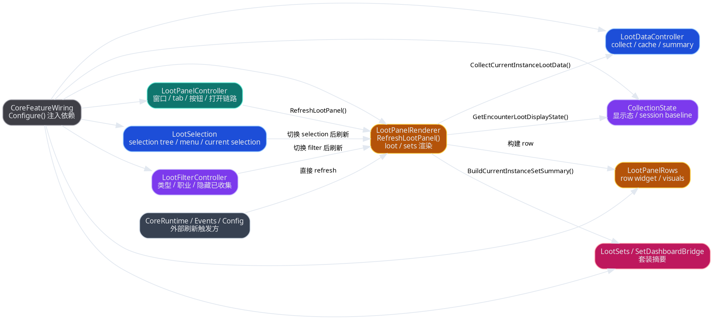
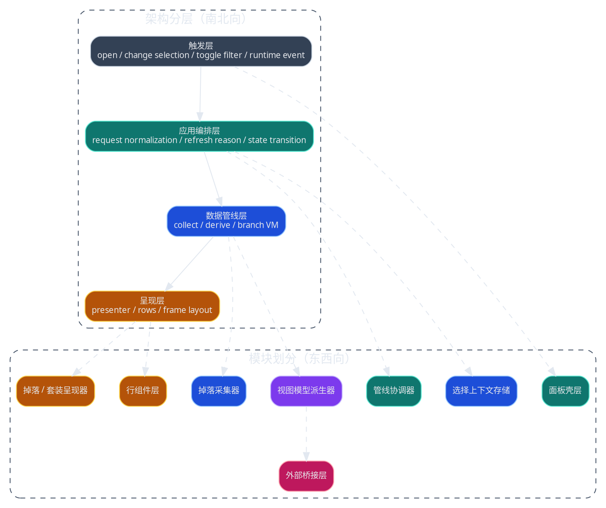
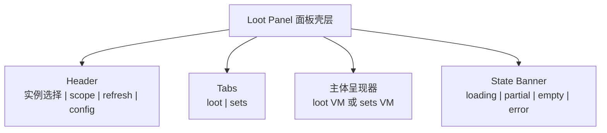

# Loot Panel 子系统数据管线重构 spec

> 把当前以 `RefreshLootPanel()` 为中心的掉落面板实现，重构成以 `selection -> collect -> derive -> render` 数据管线为中心的独立子系统，优先消除职责缠绕，并允许小幅行为修正。

## 背景与现状

### 背景

> 掉落面板已经从单一窗口演化成一个跨 `selection`、EJ 采集、收集状态、套装摘要、会话稳定态和运行时事件的复合子系统。

当前 `MogTracker` 中的掉落面板不再只是一个 UI 面板。它同时承载：

- 选择树构建：`src/loot/LootSelection.lua`
- 数据采集与缓存：`src/loot/LootDataController.lua`
- 面板生命周期与布局：`src/loot/LootPanelController.lua`
- 过滤与收藏态显示：`src/loot/LootFilterController.lua`、`src/core/CollectionState.lua`
- 主渲染与补刷：`src/loot/LootPanelRenderer.lua`
- 套装摘要桥接：`src/loot/sets/LootSets.lua`、`src/core/SetDashboardBridge.lua`

这些能力目前已经是“功能上可用、结构上重叠”的状态：模块名存在，但主 owner 还没有真正稳定到数据管线层。

### 现状

> 当前实现表面上分成多个模块，实际仍由 `CoreFeatureWiring -> RefreshLootPanel()` 串起多个跨层职责。



当前实现里已经形成以下事实：

- `LootPanelController` 负责窗口壳层，但打开流程里会触发 selection 偏好、session reset、cache invalidation 和 render refresh。
- `LootSelection` 不只是选择树，还承担 `BuildLootDataCacheKey()`、滚动重置、selection 切换后的刷新时机。
- `LootDataController` 除了 collect，还生成 `currentInstanceLootSummary`，已经开始承担 derived data owner。
- `LootPanelRenderer` 既是 presenter，又是 orchestration owner，还直接管理缺失 item / zero loot 的 retry。
- 外部调用面较大，`CoreRuntime`、`EventsCommandController`、配置相关流程都可能直接触发 `RefreshLootPanel()`。

### 问题

> 当前主问题不是文件太长，而是 owner 边界以“谁能调用 refresh”为准，而不是以“谁拥有哪一段数据语义”为准。

核心结构性问题：

- `RefreshLootPanel()` 同时承担 orchestration、data fetch、derive、render、retry 调度，导致调用方向反向穿透。
- `selection`、`filter`、`session state`、`data cache` 的 owner 分散在多个模块，难以判断单次刷新应该重算到哪一层。
- `loot` 与 `sets` 两个 tab 共享 collect 结果，但没有稳定的 view model contract，只能在 renderer 内部临时拼装。
- 运行时事件和 UI 交互都可以直接要求刷新，缺少统一的 `refresh reason` 与 pipeline phase 边界。
- 测试虽然已覆盖部分回归夹具，但 contract 仍以“最终渲染结果”居多，不利于中间层验证。

## 目标与非目标

### 目标

> 目标态是把 loot panel 定义成一个可测试的数据管线子系统，而不是一组围绕 `RefreshLootPanel()` 聚合的 helper。

```dot
digraph LootPanelTargetState {
  rankdir=LR;
  graph [bgcolor="transparent", ranksep="0.8", nodesep="0.35"];
  node [shape=box, style="rounded,filled", fontname="Microsoft YaHei", fontsize=10, color="#94A3B8", fillcolor="#1E293B", fontcolor="#E5E7EB"];
  edge [color="#E2E8F0", fontname="Microsoft YaHei", fontsize=9];

  shell [label="面板壳层\n窗口生命周期 / UI 事件转发", fillcolor="#0F766E", color="#5EEAD4"];
  selection [label="选择上下文\n当前 selection / class scope / tab", fillcolor="#1D4ED8", color="#93C5FD"];
  collect [label="采集层\nselection-scoped collect / cache", fillcolor="#1D4ED8", color="#93C5FD"];
  derive [label="视图模型派生层\nloot VM / sets VM / empty state", fillcolor="#7C3AED", color="#C4B5FD"];
  presenter [label="呈现层\n只消费 VM 渲染 frame/rows", fillcolor="#B45309", color="#FCD34D"];
  bridges [label="外部桥接层\nCollectionState / EncounterState / LootSets", fillcolor="#BE185D", color="#FDA4AF"];
  triggers [label="UI / 运行时触发层\nopen / switch / refresh / event", fillcolor="#374151", color="#CBD5E1"];

  triggers -> shell;
  shell -> selection;
  selection -> collect;
  collect -> derive;
  bridges -> derive;
  derive -> presenter;
}
```



本次 spec 的目标：

- 定义稳定的 loot panel 子系统边界，使主链路收敛为 `selection -> collect -> derive -> render`。
- 把当前 UI 事件、运行时事件和手动刷新统一成同一种 `refresh request` 语义。
- 为 `loot` 与 `sets` 两个 tab 建立共享输入、分支输出的 view model contract。
- 把 retry、empty state、partial state、error state 从 renderer 私有判断提升为子系统级语义。
- 保持玩家主要使用习惯不变，只允许小幅修正明显不合理的刷新和空态语义。
- 小幅 UI 修改仅限于新增稳定的状态表达区域，不重排 `loot` 页内部既有信息优先级。
- `partial / empty / error / loading` 统一收敛到面板级唯一状态区，不允许各分支再维护第二套状态提示语义。
- `sets` 页在无可用摘要时保留独立空态解释，不复用 `loot` 页的空态语义。

### 非目标

> 本次不把 loot panel 借机扩展成新的产品功能面板。

- 不重做小地图入口、配置面板入口或 dashboard 入口。
- 不重写 `CollectionState`、`EncounterState`、`SetDashboardBridge` 的业务规则本体。
- 不在本 spec 中定义完整 runbook、迁移步骤或具体代码 patch 顺序。
- 不借这次重构同步重新设计全部视觉样式。

### 范围

> 本次范围覆盖 loot panel 子系统内部 contract，以及它与外部桥接模块的交界面。

包含：

- `src/loot/LootPanelController.lua`
- `src/loot/LootSelection.lua`
- `src/loot/LootDataController.lua`
- `src/loot/LootFilterController.lua`
- `src/loot/LootPanelRenderer.lua`
- `src/loot/LootPanelRows.lua`
- `src/loot/sets/LootSets.lua` 在 loot panel 内的消费边界
- `src/core/CollectionState.lua`、`src/core/EncounterState.lua`、`src/core/SetDashboardBridge.lua` 的对接 contract
- `src/runtime/CoreFeatureWiring.lua` 中 loot panel wiring 方式

不包含：

- dashboard 子系统整体重构
- tooltip 主链路重构
- 存储分层重写

## 风险与收益

### 风险

- 旧模块名字还在，但 owner 变化后，短期内 wiring 和测试会同时调整。
- 如果 `refresh reason` 没有定义清楚，只是把逻辑搬家，会把缠绕从 renderer 转移到 coordinator。
- `loot` 和 `sets` 共用 collect 结果时，如果 derived contract 设计过粗，会让 tab 分支再次回退到 presenter 内临时拼装。
- 小幅行为修正如果没有边界，容易演化成 UI 语义重做，扩大评审范围。

### 收益

- 刷新链路从“谁都能直接 refresh”收敛成“谁发起 request、哪一阶段响应 request”。
- 中间层 contract 可测试，回归验证不再只盯最终 frame 输出。
- `loot` / `sets` 页签共享输入但各自有稳定输出，后续加新 tab 或新摘要更容易。
- renderer 可以降级成 presenter，降低 UI 与业务规则双向耦合。

## 假设与约束

### 假设

> 默认玩家对现有入口和主要交互已经形成习惯，因此本次主要改内部 owner，而不是改产品定位。

- 现有 `loot` / `sets` 两个 tab 会继续保留。
- 现有 `selected` / `current` 职业范围模式会继续保留。
- `CollectionState`、`EncounterState`、`LootSets` 仍然作为外部能力提供者存在，不被并入 loot panel 子系统。

### 约束

> 目标态必须兼容 WoW addon 当前运行模型，不能依赖复杂异步框架或脱离 `CoreFeatureWiring` 的初始化体系。

- 仍然运行在 Lua / WoW Frame API 环境下。
- 仍然通过 `Configure()` + 依赖注入与 `CoreFeatureWiring` 接线。
- 不引入需要长期双写的并行 UI 面板。
- 必须保留当前已有 fixtures 与 offline validation 可继续扩展的空间。

## 架构总览

> 先把 loot panel 当成一个独立子系统，看清它的南北向管线和东西向模块切片。



总体原则：

- `面板壳层` 只负责 frame 生命周期和 UI 事件收集。
- `管线协调器` 是唯一能解释 `refresh request` 的 owner。
- `掉落采集器` 只返回 selection-scoped raw snapshot，不直接关心最终 tab 呈现。
- `视图模型派生器` 把 raw snapshot、collection state、session baseline 和 tab 规则组合成稳定 VM。
- `呈现器` 只消费 VM，不再决定是否 collect、是否 retry、是否跨层读取 settings。

### 低保真线框

> 视觉布局可以基本保持现状，但内部必须改成“壳层接事件、presenter 吃 VM”的结构。



### UI 线框

> 即使本次是技术向 spec，只要允许小幅 UI 调整，就必须把目标态面板结构画成可评审的 UI 线框。

#### 面板总线框

> 目标态仍保留现有主布局和 `loot` 页内部信息优先级，但把状态提示从 renderer 私有分支提升成显式的、面板级唯一状态区域。

```svg
<svg width="920" height="520" viewBox="0 0 920 520" xmlns="http://www.w3.org/2000/svg">
  <rect x="20" y="20" width="880" height="480" rx="0" fill="#101923" stroke="#9FC3FF" stroke-width="2"/>
  <rect x="36" y="36" width="848" height="48" fill="#192533" stroke="#9FC3FF" stroke-width="1.5"/>
  <text x="56" y="65" font-size="18" fill="#E2EBF7" font-family="Microsoft YaHei">Loot Panel</text>
  <rect x="220" y="47" width="220" height="26" fill="#223245" stroke="#9FC3FF" stroke-width="1.2"/>
  <text x="236" y="65" font-size="12" fill="#D7E5FB" font-family="Microsoft YaHei">实例选择器</text>
  <rect x="452" y="47" width="92" height="26" fill="#223245" stroke="#C4B5FD" stroke-width="1.2"/>
  <text x="468" y="65" font-size="12" fill="#E9D5FF" font-family="Microsoft YaHei">职业范围</text>
  <rect x="740" y="47" width="56" height="26" fill="#3A2A16" stroke="#FCD34D" stroke-width="1.2"/>
  <text x="756" y="65" font-size="12" fill="#FDE68A" font-family="Microsoft YaHei">刷新</text>
  <rect x="806" y="47" width="56" height="26" fill="#3A2A16" stroke="#FCD34D" stroke-width="1.2"/>
  <text x="822" y="65" font-size="12" fill="#FDE68A" font-family="Microsoft YaHei">配置</text>

  <rect x="36" y="100" width="848" height="34" fill="#121E2B" stroke="#64748B" stroke-width="1.2"/>
  <rect x="36" y="100" width="120" height="34" fill="#0F766E" stroke="#5EEAD4" stroke-width="1.2"/>
  <text x="78" y="122" font-size="13" fill="#ECFEFF" font-family="Microsoft YaHei">loot</text>
  <rect x="156" y="100" width="120" height="34" fill="#1E293B" stroke="#64748B" stroke-width="1.2"/>
  <text x="199" y="122" font-size="13" fill="#CBD5E1" font-family="Microsoft YaHei">sets</text>

  <rect x="36" y="148" width="848" height="44" fill="#2B1F11" stroke="#FCD34D" stroke-width="1.2"/>
  <text x="54" y="166" font-size="12" fill="#FDE68A" font-family="Microsoft YaHei">状态横幅</text>
  <text x="54" y="183" font-size="12" fill="#F8E7B4" font-family="Microsoft YaHei">loading / partial / empty / error 在这里统一出现，不再散落在渲染分支里</text>

  <rect x="36" y="208" width="848" height="248" fill="#0E1620" stroke="#334155" stroke-width="1.2"/>
  <rect x="52" y="224" width="816" height="38" fill="#162434" stroke="#60A5FA" stroke-width="1.2"/>
  <text x="70" y="247" font-size="13" fill="#D7E5FB" font-family="Microsoft YaHei">Boss Group Header</text>
  <rect x="68" y="274" width="784" height="34" fill="#111C28" stroke="#475569" stroke-width="1"/>
  <text x="84" y="296" font-size="12" fill="#CBD5E1" font-family="Microsoft YaHei">Item Row / Collection State / Set Highlight / Class Icons</text>
  <rect x="68" y="316" width="784" height="34" fill="#111C28" stroke="#475569" stroke-width="1"/>
  <text x="84" y="338" font-size="12" fill="#CBD5E1" font-family="Microsoft YaHei">Item Row / Collection State / Set Highlight / Class Icons</text>
  <rect x="68" y="358" width="784" height="34" fill="#111C28" stroke="#475569" stroke-width="1"/>
  <text x="84" y="380" font-size="12" fill="#CBD5E1" font-family="Microsoft YaHei">Item Row / Collection State / Set Highlight / Class Icons</text>

  <rect x="36" y="468" width="848" height="16" fill="#192533" stroke="#334155" stroke-width="1"/>
  <text x="54" y="480" font-size="11" fill="#93A6C0" font-family="Microsoft YaHei">滚动内容区由呈现器消费 VM 后统一落地</text>
</svg>
```

#### `loot` / `sets` 差异线框

> 允许的小幅 UI 修改主要体现在 body 和状态表达上，不改变 header、tab 和主入口位置，并且状态表达统一从面板级状态区进入。

```svg
<svg width="920" height="420" viewBox="0 0 920 420" xmlns="http://www.w3.org/2000/svg">
  <rect x="20" y="20" width="420" height="380" fill="#101923" stroke="#5EEAD4" stroke-width="2"/>
  <text x="36" y="46" font-size="16" fill="#ECFEFF" font-family="Microsoft YaHei">loot 页目标态</text>
  <rect x="36" y="62" width="388" height="34" fill="#0F766E" stroke="#5EEAD4" stroke-width="1.2"/>
  <text x="54" y="84" font-size="12" fill="#ECFEFF" font-family="Microsoft YaHei">首领组 Header：名称 / 击杀次数 / collapse 状态 / 全收集态</text>
  <rect x="52" y="110" width="356" height="30" fill="#162434" stroke="#60A5FA" stroke-width="1"/>
  <text x="68" y="129" font-size="11" fill="#D7E5FB" font-family="Microsoft YaHei">Item Row：物品名 / icon / 收藏态 / 套装高亮 / 职业图标</text>
  <rect x="52" y="148" width="356" height="30" fill="#162434" stroke="#60A5FA" stroke-width="1"/>
  <text x="68" y="167" font-size="11" fill="#D7E5FB" font-family="Microsoft YaHei">Item Row</text>
  <rect x="52" y="186" width="356" height="44" fill="#2B1F11" stroke="#FCD34D" stroke-width="1"/>
  <text x="68" y="204" font-size="11" fill="#FDE68A" font-family="Microsoft YaHei">空组占位</text>
  <text x="68" y="221" font-size="11" fill="#F8E7B4" font-family="Microsoft YaHei">组结构保留；真正状态解释统一由面板级状态区承担</text>

  <rect x="480" y="20" width="420" height="380" fill="#101923" stroke="#C4B5FD" stroke-width="2"/>
  <text x="496" y="46" font-size="16" fill="#F5F3FF" font-family="Microsoft YaHei">sets 页目标态</text>
  <rect x="496" y="62" width="388" height="34" fill="#4C1D95" stroke="#C4B5FD" stroke-width="1.2"/>
  <text x="514" y="84" font-size="12" fill="#F5F3FF" font-family="Microsoft YaHei">套装组 Header：职业 / 套装名 / 完成进度</text>
  <rect x="512" y="110" width="356" height="30" fill="#22163A" stroke="#A78BFA" stroke-width="1"/>
  <text x="528" y="129" font-size="11" fill="#E9D5FF" font-family="Microsoft YaHei">Set Row：缺失部位、来源件数、完成度</text>
  <rect x="512" y="148" width="356" height="30" fill="#22163A" stroke="#A78BFA" stroke-width="1"/>
  <text x="528" y="167" font-size="11" fill="#E9D5FF" font-family="Microsoft YaHei">Missing Piece Row</text>
  <rect x="512" y="186" width="356" height="44" fill="#1D2430" stroke="#64748B" stroke-width="1"/>
  <text x="528" y="204" font-size="11" fill="#CBD5E1" font-family="Microsoft YaHei">空态统一显示为无可用套装 / 当前 selection 无摘要</text>
  <text x="528" y="221" font-size="11" fill="#CBD5E1" font-family="Microsoft YaHei">而不是复用 loot 页的空态解释</text>
</svg>
```

## 架构分层

> 先按数据和控制责任的南北向链路解释，每一层只做本层决策。

### 触发层

> 所有刷新都先表达成 request，而不是直接表达成“马上重画面板”。

触发来源包括：

- 打开面板：`LootPanelController.ToggleLootPanel()`
- 切换 selection：`LootSelection`
- 切换 filter / class scope：`LootFilterController`
- 手动刷新：header refresh button
- 运行时事件：`CoreRuntime`、`EventsCommandController`

该层只产生统一 request，例如：

| 字段名 | 字段描述 |
| --- | --- |
| `reason` | `open` / `selection_changed` / `filter_changed` / `manual_refresh` / `runtime_event` |
| `invalidateData` | 是否需要清 raw snapshot cache |
| `resetSession` | 是否需要重建 session baseline |
| `resetScroll` | 是否需要滚动回顶 |
| `targetTab` | 若请求显式切 tab，则带目标 tab |

### 应用编排层

> 编排层负责决定这次 request 会推进到哪一阶段，而不是自己渲染内容。

建议引入 `管线协调器`（`PipelineCoordinator`）作为 loot panel 子系统的主 owner，负责：

- 接收统一 request
- 更新 `选择上下文存储`
- 计算本次 pipeline phase：仅换 tab、重 derive、重 collect、全量刷新
- 调用 collector / deriver / presenter
- 记录 refresh debug / reason

这里替代的是当前散落在 `LootPanelController`、`LootSelection`、`LootFilterController`、`LootPanelRenderer` 中的 orchestration 逻辑。

### 数据管线层

> 数据管线层只关心从 selection 生成 snapshot，再从 snapshot 生成 VM。

推荐拆成两个阶段：

1. `掉落采集器`（`LootCollector`）
   - 输入：`SelectionContext`
   - 输出：`LootSnapshot`
   - 责任：selection-scoped collect、raw cache、summary cache、partial/error 标记
2. `视图模型派生器`（`ViewModelDeriver`）
   - 输入：`LootSnapshot + SelectionContext + SessionState + ExternalBridgeState`
   - 输出：`LootTabViewModel` 或 `SetsTabViewModel`
   - 责任：空态、过滤态、collapse state、banner state、row-level state

### 呈现层

> 呈现层只把 VM 映射成 frame 和 row，不再持有业务判断。

推荐拆成：

- `面板呈现器`（`PanelPresenter`）：header、tab、banner、body 分支
- `掉落页呈现器`（`LootTabPresenter`）：boss group + item rows
- `套装页呈现器`（`SetsTabPresenter`）：set group + progress rows
- `LootPanelRows`：纯 row widget factory / update helper

`LootPanelRenderer.lua` 在目标态中应降级为 presenter 聚合层，而不是总调度器。

## 模块划分

> 东西向切片要围绕 owner，而不是围绕“当前文件里顺手写到了什么”。

### 面板壳层

> `面板壳层` 只拥有 frame 生命周期、按钮注册和用户输入，不拥有数据语义。

建议保留在 `LootPanelController` 侧的责任：

- `InitializeLootPanel()`
- frame / scroll / resize / tab button / header button 初始化
- UI 事件转发为标准 request

不再保留：

- 直接决定刷新顺序
- 直接调用 session reset / cache invalidation / prefer current selection

### 选择上下文存储

> selection、tab、class scope、type filter 必须组成一个统一上下文，而不是四散在不同 helper。

建议形成单一 `SelectionContext`：

| 字段名 | 字段描述 |
| --- | --- |
| `selectionKey` | 当前副本难度选择签名 |
| `selectedInstance` | 当前 selection 实体 |
| `currentTab` | `loot` 或 `sets` |
| `classScopeMode` | `selected` 或 `current` |
| `selectedClassIDs` | 当前生效职业集合 |
| `selectedLootTypes` | 当前物品类型筛选 |
| `hideCollectedFlags` | 幻化 / 坐骑 / 宠物隐藏设置 |
| `lastManualSelectionKey` | 最近一次手动选择的 selection |
| `lastManualTab` | 最近一次手动切换到的 tab |
| `lastObservedCurrentInstance` | 最近一次打开时记录的当前副本身份，默认按 `instanceID + difficultyID` 比较 |

`LootSelection` 与 `LootFilterController` 应成为这个 store 的写入口，而不再分别决定刷新主链路。

### 掉落采集器

> collector 只负责得到当前 selection 的可信 snapshot。

建议 collector 层承担：

- `BuildLootDataCacheKey(selectedInstance)` 及其后继版本
- `CollectCurrentInstanceLootData()`
- `BuildCurrentInstanceLootSummary()`
- `missingItemData` / `zeroLootRetrySuggested` 之类 raw completeness signal

但不再承担：

- 最终空态文案
- tab-specific row grouping
- render retry 调度

### 视图模型派生器

> derive 层是这次重构的核心，它把外部规则和 session 语义收敛成 panel 可消费 contract。

建议导出的 contract：

- `PanelChromeViewModel`
- `PanelBannerViewModel`
- `LootTabViewModel`
- `SetsTabViewModel`

其中 `LootTabViewModel` 至少应包含：

| 字段名 | 字段描述 |
| --- | --- |
| `title` | header 标题和 subtitle |
| `status` | `ready` / `loading` / `partial` / `empty` / `error` |
| `bossGroups` | 每个首领分组的 header 与 rows |
| `refreshHint` | 是否建议重试、是否显示 partial banner |
| `debugPayload` | 可选调试补充 |

补充约束：

- filter 变化导致某个 boss 组下当前无可见 item 时，默认保留该 boss 组结构，不自动隐藏该组
- `bossGroups` 应支持“组存在但 rows 为空”的显式状态，避免筛选切换时结构跳动
- 当整个 `loot` 页所有 boss 组都为空组时，仍保留组结构，并由面板级唯一状态区解释“当前筛选下无可见物品”
- `sets` 页在筛选后全空时沿用同样的结构稳定原则：保留组结构，由面板级唯一状态区解释，但文案保持 `sets` 页独立语义

建议显式补齐 `PanelBannerViewModel`：

| 字段名 | 字段描述 |
| --- | --- |
| `status` | `loading` / `partial` / `empty` / `error` / `ready` |
| `scope` | 面板级唯一状态区；不允许分支自行再挂第二套 banner |
| `message` | 当前页签下的状态解释文案 |
| `pageKind` | `loot` 或 `sets`，用于选择独立语义文案 |
| `retryHint` | 是否展示重试提示 |

### 呈现器与行组件

> presenter 只消费 VM，不再回头读 collector 或 settings。

目标态里：

- presenter 不直接调用 `CollectCurrentInstanceLootData()`
- presenter 不直接调用 `GetEncounterLootDisplayState()`
- presenter 不直接决定 retry
- row helper 只更新视觉状态，不做 selection / filter / collect 判断

### 外部桥接层

> 外部桥接模块继续存在，但它们只以 adapter 输入 derive 层，不再被 presenter 到处直连。

桥接来源：

- `CollectionState`
- `EncounterState`
- `LootSets`
- `SetDashboardBridge`

建议做法：

- 由 coordinator 或 deriver 统一读取桥接结果
- presenter 只接收被规范化后的字段

## 方案设计

### 接口与契约

> 核心 contract 不是 frame API，而是一次 refresh request 如何穿过子系统。

#### 打开链路 contract

> `open` 不是简单的 show frame，而是一次带有默认 selection / tab 恢复和 session baseline 重建的显式决策流程。

默认打开顺序应显式定义为：

1. 恢复最近一次手动 tab
2. 计算默认 selection：
   - 当前副本
   - 上次手动选择
   - selection tree 的第一个稳定可用项
3. 判断当前副本是否要重新抢回优先级：
   - 仅当 `instanceID + difficultyID` 相比上次记录发生变化时才允许抢回
4. 重建 session baseline
5. 进入 collect / derive / present

补充约束：

- 如果恢复的 tab 是 `sets`，即使当前无可用摘要，也仍停留在 `sets`
- `open` 不能因为当前页为空就偷偷切回 `loot`
- 打开路径必须可单测覆盖上述优先级与回退顺序

推荐主接口：

- `RequestLootPanelRefresh(request)`
  - 输入：标准 `refresh request`
  - 输出：无；内部推进 pipeline
  - 用途：统一 open、switch、filter、runtime event、manual refresh
- `BuildSelectionContext()`
  - 输入：无或显式 overrides
  - 输出：规范化后的 `SelectionContext`
  - 用途：统一 selection、tab、scope、filter 读取
- `CollectLootSnapshot(context)`
  - 输入：`SelectionContext`
  - 输出：`LootSnapshot`
  - 用途：selection-scoped collect 与 cache
- `DeriveLootPanelViewModel(context, snapshot)`
  - 输入：`SelectionContext`、`LootSnapshot`
  - 输出：panel-level VM
  - 用途：统一 empty/partial/error/ready 语义
- `PresentLootPanel(viewModel)`
  - 输入：panel-level VM
  - 输出：无；只更新 frame
  - 用途：最终 UI 呈现

推荐刷新语义：

- `open`
  - 可更新默认 selection
  - 记住并恢复上次手动 tab
  - 重建 session baseline
  - 不强制清空全部设置
  - 默认 selection 的确定顺序必须是显式、可测试的优先级规则
  - 默认优先级：当前副本 > 上次手动选择 > fallback
  - 但只有当前副本上下文发生变化时，才允许当前副本重新抢回优先级
  - “当前副本上下文变化”默认按 `instanceID + difficultyID` 判断
  - 当当前副本不可解析且上次手动选择失效时，fallback 落到 selection tree 的第一个稳定可用项
  - 如果恢复的上次 tab 是 `sets`，即使当前无可用摘要，也默认保留在 `sets`，由状态区解释
- `selection_changed`
  - invalidate selection-scoped raw cache
  - 清空当前 selection 相关的 collapse 稳定态与手动折叠态
  - reset scroll
  - 重 derive + re-present
- `filter_changed`
  - 默认不重 collect，优先重 derive
  - 若 filter 改变了 collect scope，再升级为重 collect
  - `class scope` 变化默认属于 collect scope 变化
  - 默认不清 collapse 稳定态与手动折叠态
- `runtime_event`
  - 默认先更新 external bridge state
  - 仅在当前 context 受影响时重 derive / re-present
  - 默认不重建 session baseline
- `manual_refresh`
  - 必须重 collect + reset session baseline

### 数据模型或存储变更

> 本次重点不是改 SavedVariables 结构，而是定义运行时内存 contract。

建议新增或显式化这些运行时对象：

| 字段名 | 字段描述 |
| --- | --- |
| `SelectionContext` | 当前 tab、selection、scope、filters 的统一上下文 |
| `LootSnapshot` | collector 返回的原始 selection-scoped 数据快照 |
| `PanelSessionState` | 当前打开会话的 baseline、celebration、collapse 稳定态 |
| `PanelViewModel` | presenter 唯一输入 |
| `RefreshRequest` | 刷新请求与 reason 描述 |

建议保留现有 `db.lootPanelPoint`、`db.lootPanelSize`、`db.lootCollapseCache`，但不要再把运行时 derive 状态散落进多个模块私有表。

`PanelSessionState` 建议至少包含：

| 字段名 | 字段描述 |
| --- | --- |
| `active` | 当前会话是否打开中 |
| `baselineSelectionKey` | 本会话建立时的 selection |
| `itemCollectionBaseline` | 收藏态稳定基线 |
| `encounterCollapseState` | 本会话内的折叠稳定态 |
| `manualCollapsed` | 本会话内手动折叠态 |
| `lastResetReason` | 最近一次重建 baseline 的原因，例如 `open` / `manual_refresh` |

### 首领击杀次数 contract

> boss 击杀次数不是普通展示字段，它自带跨角色聚合、统计周期隔离和当前会话补偿三层语义，必须单独显式定义。

当前代码事实：

- 持久累计值存放在 `db.characters[characterKey].bossKillCounts[scopeKey]`
- `scopeKey` 当前按 `instanceName + difficultyID` 聚合
- 当前会话即时击杀存放在 `db.bossKillCache[cacheKey]`
- `cacheKey` 当前包含 `characterKey + instanceID + difficultyID + instanceName + cycleToken`
- `cycleToken` 来自当前角色 lockout 的 reset 信息；没有周期时落到 `nocycle`
- `GetEncounterTotalKillCount(selection, encounterName)` 会把同一 `scopeKey` 下的所有已知角色累计值求和，并在当前角色本次 run 尚未落盘时补上当前 session 的一次击杀

这意味着当前实现已经考虑了两件事：

- `跨统计周期`
  通过 `cycleToken` / `cycleResetAtMinute` 与过期清理隔离不同 reset 周期
- `跨角色累计`
  通过遍历 `db.characters` 聚合同一 `scopeKey` 下的 boss kill counts

但这份 spec 还缺两条显式边界：

- `跨账号`
  目前真实行为更准确地说是“跨当前 SavedVariables 中已知角色聚合”，而不是已经明确定义成 Battle.net 账号级聚合 contract
- `跨周期展示语义`
  当前代码有周期隔离和过期清理，但 spec 还没有规定 header 显示的是“当前周期累计”还是“历史累计”

目标态要求把这两个问题写死：

| 字段名 | 字段描述 |
| --- | --- |
| `aggregationScope` | 默认定义为“当前 SavedVariables 可见角色集合”，不是模糊的“全账号” |
| `cycleScope` | 默认定义为“当前 lockout/reset 周期内累计” |
| `sessionCompensation` | 当前 run 已击杀但尚未持久化时，允许补 1 次显示 |
| `noCyclePolicy` | 无 reset 周期的场景按 transient run state 处理，手动重置后清空 |

本次 spec 的明确决定：

- boss 击杀次数默认解释为：`当前 SavedVariables 可见角色集合` 在 `当前统计周期` 下，对该 `instance + difficulty + encounter` 的累计击杀次数
- 不把它定义成无限历史总击杀，也不把它定义成 Battle.net 跨账号全局统计
- 对没有固定统计周期的 party / dungeon 场景，沿用当前 `nocycle + manual reset clears transient state` 的语义
- UI 默认只显示数字，不额外增加统计口径标签或 tooltip 说明
- `loot` header 只消费一个已经派生好的 `bossKillCountViewModel`，不再自己拼装累计值、session cache 和周期补偿

建议新增派生后的字段：

| 字段名 | 字段描述 |
| --- | --- |
| `bossKillCount.value` | 最终显示数字 |
| `bossKillCount.aggregationScopeLabel` | 派生层内部可用的聚合口径标签，默认不直接显示到 UI |
| `bossKillCount.cycleLabel` | 派生层内部可用的周期口径标签，默认不直接显示到 UI |
| `bossKillCount.includesSessionKill` | 是否包含当前 session 的临时补偿 |
| `bossKillCount.isTransient` | 是否属于无周期临时态 |

### 失败处理与可观测性

> retry 和 partial 不是 renderer 的临时技巧，而是 pipeline 的状态输出。

目标态要求：

- `missingItemData`、`zeroLootRetrySuggested` 先落入 `LootSnapshot.statusSignals`
- 由 coordinator 决定是否发起 retry request
- presenter 只显示当前 banner / hint，不直接 `C_Timer.After(...)`
- `RecordLootPanelOpenDebug` 扩展为记录 `reason`、`phase`、`cacheHit`、`status`

推荐最小可观测字段：

| 字段名 | 字段描述 |
| --- | --- |
| `reason` | 本次刷新原因 |
| `phase` | 进行到 `collect` / `derive` / `present` 哪一步 |
| `selectionKey` | 当前 selection |
| `cacheStatus` | `hit` / `miss` / `invalidated` |
| `viewStatus` | `ready` / `partial` / `empty` / `error` |

### 发布 / 迁移 / 兼容性

> 实现上应采用“先立 contract，再搬 owner”的兼容式重构，而不是一次性推倒重写。

建议迁移顺序：

1. 先引入 `RefreshRequest` 与 `SelectionContext`，但保留旧函数名作为兼容壳。
2. 把 `CollectCurrentInstanceLootData()` 和 summary 逻辑稳定成 `LootSnapshot` contract。
3. 把 `loot` / `sets` 两条 presenter 分支改成吃 VM，而不是直接吃 raw data。
4. 最后再把 retry、runtime event、session reset 全部收进 coordinator。

兼容原则：

- 旧入口函数名可以保留一段时间，但内部只做转发。
- 旧测试可以先继续走兼容入口；新测试应优先覆盖 context / snapshot / VM。

### 第一阶段实现对齐

> 当前第一阶段实现已经把 authority 里的第一刀落成显式 contract，但还没有完成最终 VM 化与 retry owner 收口。

当前已显式落地：

- `LootPanelController.BuildRefreshRequest()` / `RequestLootPanelRefresh()`
  - 已统一 `open / selection_changed / filter_changed / tab_changed / runtime_event / manual_refresh`
- `LootSelection.BuildSelectionContext()`
  - 已显式持有 `lastManualSelectionKey`、`lastManualTab`、`lastObservedCurrentInstance`
- `LootDataController.BuildRefreshContractState()`
  - 已把 `manual_refresh`、`runtime_event`、`selection_changed`、`filter_changed(class scope upgrade)` 的边界写成直接可读的 contract
- `LootPanelRenderer.BuildPanelBannerViewModel()`
  - 已开始承接面板级唯一状态区 owner
- `EncounterState.BuildBossKillCountViewModel()`
  - 已把 boss kill count 从 presenter 内联拼装提升成显式桥接输入

当前尚未完全做满：

- `PanelBannerViewModel` 还没有把 `loot / sets` 的全空组解释全部做成统一入口
- `zeroLootRetrySuggested` 仍未完全从 renderer 内部调度迁移到 coordinator
- presenter 仍未完全只吃最终 `PanelViewModel`

### 架构复盘

> 现状已经具备模块雏形，但真正缺的是中间层 contract 和唯一 owner。

#### 已经做对的部分

> 当前实现已经把 selection、collect、rows、sets 这些能力从单文件里拆出了基础边界。

- `LootSelection`、`LootDataController`、`LootPanelRows`、`LootSets` 已具备继续内聚的基础。
- 现有 fixture 和 validation 已能支撑子系统级回归。
- `CollectionState` 和 `EncounterState` 作为外部能力模块已经具备桥接价值。

#### 仍需改进的部分

> 当前真正缺的是一个把 request、snapshot、VM 串起来的中间 owner。

##### 编排 owner 缺失

- [ ] 新增统一的 refresh request contract，替代各模块直接 `RefreshLootPanel()`
- [ ] 引入 coordinator，集中处理 request -> phase transition

##### 中间数据 contract 缺失

- [ ] 固化 `SelectionContext`
- [ ] 固化 `LootSnapshot`
- [ ] 固化 `PanelViewModel`

##### presenter 边界过重

- [ ] 让 presenter 停止直接 collect / derive / retry
- [ ] 让 row helper 仅负责 widget 与视觉更新

## 访谈记录

> [!NOTE]
> Q：这次 spec 的主目标更偏向哪一类？
>
> A：`2`，以**代码架构重构**为主。

收敛影响：文档采用技术向 spec 模板，评审中心放在模块边界、owner 和 contract，而不是产品交互改版。

> [!NOTE]
> Q：这次重构深度到什么层级？
>
> A：`3`，做**面板子系统级重构**。

收敛影响：spec 不再只讨论单文件整理，而是把 loot panel 当成独立子系统重新定义层次和模块分工。

> [!NOTE]
> Q：新的核心 owner 应围绕什么组织？
>
> A：`2`，以**数据管线**为中心。

收敛影响：主架构按 `selection -> collect -> derive -> render` 建模，状态 owner 和模块划分围绕这条主链收敛。

> [!NOTE]
> Q：这次是否允许改变对外行为？
>
> A：`2`，允许**小幅调整行为**。

收敛影响：spec 允许修正刷新、空态和 retry 语义，但不把评审扩展成完整 UI 行为重做。

> [!NOTE]
> Q：这次最优先要消除的结构性问题是什么？
>
> A：`1`，优先解决**职责缠绕**。

收敛影响：目标聚焦在 owner 清理、调用方向收敛和 contract 显式化，而不是先追求更多新功能。

> [!NOTE]
> Q：boss 击杀次数要按什么聚合范围展示？
>
> A：`1`，按**当前存档内所有已知角色**聚合。

收敛影响：spec 明确把 boss 击杀次数定义为当前 SavedVariables 可见角色集合在当前统计周期下的累计值，不收窄为当前角色，也不扩大成 Battle.net 账号级全局统计。

> [!NOTE]
> Q：boss 击杀次数在 UI 上要不要显式标注统计口径？
>
> A：`1`，**只显示数字**，不额外标注口径。

收敛影响：UI 线框和目标态 contract 保持 header 简洁，统计口径仍在 spec 和派生层 contract 中明确定义，但默认不占用主界面空间。

> [!NOTE]
> Q：允许的小幅 UI 修改，是否可以调整 `loot` 页内部的信息优先级？
>
> A：`1`，只允许新增状态区，**不调整现有信息优先级**。

收敛影响：本次 UI 改动边界收敛为状态表达显式化，不扩展到 boss header 或 item row 的主次关系重排。

> [!NOTE]
> Q：`partial / empty / error / loading` 这些状态是面板级唯一状态区，还是允许局部分支再维护一层状态提示？
>
> A：`1`，统一成**面板级唯一状态区**。

收敛影响：状态语义的 owner 收敛到面板级 contract，`loot` / `sets` 分支不再各自维护第二套状态提示入口。

> [!NOTE]
> Q：`sets` 页在没有可用摘要时，空态要不要跟 `loot` 页共享同一套解释文案逻辑？
>
> A：`1`，**不共享**，`sets` 页保留独立空态解释。

收敛影响：虽然状态入口统一到面板级状态区，但 `sets` 页的空态语义仍保持独立，不误用 `loot` 页的结果解释。

> [!NOTE]
> Q：手动点击刷新时，是否必须同时重建 session baseline？
>
> A：必须。

收敛影响：`manual_refresh` 被明确收敛为“重新 collect + 重建 session baseline”的强刷新语义，用来重置当前会话下的 `newly collected`、collapse 稳定态和相关展示基线。

> [!NOTE]
> Q：运行时事件触发刷新时，默认要不要重建 session baseline？
>
> A：`1`，默认不要，只更新受影响的派生结果。

收敛影响：运行时事件保持弱刷新语义，不破坏面板打开期间的会话稳定态；session baseline 只在显式强刷新路径中重建。

> [!NOTE]
> Q：切换实例选择时，是否必须清掉当前 selection 相关的 collapse 稳定态和手动折叠态？
>
> A：`1`，必须清掉。

收敛影响：selection 变化被定义为新的视图上下文，旧 selection 的 collapse 与手动折叠状态不得跨 selection 复用。

> [!NOTE]
> Q：切换职业范围或物品类型筛选时，默认要不要清掉 collapse / 手动折叠态？
>
> A：`1`，默认不要清。

收敛影响：filter 变化被定义为同一 selection 内的观察角度变化，不应重置当前会话中的折叠稳定态。

> [!NOTE]
> Q：当 filter 变化导致当前 boss 组下“可见 item 全空”时，boss 组默认应该怎么表现？
>
> A：`1`，保留 boss 组，但显示为空组。

收敛影响：`loot` 页在筛选变化后保持组结构稳定，用户仍能看到首领上下文，只是该组当前没有可见物品。

> [!NOTE]
> Q：当整个 `loot` 页所有 boss 组都为空组时，主界面应该怎么解释？
>
> A：`1`，仍保留所有 boss 组，并由面板级状态区说明“当前筛选下无可见物品”。

收敛影响：`loot` 页即使在全空筛选结果下也不塌成另一种页面结构，而是保持组结构稳定，并把解释责任交给唯一状态区。

> [!NOTE]
> Q：`sets` 页在有数据但当前筛选后没有任何可见套装项时，是否也沿用同样原则：保留组结构，由面板级状态区解释？
>
> A：`1`，是，沿用同样原则。

收敛影响：`loot` / `sets` 两页在“筛选导致全空”时共享同一种状态模型，但各自保留独立解释文案。

> [!NOTE]
> Q：打开面板时，默认 selection 的确定顺序要不要固定成明确优先级？
>
> A：`1`，固定明确优先级。

收敛影响：`open` 语义被要求具备稳定、可测试的 selection 决策顺序，避免打开链路重新退化成隐式历史逻辑。

> [!NOTE]
> Q：打开面板时，默认 selection 的优先顺序是什么？
>
> A：`1`，当前副本 > 上次手动选择 > fallback。

收敛影响：loot panel 打开时优先服务当前副本上下文，同时保留用户上次手动浏览意图作为次级记忆。

> [!NOTE]
> Q：当用户已经手动切到某个旧副本后，再次打开面板时，是否允许“当前副本”重新抢回优先级？
>
> A：`3`，只在当前副本真的变化时才抢回。

收敛影响：`open` 语义进一步收敛为“当前副本优先，但不无条件覆盖最近一次手动浏览意图”，需要显式比较当前副本上下文是否发生变化。

> [!NOTE]
> Q：这里的“当前副本上下文变化”要按什么判断？
>
> A：`1`，只看 `instanceID + difficultyID` 是否变化。

收敛影响：默认 selection 抢回逻辑被收敛成可测试的具体判定条件，不依赖模糊的名称匹配或更宽泛的上下文比较。

> [!NOTE]
> Q：当当前副本不可解析、上次手动选择也失效时，fallback 应该优先落到哪里？
>
> A：`1`，落到 selection tree 的第一个稳定可用项。

收敛影响：打开链路的兜底路径也具备稳定、可测试的落点，不会退回到“实现自由决定”的隐式行为。

> [!NOTE]
> Q：用户手动切换到 `sets` 页后，再次打开面板时，要不要记住上次 tab？
>
> A：`1`，记住上次 tab。

收敛影响：tab 也被纳入打开链路的浏览意图恢复范围，避免每次重新打开都把用户送回默认页。

> [!NOTE]
> Q：如果上次 tab 是 `sets`，但当前 selection 下 `sets` 没有可用摘要，打开时还要不要坚持留在 `sets`？
>
> A：`1`，仍然留在 `sets`，由状态区解释。

收敛影响：tab 恢复语义优先于“主入口回退”，`sets` 页的空态能力被视为正式目标态，而不是异常回退路径。

> [!NOTE]
> Q：切换 `class scope` 导致 collect scope 改变时，这次 `filter_changed` 要不要升级成重 collect？
>
> A：`1`，要，只要 collect scope 变了就升级为重 collect。

收敛影响：`filter_changed` 的升级条件被写死，`class scope` 切换不再是实现自行判断的灰区。

## 外部链接

- [掉落面板现状说明](./ui-loot-panel.md)
- [Loot Module 总览](./ui-loot-overview.md)
- [面板文档索引](./ui-panels-overview.md)
- [CoreFeatureWiring](../../../src/runtime/CoreFeatureWiring.lua)
- [LootPanelController](../../../src/loot/LootPanelController.lua)
- [LootSelection](../../../src/loot/LootSelection.lua)
- [LootDataController](../../../src/loot/LootDataController.lua)
- [LootPanelRenderer](../../../src/loot/LootPanelRenderer.lua)
