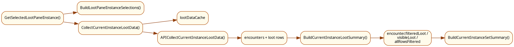
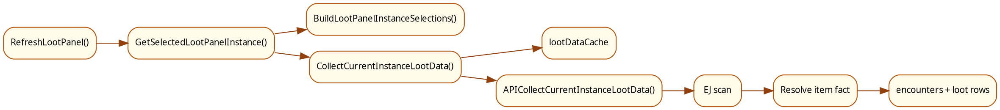
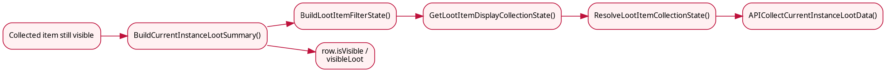

# 掉落面板

本文统一说明 MogTracker 掉落面板的入口、实例选择、EJ 采集、`loot / sets` 两个页签，以及“隐藏已收藏”链路。

## 1. 模块分工

- `LootPanelController.lua`
  面板生命周期、按钮、tab、整体布局
- `LootSelection.lua`
  当前区域、副本/难度选择树和菜单切换
- `LootDataController.lua`
  当前 selection 的掉落数据采集、缓存，以及收藏态过滤后的 encounter/row 派生
- `CollectionState.lua`
  收集事实状态和会话显示态；不再直接持有 loot panel 的过滤 owner
- `LootPanelRenderer.lua`
  `loot / sets` 两个 tab 的主渲染
- `LootPanelRows.lua`
  item row、encounter row 的复用和视觉状态
- `LootSets.lua`
  当前副本套装摘要
- `SetDashboardBridge.lua`
  套装相关桥接 helper

## 2. 打开链路

掉落面板常规入口是小地图按钮右键，最终走到 `LootPanelController.ToggleLootPanel()`。

当前第一阶段实现里，真正打开一次面板的顺序已经收敛成：

1. `InitializeLootPanel()`
2. `lootPanel:Show()`
3. `LootPanelController.RequestLootPanelRefresh({ reason = "open" })`
4. `PreferCurrentLootPanelSelectionOnOpen()`
5. 恢复 `lastManualTab`
6. `ResetLootPanelSessionState(true)`
7. `RefreshLootPanel(refreshRequest)`

打开链路当前冻结的 contract：

- `RefreshRequest.reason = "open"` 会强制 `invalidateData + resetSession`
- 默认 selection 优先级是“当前副本变化时优先当前副本，否则优先 `lastManualSelectionKey`，再回退到 current / fallback”
- “当前副本变化”当前按 `instanceID + difficultyID` 判断
- 如果恢复的上次 tab 是 `sets`，即使当前没有可用摘要，也仍然保留在 `sets`

## 3. 数据链路图

掉落面板的数据链路现在已经变成“selection -> EJ/raw loot -> collection state fact -> derive visibility -> 当前页消费的数据结构”。

## 4. 渲染链路图

掉落面板的渲染链路是“panel refresh -> 当前 tab -> 对应 rows/widget 更新”。

```dot
digraph LootRenderFlow {
  rankdir=LR;
  graph [fontsize=10];
  node [shape=box style="rounded,filled" fillcolor="#EEF6FF" color="#2563EB" fontname="Microsoft YaHei" fontsize=10];
  edge [color="#2563EB" fontsize=9 fontname="Microsoft YaHei"];

  Toggle [label="ToggleLootPanel()"];
  Init [label="InitializeLootPanel()"];
  Prefer [label="PreferCurrentLootPanelSelectionOnOpen()"];
  Session [label="ResetLootPanelSessionState(true)"];
  Refresh [label="RefreshLootPanel()"];
  Renderer [label="LootPanelRenderer"];
  Loot [label="RenderLootBranch()"];
  Sets [label="render sets tab"];
  Rows [label="LootPanelRows / set rows"];

  Toggle -> Init -> Prefer -> Session -> Refresh -> Renderer;
  Renderer -> Loot -> Rows;
  Renderer -> Sets -> Rows;
}
```

## 5. 核心状态

### 4.1 `lootPanelState`

偏 UI 的选择态，至少包含：

- `selectedInstanceKey`
- `currentTab`
- `classScopeMode`
- `collapsed`
- `manualCollapsed`

### 4.2 `lootPanelSessionState`

本次打开期间的会话稳定态，主要用于避免 UI 在面板已打开时跳动：

- `active`
- `itemCollectionBaseline`
- `itemCelebrated`
- `encounterBaseline`

### 4.3 `lootDataCache`

当前实例掉落数据缓存。它跟实例选择、职业范围和规则版本绑定，不直接缓存整张 UI。

### 4.4 `SelectionContext`

第一阶段重构后，掉落面板不再只靠散落状态拼装刷新输入，而是显式收拢到 `LootSelection.BuildSelectionContext()`。

当前 `SelectionContext` 至少包含：

- `selectionKey`
- `selectedInstance`
- `currentTab`
- `classScopeMode`
- `selectedClassIDs`
- `selectedLootTypes`
- `hideCollectedFlags`
  当前已经进入 `SelectionContext`，并由 `LootDataController` 派生成 `isVisible / hiddenReason`
- `lastManualSelectionKey`
- `lastManualTab`
- `lastObservedCurrentInstance`

这意味着 `selection / tab / class scope / loot type / hide collected` 已经开始共享同一份上下文 owner。

### 4.5 `RefreshRequest`

第一阶段实现里，`LootPanelController.RequestLootPanelRefresh()` 已经把主要刷新入口收口成显式 `RefreshRequest`。

当前已冻结的 `reason`：

- `open`
- `selection_changed`
- `filter_changed`
- `tab_changed`
- `runtime_event`
- `manual_refresh`

当前冻结的关键语义：

- `manual_refresh` 必须重 collect，并重建 session baseline
- `runtime_event` 默认不重建 session baseline
- `selection_changed` 清 `collapsed / manualCollapsed`
- `filter_changed` 默认只重派生；但 `class scope` 变化会升级成重 collect

## 6. 实例选择与采集

`LootSelection.BuildLootPanelInstanceSelections()` 会：

1. 尝试解析当前区域
2. 构建“资料片 -> 副本 -> 难度”选择树
3. 为每个 selection 生成：
   - `instanceName`
   - `journalInstanceID`
   - `instanceType`
   - `difficultyID`
   - `difficultyName`
   - `expansionName`
   - `instanceOrder`
   - `key`

`RefreshLootPanel()` 会调用 `LootDataController.CollectCurrentInstanceLootData()`：

- 先查 `lootDataCache`
- miss 时走 `APICollectCurrentInstanceLootData()`
- 采集路径会做 `EJ_SelectInstance()`、`EJ_SetDifficulty()`、遍历 encounter 和 loot rows

后续过滤和显示最依赖这些字段：

- `typeKey`
- `itemID`
- `link`
- `appearanceID`
- `sourceID`

## 7. 收藏态过滤 contract

当前实现已经把“收藏事实”和“收藏态过滤可见性”拆成两层：

- `CollectionState.GetLootItemDisplayCollectionState(item)`
  只负责单个 item 的事实/会话显示态
- `LootDataController.BuildCurrentInstanceLootSummary(data, sourceContext)`
  负责把 `hideCollectedFlags + selectedLootTypes + displayCollectionState` 派生成：
  - `row.isCollected`
  - `row.isVisible`
  - `row.hiddenReason`
  - `encounter.filteredLoot`
  - `encounter.visibleLoot`
  - `encounter.allRowsFiltered`
- `LootSets.BuildCurrentInstanceSetSummary(...)`
  改为消费 `visibleRows / visibleSourcesBySetID`，不再回退到 raw rows
- `LootPanelRenderer`
  只消费 encounter/group 上已经派生好的过滤结果，不再直接调用 `GetEncounterLootDisplayState()`

## 8. 选择与采集补充图

## 8. `loot` 页签

`loot` tab 按首领展示当前副本的可见掉落。

每个首领先经过：

- `LootDataController.BuildCurrentInstanceLootSummary(data, sourceContext)`

这一步会把原始 `encounter.loot` 收敛成：

- `filteredLoot`
- `visibleLoot`
- `allRowsFiltered`
- `fullyCollected`

`LootPanelRenderer.RenderLootBranch()` 只消费 `visibleLoot`，并通过 `LootPanelRows.lua` 更新：

- 收集图标
- newly collected 高亮
- 套装高亮
- 职业图标

当前第一阶段还额外收敛了两条 contract：

- boss header 右侧数字现在优先消费 `BuildBossKillCountViewModel()`，继续表示“当前存档内所有已知角色 + 当前周期”的累计击杀次数
- 当筛选导致某个 boss 组没有可见 item 时，组结构保留，不自动隐藏

## 9. `sets` 页签

`sets` tab 不直接显示 boss 掉落列表，而是调用：

- `LootSets.BuildCurrentInstanceSetSummary(data, context)`

这一步会：

1. 把当前副本掉落映射成 `setID -> source rows`
2. 读取每个 set 的当前进度
3. 计算缺失部位
4. 按职业分组排序

所以它本质上是“当前实例相关套装摘要页”，不是 `loot` 页的另一种排版。

第一阶段 contract 还额外冻结了：

- tab 恢复允许直接回到 `sets`
- 即使当前 selection 下没有可用摘要，也不自动切回 `loot`
- `sets` 页的空态解释保持独立，不复用 `loot` 页的“无可见掉落”语义

## 10. 面板级状态区

第一阶段实现已经引入 `PanelBannerViewModel` 骨架，把状态提示从 renderer 局部分支抬成面板级唯一状态区。

当前已落地的 banner owner：

- `no selected classes`
- `error`
- `partial`

当前冻结但尚未完全做满的目标态语义：

- `loot` 页全空时保留 boss 组结构，由状态区解释“当前筛选下无可见物品”
- `sets` 页全空时同样保留组结构，但空态文案保持 `sets` 自己的语义

## 11. 隐藏已收藏链路

item 是否最终显示，主链路是：

1. `LootPanelRenderer.RefreshLootPanel()`
2. `LootDataController.CollectCurrentInstanceLootData()`
3. `LootSelection.BuildSelectionContext()`
4. `LootDataController.BuildCurrentInstanceLootSummary()`
5. `CollectionState.BuildLootItemFilterState()`
6. `LootPanelRenderer.RenderLootBranch()`

因此“已收藏仍然显示”的根因通常只会落在：

- 原始掉落数据不完整
- `displayState` 没有进入 collected-like
- `SelectionContext.hideCollectedFlags` 没有正确进入派生链
- `typeKey` 走错收藏品分支

### 11.1 实际状态 vs 显示态

这里有两层状态：

- `GetLootItemCollectionState(item)`
  真实收藏状态
- `GetLootItemDisplayCollectionState(item)`
  面板显示态，会叠加 session baseline

### 11.2 过滤规则

`BuildLootItemFilterState(item, filterContext)` 的顺序是：

1. 读取 `filterContext.selectedLootTypes`
2. 读取 `filterContext.hideCollectedFlags`
3. 调 `GetLootItemDisplayCollectionState(item)`
4. 判断是否属于 collected-like：
   - `collected`
   - `newly_collected`
5. 按类型和设置决定是否隐藏：
   - 幻化：`hideCollectedFlags.transmog`
   - 坐骑：`hideCollectedFlags.mount`
   - 宠物：`hideCollectedFlags.pet`

然后把结果继续派生成：

- `row.isCollected`
- `row.isVisible`
- `row.hiddenReason`
- `encounter.allRowsFiltered`

## 12. 首领击杀次数统计图

掉落面板里首领 header 旁边的击杀次数，以及相关 tooltip，走的是单独一条链：

- 事件侧通过 `EncounterState.RecordEncounterKill(encounterName)` 记录当前 run 的击杀
- `EncounterState.GetEncounterTotalKillCount(selection, encounterName)` 读取当前角色在该副本难度下的累计击杀次数
- `LootPanelRenderer` 在渲染首领 header 时把次数显示出来，并参与 auto-collapse / tooltip 展示

```dot
digraph LootBossKillCountFlow {
  rankdir=LR;
  graph [fontsize=10];
  node [shape=box style="rounded,filled" fillcolor="#F5F3FF" color="#6D28D9" fontname="Microsoft YaHei" fontsize=10];
  edge [color="#6D28D9" fontsize=9 fontname="Microsoft YaHei"];

  Event [label="boss kill event"];
  Record [label="EncounterState\nRecordEncounterKill()"];
  CacheKey [label="GetCurrentBossKillCacheKey()"];
  Cache [label="bossKillCache[cacheKey]"];
  Counts [label="characters[*].bossKillCounts"];
  Scope [label="GetBossKillCountScopeKey()\n(instanceName + difficultyID)"];
  Read [label="GetEncounterTotalKillCount(selection, encounterName)"];
  Render [label="LootPanelRenderer"];
  Header [label="encounter header / tooltip"];
  Collapse [label="auto-collapse hint"];

  Event -> Record -> CacheKey -> Cache;
  Cache -> Counts;
  Counts -> Scope -> Read;
  Read -> Render;
  Render -> Header;
  Render -> Collapse;
}
```

这张图描述的是“击杀次数统计”本身，不是 `visibleLoot` 过滤链。它服务于：

- 首领 header 上的击杀次数提示
- 鼠标提示里的 `xN` 次击杀信息
- 基于击杀进度的折叠/展开辅助判断

## 13. 隐藏已收藏排查图

## 14. 常见排查

如果症状是：

- 菜单对，但掉落不对
  先看 `LootSelection.lua` 和 `LootDataController.lua`
- 数据对，但显示串状态
  先看 `LootPanelRows.lua` 和 `LootPanelRenderer.lua`
- `sets` 页不对
  先看 `LootSets.lua` 和 `SetDashboardBridge.lua`
- 收集图标或隐藏已收藏不对
  先看 `CollectionState.lua`
