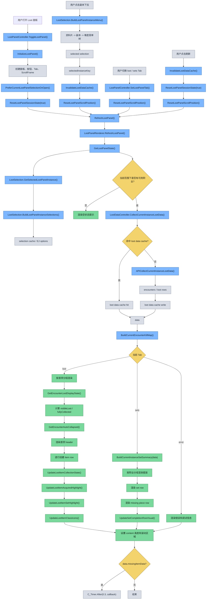
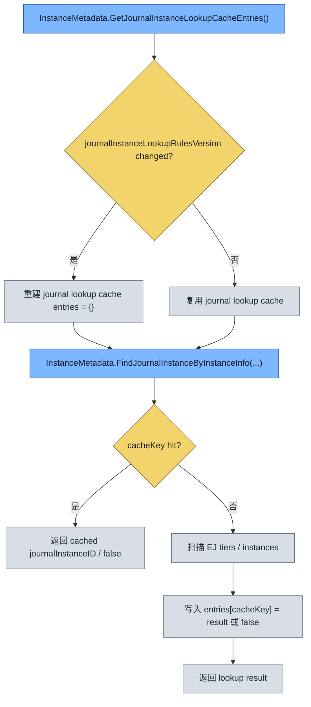
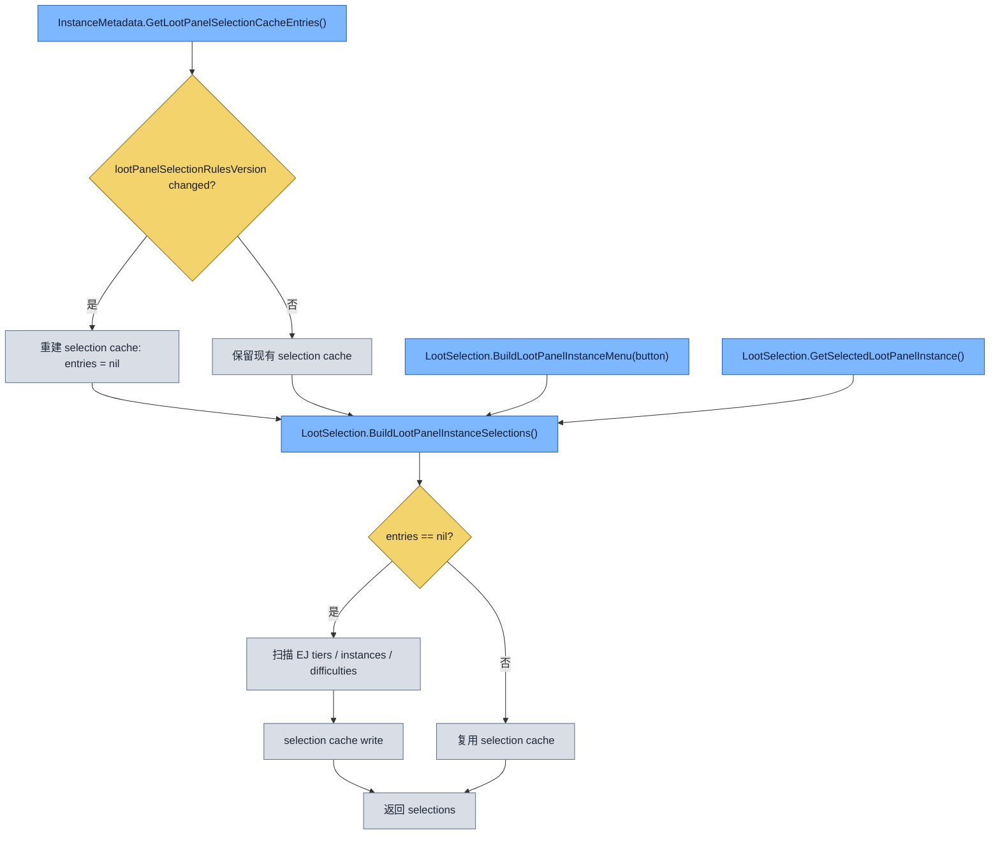
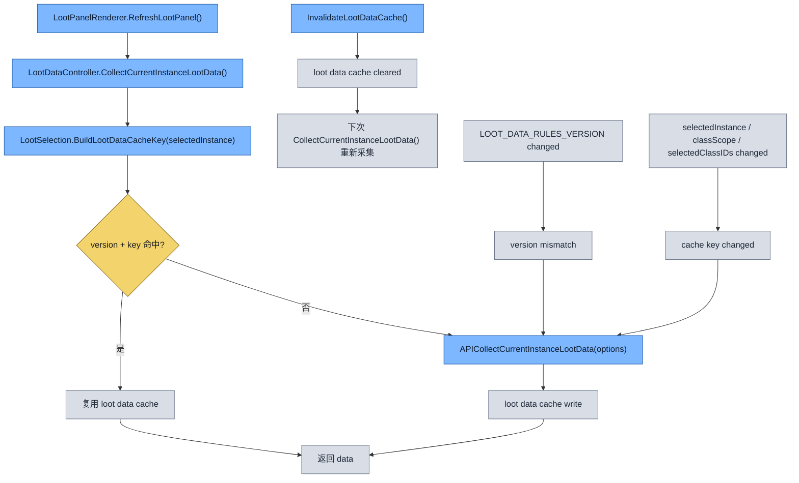
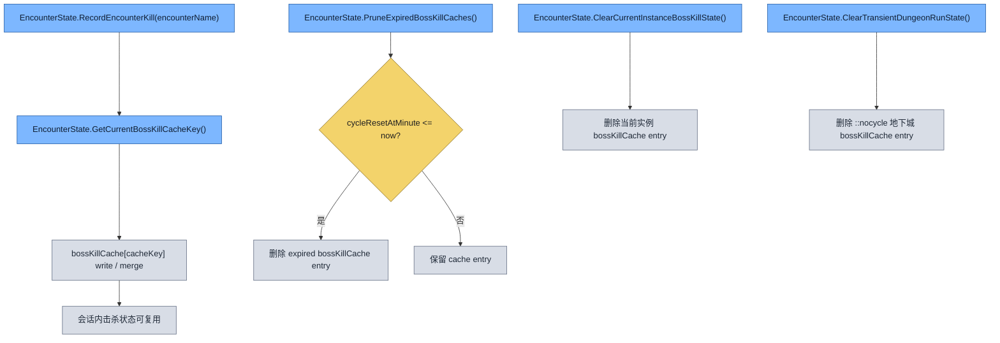
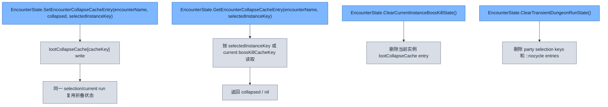
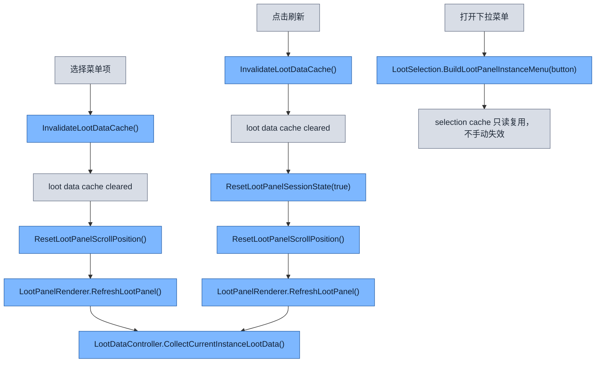

# Loot Module

`src/loot` 负责掉落面板的选择、数据采集、渲染和行组件复用。

## Files

- `LootPanelController.lua`: 面板生命周期、窗口布局、按钮交互、Tab 切换。
- `LootSelection.lua`: 副本/难度选择构建、下拉菜单、当前选择切换。
- `LootDataController.lua`: 当前选择对应的掉落数据采集、缓存、扩展信息查询。
- `LootPanelRenderer.lua`: 面板主渲染流程，按 `loot` / `sets` 分支生成内容。
- `LootPanelRows.lua`: 共享 row widget 创建、重置、高亮、收藏状态图标。
- `LootFilterController.lua`: 职业/物品类型等过滤状态管理。
- `sets/`: 当前副本套装摘要所需的套装计算逻辑。
- `docs/DropPanelCollectedVisibilityFlow.md`: 掉落面板从采集到“隐藏已收藏”判定的专项链路文档。

## Runtime Flow

## Cache Lifecycle

### Journal Instance Lookup Cache

> 名字/地图 ID 到 `journalInstanceID` 的点查缓存，只在 lookup 规则版本变化时整体重建。

`journal lookup cache` 和 `selection cache` 现在都由 `InstanceMetadata` 内部的 `metadataCaches` 容器统一持有，但仍然是两个独立子缓存。

这张图表达的是一次“副本信息反查 EJ 实例”的生命周期。调用入口总是 `FindJournalInstanceByInstanceInfo(...)`，它先检查 `journalInstanceLookupRulesVersion` 是否变化；如果版本没变，就继续复用现有 lookup 表。之后按 `instanceType + instanceID + instanceName` 组成 `cacheKey` 做点查，命中就直接返回，未命中才扫描 Encounter Journal，并把成功结果或 `false` 都写回缓存，避免同一查询重复扫 EJ。

### Selection Cache

> 下拉菜单选择树缓存，保存“资料片 -> 副本 -> 难度”整包结果，只在 selection 规则版本变化时重建。

这张图画的是掉落面板选择树本身的生命周期。`BuildLootPanelInstanceSelections()` 不会每次都全量重扫 EJ，而是先通过 `GetLootPanelSelectionCacheEntries()` 取到 `selectionTree` 子缓存；只有当 `lootPanelSelectionRulesVersion` 变化，或当前 `entries` 还是 `nil` 时，才重新扫描 `tiers / instances / difficulties` 并整包写回。打开下拉菜单和解析当前选择都只是复用这棵树，不会手动让它过期。

### Loot Data Cache

> 当前选中副本的掉落数据缓存，按“规则版本 + 选择签名 + scope + 职业集合”命中，不匹配就重新采集。

这张图说明的是实际掉落内容的缓存机制。`CollectCurrentInstanceLootData()` 先构建 cache key，其中包含当前 `selectedInstance`、`classScopeMode`、已选职业列表以及 `LOOT_DATA_RULES_VERSION`；只要其中任何一项变化，就会自然 miss 并重新调用 `APICollectCurrentInstanceLootData(...)`。此外，显式的 `InvalidateLootDataCache()` 也会让下一次读取重新采集，所以它是一个严格按当前面板语义命中的内容缓存，而不是长生命周期静态缓存。

### Boss Kill Cache

> 当前副本击杀状态缓存，按副本周期 token 或临时 dungeon run 作用域保存，过期后按重置时间或重置动作清理。

这张图表示的是首领击杀状态的写入和清理机制。击杀事件发生时会通过 `GetCurrentBossKillCacheKey()` 找到当前副本作用域，把击杀结果并入 `bossKillCache[cacheKey]`；后续渲染和统计都可以直接复用这份状态。对于有明确重置周期的副本，`PruneExpiredBossKillCaches()` 会根据 `cycleResetAtMinute` 清掉过期项；而对于临时地下城 run，则通过 `ClearTransientDungeonRunState()` 删除 `::nocycle` 作用域的条目。

### Loot Collapse Cache

> 掉落面板首领折叠状态缓存，按当前 selection 或当前副本 run 作用域保存，并在实例状态清理时一并失效。

这张图画的是首领折叠状态如何持久化。用户在面板里手动折叠或展开首领时，状态会写进 `lootCollapseCache[cacheKey]`，其中 `cacheKey` 取决于当前 `selectedInstanceKey`，若是“当前副本”则退回到当前 run 的 boss kill cache key。之后再次打开同一个 selection 时就能复用相同折叠状态；而当当前实例状态被清空，或地下城临时 run 被重置时，对应的 collapse cache 也会一起删除。

### Explicit Invalidation Paths

> 显式失效路径现在只针对 loot data cache；selection cache 和 journal lookup cache 都改成版本驱动重建。

这张图总结的是仍然保留的“主动清缓存”入口。当前只有 `loot data cache` 会在选择菜单项或点击刷新时显式清空，因为这两条路径都明确意味着“当前内容语义变了，需要重新采集”；而打开下拉菜单只是读取 `selection cache`，不会触发失效。`journal lookup cache` 和 `selection cache` 本身都不再依赖运行时事件手动清理，而是完全由对应的 rules version 决定何时重建。
